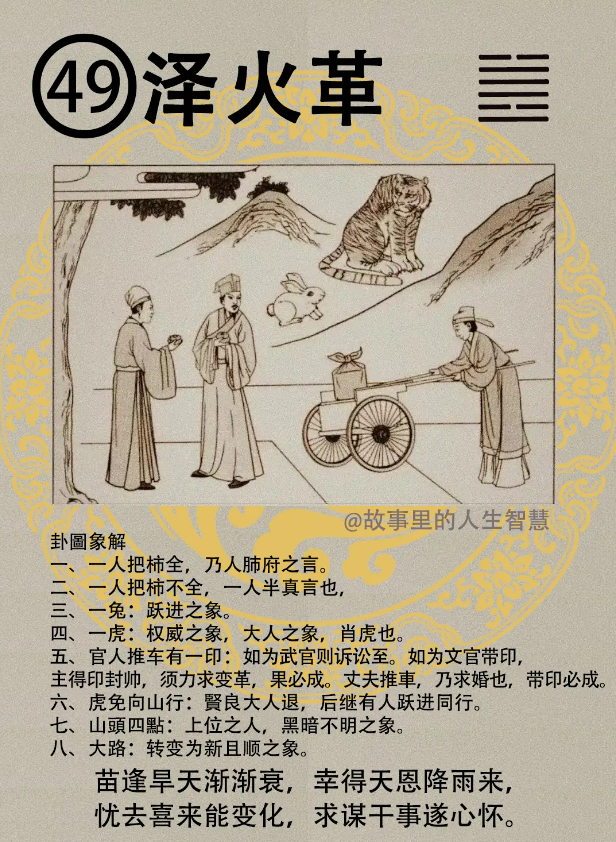

#### 详解泽火革

革卦，泽火革，井之后呢是易经的革卦。

为什么叫做革?井之后为革，因为井里面的东西，如果存在井里的话，如果你把一块肉丢下去，井就坏掉了嘛，烂掉了，井没有外通的路嘛。所以如果一坏掉的话，就有革的象出现。

所以说一粒老鼠屎，带坏一锅粥。你看台湾好像百姓都很好，人都很聪明，有粒老鼠屎出现，台湾就危险了。这个时候就要去革他，所以你说孙文说我们来喊革命，那不是孙中山讲的，易经上面早就讲革命了，所以不是孙中山，对不对，不是孙中山讲的。

为什么要革呢? 遇到这种情形的话，因为他要须革，须要去改革它，不是要革命，待会儿他会告诉你哪些条件，如何有哪些条件才能革，没有哪些条件不要乱去革，你可以发不平之声，但是不要乱去革。

那泽3火革呢，你看看，火在下面，泽在上面，上面是水，下面是火，火在下面烧，水在下，这两个性是不相同的。如果没有这个反的，比如火在上面，水在下面，那就是火泽暌，有没有， 因为相悖。那两个火在上面烧，水就会蒸发掉，就是它的物象怎么改变，革有改变的意思，有改革，有变迁的象在里面。

人间道：

诸位看这个卦，这是泽是三女，火是少二女，泽是不是三女儿，二女儿，三儿女还有二女儿两个人，他说二女同居， 易经上，我看别的不讲，都是讲女孩子， 不要骂我， 骂易经就好了。

两个女孩子同居在一起，其志各异。我们发现这个很好玩儿，这个男孩子还不会，女孩子两个，即使两个女儿给她放到同一个房间，想法都不一样，其志各异，完全是背道的，各不相格，所以水火叫革。

要去革，革之道，易经说去故，易经很好玩儿，把旧的去掉就好了嘛，去故，革之道要去故。

那易经上面说，没有关系，始革的时候，人心未信，刚开始人都不会相信，他说按巳日至人方信。到了巳日了以后，人就会开始信。你不要看皇历巳日，而是形容一段时间人就会相信。

刚开始改革的时候，孙文不是人每一个人都很认同他，刚开始我在清朝也是富商，富甲怎么样，对不对。孙文讲的不见得对，万一我支持了你以后，倒霉了当场从富商变成流寇，对不对。一夜之间不容易让他信。

在革之道，在卦里面的象，这个火是离卦是明，泽是悦，而且是顺，对不对。

第三个，人间道，就是讲这个悦和顺。因为人呢，人能明理，很多人说我很明理，这个话不会说，什么叫做明他不知道。他不晓得什么叫明。

人能明理，则无不尽之理，所有的理都能通，但是你要明。人能悦，则人心和顺。

革卦的条件，你要去改革，有几个条件。革，在易经里面说是人间事之之大，最大的事情。所以它要立下条件来。

第一个，必有其时。一定要有时机，郝XX听好。

一定要有其位。

一定要有其其才。真的要有才能。

然后这三个条件具有了以后，易经叫要谨慎小心，审虑而后动。

遇到这种时机，革一点灾都没有，一定要有时机。 

时机是什么? 当有天灾的时候，第一个时。第二个是当人民都反对的时候，人民反对君王的时候就是所谓的时机。

那你要有你的地位，要有你的才能，那你现在没有很好的位置，没有关系，你赶快去静修其才，不要花时间去写那个无悔，你做个官，本来就是无悔，本来就是无怨无悔的，不然你做的很痛苦你就不要写了。

所以李XX前面说，你不晓得当总统很痛苦的，总统讲这种话，你不要当好了，你下来。你了解我意思吧，怎么会这样讲呢。

#### 占卜

如果占卜能卜到泽火革，有一个人把柿全，有一个把柿不全。把柿全呢，有一个人肺腑之言，一个人把柿不全呢，就是半真言。

你身边两个人， 一个人讲的是实话，一个是一半实话一半虚话，你们没有卜到不知道，卜到就晓得了。
不要跟人讲，我卜到什么事情。

那有一个兔子在地上，兔子代表跃进。

一个虎在那边，虎代表权威的象，大人之象，虎代表权威，也代表大人，大人就是官人，官人的象。

那兔子跟在老虎后面走。

一个官人在推车，车上有一个印，有没有，有一个印。看到这个图的时候，如果是武官。

诸位读易经上面图的时候，如果是武官来推车的话，代表讼至，诉讼，官司，准备打官司。

现在是文官在推，有没有，文官呢，带印，主得到分封，封侯。但是这个分封，上任以后必定力求改革，原来是烂摊子一堆，你上去要改革。

人家来卜官，我这次去任官好不好，卜到泽火革，任官很好，但是你要大力改革，前面那个人留一个烂摊子给你，车子推那个大印，赶快推给你，很快的交给你。

这个虎兔上山，两个人在往山上走，对不对。代表说，这个贤良的人退后，这个虎代表贤能的人退居山林。那兔子呢还跟着老虎走了，为什么要这样子讲? 

最后一个，诸位看上边那个，一个山头上边有四个黑点，有没有?它为什么山头上面画四个黑点？ 山头代表君王，四个黑，你看看，四黑点在土上面，君王不明。就是小人当道，君王不明。目前我们就是这个样子，很累，很麻烦。

#### 阳宅 

三女居二女位。三女儿不好好的住，跑到二女儿位置，住错了，跑到前面去住了。

第一个性刚而明。

诸位所有的卦你都要会用。比如说革之道，你要如何用革，比如你发现你的三女儿实在太柔弱了，体弱多病，对不对。那就在革上面改变一下，突然之间就会变成性刚而明，脑筋变得很清楚。

但是又有她的缺点，困扰于感情。困扰于感情，有的男人对她是诚心诚意爱她，有的人是虚情假意的，半真半假的爱她，对不对。她很困扰，不晓得选择哪一个。

第三个，婚事呢提前两年。比如说她的命里是28 岁红鸾星动，住在这里会提前到26 岁。她结婚的时候，比姐早，妹妹先结婚，比姐姐早婚的。

如果是还没有结婚，她住在革卦上面的时候，如果是这个当公务员，或者是当官的，官运亨通。 当官的话官运很亨通。

如果是从商，她在商业不利。

第五个，利科甲，对考试非常的好。我们易经上有很多利科甲的卦，最利科甲的是中孚，状元卦，风泽中孚很难哦。所以哪天你一卜，风泽中孚，考状元啊。