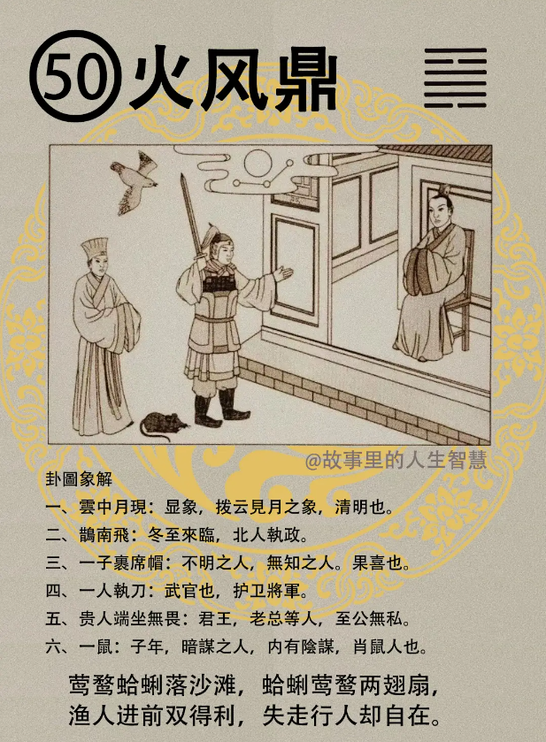

#### 详解火风鼎

相写字里面可以看出来，一下，你看，我这一字，风下来有没有写勾? 不是故意的，习惯，有的人爱写一个勾，所以如果测字的时候我们测不准的。

为什么叫做火风鼎卦，火风鼎前面是革，革改变意思，那世界上革物，把物品革开来，就是鼎最大，超不过鼎，莫如鼎啊。

为什么鼎最大？中国人过去把这个鼎啊，食物米啊放在里面，这个鼎的角在下面撑着，这个下面是火，上面是水，那水和火本来是不容的，可是这个鼎在中间能够让它相容，所以鼎卦的意思就是如何让他不容的能够让他相容，这就是鼎的真意在这里，鼎卦的真意在这里，对不对。

就像一个法官在办案一样，这个案子甲告，乙告你们不要吵了，你们和解得了，法官就是鼎知不知道，鼎的道在这里，你不要老是看着煮饭叫鼎，那个圣人聪明的，看到你不是煮饭，那你看到还是煮饭，你就要多想一点，看到煮饭还是煮饭，你就不要看易经了。

所以鼎呢专门讲革物，好，能够让不相和的能够相和，这就是天机道。

进入人间道以后呢，这个离卦本身是明，巽卦本身是风，风是顺，能够明又能够顺，这两个放在一起，就代表我们一个人耳聪目明，能够看的很清楚，这是耳聪目明的相。

所以如果你要能够做中间的那个人，一定要有这个条件，耳聪目明。不然的话，A 来说有他的道理，B 来说也有他的道理，你们都有道理，那两个回去还是吵，找你没有用，好，鼎一定要耳聪目明，知道犯的错误在哪里。

当你让对方晓得他哪个地方错了的时候，他气就下去了，你们和解嘛，没有必要再吵，一下子就解决掉了。当然有的事情不能和解，杀人了跟你和解？

那鼎呢，鼎的相除了中实以外，有中实的相，中实之相，中间的部位，中实代表说，这个中实跟坎中实不一样，坎卦是中间中实代表险。不管是在课堂，还是在镜头前面看的人，你老是，我跟你讲了半天你还是没进去，你就是自己危险了。

那鼎有中实，这个中实代表有才，内部是很有才能的人，装了很多东西的人，这叫做中实要有才的，好，然后行为呢，有端正呢如鼎，像鼎一样行为端正如鼎，这个呢，这是真正的正道，这是正道，至善之道讲的就是这个。

这个终身不过，一辈子都不会有过失，这是鼎卦的意思。

可是我们现在的人间呢，不是这样子的，麻烦在这里啊。今人啊，我们以后加个今人，德薄而位尊，职位很高，但是没有功劳，知小而谋大，然后呢，力少而任重，给他的权利责任很大，根本他没有能力。这个就是君王用非其人啊，意思就是讲这个，遭败亡之道。 

易经在最后提出来的，公正无私，为鼎。所以呢，背私为公。什么叫做公? 就是把你的私人欲望，私人的想法藏在你的背后，用人为公啊，你不能为公，这就不对了， 背私，就是公，你的私心，你的私欲放到后面，来看，用的人要对社会上有很大的贡献的人， 用一个军方的将领要一定他要有很多的功勋，然后让手下能够信服的，这个时候军心上下一心。你不要用一个人，开一枪就躲在桌子低下的人啊，对不对。那面都是腾蛇脸，现在讲懂了啊。那个人脸歪的，不行。相不对。

#### 占卜

如果你要问事情，一卜，火风鼎，这个鼎是干什么? 

第一个云中月现，云中看到月亮跑出来了，这是显出来的相，显的象，有拨云见月。那也代表什么? 清明，时节呢，清明中秋都属于这个时节。

第二个，他说雀南飞，雀住南边飞，雀南飞呢，代表冬至到了，冬至来临。也代表了，北人执政，国运上面来说的话，就是北人执政。所以啊你要卜一件事情也可以卜一卦，如果要卜国运也可以卜一卦，懂不懂，都可以查到，这个大小要看你怎么灵机。

一子裹席帽，一个人脸用席帽裹起来，不明之人，或者是无知之人，裹席帽，果喜，结果是喜的，看你论断什么事情，看论断什么事情。

你如果说老师我用这个人可不可以，他是无知之人，你不要用。那老师什么叫做无知啊，无知并不是蠢啊，什么叫无知啊? 我跟诸位讲过，说无知有没有，无知就是你跟他讲了还不知道，不懂的他来做决定，提供意见。中医不好，中医不好，请问你懂不懂? 我不懂，你不懂那你说中医不好，他就讲不出话来了，这种人就是无知的人，反正就是不好啦，我有钱我就是对的，大块肥肉长在嘴巴上面，好一点用都没有，无知的人。

有一个人持刀占在中间，这个就是武官，代表护卫将军。代表执刑的人，执刑，这个刑要这样子，执刑之人。

那第五个，贵人坐屋内，代表君王，也代表法官，也代表老板，看你怎么用。这个老板呢，是至公无私的人，所以至公无私，我们叫做鼎。

一鼠，老鼠在家里，老鼠除了讲子年以外，讲暗谋，内有阴谋，或者是属老鼠的人，子年这都是时间，或者消鼠的人。 

#### 阳宅

阳宅，鼎象出现的话，二女居长位，成格，这是鼎的象，这时出现。

那一再跟诸位讲不要忘掉，你去看阳宅的时候，你看到他没有经过你指点，他自己本来就是二女儿跑到长女的位置去了，他的动作没有经过你指点，他就是命，你懂不懂我的意思。

你不要老是在改过以后，是火风鼎。还没改，他自己不知道，无意直接坐上去他就是鼎。然后他很好玩啊，到台北是鼎，到新浦还是鼎，跑到美国还是鼎，一直在那个位置上没动过。他自己还不知道，还住的很爽，好，那我们看爽的结果是什么? 

第一个，必嫁贵夫，很好啊，很好。一票学生来问你，今年科举考试，老师我写一个贵，去测一票人，中一目人啊，独眼的人会考上。

第二个，住火风鼎的女孩子呢，果决，刚断。看多就会了啦。

婚比姐早，冬至，冬天的时候结婚。姐姐还没有结婚她就先结婚了。

如果这个住在火风鼎的女孩子，是官， 当官的，官运亨通。

如果是做生意的，财不利，赚不到钱。

第五个所有的十二生象里面，十一生象都好，属老鼠的不行。老鼠真的很讨厌写，给他画个老鼠。肖鼠凶。

我实在很想画图，画图比较快嘛，因为老鼠很好画嘛，两个耳朵一个尾巴就是老鼠，写那么复杂。

第六，如果是我是火风鼎，我今年要考科甲，吉，科甲大吉。老师你说科甲，雀南飞嘛，喜鹊都是报迅嘛，喜讯，所以如果你二女儿考大学，住东南边。

如果大女儿结婚，家里面只剩二女儿，二女儿变长女，你让他住东南，叫巽为风。这时让她住到中孚卦去，风泽中孚，后面会介绍中孚。鼎卦完了以后。