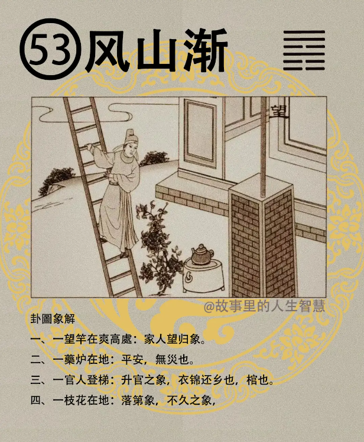

#### 详解风山渐

风山渐，艮卦这后是渐卦，为什么艮卦之后是渐卦？渐呢，本身是进也，渐进的，慢慢的，慢慢的进，止后，必有进，止过后的动作，一定有进，停止下来再动就是往前进的，这就是天理。所以这个为什么说渐进。

这个卦呢专门告诉我们，屈伸，消息之理，要了解这个卦，什么时候要进? 进要采用渐进的方式，不要力度很大。如何处它，渐进之道在哪里? 这个渐讲的就是这个。

风本身是木，木在山上，山上有个木长在里面来，一直往上长，这个树木长很高，是因为这个下面有山，所以你能够很高，你要知道下面有山在里面，你的山可能是你的才能，可能是你的贵人，对不对，所以说你随时要补充你的才能，你这个树才稳嘛，要有渐进之道。你不能说，我现在是部长了，我就不需要读书了，不需要读书鼻子歪掉了，读书读的越多，眼光越好，鼻子越正。

那手有天柱纹，为什么？翻书嘛，你要翻书啊，天柱纹就出现啦，对不对。

那如果是很紧张在讲话，被骂的要死，对不对，出来那个脸就是歪的嘛，每天都不读书，在那儿想歪的事情，想如何规避责任嘛。

易经很厉害啊，老祖宗实在很厉害，他说天下之事啊，进必以渐，要渐进。那现在的全世界只有一件事情就是渐进，只有一件事情，就是女归，这个时候女孩子最听话了，女孩子刚结婚的时候，进入夫家的时候啊，都知道渐，懂不懂，这是最艰辛的。这个事情是，其他事情都不是，其他我们男的出去，女的都一样，到了，我到了公司之后，什么渐进，我表现好我就要升官了，你要给我多少钱，每月能给搞多少事情。

那不管外面女孩子能力再强，如果一结婚，一到了夫家的时候，就在渐，自然而然就得渐，大家都在一起对不对。就是易经，我们老祖宗，这个的时候是天地下至渐，在这里。诸位要效仿他，所以女孩子结婚，你看那个女孩子到家怎么样，你去学习一下，好，比较好，如果你不知道什么叫渐进的话。所以我们有很多人要去了，很多部长要去了，干校长的跟部长有什么关系? 诸位看，我在易经上怎么找也找不到关联，《圣经》上可能有。

渐进之道，易经上面提出来的，要各得正位，当你得到正位之后呢，你后面得到正位之后你再进，再升上去，进而有功，进是因为你在这个位置上有得到功勋以后再往上升，明白了吗? 这才是真正的进嘛，渐进。

进而有功，可以正邦国，如果一个国家所有的人，每个人晋升上来，从小职员，干上来，干到部长，都是我干到科长的时候，在科长之位立了功，因为立了功之后再晋升到处长，每个人都是这样上来的话，可以正邦国，知不知道? 现在台湾很简单，部长骂我一句话，我就升官了，我给你讲。所以你去得罪一下，你就会得到重用，下回我们有机会可以骂骂，骂他干吗? 我们可以升官啊。

#### 占卜

这个占卜，占卜的时候。

一个望杆在爽高出，家人望归，等候而望的象。

一个药炉在地上，代表平安，无灾。

官人登梯，升官的象，还有呢，代表衣锦还乡，还乡的象。如果卜这个卦的时候，也代表官也，这不是说每一件事情都会用到，官人在木头的梯子上嘛，所有的树坎掉，那就不叫树了，那叫做木，听不听的懂我的意思，你把树坎断以后，放在地上，就不叫做树了，就叫做木嘛，那官人在梯上面，就叫做棺。

一枝花，我跟你讲，那个卜卦的时候，卜到地上去干什么，你慢慢就体会到我讲什么东西。一枝花在地上，落地嘛，不是热地，落第有没有，落第，是金榜不提名，落第之象，考试没上。还有呢，花开的地方花的时间不久，好的不是很久，落地。如果是这个我做生意的，这个生意不长久哦，可能很快就结束掉了。

#### 阳宅

长女居三子位。你是大女儿，就好好的东南角不去主，你住在东北角。

第一个，科甲不兴，所以如果你发现你大女儿不喜欢念书，你看看是不是风山渐。

第二个，工作心念不定，所以呢，如果那个女孩子一天到晚换工作，那家里面住在风山渐。

没有工作，不但在家里闹出很多烦恼，身体很健康，但身体又很好，闹得就麻烦一点。

这个婚事难成，婚事不会有结果，我写难成比较含蓄啦，没有婚。

第五个，公职大利，如果他当公务员或者教务员，住在渐卦很好，因为官人登梯嘛，其他都不好。