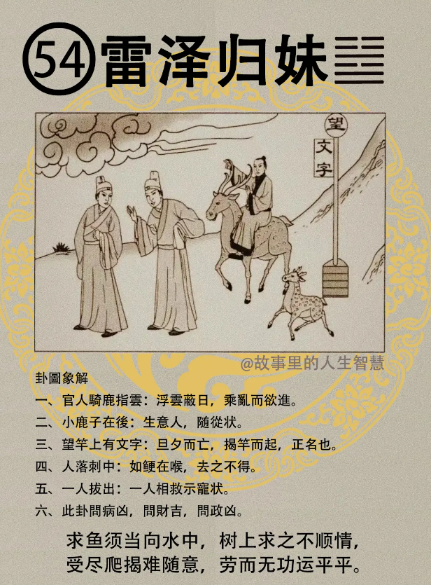

#### 详解雷泽归妹

渐卦完了以后，进入雷泽归妹。归妹卦。

风山渐，渐必有进，一定会慢慢进的，进到后来呢，进之后呢，必归，就好像你刚开始，各位山都不讲话了，两个人开始认识了，开始慢慢相交往了，渐进啊，结了婚了，就要谈论婚嫁，但归。

我们一直讲归妹嘛，为什么要讲妹，这我专门讲女归啊，女之归道，女归妹，为什么? 因为泽是少女，三女儿，对不对，雷是不是长男，长男跟三女儿在一起，结婚的意思。

那雷在上面，女在下面，男在上面女在下面，男动，女悦，泽是有喜悦的象，男动月悦，这就代表相感。

如果进入人间道，按照易经的卦爻来看，卦象来看，你这个动，外动内悦，对不对，是以悦而动，凶。

现在所有的人都是以悦而动，易经上叫什么，以明而动，所以雷，火，丰，火是什么，明，雷是动，一个是以悦而动，对不对，一个是以明而动。所以以悦而动才会有归妹的现象，那我是男的，我看到男的就很喜欢，以悦而动。以明而动，我知道男人跟男人不能来往，我只喜欢女人啊。对不对，知道意思吧。所以以悦而动，不能啊，看到这个很喜欢，我好开心啊，我想把他偷走就偷走，这是以悦而动啊。以明而动，这不行，这是偷的行为，会坐牢的，犯法的，这叫以明而动。

所以治丰之道，丰胜之道要以明而动，不是你高兴想去怎么做，我高兴我好爽，我把吉普车停在马路中间，车没锁，然后防盗器打开来，你这是以悦而动嘛，懂不懂我的意思，不能以悦而动哦，要以明而动。

你处事情的时候，处在这个问题上要以悦，但是动的时候，不能光是你喜欢就能动，这以悦而动，这是招凶。

这个第五爻啊，这个雷泽归妹第五爻，六五之爻呢，专门讲君王的位置，柔居尊位。你如果是全国第一夫人，柔居尊位啊，易经讲这个，就是女啊，女人啊，特别看清楚啊，女要处尊贵之道，一定要做到什么? 尚礼不尚饰，要规规矩矩的。

现在我们的人呢，一天到晚的尚饰，女孩子带着妆，我是第一夫人我当然要怎么样。然后让你报财产，申报财产的时候乱报一通。所以呢，尚礼不尚饰，这是易经面的中道，在归妹卦里谈到，因为讲女人啊。

所以你看到女孩子，值得我们尊重的女孩子都是，她尚礼，非常的有礼，不尚饰，不是股票上市哦，尚饰，音同字不同。那他们现在都是股票上市的都是很好的，都是好人。

#### 占卜

占卜，如果你哪天不小心，为自己占卜了归妹卦。

官人骑路指云，代表云看不到，代表浮云啊，蔽日，太阳，被遮掉了，有浮云蔽日之象。日字在卦上面来说，指的是君王，也代表爸爸，也代表丈夫，也代表儿子，浮云蔽日。有代表因为浮云蔽日，乘乱而进，乘在大乱的时候，赶快逃。

第二个，有个小鹿子在后面，这是生意人，代表随从，是一个随从跟在旁边，生意人跟在后面走。

第三个，望杆上有文字，这个望杆在上面，如果卜疾厄，旦夕而亡，知不知道，那个望不是这么写嘛，亡的亡，旦夕而亡。

还有呢，如果是卜到，我实在给他整得不得了了，这个天下大乱了，我们要揭竿而起，正名，你揭竿而起可以啊，你要用什么名义啊?我要反清复明，我要把清朝推翻，建立民国，对不对，这就是口号，要正名。反清复明的口号喊不对啊，要推翻清朝，建立民国的口号就对啦，所以最后就成功了。是吧，那名不正嘛，问问我对吧。

第四个，人落刺中，人跑到刺里面，去之不得，你看我的婚姻如何，一卜，对不起，很难解决，去之不得，如梗在喉啊，先生小姐你不要看我写，你卜到这个卦你就知道真的是这种感觉。很多卦可以读心。 

然后有一个人呢，一人拔出，有一个人来相救，但是呢， 一个来相救，这个人相救是恃宠状，为什么这里要恃宠? 因为它是归妹卦，那我们现在只要能够得尊贵的夫人宠爱的话，那真是升官平步青云啊。

#### 阳宅

阳宅，长男居少女位。你是大儿子，住到西厢，成格，如果你那天不爽，说老师我要证明你是错的，我让我大儿子去住西厢，开始演西厢记了。 

第一个，男同性恋。

第二个，委曲求禄。

第三个，无婚，同性恋这还没有立法通过嘛。

第四个，诸事不顺，儿子读书考试什么事情都不顺利。

然后短命，艾滋病嘛。

不要乱住归妹卦，然后也上演西厢记，这西厢记啊，都是爱情角色谈了半天，谈了半天都没有结果。所以恋爱史都可以写一部小说，所以你发现你儿子一住归妹卦，他每天都在谈恋爱，但是你那天他打电话，你窃听一下，一听对方是男的，你真的是吓死你啊。

老师我改过来，如果改回来太慢，积重难返啊，就会累啊，那可能要雷天大壮卦。