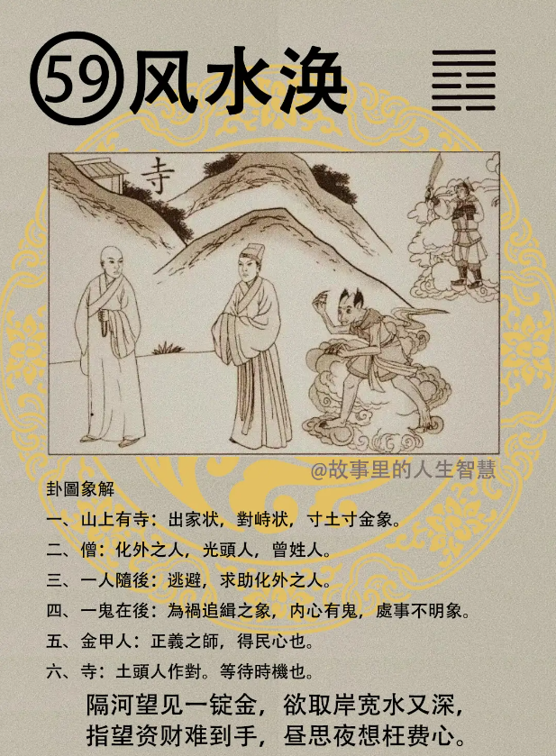

#### 详解风水涣

风水涣，这个涣卦呢，天道，这个涣卦啊，讲了我们人的气啊，忧则结聚，优就聚在一起，悦则疏散。就好像你现在有闷气，肚子里很难，气发不出来，聚在里面，喜悦的话就会散掉。

风水涣，这个涣就是讲散也，如果是涣散的时候我们怎么处理? 所以我们有治散之道，有处散之道，当你是君王，天下民心涣散的时候，我们怎么处理?如何是这个治疗这个散，这个象。

那为什么是风水涣？风在水上面，风在上面水在下面，风吹水的时候，上面的纹跟着风在吹，所以扩散的象。

老祖宗就想到了人间道，所有人之离散，包括夫妻，包括国家，百姓都是一样，所以人的离散都是由乎中，就是心啊，都是人心离，人心离则散。所以有时候你不要看到人家打包袱走路了，那已经是结果了，人心已经离散了，在走路之前已经散掉了，讲的是这个人心啊，人心离。

那治散之道在哪里呢? 因为他知道是心嘛，所以治散之道一定要本护中，这个中，是中庸之道，能收合人心，能够收合人心，收合人心的时候，这个散可聚也。

那易经既然提出要收拢人心，那个圣人很聪明，他就跑去看这一票人，你看前见天那个新闻，一票人那个信宗教的，有没有，整个路上跪满，大都穿着白衣服跪在那边，中东什么宗教的。大家在这个朝圣的地方，全部跪一票，古圣人一看，人心在最聚的时候就是在宗庙里面，所以要收人心很简单，三个字，要立宗庙，就能够收人心。

所以李 XX 现在在立宗教，主权在民，这个我们一定有把它建立的制度化，这个建立制度化，两年以前人家就在讲啊，他就是不给人家建立制度，是不是，现在他就在讲，就是想立宗庙，收人心，他说是他说的，你看他两年前，早就该讲了嘛，大家都在讲，要内阁制、总统制，讲明确，然后他就说了，我们国家既没有总统制又没有内阁制，蒙嘛，让大家都不晓得是什么制度，蒙骗才能得到利啊，到现在讲了，为什么? 他可能知道大势不太好了，他在立宗庙。但是立宗庙立错了，有一个很好立宗庙的方法，人心的两千万，大陆的人心都收回来了，不告诉你啊。给你知道还得了，你想当上帝去了嘛，野心太大了，不给他讲，真的不能讲。

这是立宗庙是自己去想，一错就倒霉了，象只要一次机会。

#### 占卜

山上有寺有没有?你宗庙立错了，就是山上有寺，出家状，山上有寺。也代表两军对持状。

那这个寺庙这个寺呢，你看寸土寸金的象，寸土寸金的像，也代表土字头，对字尾，土头人作对，赵是不是土头人，连（連）勉强把你能成土头人，想把你弄成土头人，我不告诉你，我一下就把你给干掉了。现在不能讲。

一个人寺庙的尾巴不是对字尾，我们这个付有没有，旁人作对啊，寺，土头人作对，你黄是两个土，对着更厉害了嘛，赶快把它干掉。

一个僧，僧人呢，这个僧侣是化外之人，是光头人，那也代表曾姓的人，天机到上面我们讲先天卦，后天卦，会把这些写进去，诸位可以去看，我给讲的很清楚。

这个一人呢随后，一个人跟在他后面，跟在那个僧人后面，就是中间的那个人，代表逃避，逃避，求助化外，世外人的象。

第四个呢，一个鬼在后面，这个鬼呢就是内心有鬼，处事不明，内心有鬼处事不明的象。

有人说老师你怎么知道他内心有鬼? 羊眼还有猪眼的人，这两种人，前面坏的我都讲过了。什么叫羊眼，猪眼? 眼睛嘭出来，然后眼球呢，旁边眼白的地方，充满着黄黄的，很浓的，眼白非常的浑浊，红丝非常的多。羊眼和猪眼的人啊，大恶，大恶之人，还有醉眼，其实这三个看着都很像，猪眼其实看起来就像醉眼，你看这个人平常没有喝酒啊，可是看到他的眼睛好像喝醉了的样子，眼睛像喝醉的样子，这种人呢，大恶大凶之人，闪开点，不要理他，这就是内心有鬼啊，处事不明的状况。

金甲人在后，正义之师啊，我们前面出来很多的金甲人，代表得民心的。

#### 阳宅

阳宅部分呢，长女居次子位，大女儿不住到东南角，跑到二儿子的位置去了，成格。诸位千万不要问我，我一再提醒你，如果那个人没有八字，如果你只拿个罗盘到他们家，一看的时候，你卦一排出来的时候，他就是命了，他没有经过人家，就跑到涣卦上住了，就给批下来了。

第一个，心在宗教，不想婚事。这麻烦了，你爸爸妈妈发现你的女儿怎么样，每天给你们说她想出家，你就想了，风水涣。不想婚事，但是这个也罢了，懂不懂我的意思，易经说还没有结束啊，他想宗教，但是又不求正道，每天在那边不求正道，走邪道。所谓鸡蛋教，鸭蛋教。

第二个，心中有鬼，故诸事不成。所以为什么我给诸位说不管你今天以前如何，诸位呢千万不要有心机懂不懂我的意思? 你不要去想事情，想了半天，你心机再多也没有用，这是浪费时间，你还不如多花点时间去读书，然后一到事情的时候，遇到人的时候你什么都不要想，中虚为明，然后先听，听完了再讲，不要先还没有看到什么，就先去认定什么事情，你一主观的话就会被人家利用，易经从头到尾都是给我们在讲这些事情。诸位不要学完之后，今天这个清楚了，回家以后就忘了，走到门口头一撞，刚刚讲的什么忘了，一定要想通知道吧。

第三个，如果女孩子住在这个地方的时候，她会祸事连连，祸事连连，一直连续着不断，甚至还有官非，牢狱。然后爸爸妈妈就很奇怪，我女儿，信宗教信的很好了，怎么还有这么多是非，因为她信的不是正教嘛。诸位你看我读这样，我看过啊? 我当然看过了。

那你说怎么办呢? 易经上没有解得方法，易经告诉我们出家呢化解，化解凶灾。克母，永远让妈妈担心的，易经上告诉我们这样解，这是人间道，人间道讲了半天，他没有收到，这就要靠地脉道，你住在东南角，巽为风的位置就可以改，位置调整过来，他的想法就可以改变，否则你在，耳提面令是不是，重审你的命令，但是讲了半天她没收到，她还是，当时听了很激动，回到房间就变风水涣，好了。这个就很麻烦。