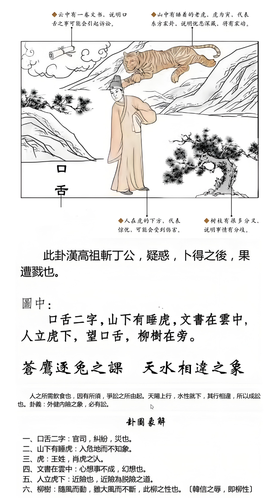

#### 详解天水讼䷅

《讼(sòng)》：有孚，窒惕，中吉，终凶。利见大人，不利涉大川。

▅▅▅▅▅ 上九：或锡之鞶带，终朝三褫之。
▅▅▅▅▅ 九五：讼元吉。
▅▅▅▅▅ 九四：不克讼，复既命，渝。安贞，吉。
▅▅　▅▅ 六三：食旧德，贞厉，终吉。或从王事，无成。
▅▅▅▅▅ 九二：不克讼，归而逋。其邑人三百户，无眚。
▅▅　▅▅ 初六：不永所事，小有言，终吉。

在看天水讼。为什么是天水讼？饮食之道，因为有饮食大家就会争，有了争以后就会有讼，所以讼之初一定是有争。争，就是冲突、争夺的象。讼是官司、 诉讼、 纠纷。 

以内卦、 外卦来说外卦是健、 内卦是险，是不是变得外健内险。有一个人外面装饰的很好，里面是空的这就是讼，诉讼的源头。

比如说我开了一部很好的车子来说先生，你借我50万，这是外健内险。同样一个人如果外健内险的话，他每天都在做人，结果做的也很成功，世界上好人坏人都觉得他是好人，外健，里面是空的，因为他花时间做人，从来没有充实自己，内里是空的，结果是给人家骗了，为什么? 因为他要去做人，他必须对人家好，遇到坏人要求什么他都答应他，这是内险，从来没有求内实，内一定要实，讼之源，讼的源头就在这里。

一般来说诸位我们看人的时候已经是开始官司了，都没有去溯源，溯源后，这个人的本身的心态，最开始就是这样的外健内险。

还有的人打肿脸来充胖子，他是外健内险，你跟他说没有关系，我帮你，结果他还是不能。都是这样的。

所以讼是需卦的续卦，因为有争才会有这种现象。

所以我们人在人间道上来说，在一个人的内心抱着侥幸的心里，外又刚强不服的人，这是致讼之源。

如果我们看到一个人内险外健，所以就成讼，诉讼。还有如果一个人是健而不险，就是不生讼，这个人一辈子不会打官司。还有就是反过来如果这个人是险而不健的? 就是不能讼，根本不能打官司。 了解意思吗? 这就是属于人间道。

所以一个人如果是险而又健，是以讼也，才会真正的打官司，死不认错。

如果一个人健而不险，从来不行险，做事情不抱着侥幸的心里，一天到晚要充内实，一百万投20万炒股，或者100万投500万炒股，外键内险，讼之源头。健而不险，根本不生讼。

有的人是险而不健，冒险又是空的那就是不能讼，根本不用打了，你这个人一定输的。如果你拿出来的案子你一拿出来，你这个人本来做的事情都是险而不健，这个官司根本不能打，一打就会输，如果是险而又健呢? 就是讼之源。

诸位看，占卜，你看卜事的时候，图上面， 下面有一个口舌二字， 口舌讲的是官司、 纠纷。

山下有睡虎，人入险地而不知。

虎也代表王姓人士，或者是属老虎的人，或者是明正之官人。

所以如果你看到比如说请问你这件事情如果我们这样做会怎么样?会怎么办? 我们卜卦，一卜是天水讼，先生你这样做一定是官司纠纷，因为你在行险，老虎没有看到，同样的老虎也是你的贵人，如果找到肖虎的也是代表贵人。

文书在云中，就是幻想，心想事不成。

比如说你看我今年会不会升官?一卜天水讼，对不起，本来你的官已经太高了，结果现在你官司缠身，所以不会升+，卦就解释的很清楚了。你现在不要想升官了，你现在好好把官司打好吧。

人立虎下，人站在老虎的下面，这就告诉诸位一个脱险之道，什么意思? 就是告诉你，《易经》已经告诉诸位了，险事发生的时候，进险为脱险之道。比如说我是公司的老板，工厂里面有人死了，被机器夹死的，你不要跑路，又不是你杀的，你怕什么? 你一跑路就心里有鬼，找你的时候，你要马上出面，要进险是脱险之道，了解我的意思吗? 这才是重点。不要跑路，险事发生的时候一定要坚心，所以任何事情一定要面对，千万不要逃避问题，逃避问题不但不能解决问题，要面对问题就能解决。所以如果我是通缉犯，我找个和尚庙离警察局最近的，你天天吵他，吵的他知道我是谁，他就忘记你是谁了，只会说拜托拜托，悟因大师你不要吵了。

后面一个柳树，什么树不画， 画了一个柳树在这里，柳树是柳的性，柳性，你看柳树风再大都不会倒，告诉你能屈能伸，柳姓能屈能伸，大丈夫能屈能伸，该跑路的跑路没有关系，韩信能受胯下之辱，大丈夫就是柳的性。

所以能屈能伸就是君子之道，君子之道是能屈能伸，所以能够避讼。所以诸位你只要记得发生什么事情管他对错，先认错，没有人会找你麻烦，哈哈，要不人争一口气跟你干到底。

刚刚讲的是天水讼，阳宅的位置，父居二子位必讼，一定会讼的，所以爸爸住到二儿子的位置，如果住到正北方，做什么事情都有官司纠纷。你说奇怪，我以前没有这么倒霉，从我搬到这个房子以后，我开车从车库出去也要跟人家打官司，回到家也要跟人家打官司，上班按电梯把人家的脚夹了，也要打官司，每天都有，这就是讼，诉讼。

所以如果你在做事业上面，有一种没有关系，就是你本来就在讼，比如说律师、 法官，讼吧， 没有讼我怎么吃饭?我如果是法院，我一定住讼。其他的最好不要讼，那就是天水讼。

住到这个位置上的时候，在运的立场，父降位了，爸爸降位了， 降到什么程度? 诸位看这里，东西南北，父亲在这里乾为天，长子在这里东宫，爸爸是第一，你看我写的顺序，爸爸是第一，妈妈是第二，长子是第三，长女是第四，再来第五是二子。

你如果你的名字是爸爸，结果不幸住到二儿子的位置上，就是叫降了五位，本来你的八字里面32 岁那年是天同化权，陈先生，你 32 岁掌权做主管，但是因为你住到这个位置上，发生官司、是非、纠纷，延后5年，变成37岁，就是加减，不然同时生出来的人同时升官发财了，看位数在什么地方。

本来32 岁化禄，化权又化禄，张先生，你32 岁的时候，您可以脱离开来，自己做生意当老板，但是因为你住在北方的位置，所以对不起，你要等到37 岁以后才可以自行当老板，要延5年，依此类推。会不会看? 

还有这个李先生，您住在正北方的位置，你老是在行险，你做的东西都是很冒险的。你怎么知道？我是买六合彩的。我表面上卖槟榔，里面卖吗啡，我们表面上看外险内健。

如果你做主在西北角的话，表面上是卖槟榔，晚上回家，在看书准备高考，这两个位置差很多哦。行险，你有贪念产生才去行险，你没有贪念行什么啊。所以我们上次介绍艮卦的时候，艮是止的象，止的象是目所见，你当时没有看到欲望就是止住了，女孩子一看到很漂亮的衣服人都走远了，眼睛还在斜着看，就是不能止她的欲望。所以阳宅上会了吧?

爸爸住的是天水讼，妈妈住的变成了地水师。天水讼之后就是地水师。
