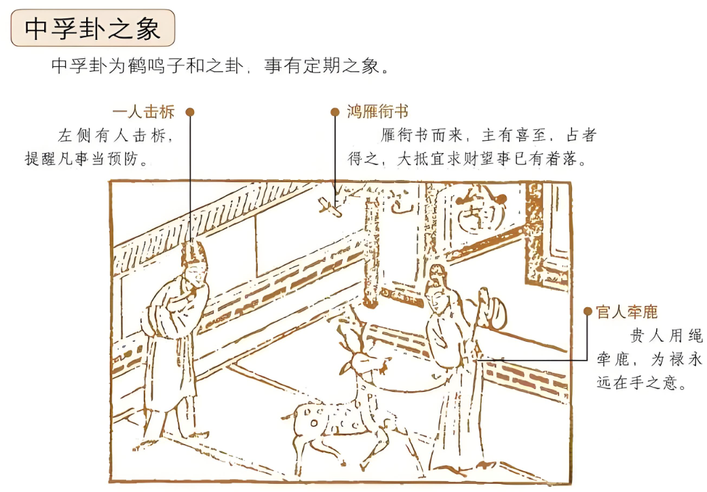

#### 详解风泽中孚

诸位看，风泽中孚，风泽卦，泽上有风。

中孚，信也，代表诚信，代表信。天道演变的时候，从一个人的节制，节制啊而不过越，你不要超越过，有知止嘛，节制而不过越的人则有信，人家一定会信任你。

诸位你要做信，做正，做刚的人，你不要求，人家自然而然会来帮你的。这是真的帮忙。你求了半天，人家不要帮忙，你这热脸贴到冷屁股了。就没用了。

一个人有信了以后，大家都相信你了，信则能行，就能够推动所有的事情。现在民进党就是，还没有让老百姓完全信，所以很多意思还是受到阻碍，信你的毕竟是少数的人。那你如何让大家相信，你来问我嘛，你又不问，问我就告诉你。

所以中孚卦专门讲信之道。那为什么这个信呢?诸位看泽上有风，我们老祖宗坐在那边看，泽上有风，风吹在泽上，不是风吹在水上啊，沼泽是一片，有限的水池，风在吹，风一吹的时候，那个水感到很柔和的在动，所以是水受到风感，关键在感上面，你的诚信能够感动人家对不对，这才是真正的中孚啊。

所以所有的后面的所有的行啊，所有的行动，都是因为有感而动嘛，因为是被感动了。

所以你看他的中孚卦，诸位看，风泽中孚䷼，外面是阳，里面是阳，中间是虚，叫内外皆实，又中虚为明，易经一个，一个虚就是明，中虚，他两个中虚在中间，另外两个实在外面，就是告诉你，如果一个人，表里一致啊，你们听好啊，内外皆实，又中虚为明。什么叫中虚？你坐在那边听国事，要真听啊，不要听完回去以后，还是登辉制，懂不懂我的意思啊。你不是中心嘛，做个样子给你看，表里要不一致就不行了，真正的孚诚，中孚是孚性，好，至善之道在这里。

装装样子，那表里一不一致很简单嘛，看他动作就晓得了，一个人在讲话的时候，如果听进去的话，回答你，真心诚意回答你的话，他的手是这样子，上下摆动的。听完你的话，他还是在讲他的话，手是左右的，表里不一致，嘴巴和心里想的不一样，他手就是横的。

人间道，第一个就是我刚刚讲的表里一致，表里一致而且要中虚为明。

诸位呢不要做清官要做明官，明啊，不是争名啊，你不要给他算命的，你娶一个老婆，她两个儿子怎么着，不要去讲这些，你六合彩赚大钱，然后后年坐牢，不要这么讲。明，一定要晦明才是高手，明不明白我的意思，晦明。有些情况人家愿意是好的，不要去批评人家的善恶，了解我的意思吗?很多人做坏事做到牢里去了，他要去坐牢，人家个人头上一点点，不要去随便讲人家。

晦明，明要半晦，有时候，还是看不到比较好。

今人呢，现在的人呢，不知道，真正的中孚是什么，易经这样写了，《圣经》没有写，今人不知道中孚啦，表里不一啊，造成了言而无信，言而无信，都会招凶。

中孚卦在法上面怎么讲，中孚卦，他讲君子，君子观象，他以两句话，一个叫做议狱，一个缓死，两个动作来招信天下。为什么要这样讲？仪狱缓死，有人犯了错以后，我们讨论他在法庭上辩论他，这是一个，要招信天下的，要仔细的讨论，你仔细的讨论这个案件的时候，这叫做尽忠。

如果这个人该判死刑的时候，你经过很多层的审判，终于判你死刑，你还是死刑再去执行，这叫做缓死。

易经就是这个精神，个人赞成呢就地枪决，个人赞成这样子，那要看时机嘛，学了易经不能被绑住对不对? 要看什么时机。

如果是台湾法院突然通过了，非法持枪的人，就地枪决，我告诉明天早上台北市一大堆枪都缴出来了。现在台湾坏人有枪，好人没枪啊。

易经赞成这个，现在美国就走这条路，为什么? 一直上诉，过了十四年，该死还是死。这事告诉你国家的法很严，决定经过十几年你还该死了，是不是，不会马上把你干掉的。说当然是很迟来的正义了，迟来正义，所以有人赞成有人不赞成，但是这个易经上面是赞成这样的议狱缓死。

#### 占卜

如果你卜卦卜到中孚卦。

第一个，望字上文书，代表科甲高中，考试会上。如果刑事，刑法更吉，能够招信于人嘛。

第二个，人撃柝，示警，有人在示警。

第三个，贵人用绳牵鹿，有个人用绳牵鹿，用绳绑到，叫守成，不可攻，守成。

第四个，燕衔书，过去人看到燕子，就知道什么? 国都要南迁。向南走，向南行。诸位看到前面的很多燕子都可以解释，全部向南去。

第五个，人立亭中，有没有，人站在亭子中间。防官司，还有呢，打官司来保身啊，打官司来保身。

你说老师这个怎么会有官司？诸位看啊，燕子旁边画了一个这样子，乙，有没有，我就不会画了怪怪的，有没有，这个叫腾蛇，腾蛇出现的时候，腾蛇主的官讼，窃灾，官司。

那个望解释过了，旦夕而亡，你身体好不好，卜到科甲大利，但是在医院快挂了，旦夕而亡，所以卜卦的时候，一定要问小姐你要卜什么? 我要卜疾病，好，死。考试？上。

#### 阳宅

阳宅上面，长女居三女位。成格，这个常常见到，中孚卦。为什么会常常见到? 你是二女儿，三女儿，大女儿都常常有中孚的是不是，住错了，住到西厢去了，大女儿结婚，二女儿住西厢，变成中孚。

第一个科甲状元，你说奇怪了，我女儿总是从小到大全校第一名，中孚卦。

第二个，武职大利，军人，警察，法官，外交官，武职大利。 

第三个，这个中孚卦出现的时候，双喜临门，双喜同临。

一般人来说，时间来说的话，代表喜事呢，喜事初不成，刚开始不成，后成于科甲，喜事初不成，后成与科甲，然后延三年。比如说你的命是24岁红鸾星动，结果当年你要去结婚，你爸妈不同意，不行啊，你是女孩子，你先去考律师好了，考上我就同意你结婚，好了，他 27 考上律师，进入中孚卦，结果考上律师同时办结婚。这是举例啊，你不要给他做这样的批啊，那有这么多这样的事，我给你们举一个例子，怕你们不会变。

所以我有时候不敢讲，让你们自己想，比较海阔天空，有的人我讲完他就在这条路上面，不会走了，懂不懂? 如果要海阔天空的话就要去想。