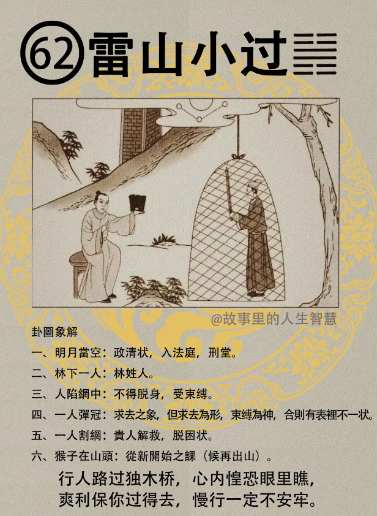

#### 详解雷山小过

雷山小过，我们有一个大过，有一个小过，有一个大畜，有一个小畜。

这个天道呢，遇到小过卦的时候，为什么是中孚卦之后? 中孚卦是信，人之所信，大家都信你了，必行，一定会行，有动作出现，行则有过，有时候我们做事情会有一些过失， 或者过一点，或者少一点。小过讲的是， 小事过，小事过一点，还有过之小，过的很小，这个不为过。这个是讲的小过卦。

那为什么叫雷山小过呢?山上有雷，雷打到山上的时候雷声可以传很远，对不对，无所谓无伤嘛，打的很响也无所谓啊。过去一下就过了，我们难免都会犯些过失，小过失无所谓的，无伤大雅，你不要一直在一天到晚在讲那么一点点，你自己是完人啊，不要，小过失无所谓。

我刚刚讲就地枪决，你不要人家违规停车，你给人家就地枪决，那太过了，那是大过不是小过啊。好，不要乱搞，如果要用的时候，我讲的很有道理，有一个先生问我嘛，标准嘛，水泽节标准在哪里? 节卦就有标准，初爻和六爻啊，你不要初爻就我刚刚讲的就地枪决，好了，你给人家枪决了，结果自己也要枪决了。为什么? 你摩托车停的很安全，人家给你迁到那边去了，结果你违规了给人家干掉了，你迁的时候，你还以为被偷了，他以为你违规把你干掉了，这就太过了，不行。

这个小过之道啊，必要宜时，一定要有时机，一定要随时，宜时从事，你要做什么事情，行动的话，一定要顺势而为，判什么时机。你在这个时机上面做一点过失无所谓啦，你在台北市啊，以前街上都没有那么多摩托车，摩托车，你车子乱停就不对了嘛，到处都是停车位。现在都停不到，偶尔停个黄线无所谓啦，红的也给拉走了，这都是小过，小过失无所谓，这要因时制宜。

今人呢，现在人呢过在哪里? 过恭，太过于恭敬，过哀，老人死了在那边哭天抢地的，又过俭，节俭呢，就是所谓的大过。这种决定不要，不可以。

那你看这次国民大会，一大堆人在那边巴结他，过恭，还要求他出来，我要告诉你，这种人，我要告诉你是我提的，你记得下次干部长的时候我来干。这就不对了。

所以我们讲小过啊，如果易经上面提出来的，当过则过，无伤，没有伤，无伤大雅。如果是不当过，不该过，则过，就马上从小过变成大过，不当过则过。那最重要的，诸位一定要因时制宜。 

#### 占卜

有一年呢，我有一个朋友，很好玩呢，民国八十二年是不是酉年啊，那八十一年是什么? 是申年，申年是什么? 是猴年，八十一年，他姓林，那他二小姐，家里环境非常好，他父亲是刻苦耐劳，白手起家，创业，创的很大。结婚的时候这个二女婿有问题，二女婿想贪，这个你应该给我什么，他如果在他岳父的公司里得不到一些好处的话，就回家打老婆，无缘无故就打，大家都知道，安安静静，标准的贤妻良母，他也不晓得为什么打她，就没事在那边打，没事在那边打。 要离婚，离婚可以啊，你给我三亿啊，你就知道这是他的邪念了。来找我怎么办? 拿铜板一丢，雷山小过。你看哦。

第一个，明月当空，代表政治清明，包青天头上的月亮，代表司法，公正。

第二个呢，林下一人，看到没有，林姓人

第三个，一个人陷网中呢，不得脱生，受到束缚了，人陷网中就是不得脱身，受束缚。

有一个坐在那边弹冠，弹冠求去，有没有? 那个男的坐在这边看到没有，离婚啊，可以啊，但是不爽快，还是给你束缚到有没有，所以你要说离婚，离啊，你拿钱来，不给你离，那那么简单的。所以一个人弹冠，我们给他挂上邪的时候，弹冠呢，是第四个，求去的象，求去的象没错，但是求为外形，外面是求去，束缚仍在，他绝对不会跟你好聚好散的，这就是小人，易进难出，束缚的人在。

那有一个人在割网，有没有，贵人相救，脱困。 

第六个，是不是猴子在山头，猴子在山头啊，第一个猴子在山头指的是什么? 猴年就是申年嘛，第二个呢，有猴，猴是等候，候在出山，在重新看，雷山小过，有重新开始的象。 

官司打掉，贵人相救啊，脱困啊，拿刀割网，我自己就去冒充贵人啊，然后就找我一个很好的朋友是女孩子的，他最恨老公打老婆了，对不对，我就去找她，如果是找男的话，无所谓啦夫妻打架。找女的，他敢。然后找个老虎人，很凶悍的，让他到那边去告，一下就干掉了，那人只要一条路，不离婚就坐牢啦。结果干掉了，这段要剪掉，不然那个男的会来找我。说我给他搅局啊，读出来给你们看。 

还有，卜卦，或者是事情，或自己做梦，你遇到林的时候，你不要以为林很简单，林姓的人啊，如果加一个火字就是焚了。

所以林呢，什么叫做林啊，林就是一火焚之啊，所以如果流年流月逢到雷山小过，对不起，家宅要失火了。

后面还会再讲，所以我很累，我还要再讲一遍。好了，很麻烦的。

你晚上睡觉做梦怎么树林那么多，那就要失火了啊。

#### 阳宅

阳宅部分，长子居三子位。这个大儿子居三儿子的位置，这个有很多人，我告诉你现在有很多的雷山小过，本人告诉你啊。

第一个，感情啊困扰，非常困扰，然后网女不放，认识一个女孩子之后，抓住不放，要分手，对不起我不同意啊。所以你们女孩子交男朋友之前，最好看看他是不是雷山小过，读图嘛。每天在后面跟踪啊，看你有没有交男朋友怎么着的，每天都是，深更半夜在你们家门口等，每天早上一出门他在那边等，正事不干，天天在困扰你。那你如果你是父母发现你儿子这样，他是雷山小过，知不知道? 好，你不要去说，儿子啊，一直劝他，劝了半天没有用的，他理你他就是雷山小过，这个是问题很大。网女不放，这就是小人啊，不顾一切，这就是不顾一切。

第二个，肖猴，属猴子的人呢，还有侯姓人，不忌，如果你看到你儿子跑起来，动不动像小猴一样，你那个脸笑起来也像猴，吃东西，吃花生米也像猴子，喜欢是吃香蕉，不喜欢吃西瓜，然后爬树，爬到衣柜上面，动作很多，好了，小过无所谓啊，他不会的。动作也要像猴子啊。但如果你儿子是猴年生，动作又像猴子，那就是王永钦了，他真的像。

第三个呢，小过会伤人，因为他感情不顺啊，伤人有过，婚事不成，抓着女朋友不放，还有跟女朋友谈判，到女朋友家里去把他，你是父母亲，你不让我跟你女儿来往是不是，没有关系，把他爸爸也打了，家里人也打了。小过伤人啊。

那你就发现你儿子这样，拉又拉不回来，你就要想想看，所以天下很多父母亲遇到这种情况就找张老师，不要嘛，找倪老师。张老师没有用啦，还是来找我。张老师是愚善，他耐心很足，给你劝，愚善很好，劝了半天该自杀还是自杀，该想不开还是想不开，没有用的。