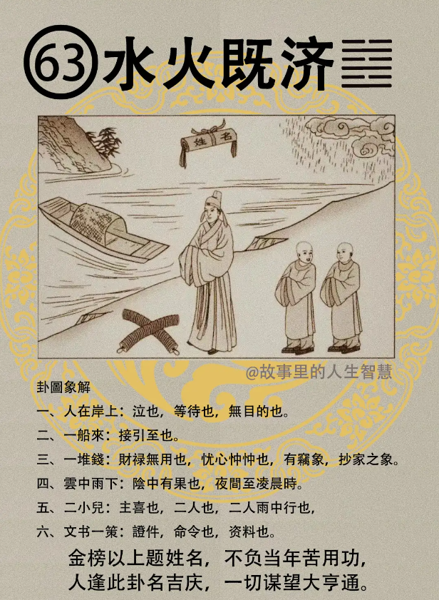

#### 详解水火既济

为什么叫水火既济卦䷾? 诸位看，一三五是不是阳? 特殊的我都写出来了，其他你要以此类推了。

所以一，三，五，是阳，二，四， 六，阴在阴位，阳在阳位，所以说， 人各安其位，各司其职，这个叫做既济卦，既济卦就是讲的这个时机，这一段时间，既济卦。

天道上面呢，雷山小过，有小过者，一定会必济，他知道他犯错了对不对? 好，他好会回头一点，我应该站在哪个位置上，角色扮演，前后要分析一下。必济所以受之以既济，既济卦就是小过卦。

因为先有小过，我刚开始不懂啊，所以教育很多，犯了过错，小孩子犯了过错你教他，就是小过嘛，慢慢他就知道他应该扮演哪个角色，站在哪个位置，不违法啊，最好的立场，所以小过之后，才会到既济卦。

那水火既济卦你看，水火，水在上面火在下面叫做水火相交，是不是水火相交，你不要香蕉、 西瓜、凤梨啊，不要老师音同，老师常常用音在判嘛！所以我就常常提醒你，你知道我的意思吧。我刚刚说鸡嘛，我就突然讲到飞机的机去了，那我用这个香蕉，讲到你写香蕉，你不敢看字，你在听同音，所以有时候还是要看一下字的。

水火相交呢，必可互济。这个是所以用济之时呢，水火既济卦就如何用济啊，互济，来各得其位，各安其位，讲的用济之道。这个易经的火水之卦讲的是这种。

到了人间道啊，圣人呢，我们古代的圣人知道既济，所谓知道既济的为各安其位。

开始呢，圣人就开始思，防患於始啊，一开始各安其位，大家都没有话讲，没有问题的时候，这个时候，看了大家都很好，还没有看到明年，后年大家会不好的时候，现在还是警戒，如何维持水火既济。而不会得到已经发生的，我不平衡我应该干科长，他怎么可以干科长，应该是我来干，可是刚开始你干科长我干科员的时候没发现，对不对，等他开始运作的时候开始发现了。发现到了，那个人听不懂什么叫地山谦啊，那个人怎么能行呢，那个人干科长太差了，应该我干才对，他应该下去，不安于己位。

所以始蒙的时候，非既济的时候，圣人就开始思戒，如何持续这个阶段? 才不会造成他的灾，思防患於始，是圣人看到的既济卦。

遇到既济卦的时候，诸位记得一个天择。既济之时呢，就是天下，或者是一个公司， 或者是一个家里，既济之时，人各安其位的时候，既济之时，切不可进，绝对不可以往前进。进则必凶，一定会招凶。

举例，比如说这个科长，你是科员，上面的处长，这个是既济卦，大家都各安其位，你不要进，进必定凶。有一天科长不适位的时候，他自然被调走，这个时候你再进，懂不懂我的意思? 这里还是处于既济卦的状态之下，了解我的意思吧? 易经讲的就是这个。

进则必毁，所以呢，要知止，知道止。

今人啊，现在人不是这么想的，我给你讲现代人是怎么想的。今人他不知道安於其位，进而招悔，一进的话就后悔了。都是因为什么呀? 不知道自己不了解自己，不了解自己的才能到什么阶段。

所以易经有两个字，两个原则。第一个，这个易经告诉我们要知己而动，知道自己有多少才能再去动。第二个，适时，等待到适时，等待时机的时候适时而进。这个是易之道，易经告诉我们，这是大原则。如果能够这样子动的话永远都会无咎。

现在人呢，都不知安于其位，每个人都想做大，都不想安于其位。所以如果我们要进，一定要知己而动，知道自己有多少才能，等待时机，这是最好的。

这两句话就是告诉你，如果你郝XX听我的就不会这样，你没有读到易经啊，你也可能读到《圣经》，还是读什么经我不知道。

#### 占卜

第一个，一个人在岸上。人立在水边泣，哭泣啊。等待也，等待时机。无目的，没有目的。 

第二个，一个船来，有接引。 

第三个，一堆钱，代表财禄无用。那可能是铜板太重了，财禄无用，好，前面我们也介绍了，忧心忡忡，忧心的样子。财禄在地上呢，也有窃象，招窃的象。

第四个，那这个云中雨下，乌云密布嘛，代表阴中有果。阴也代表半夜，半夜，有结果，要托到半夜，晚上。

第五个，二小儿呢，主喜事，你看那个喜事就两个话筒，有没有，二小儿，主喜事。也代表二人也，也代表两个人在雨中行。

第六个，文书预测在空中，文书在空中看到没有? 上面代表着一个人的证件，就像我的证件有没有，飞啊，飞到空中上去了。命令，你该拿到命令马上就要到了，人事命令马上就要下来了。还有呢，也是代表资料，专门文书在空中，资料。

#### 阳宅

阳宅部分呢，二子居二女位，你是二儿子结果跑到二女儿的位置去住了，水火既济卦，好，如果说二儿子住二儿子的位置上，坎为水，如果你是二儿子住在南边，住在二女儿的位置，水火既济卦。

第一个，个性上面不重利。

第二个，喜从官，当官。从商呢，亦吉。做这个水火既济卦的时候，叫财官双美，有的人家里面很有钱，可是他住在水火既济卦，他喜欢当官，可是家里面希望他去做生意，所以他就两边兼顾，从商也可以。

第三个，文书在空中，科甲旺，高中，考试高中。

那水火既济卦的男孩子呢，唯一的缺点，这个，第四个，唯一的缺点。先有子，后有婚。有的人认为这是优点啊。一子为正，一子为偏，婚慢八年，婚姻慢八年。然后呢，先有妾来，后有妻。

所以后面我们批流年的时候，批先天卦后天卦，过瘾啊，先有妾来后有妻， 当然这是缺点也是优点了，很难讲，所以我们没有资格评价，个人是很喜欢啦。这个，但是不能这么论断对与错，这无所谓。