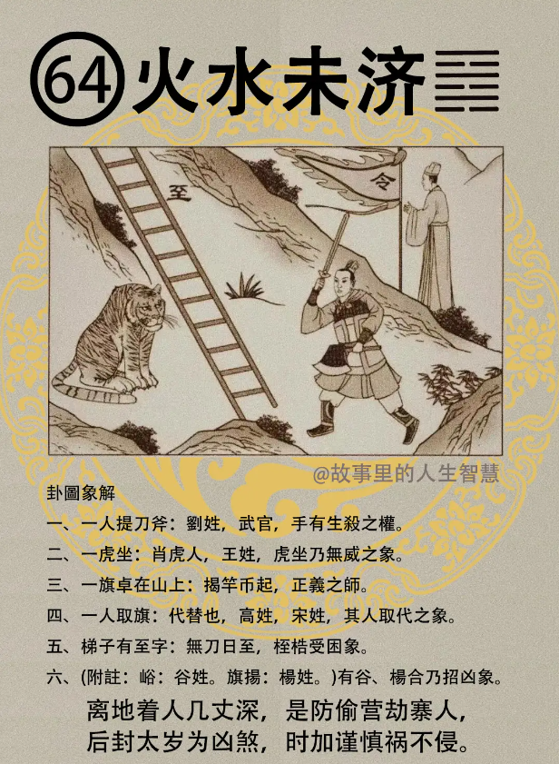

#### 详解火水未济

火水未济，火在上，水在下，这是未济，就是没有交接。在天道上面看是这样子。

未济卦之前是既济卦，既济卦物之尽，任何事物到了尽头，到底了就是既济。那物到尽头之后，就不会变，物尽不变，到了这里为止。

可是易经它本身的精神不在这里，易经它接个圆形的，所以我们易本身谈的是生生之为易，相生再相生才是易经。

所以易经，变易，不易，简易，讲了这三个原则，我们读了易经之后把天下事情简化了，我们看他的神。因为它是简易的，如果读了易经之后，越读越复杂，就是你没有读通，这个易经告诉我们读了以后会简单。

就好像我们常常讲，十八世纪的时候发明计算机，那一个大计算机像房子一样大，它只能计算三位数，但是经过200年的演进以后呢，到现在一个名片可以算十位数一个名片，由繁而简，200 年的历程，你不懂了嘛，所以你懂了之后，什么事情都会变简单。

诸位你听那个人讲话，越听越复杂，那就是你没有懂，了解我的意思吧，所以我们讲阳宅，四个字就讲完了，长幼有序就讲完了。

易经所谓不易的原则就是我们所谓的人间道，这个人间道是一个法则，诸位能够称得上法则的，叫什么? 法则的定义是什么?亘古不变，这就叫法则。这个法则，这个规则适用于今天，明天就不适用了，这个根本不叫做法则，法则就是亘古不变，永远存在在哪里的东西，这才叫做法则，你不能说今天合了明天就不合了，500 年前合，今天就不合了，这个就不是法则了，懂不懂? 那是规则，游戏的规则，法律在变，我们人间的法则不会变。

还有一个变易， 变易的话，因为易经在上面谈到我们外面的形在变，5000年前和现在穿的衣服都不一样，形在变，神不在变，所以我们了解意会有变的时候，我们不能脱离他的神。那因为他变易，易经还有在循环下去，天道还要再循环下去，所以进入到了既济卦以后，然后再到未济卦是两个再不相生。

因为从已经到物的极，物的极以后开始反，就是未济，又开始重新开始了，所以未济是我们既济之后，再进入易经的循环，再跑到乾为天去了。

所以受之于未济，未济在既济之后，物又无穷无尽的，所以未济呢代表未穷也，还有再重新开始，要一直循环下去。

所以你看火在上面，水在下面，就不相济，如果火在上面，泽在下面叫做火泽睽，睽就是违背、就是我忤逆你了，就是冲突。未济是没有冲突的，叫做未济卦是没有冲突的，两个是互相还没有开始，重新开始。

到了人间道，在未济的时候呢，未济之时呢，有亨。也有吉的事件会发生，比如说我刚到一个公司里面，我跟公司里面的人统统不认识啊，这就叫未济，这是未济的时机。那有亨之道，你处在这种状况之下的时候，如何去亨呢? 要慎，易经告诉我们要谨慎的处，讲谨慎的应对。

那谨慎的应对到什么程度呢?怎么讲谨慎的应对? 君子观象，水火不相交啊，两个不易交在一起，代表有不当之象，不适用的，不当之象。君子知道这个时候，君子处此之时呢，必各安其位，各得其所，慎动，慎静，就是未济卦君子处理的。

小人不是这样子，小人，处此啊，未济的时候，他从不量力而进，从来不会去量力而进，结果呢，终未能济，到结果呢终于是不能适应他的工作，自招损。这是易经说的，乃自招损也。

所以我前面跟诸位讲过，君子、人才难进易出，这个难进除了表面上解释，你很难请到它，还有君子本身去上任，去走马上任的时候，他就会心里，问自己的能力够不够，有没有资格去，万一不适应怎么办? 不受用怎么办? 君子来衡量自己的能力能不能够。

小人不是啊，小人是从不量力，他就要进，你看那个孙XX，从来不去量力。所以难进易出，除了讲君子本身以外，我们当然讲事情本身上我们上次跟诸位解释过，现在讲自己要先度量自己可不可以去。

当一天公司宣布你不适用的时候，你马上走，不要挡在后面。现在很多人找了很多借口，他太年轻了，他太不够资格，晋升现在还不好了，我要再观察他，再训练他一段时间，这都是借口。

所以如果量力而进的时候，他从不量力而进的时候，结果是未济。所以拿破仑讲一句话很好， 一百头狮子你给一头羊去带领，跟一头狮子带一百群羊，我宁愿选择一头狮子带一百头羊。李登辉就是胡乱搞。 

#### 占卜

占卜，这是未济，诸位看。

第一个，一人提刀斧，一个人提刀斧在那边，你看他读图下来，文字啊一个人提刀斧，以姓来说的话，刘（劉）姓啊或者是武官啊，或者是手有生杀之权的人啊，手有生杀之权的人，这是提刀斧，刘，刘卯金刀刘，刘是不是卯金刀刘，对不对?

第二个，诸位看因为人，老虎坐在地上，老虎坐在这边，是肖虎人，表示是属老虎的，或者是似虎，看起来像老虎的人，或者是姓王姓的也是老虎。老虎坐在那边，坐而无威啊，坐在那边发不出威来，老虎没有办法发威。

第四个，诸位看，老虎前是不是有楼梯啊? 楼梯有没有? 上面有没有写一个至字，有没有? 楼梯是木嘛，桎是不是? 桎梏啊，绑住了嘛，困在里面。好，所以本身呢，无刀曰至，一个东西到了，到字有一个刀在旁边，你把刀子拿掉是不是无刀曰至啊，这个桎梏，受困的象。

第五个，那一个旗插在山上，代表有事情或会有人揭竿而起，这种事属于正义之师。

第六个，有一个人取旗，一个人在那边拿着旗子，代表代替，一个人来代替的象，替代他，代他来做这件事情。一个旗子，拿旗子的人是不是带着一个帽子?诸位看易经上面有一个官人戴帽，一个纱帽山，帽子在这边，帽有两个姓，一个是高姓，就戴一个帽，一个是什么?我们宋兄啊，戴一个帽子。人取代的象。

等会儿下课，我们中间休息我再给你讲。我们卜这个卦有什么事情发生。 

#### 阳宅

阳宅呢，这个水火未济卦，二女居次子位，二女儿跑到次子位。

第一个，女身男态。你爱人呢，动作像男人。

第二个，逢虎，如果这个女孩子是属虎的，或者是在婚姻对象是虎，逢虎的话，枯坐无成。

第三个，那如果这个男子是刘呢，或者是宋，或者是高，像这种人啊，会从武， 比如说女孩子当军人，当法官，当警察，当外交官，会从武。

第四个，女孩子卜到水火未济卦呢，婚事呢不成，婚事会停摆。那这个从职的行业，跟命要做加减，婚事还不成。

第五个，如果是求财，做生意，求财这个位置上的时候，求财是非多，有争执，所以有争执版，就会有官司，求财以后会有官司，该给钱不给，这个女孩子拿刀或者拿枪出去找人家，很凶悍的。