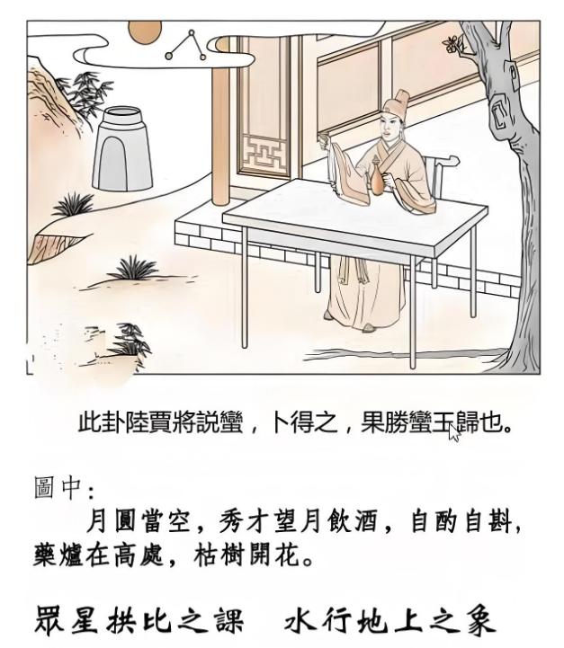

#### 详解水地比䷇

师卦呢，出兵征战了以后，天下治世啊，始治之时啊，刚开始治的时候。天下大乱之后，刚好天下突然太平了，对不对，刚开始就是人相亲在一起，所以下一个卦，就是水地比，比呢，就是有亲和的意思。

那我们为什么叫水地比？我们的老祖宗，圣贤呢，一看到自然界啊，最亲和的，就是水跟地永远连在一起，就是那么简单，水永远顺着地走。

世间天地间，至亲的就是水与地，所以地上有水，为比。自然界的象是这样，老祖宗每天看地上的水在那里流啊，亲和之道在那里。

所以易经上面讲比卦的时候，特别提到，两志相求，为比，两志相违，为睽，火泽睽卦。志气相同的人会在一起，志气不同的人，两个人不会互相往来，互相仇恨。

进入人间道以后，我们历史上很有名的，他说：同欲相憎，同忧相亲。这是一个不变的规律。

欲望相同的人，小姐，你我两人都是副总，一起想升总经理哦，这是同欲，一定两个人在敌视。我们两个人一起跑路，在海边碰到了，同忧，相亲。这是不变的，这是人间道，这是至理，你不需要去确认，有没有道理啊，这就是进入人间道。

那最早出来的，在战国策里面，中山策。有一天，他们要立武王，战国时代，大家都想称王，齐国魏国赵国燕国还有中山，立五王，齐国说中山这么一个小国家，我干吗跟它并列，就跟赵国魏国叫来，你们两国过来，当时齐国最大，中山最小，就把这两个国家弄过来说我们三国出兵把中山干掉。中山王听到这个消息啊，很紧张，怎么办呢，请了张登来，历史上姓张的都出鬼点子啊，他叫张登，中山王说称王不重要，国家要保存下来啊，张先生一定要救我。张登说好啊，你给我准备一些金银车马，我到齐国去，去了就去找田婴，是个庸才笨蛋，他说你们齐国是笨蛋，如果你要找两个大国，三个国家去打一个小国，那中山王就会去找赵国燕国说我把国家给你，当你们的附属国，来对付齐国，那你齐国不就倒霉了，你不是把羊赶到赵燕，什么都得不到。现在有个方法很简单，你不但能让中山王称你为君，而且他的东西都属于你。田婴说有那么好的事啊，当然有，我告诉你，你现在把中山君弄过来，许诺他为王，他一定很高兴，齐王许诺我为王，最大的靠山有了啊。那就会和其他国家断交，专门和齐国做朋友，那一绝交的时候，那两个国家就很火大了，齐王为什么要立他，当初说我们联合三个国家打他是你，把他立起来又是你，对不对，好，一定会去攻中山嘛。

这个田婴上当了，因为你一打中山，中山怕了，就说我王不要做了，统统给你齐国好了，你只要做一个动作就好了，让他们挑拨之间的感情，好，田婴就接受了，张登就走了。

那田婴旁边也有一个姓张的人，叫张田，他说报告国王，这个张登是有名的怀丕子，你被他骗了。历史上不变的教训，同欲相憎，同忧相亲。所有的四个王，就担心你齐王最大，你如果一立中山王，其他的王都会怕你，当初你要打他，现在你立他为王，你立一个王，亲近一个小国，结果和其他三个国家作对，得不偿失。每一个国家，不单单是中山，都担忧你不让他称王。怕你并吞天下。每一个人都同忧。张田就说张登的话不能听。

田婴说不听你，招中山君来称王。这个张登多坏啊，马上跑到魏国赵国燕国去，我告诉你们，齐王要来打你们了，为什么，他以前联系你们干中山君，现在他招他称王，要用他的部队，你们要小心，他们这几个国家一听，马上就联合起来，要对付齐国啊，赶快也立中山君为王，你看，厉害不厉害。

所以自古不变的道理，要抓住这八个字的精髓，这是最好的外交官，也是最好的谈判。看人性看的最清楚，所以说，当你遇到这种情形的时候，你有这种认识。

同样的，当你是老板，两个人之间你要升一个人的时候，同样有这种情况，了解我的意思。那如果你要大家同舟共济，很简单，让大家同忧嘛。大家就相亲，这是千古之道，人间道。

这个卦象，外面是水，是险，里面是地，内顺，所以比卦，相亲，亲和为比，所以呢，比之道，互相亲和就是外险内顺。

你要跟一个人变成好朋友，要外险内顺，亲和嘛，外面要战战兢兢地，对他很尊重，里面要诚心诚意，要内顺。有的人是外表很顺，心里想着骂你呢，那你说如何看出来骂，我们就看的出来啊。

怎么看？他对你很尊重你，跟你讲实话的时候，他的手是上下摆动，骗你的时候，手是横的摆动，这是人性。因为心摇摆不定，所以他的手自然就要摆不定。如果心很正，内顺的时候，手势是上下动的，这是外相可以看到，小人无法遁形。谁愿意当小人啊。当他手上下的时候，就顺了。

还有呢，就是讲话，讲话一直在偏离主题，不讲到正题，他就是要背叛你。他就在骗你。所以讲了半天，语无伦次，有没有，讲了半天，你听不懂他的话，这个人就是在骗你。

所以你马上可以发现到，真正的比之道，如果你抓到比之道，天下没有你的敌人，也是一种天下无敌。天下无敌也有一种，你没有敌人，你对所有人都是外险内顺，外面很战战兢兢，里面很清顺，没有敌人。

注意看这卦象，图解。
 
他怎么写的，月圆当空，然后秀才望月饮酒，自酌自饮，药炉在高处，枯树开花，是什么啊，看不懂，问你孩子，还没长大哦，还在幼稚园，进了小学就不要问了，就已经不懂了。小学看到了，药炉就是药炉嘛。

月圆当空，代表政治清明的象。

这个秀才啊望月饮酒，有二解。

一个呢，代表才智的人，无忧。比如说来卜卦的人，倪海厦，你帮我卜卦看看，我是教务长，我准备退休了，但我又放不下这个学校，一卜得到这个卦，才智之人，无忧，你不要忧虑，退休好了，不会有什么你担心的事情发生。

第二个呢，作秀的人，无法出头。比如有个立法委员过来问，你看我继续看立法委员好不好，一卜，别干了，政治太清明了，你出不了头。

如果是自酌自斟，一个人在明月当空，独自那那边喝酒的时候，无欲则刚，这是去比之道，万一说亲和，相比的时候有问题，你一定要无欲则刚，比才不会出问题，你跟人家来往，你有目的，你就会无问题。

药炉在高处，代表无病无灾，药炉可以放的很高，没有什么用了。

枯树开会，晚发。也可以说从头到尾代表有志者事竟成。你只要一心一意地往前走，有志者事竟成。枯树都会开花，代表晚发型。如果来问你的，是一个刚好二十几岁的作家，倪先生你看我专门从事著作好不好，一卜，不要，你晚一点再做好了。多吸收点社会经验，多看点人，不然你写的小说都是看人家小说抄来的，没有社会经验。外国人有的人，他为了写一本小说，写荒岛的事情，他就一个人住到荒岛上去独居，一住好几年，仔细体会才能写出一本书出来，你一个晚上就写出三本书出来，搞什么。那都不对的，要晚发。

相上面也有，你看耳朵，耳珠朝嘴。我们相上看耳朵，耳朵啊，眼睛啊，都不在大小，我看过眼睛大的笨蛋一大堆，耳朵也不在大小，耳朵要轮廓分明。有人说我的耳朵很大很好，那驴子的耳朵最大，那耳朵要轮廓分明，而且耳要比脸还白。

那如果像我这样，耳珠翘起来，对着嘴，叫耳珠朝嘴，不是明珠出海哦，朝到嘴巴，晚发。所以我只好算算命好，命格如此，只好晚发。

#### 阳宅

阳宅：住到水地比，是次子居于母位。西南角就是母位，结果二儿子住在这里，比卦就出现了。

第一个，他会从母事，喜欢做妈妈的事情，还任劳任怨。你看我就是，以前我不懂，小的时候不懂啊，从小就住西南角的位置，从小的衣服都是我在那里洗，没有洗衣机，用肥皂洗，洗得还很愉快。我好喜欢洗啊，我怎么洗衣服这么愉快。我就在比卦上面知不知道，我就想做妈妈，妈妈去菜场我也要跟着，菜篮都比我大，我还想提菜篮，很愉快啊，就是任劳任怨，很愉快啊不晓得为什么，所以这个念很重要，所以我常常对人说，如果你发现你儿子不听话，那就是他住西南角，好，第一个。

然后婚姻呢，会延后。婚姻会delay，娶女呢必长或二婚妻。因为他住哎妈妈的位置上，他就喜欢妈妈，他看到年轻的女孩子，他就不喜欢，他喜欢妈妈型。看到年纪比较大的会比较愉快。那么刚好碰到一个没有结婚的女孩子，那个女孩子是住在妈妈的位置，她看到男友，就好像妈妈看到儿子一样，对她男友很好，很愉快，这两一大一小，碰到了，好了。你问他贵庚几岁，他小他太太三岁，但是他很愉快。就会有这种情况，这就是为什么同时间生的人不一样的原因。

那有一种特殊的现象，如果命属偏房，如果一个男孩子过来一看，哎怎么会拿到这种偏房命，就是说太阳星不亮，巨日格，或者是女命阳刚星太重，武曲破军星入命啊，夫妻宫是凶星，到头来是偏房，如果男孩子命属偏房，男人会有终生不娶的现象。会有这种现象。这是比卦。
