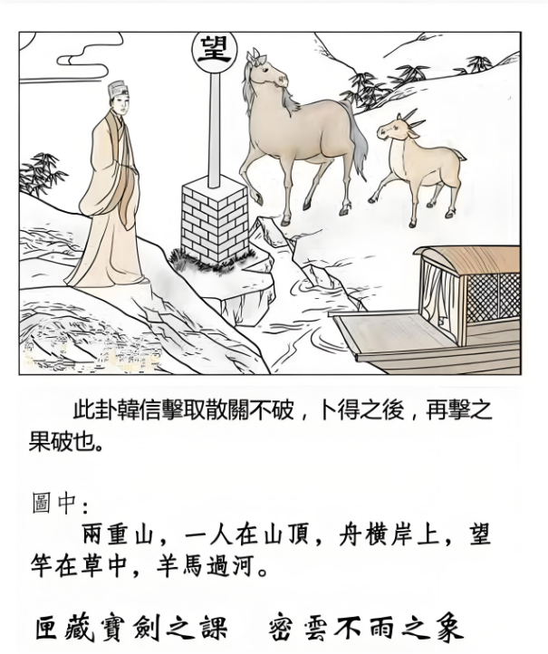

#### 详解风天小畜䷈

易经是一个一个卦接连，顺序地发动，比的续卦呢，叫小畜卦。风天小畜，畜生的chu也无所谓了，音读错无所谓，中国好几百种发音呢，外省跟闽南都不一样。

为什么比之后为小畜？比是亲比，大家亲和在一起，亲和在一起就会结社，结合成一个社会，大家比较亲和，我们组成一个社团，易经学会，各种文化学会。小畜卦呢，畜就是积的象，有聚的象，相聚的象，小畜卦就告诉我们相聚之道在哪里，那聚的好处有哪些。

自然的象，天机道，外面呢，外卦上卦是风，风为顺，内卦是乾，健，对不对，刚健的健，内部有一定的原则，外面是柔顺的，这个象出现的时候，就是小畜卦，那小畜之道也在这个里面。

要大家聚成一个团体，第一个，内健，本身有一定的实力，有一定的看法，所以志同道合的人一定会同聚在一起，就好像蛇鼠一窝一样，所以你抓小偷，不是一个，而是一票。同志之人必同聚。这就是聚的相。

所以聚在一起的时候，如果外顺，大家都很和睦，内健，各人有各人的事情，处在一起非常的愉快，这是小畜卦。

卦象哦，小畜卦出现，本身卦象上，以小畜大。为什么以小畜大？这里有个爻格，比较特殊一点，我要讲一下。

风天小畜卦：䷈

你看他的爻，就是物象，这第四爻的位置是阴位，是近君的人，六四没错，这个位置是最近君主之位，这是相啊，将啊，下位。

所有的都是众阳，一个阴在那里，上面的皇帝君王总统，跟下面的将相都是阳刚，起冲突，你一个人夹在中间，懂不懂我的意思，就是小畜，所以小畜之道，能够以小畜大，为什么？小畜是阴柔，柔。

这个时候，你如果夹在中间，刚好你是他的秘书，办公室主任，你夹在中间，你要有小畜的道理哦。不可以落井下石哦，小畜嘛，对上是柔，对下也是柔，懂不懂我的意思，变成第四爻就变成了上跟下沟通的媒介。所以他以小畜大，懂不懂，畜的道就在此。

所以说能够相聚在一起后，产生的小畜的道理。现在讲的就是扮演这个角色的人。

所以说，在天地之间，至刚之人或事，唯巽顺能止。性顺的人能制止他。

诸位看，天已经很大了，风还在天上走。风在天之上，天之上只能容风了，所以说再刚烈的人，柔顺都可以去止他。这是小畜卦的定义。这是从外相来看他。

当你由小畜卦相亲比的时候，你能够用巽卦的柔顺，巽风无孔不入，巽风很谦和，柔顺，当然能够以小畜大。本来所有的山头，谁都不服谁，跑出来一个小畜卦的人，他就变成一个中间人，大家都听他的，大家也相信他，每天挂六国相印的人，就是他了。

诸位如果遇到这种情形，你说老师啊，我刚好现在就是小畜啊，上面的老板恨下面的总经理，我偏偏是总经理或董事长的助理，我夹在中间怎么办，易经就讲了。

处小畜之道，君子小则文章才艺，大则经世济人之学。

遇到这个时机的时候，外柔内健，是不是小畜卦，你看畜卦的神哦，外面很柔顺，回到家每天都读书，好好的加强自己，因为你才德不足，只好阴柔在中间。小则文章才艺，如果是女孩子的话，就多学唱歌跳舞，打比方哦，不要真的去啊，或者回家烤面包做牛排做得很好，大则经世济人，学到好的学问，这是处畜之时。

你能够做到这样，就能抑众刚，所有的刚都要听你的。包括上面的都要听你的。

诸位看卦象，图解：
 
他写：有个人站在山上，有个堠，上面有个望杆，有个马，羊在后面，中间一条河隔到，船在旁边，人站在两重山上，一个人在山顶上，这怎么解释。

两重山，第一个代表险阻大也。还哟，这个出是不是两重山，所以，出也。出来。比如时候过来一个人，时候倪海厦你看我今天出去赌钱怎么样，卜一下，出，不要去了。这很多事情哦。学了卦不要去赚偏财哦，搞什么六合彩。

一人在山顶。第一个，独行无依的象；第二个，向下坡的象，小姐你的事业已经到了顶了，以后只有往下走的了啊。

舟横岸上，涨潮才会出发，所以是准备出发，但是呢，无水不行。

望杆在草里面，望杆就是等待消息啊，因为没有消息嘛，无讯息，故等待。

为什么在草里呢？诸位读推背图或者马前课，不管是什么图，所有的草呢，草头黄，你姓什么，我姓口天吴，草头黄，有没有。

这个黄是我们中国的大姓，所以中国是李氏皇朝，一票都是李，为什么，姓李的比较亲和，为什么，水地比，李氏出现的时候大多出现黄巢之乱，所以民进党有黄**。这个要删掉！

我的意思，这是读到大自然的象，国家的象，如果你看海峡两岸沟通，中间是台湾海峡，想去又不去，是不是三通啊三不通，心里想三通，但是无水不行啊，中间是一匹马在沟通啊，大陆是很希望你过来，每天望杆上望，船怎么还不过来。

上有羊马，就是马引羊渡河，你看是不是马走在前面，羊走在后面，所以马为贵人，第一是肖马的人，第二是姓马的人也可以，马是你的贵人。

诸位看我们读图的时候，比较分开来，你卜卦一卜下去，那些事情就统统出来了哦，连贯起来了，知道吗，所以一个图的象，可以代表一件小事情，也可以代表整个国家的国运，所以从卦一路看下来，从山水蒙一路看下来就知道怎么样做了。

我每次讲很多事情，就会有很过怪声音出现，就叫我不要讲，哈哈，今天没有。

还有呢，有时机，时机来了的时候，马就是贵嘛，所以马年，午年，或者是午月，或者是午日，或者是午时，这就是时机。

那你说有个人生病，重病，一卜，卜到风天小畜卦，你还没看的时候，好像天上风在走，好像灵魂跑到天上去了，就不太好了。

第一个，望杆头，这个望是这样，夕亡，旦夕而亡，那你早上卯时一卜，午时会走人哦。然后他病重，再一看黄历，哎呀，明天刚好是午日啊。

黄历上面，日有天干地支，至于这些干支弄不清楚没有关系，斗数交完了，64个卦讲完了，我会教诸位用易经八卦来排列，卦的排列，卦在排命，你今年流年是风天小畜，你今年流年是地水师，你今年流年是天水讼，了解我的意思吧，用卦来排流年。要用到四柱命卦，年的干支，月的干支，日、时的干支，教各位这么排，这个不用担心。黄历打开来看上面就有日子的干支嘛。逢到午日就是凶。以此类推。

然后你在卜卦呢，有个客人来问，卜卦得到这个卦，很危险啊对不对，那羊也跑掉了，羊没有回头啊，对不对，再一看，他日角黑的，他一定问爸爸，眼袋是黑的，左边是儿子，右边是女儿，眼角是黑的，丈夫或者是太太。卦上面有没有丈夫、太太啊，没有啊，懂不懂，所以我们需要很多的资料来赋给我们。

如果看着什么都没有，哎脸色都很好啊，那你是他什么人，哦我是她先生，这个一定是坏先生对不对，他太太重病了他一点气色都看不到，代表他没有忧气，他就是想他太太快点死啊，他来问你卜卦什么时候死赶快争一些东西啊，会哦。

所以，诸位，我们学的，就是看到外面就知道里面藏了什么，我常常讲，我们下棋，如果有四个人下棋,AB两个人下棋，走几步就走完了，走几步就，哎算了，重新开局，我输了。CD两个人走棋，走到剩下个帅还在那里走。你看看哪个是高手。懂不懂，我们学的己的就在走两步就知道了嘛，不要等到后面确认，这个不是我们的主见哦，如果我们没有这些本领，我们光是主观地，就会过于主观。我们为什么要学老祖宗那么多五千年的经验，就是不要让伤害很大的事情，在你认为不可能的情况下发生!帮助你们在人生某个极端刹那间做决策，不会错的，因为一念之差，可能全盘皆输。所以我一开始就结束了。

会不会推理啊，联想，这些我们都讲过啦，只是你没有把它连在一起。

#### 阳宅

阳宅：这个阳宅不讲差太多了，我老是漏掉。诸位每次提醒我下，没有关系。

阳宅会有小畜卦出现，长女居西北，这个都没有问题了吧，所以一定要懂我们那个图，这样以后就不要背，阳宅上面，长女应该住东南，结果不知道怎么搞的跑到爸爸的位置去住了，就产生这个风天小畜卦：

小畜卦出现的时候，我就是爸爸，我的身份证户口本上或许我是长女，可是我告诉你，我是爸爸，形上是长女，神上是父亲，所以像父，不是说脸长得像爸爸，而是主观很强，个性很强，家里谁讲的话，她都不听，我就是爸爸，爸爸还要听她的。第二个，我就是爸爸哦，你们都不要担心，我会出去赚钱来养活你们，她会给过多的责任给到自己身上。好，有利有弊。

那同此类推，婚姻不成，她太年轻，二十岁的人住到四十岁人的位置，所以思想会超越年龄很多，这个时候，她住那里，有25岁的男孩子来追她，她今年20岁，你的外形看是男孩子比女孩子大，但是我们要看神啊，这个女孩子看这个25岁的男孩：幼稚，像小孩子一样，我跟他在一起好像爸爸照顾儿子一样，好累哦，处处要替他找想。你看这个小孩子优柔寡断，我怎么能跟他谈恋爱呢，回头一看，哟，我们的教授好棒啊。教授是爸爸，懂我的意思吗，她就欣赏年龄比她大很多的，爸爸型的男人。你看这个教授多棒，如果我找男孩子像他这样子就可以了。可是对不起，像他这样子的都已经结婚了，已经经验很多了，已经被太太和孩子整过的，浴血重生的一个人了，你要看他的真相！

如果你继续住下去，如果你不信邪，继续住下去，到老出家，不是出嫁哦，是出家。但是因为是小畜卦，所以事业上会有积蓄，住在这个地方的女孩子，很有钱哦，但是她很小气，她钱都藏起来，这是她的优点。

那往往居于小畜卦的人，往往居于众刚之间，懂不懂，你看那个人，上面总经理跟董事长不和，或者是总经理跟下面的经理不和，那你刚好是总经理，那你刚好是小畜卦，然后你一看阳宅，咦住在西北角。得到上下的信用。手下没办法跟老板沟通，就去找她了，老板没办法跟手下沟通，也去找她了。她就变成中间人了。变成这样子，就是小畜卦。

这是从易经的象出来的，为什么说婚姻不成，到老出家，你想想看，未女，你没有结婚在家才叫长女，如果你结婚了，就不叫长女，叫妻子了，你一结婚，名分就跟着变了，未女去住已婚男人的位置，西北角爸爸的位置，好，

未婚等于已婚，你就已经不需要结婚了。女人等于男人，只有一种人男女不分，光头，秃头，那和尚尼姑乍眼看会看错人的。懂不懂，和尚尼姑分不出来，所以到老会出家。

我悟出来啦，然后到那里去看，嗯，这个是谁住的，我三女儿，哦那老大老二住哪里，老大老二出嫁了，哦，你不是三女儿，住在西北角，就是风天小畜。这种情况，就是大女儿二女儿已经结婚了已经叫妻子，家里老三就变成长女，这时候就补位，结果三女儿住到大女儿的位置，也是风天小畜卦，我说赶快从里面搬出来，他说不搬怎么办，我说不搬就念经念佛去了。他说念佛经还好，她都念日文的佛经了，每天在那里念，变成这样子了，这就是小畜卦。我说你女儿赶快移出来，他说移到哪里，他女儿还没有回来，爸爸妈妈就已经搬好了。

我讲他女儿这样子，他说真的是这样，那怎么办呢。这是无意识间造成很多不可弥补的伤害，当然我不是说那是坏事，但是站在父母的立场，他只是希望女孩子好好的结婚啊，因为她23岁了。不但一个男朋友都没有，每天抱着佛经在那里，我不是说信佛不好。而是一个事情要看周围人，不是你一个说了能决定很多事情。

#### 名位相等

还有一个，我提一个东西出来，名位相等，我深入介绍给诸位。

当你的名，你是什么名字，住什么位置的时候，这个过程，我们叫做家和。

当你是什么位置，住什么名的人，叫万事兴。现在可以深入跟你们来讨论了，这里关系到世代交替。
真理的话，是个圆形的，随便你怎么换，都一样。

你说老师你讲了半天，好像只有两代同堂。

我们九宫图上，各个人的位置：

如果名位相等，儿子住儿子的位置，女儿住女儿的位置，夫妻住夫妻的位置，家和。

如果你要事业兴，要位等于名，住谁的位置要用谁的名。

举例，你的名字叫爸爸，位置住到长子的位置，叫做天雷无妄卦，你用你的名字开公司，那就无妄卦了，无妄之灾。

你的名字叫做爸爸，结果你住在二儿子的位置，叫做天水讼，你再用你的名字做公司的负责人，就叫做天水讼，准备打官司坐牢。

如果你住长子的位置，结果你公司用的是长子的名字来做，住他的位置，用他的名字来做老板，运就起来了。

所以说，如果你是先生，如果你去住到太太的位置，西北角是在没办法改，没关系，工商负责人改成太太，你从董事长降成总经理。

同样的，夫妻结婚了以后，年龄大了，夫妻本来是住西北，你夫妻不想干了，事业要传给儿子，世代交替哦，儿子如果还没有结婚，你让儿子住东宫，儿子名位相等，当他位置住对了，才用他的名字来挂负责人，了解我的意思吧。

如果要交给儿子的时候，儿子已经结婚了，父母亲退位出来，住到三儿子的位置，天山遁卦，那长子跟媳妇来继位，继在西北边，因为名字叫夫妻嘛。夫妻住在西北角，代表他家和，夫妻感情很好，反过来，他的名字叫做丈夫，位置住对了，才可以用他的名字来做事业负责人。了解我的意思吧。

这是阳宅上的活用。

这是北半球，是这样用；南半球呢，你就东西不要动，南北换一下，所以我们北半球是春天，南半球就是秋天，我们北半球是冬天，南半球是夏天。

所以我们在北半球的时候，南从北，西南从到西北来；南半球的互啊，主卧房要放在西南角。就是南北反，中间这两个不动。

你们先学会北半球啦。南半球就会了啊。你说老师你还有西半球东半球啊，我把你干掉。

这是位要等于名。

如果说你住在乾为天不爽，看地天泰的太太不爽，你就住正南，天火同人，你的太太就成地火明夷卦，凶，有暗伤。可是你要做事业，住在二女儿的位置上，就要挂二女儿的名字做事业当老板。

更深入一层，临床经验告诉我们，一进去这个宅，看到哪个宫在里面，那个宫很大，就代表这个家族发那个房，懂不懂我的意思。那一房的脑子最清楚，就发那一房。

一进去一看，他们家南宫最大，他们家二女儿最强。一看西南宫最大，你想嫁进来，你就要对他妈妈好，她最强，不用理你公公懂不懂，了解我的意思吧。看到房间就知道。一看东宫最大，好吧，先巴结巴结你大舅子。先要把哥哥说服了，不然的话，他爸妈没意见，他哥哥冲出来否掉了。你干泡我妹妹就把你干掉。看哪个宫最大，发哪一房。

因为我要跟诸位讲这个想法。以后我们讲阴宅讲风水的时候，也可以知道。风水是看山川河流。

阳宅上面，就是这样。以后我们会举例来详细跟诸位谈谈这个部分。好，慢慢让诸位深入。
