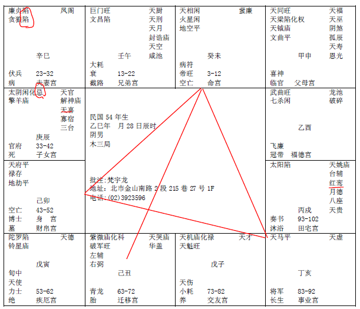
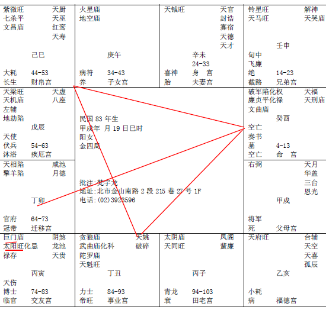
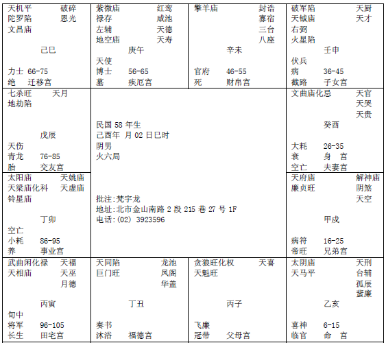
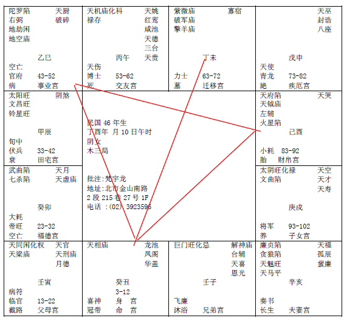
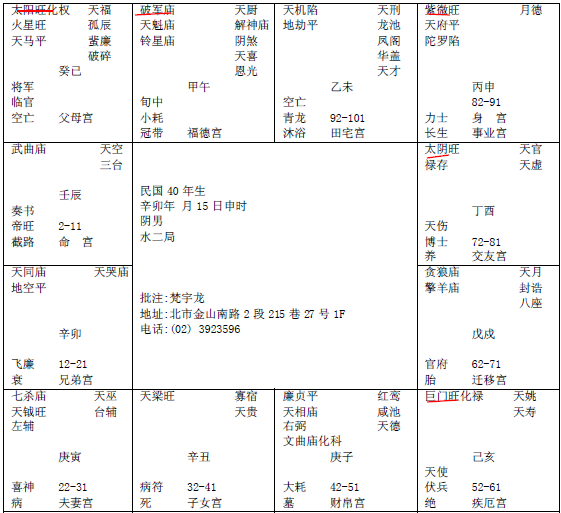
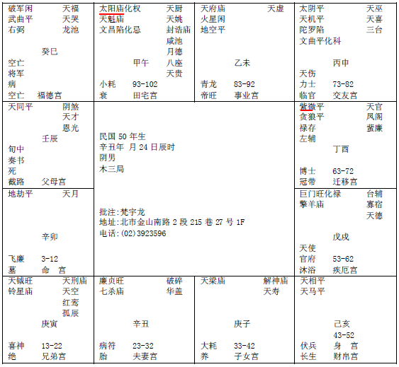
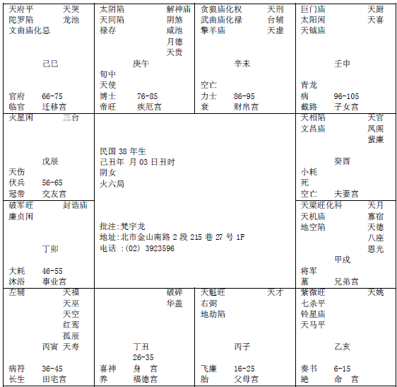

## 紫薇十二宫详解

诸位现在看的这个案例有 12章，我们一章章的仔细的跟诸位介绍，为什么给12章，我们所有的星那么多的星，我们排八字诸位排的时候就会知道，统统按照以北斗星系为主，其他的星座是按照北斗星转，所以我们以紫薇星为例，所以第一章到第十二章， 刚好紫微星在子宫，丑宫，寅宫， 等等等等， 所以刚好是一周回来，所以12 章紫薇星是 12 个位置，如果以紫薇星来看的话，不要看其他的门，八字就是这12种，其他的变化只是宫的变化，我们命宫会转啊，但是基本上是12种形式。

星都会聚在一起，星都会因为紫薇星统统聚在一起，排起来是一样的，我们从这个角度来教比较简单，如果我们光教一些那些星在一起变成什么，什么明珠出海格，什么石中明玉格等等，这样教的话反而不好记，我们在介绍的时候一章章批会批的非常详细，我们利用批的同时教诸位如何批八字。

#### 紫微星在子宫

按照紫微斗数安星法，生时在戌，文昌星应该在子，
而这张命盘上，文昌星旺化忌在酉。疑此命盘有误！

首先诸位看第一章，辛丑年3月5号戍时申刻，我们批八字为什么用这个，因为这个这个八字刚好在子宫，诸位先不要看其他的宫，如果紫微星在子宫，命宫可能就有12个地方，但是紫微星在这里它不会动。

我们首先拿到这个八字的时候，原则上这个人的名在这里，紫微星在对面，如果我们以时间来说，诸位注意看，我们在批的时候讲贪狼星，贪狼星是一个桃花星，但是它是亥子宫，亥宫是晚上9点到11点，子时是晚上11 点到1点，这两个宫我们又叫做水宫，在水宫里面，如果贪狼星在亥宫或者是子宫才正合是桃花运，如果贪狼星在午宫不是桃花星，它是武官星，贪狼、破军、七杀这些武官星最希望碰到的是火星和铃星，所以你们看书的时候有一句话叫做火贪，火贪相聚的话叫做火贵格，就是武贵，所有的武官……晚上的贪狼星要长的高大魁梧，男女都一样，长得肥厚，午时的时候贪狼、武曲、七杀、破军这些星的人反而变得瘦小，越小越瘦越好。

举例，王申就是这样的，你看王申跑出来干干的脸红红的，头发还往上翘，这是标准的火形的人，所以他是将军，瘦干干的，还有林文礼也是这样的，空军最矮的就是他了，是总司令，反而是大贵，今天以前你们看到的好的其实是反的，我们在象上把人分五种星：

一种是木形，木形的人瘦瘦高高的，我们要所谓的形出现一定要纯，比如说你很瘦，但是肚子很大就不是木形的人，要从头至尾都瘦，连脚伸出来都干干的，手上都没有肉，这是纯木，

纯火也是干干的，但是红红的，看起来很热，在发热，头好像火焰山一样。

我们过去的总统就是土形的人，很厚重，土是地厚嘛，所以头一定是圆圆的，脚一定是方方的，天圆地方，手伸出来的也是也要厚厚的，摸着没有骨头，全身圆圆的厚厚的重重的，这才是纯的的土。如果你遇到个土形局，全身都像啊，结果手伸出来，干干的，就不是纯土形人，因为他有一个地方不合。

纯金的人，金是白色的，金属都是方方的，手伸出来都是方方的。

水星局的人呢，水是圆圆的，什么角度看都是圆圆的，嘴唇，下巴，额头都是圆的，手也是肥厚的圆圆的。

除了在象上要成局的人一定要纯，越纯的越贵，非富即贵，这是第一个看象的原则。

第二个是两句话送给各位，南人要北象，北人要南象。这在过去大陆的人看的最明显，长江以北的人大口吃肉、喝酒，面食一直吃，所以北方人看起来很高很壮，如果出来一个山东人很瘦瘦小小，皮肤白白的，娇小的，斯斯文文的，这叫做北人南象，大贵。如果是南人北象，长江以南的是南方人，因为南方是鱼米之乡，所以他们比较斯斯文文秀秀气气，结果出来一个人比北方人还高，这叫做南人北象，这种人也是非富即贵，这些特殊的贵象你要知道。

我们为什么要看这些象呢? 算命的时候只占我们的三分之一，我们有天文、地理、人事，到后来我会慢慢慢慢让这三条路并成一条，不管人和地的部分，在介绍象的时候如果我们有办法把命象同参的话会增加很多准确性，会帮你做加帮你做减。

贪狼入命的人，他有生杀之权，所以我们介绍的时候同时要介绍这些东西。这有一个

天魁星，天魁星是什么? 科甲代表这个人是有武，天魁星是文，这个人是文武双全。

如果文武全给一个男人的话太好了，有的女孩子很不幸，拿到这种命很累，这个时候我们会跟她说你这个是男命女身。

诸位看到她的命宫以后，我们说的事业宫就是官禄宫。

我们批一个八字的时候先定三方四正，先看他的本，我们算命的时候分两个部分，第一个叫做迷津，第二个叫做批流年，这两个都属于算命的部分，官禄宫是七杀和擎羊，杀破狼一定会来一只擎羊。

如果官禄宫最喜欢的是权星入进来，我们命上有几种权，有几颗星都代表权：

第一个是四化星里的化权；

第二个是紫微和七杀同宫，这也代表权，这个时候是官权压重，非常好。

现在这个人的八字只有七杀和擎羊，没有化权，所以他当官势必不好，当官要有权才好，要不然当个小官干嘛。

还有一种官禄宫和特殊的一种批法，如果财星跟权星在一起，那就变成银行的总经理、中央银行总裁，财的权很大，可是钱不是自己的，这叫做财权。

财权的人看他的鼻子，两种鼻子是指本身有财，一种是很大很肉的鼻子，像狮子的鼻子，还有一种悬胆鼻，就是长长的，这两种是大富。

如果他没有这种鼻子，鼻子是很挺，长的很好，但是肉并不是很多很厚，颧骨很大，这种人就是掌财权的人。手握过去软绵绵的，说明是贵人和富人，这两种人手都很软。

如果官禄宫里有杀星在里面，你当官当然不容易了，我们看到这是财帛宫，诸位看到上有一个身宫。

身宫的定义是什么? 我们简单讲就是后天，比如说身宫在财帛就会在生意人，如果在官禄宫自然会当官。

有的人身命同宫就是先天和后天是一样的，比如说我的命是划权、划命，我身命同宫，我生下来家里就很有钱，我长大了也有钱，有的人身宫是夫妻宫，后天被婚姻的影响很大。身宫在哪就是看后天影响她最大的是什么。

这个女孩子的身宫在财帛，命一定是做职业妇女，中间不能中断，因为中年的时候可能先生会有问题，不然你为什么老是想要去赚钱，她本来就想做职业妇女，不会去做家庭主妇，她的命就要这样。

我们还有一句话七杀临身终不美，身宫上最怕是七杀，比如说一个人他的福德宫在这里，结果七杀星在福德宫，身宫跟福德宫也在这里，七杀在身宫里面，你不要管它是什么，光是七杀临身，一辈子多半少成，这种命很累。算到这种命，诸位放心，我们后面有人间道应解，非常厉害，天人地的人和地加起来就是三分之二，就大于天命，算命只是一个工具。

现在身宫到财帛会在私人企业很好的发展，或者自己做事业发展，那我们看看她到底做什么东西。

第一个是财帛是破军星，第二个是天钺星，第三个是文曲星化科。

我们看八字，科权禄是最大，我们首先看科，科在财帛，他一定要有专业技能，有专长在身上，科主两个意思，一个是考试，金榜题名，一个是专业专长。比如说作家，画画或者音乐家都有科，有的人科在官禄会考公家单位，科在命宫会考试。

她的科在财帛，天魁星在命宫，天钺星又在财帛宫，又化科了，等于三个科甲星，这个人先天才艺一定很好，聪明智慧，才艺好的人一般手指都比较长，天柱纹都比较高一点。你就要告诉她，小姐你要往才艺方面多发展，走专业技术最有利走服务业，已经定出来了。

有的人不是这样的，财帛宫没有破军，他财帛宫都是财星化权，这种时候他就会自己做生意当老板。像这种人如果专科技术专长，破军星是要流浪在外，要走天下，专业技术专长，捧着饭碗走天下。

怎么看有专长的人的相？后面的脑壳下面是这样的，波浪一样的W，下面两个圆圆的，骨头是这样的，这种人一辈子到处四海为家。

她就是唱歌唱的真好，虽然脸不怎么样，但是声名远播。她就是后脑勺可以看到。

还有迁移宫，现在紫微星在子宫，我跟着诸位讲过紫微星一定要有左辅右弼来会合，结果他的紫微星一颗星在外地。

我们批格的时候是讲迷津，迷津是讲一辈子的，我们不管他几岁，我们先把终身讲出来，第一个紫微星在外面，代表你在外地会遇到贵人，紫微星是皇帝星。第二个紫微星对你自己来说也是紫微星，你一个人在外地，到头来会孤君，孤独的皇帝。

所以从这些星上显示我们可以看到一个女孩子的命拿到男人的命，在外地又孤单的话，恐怕先生就会有问题，我们要注意看，已经暗示我们了。所以你就不会让这个女孩子当官，她一定从财方面发展，所以你看天魁星、天钺星在这里，这是我们算命的第一个重点。

第二个重点是我们看左右，天同星在父母宫，兄弟宫，太阴星在这里陷，因为这是巳宫，代表上午9-11点，月亮出来，这是已时应该出在太阳，结果月亮跑出来了。那你看这边酉时的时候太阳在这里，也是陷地。

这里我要提醒各位，我们看女孩子的太阳看太阴，一个人的命月亮、太阳就代表爸爸、妈妈，所以天和地，太阳和太阴在养终生，就好象父母在养子女是一样的象。

一般来说只要太阳和太阴是反背的话大部分的时候是离开家乡，到外地发展。这个八字的人，她在国外美国。

第二个他的父母宫有化禄，代表他父母会有财物给他，第二个解释太和太阴反背过来，巨门星又在父母宫，巨门星代表是非口舌嘛，天同星在同宫，说明父母在一起经常吵架，可是感情又好，两个人感情好又要吵架，不会离婚，很多夫妻这样，说离婚不离婚，可是见面就吵架也不知道为什么。

第三个解释一般来说日月反背的人，是有一些事让父母替他担心烦恼，我们讲的很含蓄，因为每一个人担心烦恼都不一样。我们看到她可能是因为原来很好，可是中年的时候万一她先生有事情，出事了，她一个人带孩子，那是不是爸爸妈妈会担心?

我们过去说这种日月反背的都是克父母，克的时候没有解释的好。在这里我解释一下什么叫做克，什么叫做旺？因为中国以前是用竹简的，竹简克下去也很麻烦，一百种人都是克，但是克的事情不一样，精神是一样的，所以我们陈述事情陈述不完，但是精神是一样的，什么叫精神? 比如说我走在路上我不认识你，先生，你结我10万块，我买车子，你不把我当神经病吗? 我就没有克到你害到你。可是如果我是你弟弟或者是你儿子，我说我出车祸了，把人撞了，你赶快给我10万块，不然我要坐牢，你给不给?这就叫做克，所以说能够影响到你的才是克，所以克不是感情不好，而是感情太好了。

我举例有个女孩子没有结婚，可是她的八字克父母，你跟她说她克父母，你还没有解释她就很心急啊，说我怎么会克父母? 我跟我爸爸妈妈感情很好，我很孝敬他们，没有错，就是因为你感情很好，你大学毕业一个月赚5万块，你就拿4万块给你爸爸妈妈，越工作职务越来越高，一个月赚7万块，你拿6万块，10万块你拿9万块，当你对你爸爸妈妈越好的你的心态是你们放心，不要担心我，我照顾好自己，可是你错了，这是你的想法，你爸爸妈妈的想法是你赚5 万块给4万块的时候想想还年轻，没有关系，等到赚7万给6万的时候你看我们家隔壁的女孩子跟我女儿比差多少，为什么她的女儿嫁的那么好，为什么我女儿到现在没有结婚? 她就会越来越担心，这是克，所以你越对他好的时候就越克，克了半天你们无解，我有解，看一下阳宅一下把它解决掉，这就是人间道，你没有办法，人是感情生物，因为越克越累感情越好。

还有一种是旺，我最怕看到女孩子是旺夫命，可是很多女孩子是旺夫命，首先诸位有一个明确的观点，上帝并没有规定旺夫命的人一定嫁给好先生，这是两回事。

什么叫旺夫? 一个太太会让先生完全没有后顾之忧，这叫旺夫，你知道一个太太要花十几二十年很多年的时间去证明她是旺夫的人。

如果女孩子的太阳，日月很旺这种人是天生很厉害，天生好手，如果你太太是太阳很旺的人，你一定要多听她的，即使她读书很少，你多听她的，她是旺夫命，她给你决定的一定是对的，你是当局者迷，你不听她的就完蛋了，可是旺夫很辛苦。

克夫的女孩子就是太太在前面走，先生在后面满头大汗，在百货公司里大包小包拿着付钱，好不容易走到马路了，车子来了，先生还要帮她开门，把东西拿上去，先生再去开车，这叫克夫命。

那诸位看兄弟太阴星，这就是克和旺，所以诸位千万不要把外面的观点带进来，克就是克死，这是胡说八道，是断章取义的，中间有很多的过程的，结果到头来是你爸爸妈妈因为担心你，一直没有结婚，又担心你又在旁边孝顺她，然后你呢，很爱爸妈，你在旁边孝顺他，你放心我一直孝顺你陪你到死， 结果他就死掉，然后你才能结婚，他赶快死，所以是互克。我们解很简单，一个动作就解掉了。

兄弟宫太阴在这里落陷，这有两种解释，第一种是没有兄弟，兄弟是太阳怎么成月亮了，是阴星。

第二个是有兄弟而且夭折，有夭折的现象，一个星在里面如果不亮的话，没有其他的吉星来会，她就有个太阴星，没有其他主星来会，这个杀星就会很强了，如果是其他的主星，比如说有天同等吉星在里面的话杀星力量就不强了。

所以我们一宫有一个原则，你一个杀星在里面，有吉星来的话，杀星就杀的力量不是很大，什么吉星都没有，哪怕是一个小的天空、地劫都会要你的命。后面我们还有很多很好的案例给诸位，很多都发生了。

看她的疾厄宫，这个疾厄宫很强了，第一个肾脏，为什么肾脏? 因为有宫化忌在酉宫，酉宫代表肾，化忌就是最不好的了。

第二个所有的星里都是火星，地空在疾厄宫里，疾厄宫在丑宫里，丑宫代表肝，这又是一个女孩子，这是妇科右边卵巢的问题。左边是紫薇，右边是火星地空。先和她讲好，什么时候开始不好，之后批给她看啊，现在还没有批流年，先批总格，迷津就是一辈子要注意的事情。

我们最后讲婚姻，现在看朋友宫，这个在这边，交友宫是天机、天马，这种星你自己看，我们有主动和被动，她的命里面朋友宫是天马星座的，她的天马星座在朋友宫，你注意我讲话的顺序啊，所以她会为朋友奔波劳役，有的天马星在子女宫，有的在父母宫。

天机星很平和的星，如果有权、财星或很多吉星在朋友宫的时候，意味着她跟朋友合伙做生意一定大赚。如果有很多空耗的星，比如擎羊、化忌等，这些杀星、口舌星在朋友宫，这代表如果跟朋友合伙的话会朋友变仇人。上帝有没有规定好朋友合伙一定赚钱的，没有吧。这是原则。

一般相术如果这里说这个忧喜参半这是废话，这样说很简单，你说这个命格的人最好一辈子靠自己，你交朋友永远靠不住，这是比较重要的。很多人算命还给她说，你命犯小人，你命有贵人，这种话都不要讲，什么是命犯小人？他看到人就会相信，然后犯到小人，对小人特别信任。

看子女宫是空的，对面田宅宫是化忌，我们看宫一定要看宫，子女宫空的时候我们要看对面，这个子女宫的对宫化忌，杀，所以说无子，你没有儿子。

一般来说我们要看先生的命，如果先生命中有儿子的话，先生的命和太太的命，夫妻八字合在一起，先生有两个儿子，太太命里没有，还是照样生两个，生两个都比较像先生，女儿不知道。如果先生有两个，太太没有，两个人结婚，生的儿子脸孔像太太，你就紧张了，你看他小时候会像大人，善知人意，动作像大人，就是有子但是会夭折的象。

如果客户在你面前，你看她的子女宫，在泪堂。这个图象命宫在印堂，印堂就是你的命宫，额头正中这块地方就是你的官禄宫，所以这个地方越大越好，你的田宅宫在你的眉毛下面，天仓的地方是迁移宫，鼻子中间的是财帛宫，两个眼角尖门的地方是夫妻宫，地阁的地方就是所谓的仆役宫，好象我们的总统下巴就很大，有点下牙包上牙，仆役宫，手下众多的象。这两边命门是我们看生死的地方，如果你看这个人病重的话，鬓角命门这两块黑黑的，就是要死了。有一种人讲话的时候，命门这边多个骨头，两边尖尖的，这个人是有反骨，会背叛人，平常没有，一讲话的时候，一尖一尖的跳起来，就是有反骨，一定会反。

现在社会上很多人事情之前他认为不可能，事情以后他说他后悔，我们学了以后有这种经验，有的事情可以得，有的事情不可以得。

诸位看廉贞星还有天府星，这个廉贞星本身是很清廉的，当官的有廉贞星很清廉，碰到天府星，是个南斗星君，这两个加起来是一个很温和的星，这种让长的很清秀很漂亮，个子不高，也是很正派厚道的人，但是你注意看他的夫妻宫的三方四正，我们看的时候看他的福德，这个人的福德宫是武曲，天相、右弼，我们看三方四正的时候注意看她的先生的夫妻宫，是不是科权禄都没有会到，这种人都是正财，有一个人的命宫在这里，三方四正都没有科权禄，正财，这种人一辈子帮人家工作，结果她的先生没有科权，反而他太太有科在里面， 虽然她的先生很好，但是适合帮人做事领薪水。虽然他们夫妻感情很好，但是儿子没有，是他们的缺点，我们算命是把问题找出来，如何让她生儿子等问题，我们要找到的化解的方式。

<table>
<tr>
<th colspan="1">

兄弟宫

巳

太阴星 陷

</th>
<th colspan="1" valign="top">

命宫 

午 

贪狼星（武官星）（武）（有生杀之权）

天魁星（主科甲）（文）

</th>
<th colspan="1" valign="top">

父母宫

天同星（感情好）

巨门星（口舌是非）

化禄（父母有财禄）

</th>
<th colspan="1" valign="top">

福德宫

武曲星

天相星

陀螺星

陷地

右弼

铃星

</th>
</tr>

<tr>
<td colspan="1">

夫妻宫

廉贞星

天府星

</td>
<td colspan="2" rowspan="2" valign="top">

民国50年生 今年34

辛丑年月05曰戍时阴女

金四局

批注：梵宇龙

地址：北市金山南路2段215巷27号1F

电话: (02)3923596

</td>
<td colspan="1">

田宅宫

酉 肾

太阳星 陷

化忌

</td>
</tr>
<tr>

<td colspan="1">

子女宫（空宫，就看对宫）

</td>

<td colspan="1">

事业宫（又名官禄宫）

七杀 擎羊

</td>

</tr>

<tr>
<td colspan="1">

财帛宫

身宫（指后天，命宫指先天）

破军星

天钺星（科甲星）

文曲星

化科

</td>
<td colspan="1" valign="top">

疾厄宫

丑 肝

火星

地空

</td>
<td colspan="1" valign="top">

迁移宫

子（又名水宫）

紫微（外地逢贵人，在外孤独）

</td>
<td colspan="1" valign="top">

朋友宫

亥（又名水宫）

天机星（平和）

天马星（为朋友奔波跑动）

</td>
</tr>
</table>

这是我们看总格是这样的，我们来看流年，诸位还没有进入天文地理，我们批的时候还没有学完，所以我们地理还没有学完，所以我们不要加起来，不要太快速的进来，先算命。

<table>
<tr>
<th colspan="1">

兄弟宫

巳 39岁

太阴星 陷

</th>
<th colspan="1" valign="top">

命宫 

午  38岁

贪狼星（武官星）（武）（有生杀之权）

天魁星（主科甲）（文）

</th>
<th colspan="1" valign="top">

父母宫 14-23

未 37岁

天同星（感情好）

巨门星（口舌是非）

化禄（父母有财禄）

</th>
<th colspan="1" valign="top">

福德宫

申 36岁

武曲星

天相星

陀螺星

陷地

右弼

铃星

</th>
</tr>

<tr>
<td colspan="1">

夫妻宫

辰 40岁

廉贞星

天府星

</td>
<td colspan="2" rowspan="2" valign="top">

民国50年生 今年34

辛丑年月05曰戍时阴女

金四局

批注：梵宇龙

地址：北市金山南路2段215巷27号1F

电话: (02)3923596

</td>
<td colspan="1">

田宅宫 34-43

酉 肾 35岁

太阳星 陷

化权

天梁

禄存

文昌

化忌

</td>
</tr>
<tr>

<td colspan="1">

子女宫（空宫，就看对宫）

卯 41岁

</td>

<td colspan="1">

事业宫（又名官禄宫）43-53

戍 34岁

七杀 擎羊

</td>

</tr>

<tr>
<td colspan="1">

财帛宫

寅

身宫（指后天，命宫指先天）

破军星

天钺星（科甲星）

文曲星

化科

</td>
<td colspan="1" valign="top">

疾厄宫

丑 肝

火星

地空

</td>
<td colspan="1" valign="top">

迁移宫

子（又名水宫）

紫微（外地逢贵人，在外孤独）

</td>
<td colspan="1" valign="top">

朋友宫

亥（又名水宫）

天机星（平和）

天马星（为朋友奔波跑动）

</td>
</tr>
</table>

批流年的时候诸位要观象，你不要把书背了，你还是不会批的，越背越笨，要观象。我们把它放大，这是田宅宫，34 岁到43 岁，里面有几颗星，太阳化权，各位看例子，还有文昌化忌。这十年中化忌，刚好和太阳同宫，女孩子的命太阳是代表丈夫、儿子。

上不见父母，下不见子，中不见夫，一出来就得杀。然后我们再看这个人的命太强了，这种人孤军奋战，女孩子拿到这种武官命，都是一个人去打仗的花木兰，结果她先生很好，到头来有一个人孤军奋战的现象，原来在34-43这个时候会有灾，第一个十年就看到了，34 到 43 中间这 10 年，太阳星化忌，会发生事情。

举例，如果在你14 到23 岁这 10 年当中有一颗太阴星和太阳星落陷，就是在这段时间你的父亲或者你的母亲会有问题，依此类推看到太阳代表什么? 先生，所以会造成她晚年的时候，她从44 到53 岁七杀星在本宫，也就是说44 岁以后她是一个人孤军奋战。

50年生人，这个人今年34 岁，我们先看流年。

我们从戍宫开始， 这个人是辛丑年，丑年是牛，子丑是 25 岁、37 岁、49岁， 男孩子是顺转，女孩子是逆转，今年算她几岁，34在这边，这个有没有问题? 没有问题现在这个会算了? 

诸位继续看，这是 34 到 43，太阳在这边，其他的星星不要写了，34 岁是什么? 事业宫在这边，现在很多外面人不会算，算命算的不好，问题就是没有把宫解释出来。

这个宫我们在批流年的时候，宫为当年值日发生之大事，举例，今年34岁来找你算命，她就是今天来想问事业的，如果是明年来就问财产、田宅，后年来问婚姻，如果是40 岁来找你的话就是要看夫妻，所以这个宫代表他当年发生的最严重的事情。

这里有两种大限的算法。未来10年无大运，大限在今年，未来1年无大运， 大限在前一年。

34到43 年，子女宫是空的，41 岁那年开始太阳星在紫微星降落，她从41 岁以后开始太阳星看不到了，就是看不到儿子，所以她是 41 岁以后看不到太阳，但是已经讲结果，算命是一个谈果的哲学，我们不知道41岁以后先生没有了，当好值年 41 岁杀在她的夫妻宫，如果是 40 年值年那一年当好是她的兄弟宫，太阳就指的是兄弟了，可是刚好落在夫妻宫，所以从这个命上我们看40岁的时候夫妻有大限。

如果这个女孩子坐到你面前来，面大、声沙、骨粗，就是死运，就是百分百会发生，面孔大大的，讲话声音是破锣嗓，骨头很粗皮骨相连。

夫妻宫有死运的时候，我们看象书上的尖门，尖门就是眼角的尾巴，有人的眼角的尾巴如果是一条，往下走说明婚姻不好。如果是打了一个十字纹，有交叉的纹路的话，代表夫妻死别。有的纹路眼角的鱼尾纹很多，密密麻麻，代表桃花，眼角的鱼尾纹最好是一条、 两条、三条最多，代表夫妻很好，对她的另外一半非常的满意。

我教女孩子一个技巧，你先生每天晚上回家吃饭的时候或者他晚上出去再回来，你就不用问什么，可以看过去，如果他说话时的眉毛眉头纹路立起来，就是刚刚干完坏事回来。女孩子比较不容易看，这部分少教，哈哈，诸位自己看象书。

女孩子婚前乱来，然后到妇产科做处女膜手术，让男方看不出来，那个没有用啊。鼻子上，鼻头上有个骨头，叫素髎，骨头是两片分开来的，一定不是处女。她只能把阴部缝起来，可是没法缝鼻子。

一会还会有她女儿的八字，她女儿的八字刚好是在今年生的女儿，结果她女儿 7 岁的时候她爸爸有灾，从她的命格也看到，正好是她夫妻宫40岁的时候，从她女儿的命也看到。从她的命看到还不见得是对的，因为跟她同时间出生的人很多，不一定嫁给同样的先生，她女儿也是这样的话，这个时候我们要注意，这是一个流年上的限，这个大限我们要如何解它呢?

#### 阳宅化解

阳宅来说东西南北，有两种阳宅死先生死老公的，第一个厕所在房子的正中间，没有靠边，你不用管门，我们讲易把阳宅简化，四个字就讲完了，不要管门是怎么开的，门随便怎么开，厕所格在房子的中间，这是凶宅，这种人死的一定是心脏病、中风啊、气喘，痰梗到死掉了。

第二种凶宅西北角是厨房，西北角是乾卦，西南角是坤卦，太太从先生住了先生的位置，乾卦这是厨房，厨房是刀象。

厕所在中间为什么主心脏病、中风、气喘呢? 一个门，厕所有靠边又有开窗的话，开就是方格子，如果一个门在这边，没有窗户，心脏闷到的象，心脏病人的象不对，我们看什么东西精神就是讲它象它的精神，所以以后室内设计再设计，神还在那。我们取它的象最准。

以此类推，厨房如果在坤方，是不是死太太? 厨房如果在东宫死长子，但是阳宅部分只占了三分之一，必须你命中有灾，比如说这位小姐命上没有儿子，有儿子的话也是夭折，结果她不信生了一个儿子脸孔像她，她很紧张，她去挑房子，挑的时候南北看房子，她一东边不要厨房，结果她的东宫开到这边，这边是厨房，罗盘不会看，南北看反了，很多人这样的，命中有灾，她很紧张也去做了，结果罗盘还是看错了。

一定是命上有灾再加上运上也有灾，就会发生，我们要进入人间道的时候还占三分之一。如果以人间道来看的话，一个妈妈命中没有儿子，这种是什么妈妈? 我告诉你她每天在紧张，从怀孕开始，因为她命中没有儿子，你看她做了很多无知的动作，每个礼拜跑去电子扫描，非把孩子扫描死在心脏病上，小孩子三个月心跳没了。

还有一种是生了儿子以后，因为她命中没有儿子，她会做很多动作伤害儿子，可是她表面上的动机都是爱儿子，她的无知造成，有只有小孩子不懂，东西掉在地上，并不吓人，小孩子很好奇，鼻子侧面看，有点向上翻的人，像<，都天生好奇，小孩子都是这样子的，结果你是妈妈，你在后面叫了一声，你叫的目的可能担心他会摔倒，结果小孩子被你一叫吓到了，你是河东狮吼啊，小孩子受到惊吓了，小肠和心是表里，结果小肠蠕动就不好，大便不出来，然后发高热，就抓去医院给整惨了，很多后遗症都是妈妈造成的。

所以属于你的命中没有儿子，其实算命三个都要讨论的，没有人间道和地理的时候，现在外面算命是让你把儿子给别人养，或者过继给别人，不要放在身边养。这是很消极的动作，因为不见得每个人都愿意，有的人说我自己的儿子我自己养，因为你太关心了。这不是最积极的，最积极的是东宫，让儿子住在东宫里，如果他的妈妈的命中没有儿子，可是他的儿子是排行老二，那也有老大，老大住东宫，刚好是二儿子像妈妈怎么办? 你给他住到南方去水火既济卦，二儿子北方是坎水卦，二儿子要变成长子要等到大儿子结婚二儿子才可以补位，我们的名和位一直在动。我们要告诉她你一定要坚心，不管你搬到哪里，主卧房要住西北角，我特别提醒她。

我们做阴德，我帮了她她还不知道。

第一种情况， 东宫空 

第二种情况， 床压东边强

这里还有我们有两种无子宅，一个房子偏东，中心点来说一看正东边客厅或者是餐厅，空的就是缺东宫，当然没有儿子，随便你睡那一间都没有儿子。 

第二种，东边有房间，但是床压到东边的墙壁，生下来的就是女儿，床不要靠东边，可以靠其他的边，生下来的就是儿子。

过去婆婆看媳妇会不会生小孩，女孩子的人中很宽，生的非常好，生小孩平安，一种很窄，细细的一条，人中代表和产道有关系，代表很困难，整个平平的没有人中根本就是生不到儿子。有时候改阳宅改了半天，搞不好还要别的方法加进来，这是我们要注意的。

我们算命如果有什么问题我们马上把它解决掉，如果她刚结婚住这种房子的话，你的命中没有儿子，你专挑这种没有儿子的房间去住。人很好玩，她的命中没有儿子，她找好几个房间都是这样，好不容易换了一个有东宫的，结果她的床靠东边，这是我们要预防的。

你说这边是客厅没有办法住，没有关系，你跑客厅行房有可以了，客厅住是暂时的，你只是一个月三天，你怎么会每天都会怀孕那么厉害? 我们要住西北角的时候这个才是夫妻一世的位置，怀孕只是暂时的，如果到东南边怀孕的话就是女孩子，东往北怀孕就是男孩子，因为我们的阳宅东西南北，长女在这，长子在这，你要先女后男还是先男后女你自己挑，我这个比较积极。

#### 紫微星在丑宫

<table>
<tr>
<th colspan="1"> 

夫妻宫 23-32

巳 脾

廉贞 陷

贪狼 陷

天官

解神

</th>
<th colspan="1" valign="top">

兄弟宫

午

</th>
<th colspan="1" valign="top">

命宫

未

天相星

</th>
<th colspan="1">

父母宫

申

</th>
</tr>
<tr>
<td colspan="1">

子女宫 33-42

辰 胃

太阴 陷

化忌

擎羊

天喜

小星：官府、死

</td>
<td colspan="2" rowspan="2" valign="top">

民国54年生

乙巳年月28日辰时阴男

木三局

批注：梵宇龙

地址：北市金山南路2段215巷27号1F

电话: (02)3923596

</td>
<td colspan="1">

福德宫

酉

武曲

七杀

</td>
</tr>
<tr>
<td colspan="1">

财帛宫

卯

天府

</td>
<td colspan="1">

田宅宫

戌

太阳星 陷

红鸾

</td>
</tr>
<tr>
<td colspan="1">

疾厄宫

寅 肺 右脚

陀罗 陷

铃星

</td>
<td colspan="1" valign="top">

迁移宫

丑

紫微星

左辅右弼

破军

</td>
<td colspan="1" valign="top">

仆役宫

子

</td>
<td colspan="1">

官禄宫

亥

</td>
</tr>
</table>

诸位看第二个我们要讲的是紫微星在丑宫，其他的星都一样，当然科权禄忌，要看八字不一定都在一起，如果紫微星在这边的话旁边一定是跟着破军星，其他的都一样了。

首先我们看的命宫在这里未这里，先不要看这个。假设命宫在亥的时候，本身是一个空宫，对面是廉贞星、贪狼星，都落陷，它们不单单在巳宫，如果有一天跑到亥宫来，也是属于廉贞星、贪狼星，这有一个特别的格局，我叫它半空折翅，以后我们会有案例看它。这种八字在算命的时候就属于天罗地网，限在中年，就是 30 岁左右，看他流年的时候，我这边只是一个大概的原则，有的人29 岁就发事，有的人31、32岁发事不一定，但是基本上只要看到廉贞星、贪狼星，或者是他的命宫在任何一个宫，廉贞星、贪狼星在对面，这就格局，中年会有夭折的现象。

有一种是先生带着一些病到这个时候发病死掉，有一种是完全没有病，而是环境造成他，也没有人要伤害他，他自杀了，都会有这种现象。

如果按照他的命来看的话，他的兄弟宫在午宫，命宫是天相宫，一般来说我们算命的时候女孩子是天相星最好，天相是天上的宰相，是辅佐的人才，所以天相一定是位高无权，天相落在命宫的人，命宫是天相的人从来不想权位，他只是很好的辅佐的人才，天相的人一定是比较瘦高的。

如果你算命的时候有一个人天相星在这里，结果是45 岁到 54 岁的本宫就是天相，意思就是说 45 到 54 是他十年位高无权的现象。比如说他干副院长，他老是干副职，依此类推，不能说这个命宫就是这样的，实际上如果流年进入这个也是依此类推批的，所以批八字要活用，如果你光看书是没有用的。

如果是紫微星、破军星在这边呢? 如果是命宫在丑宫，我一再跟诸位讲紫微星一定要符合左辅右弼，这个人就是左辅右弼的命，如果命宫丑宫，我们不管什么命宫，光看这个是紫微星左辅右弼在丑宫，诸位想一下，我们知道紫微星碰到辅弼星非常好，非常贵，那对这个八字来说刚好是落在迁移宫，换句话说这个八字如果外地去会比本地好很多，反过来如果命宫在这里，迁移宫在这里，在本地就比外地好很多。所以格是一样，星座位置不一样，批法就是反的，这就是批的原则，所以斗数易学难精就在这里，其实很简单，就是这样看。

如果我们知道北斗星君左辅右弼坐落在夫妻宫呢? 代表他的对象非常好，另一半非常好，这是非常好的现象，至于怎么好以后我们举例的时候我们再批整格，我现在是介绍如何批，以后这12张紫微星介绍完的时候我们再用好的特例说。

这个夫妻宫刚好是在廉贞星、贪狼星，这是天罗地网也是半空折翅，我们怎么解释呢?我们星辰那么多，结果有两个大桃花星落陷在命宫，这一定是酒色财气十足的现象，刚好居在夫妻宫是不是他的婚姻就会很差?首先不用了解，光看这个就已经有预感这个人的婚姻不太好，先生一定问题很大。所以廉贞星、贪狼星落在一起的时候，我们有，廉贞星七杀星、廉贞星破军星、廉贞星贪狼星，廉贞七杀半路死亡，就是半路埋尸啊、廉贞破军水中做冢，水里面做坟墓、廉贞贪狼是夭折，横夭。廉贞星、贪狼星比较着重于先天的疾病，比如说生下来就得一种治不好病，还有一种是自杀。

所以我们这个杀、破、狼，本身是杀星，再遇到廉贞星的时候会加杀，有的人就死在水里了，也不是想不开，就是被淹死，或者被杀后死在水里，或者岸边钓鱼被浪卷走了，这都是死。

如果入庙，庙旺，如果杀星很亮，就代表你眼睛看得到的杀，比如说隔壁失火了，你去救火，你会先预防，所以杀星很亮代表凶处藏吉，杀星不亮就是根本没有预警，叫做吉处藏凶，在劫难逃，这就是我们八字里面的经义。所以你看到杀星落陷，看不到是你无法预测的杀，看起来外面是好事，实际上凶事在里面，所以如果杀星亮了，没有关系，大家安心，都会过去的，如果看不到那是最可怕的。小偷看不到的，看到就是强盗了，强盗比较重，给你看到他就跑掉了，这就是庙旺跟星辰落陷的关系。

诸位再看太阴星在辰宫，辰宫是上午7点到9点，刚好在子女宫，太阳星在戌宫，诸位看这个人的八字，这个化忌在子女宫，太阴在这里是辰时，是白天，等于白天出月亮，太阳在戌宫夜间出来，刚好是反过来的叫做日月反背，这有几个重点：

第一个代表这个人披星戴月，工作常常晚上比白天还忙，有很多行业晚上才开始忙的。

第二个六亲不靠，靠不到父母亲。

第三个性情非常刚燥。

你想想看如果是命宫在辰宫，白天出月亮的话，白天明明是太阳，他要指着月亮说是太阳，这个人是不是很固执呢? 就是因为这个人很固执的意思。

如果在子女宫化忌又是反背，你想想看有没有儿子？没有。

所以紫微星在丑宫的话会有日月反背的现象，这里还牵涉到一个重点，诸位看十年，夫妻宫23 到 32，子女宫33 到 42。

我们先看未来十年无大运，大限前十年，我们先看十年，32到42 日月反背没有大限，大限就在前面，连续两个20年杀，23到32我们知道是半空折翅，很危险，33 到 42 日月反背又化忌就完了，人生乏味差不多可以走了，再一看他的杀都在夫妻宫，子女宫。

一个女孩子的观点就是这，这辈子我的世界就是我的先生、孩子，人生这么乏味就想自杀，所以他在20年中婚姻也不好，子女也没有，没有精神的依靠，所以他大限在前十年，他在32岁那年可能就会不想活了。那既然过的日子都不愉快，那没准死了也算一种解脱，就会有这种倾向。

所以我们光是算命，如果在23 岁之前算和42 岁以后算，我们算的结果是一样的。所以中国的天文地理人事在一起，在23 岁以前来找你和在42 岁来找你，就算的完全不一样，我们可以让他这20年凭空不见了，排的时候要排，不要说他是你的兄弟姐妹，你就装作没有看到，那也不能等到事情发生的时候再去解，是不行的。这都是可以解的。

诸位看疾厄宫在寅宫，陀罗星落陷，本来寅宫就很杀了，寅是肺、右脚，第二个太阴星在辰宫化忌，所以他的胃也不好，脾也不好，按照中医的观点来说很惨，中医的观点是忧能伤肺，思能伤脾。所以诸位有时候感冒咳嗽，奇怪怎么两三个月还没有好，因为你已经在担忧自己了。思能伤脾，思虑才重就伤了脾脏，我们的胃蠕动和脾脏蠕动是同时的，脾脏一涨胃就缩小，脾脏一缩小胃就变大，你思虑太重了，像梁山伯的思虑太重了，脾脏就死掉了，没有蠕动了，胃就吃不下去，所以思念对方的时候真的是如同嚼蜡，吃东西一点味道都没有。

一个女孩子的婚姻是非常不好，子女也非常不好的话，是不是真的是如同嚼蜡，尤其是遇到这种廉贞星、贪狼星，这种一定是就算先生没有死亡，也是如同死亡一样。

#### 阳宅化解

如果我们看他的阳宅的时候，命运同杀的时候非常厉害。

阳宅上看的时候，东西南北，房屋的中心点来说如果厨房在西北角，这是死夫，如果西南角本人死，知道为什么? 西南是坤卦，坤是地，这是一个女孩子的命，西北角是夫。

不好意思这是男孩子，如果西北角的话死本人，如果西南角的话死太太，这是男人的话娶这太太也很惨的，如果没有改人和地，你就跟太太算了吧，太太反正也喜欢到舞厅和赌场，积重难返啊，很累。如果这个八字是女孩子，先生就完了。

到底是生离还是死别就决定在阳宅了，西北角是厨房死先生，西南角是厨房就死太太，如果西北角是客厅就是本人生离，客厅主生离，客厅在《易经》上的象，客厅像客人嘛，把家当旅馆，如果房子东西南北，如果你家东边是客厅，有两种情况：

第一种夫妻住进去以后生不了儿子。

第二种有了儿子以后儿子变成客人，你就很奇怪，原来东宫不是客厅的时候儿子很孝顺，现在儿子的屁股每天如坐针毡，就喜欢到外面打电动玩具啊，出去玩啊，或者跟不良少年出去。

如果西北角是客厅的话顾名思义就是丈夫的位置，丈夫等于客人了，把家当旅馆，如果说先生是船员、飞行员这都是客人。我们看到很多军人、警察、船员、飞行员都是客人。

因为西北角是夫妻的位置，所以如果西北方是客厅的话主的是夫妻生离，如果西北方是厨房的话主的是死别，厨房的象就是肉放在案板上拿刀子切下去，跟手术台的刀子是一样的。

同样如果的子女宫东边是厨房，是不是阳宅主的是长子夭折。如果子女宫，太阴化忌在这里，我们知道这种八字是没有儿子的命，无子的命，你说不对啊，我现在有儿子，一般来说我们算男孩子的命，如果这男孩子的命中没有儿子，我们帮他算的时候他是无子，但是如果他的太太命中有儿子，他生的儿子的脸孔都像他太太，如果有一天他生到儿子脸孔像他，这个儿子就是会夭折，命占了一半。如果住的房子东边是客厅的话百分之百夭折。

如何化解夭折? 第一靠阳宅的位置，东边改成卧房，改成东宫，第二个就是医学上的技术，如果生了什么病，医学上帮他解决。

所以天、人、地三才，实际上人间道占的部分，医学的理论占了很大的部分，不然的话你算到他儿子夭折死在心脏病，就算你算的很准，你讲不讲这话他都要死啊，死之前还让他不愉快好久，你要解决啊。如果他39岁来，你说他59岁死在心脏病，他20年都活在心脏病的阴影下，结果真的死在心脏病。

这是日月反背的意思。

依此类推，如果日月反背在子女宫，如果落在父母宫了又化忌，太阴化忌代表妈妈，会代表父母亲不在身边，或者是父母双亡，到底是先亡父还是先亡母看印堂或者是眉毛，我们左边眉是父，右边是母，如果父亲已经走了，左边眉毛也不需要伤感了，停着不动，右边眉很高，如果右边眉毛不动，妈妈已经走了。

还有一个，所以我讲完12星以后你就会批了，因为讲例子你都会了。诸位看到这个地方，紫微星在丑宫的时候，武曲七杀会到酉宫，日月一定会反背，只你看在哪里反背。比如官禄宫，太阴星化忌，当官就毁掉了。我们算命要他这个角色适合什么。

这里有一个重点，福德宫武曲星、七杀星在一起的时候，诸位顾名思义用想的，不要想书上，要顾名思义，武曲星、七杀星在一起，武杀会。

第一个就是女子主孤单，女孩子好好顾家就好，你去杀谁啊，当武官就一个人孤军奋战。

第二个代表离祖，到异乡，异乡发迹。也就是说一个人的命就是这个，他早年就会离家。如果12-21是武杀，就是这个时候就会离家。看他是什么时候。

第三个如果是男人，武职大利，武官非常好，军人、警察、法官、外交官都好。武官会到杀星才会大用，有的人武官会到个文昌星，结果他当教官，或者是在学校教书的，武官文象。

第四个如果是商人，主劳多功少。这两个星进来掌的是生杀权，完全掌权，不掌禄，不管财，商人如果碰到这颗星不是很累吗? 我不要权，只要我赚钱就好了。看你是什么职位需要什么东西。

武曲七杀比廉贞贪狼好多了，因为他不像廉贪落陷那么凶，如果男孩子的命里福德，福德是一辈子，是武曲星和七杀星，代表这个男孩子个性很刚强，不喜欢靠祖业，一个人拼命做事情，如果是女孩子福德宫武曲和七杀，她一辈子靠自己，这个人面大骨粗，孤单的凤凰，就不容易结婚，再一看阳宅，小姐你没有结婚为什么住西北角爸爸的位置。

如果我们以这张八字来说，32 到 42 的流年太阴星在里面，诸位看红鸾星、天喜星在辰宫，所以他在33-42岁子女宫（太阴陷、化忌、擎羊、小星：官府、死）+红鸾、天喜星在相会+对宫田宅宫（太阳陷）=这十年。

第一个我们可以看到她无子福，没有儿子的福，人死了也没有儿子的福，是一样的。

第二个父母凶、主丧亡，父母亲要离开。

第三个婚姻凶。

这个男人的命，太阴代表太太，太太在这个时候化忌，婚姻一定完蛋，因为天喜星在旁边，红鸾星在对面，天喜红鸾一定相对了，喜神逢化忌，他又是男的不是太阴，所以夫妻不是生离就是死别，一定完蛋了。结果只有两个，生离和死别的话，我们这时候做选择生离比死别好。

如果今天以前我们没有阳宅，没有人间道，光是算命，先生，你这个命很惨，你婚姻、子女都不好，我告诉你，你43岁以后再结婚，这不是废话吗? 你讲43岁结婚比较好，这是你说的，对方很难做到，所以我们往往算命给客户的建议，讲出来很简单，可是是消极的，人家做不到，这就是过去的算命的缺失。43岁结婚这是你的想法，想法和事实不一样，所以说这个是废话。

还有，算命有化解的方式，遇到婚姻不好的时候男女都一样，因为六是阴数之极，九是阳数的极，所以我们算人的命，婚姻凶的时候我们提示两个，命的解。

第一个是二婚的对象，

第二个是长7岁以上。

有的人的命里婚姻非常不好，还没有结婚，你找的对象是结过婚的，还有年龄差7 岁以上才行，那就不克。这也是废话，你们不要写下来。这是一般外面算命的，但是我为什么要告诉你? 因为有的人命就要这样的，他来来就是这个命，结果他娶一个太太离过婚，跟他相差7岁的，没有事。

为什么? 其实这个有道理的，因为他离过婚本来就理亏了，脾气不好就会忍耐，本来以前不对，本来以前结婚老婆吵架敢出去喝酒、跳舞的，现在不好意思去了。还有一种长7岁，本来我是先生脾气很坏，你跟我年龄差不多，我都懂你应该懂，如果遇到一个太太小你7岁，小妹妹算了，她不懂是应该的，所以同样一件事情，面对她的态度就不一样，所以算命有它的逻辑，如果你跟我差不多的话，你就应该知道，跟太太的冲突就来了。

所以我们常常帮人家合八字的时候我们看这两个八字放在一起，居然八字是父女合，外面的形是夫妻，这个先生把他太太当女儿一样的宠爱，你走在外面看看，爸爸对女儿的态度和对儿子的态度不一样，儿子一脚就踢过去了，女儿抱到怀里。

有的夫妻是母子合，有的是兄妹合，有的是朋友合，看你是什么状况。所以我们算命时候很厉害，我这样讲，诸位体会一下，一个八字我们有命宫，命宫是天相，如果他还没有结婚的话，我们帮他挑对象的时候，一挑对象的命宫就是廉贞星、贪狼星，这不刚好是死路一条。

所以我现在跟各位讲八字的精神在哪里。

#### 如何合八字

很可惜外面算命的人，现在都误解了，包括外面很多算命的人这个都不懂。今天有两个人要合八字，合八字和八字合是两回事，现在外面算命八字合才能结婚，这句话已经错了，一个念错了，十年乃字，十年就厌倦了，我现在帮你一念改回来，你就省了十年的时间。

我们两个人合八字的时候的结果第一个是合，第二个是不合，有没有第三个? 没有的话我们讨论这两个是不是逻辑?两个八字放在一起，你知道有时候合才可以结婚，有时候不合也可以结婚，不合才可以结婚你知道吗? 你说老师此话怎讲? 

我们看八字一定要看先天先天的立命，如果有一个 A，他的命中先天就是一世夫妻，找一个跟他八字合的就可以结婚了，如果有一个生下来先天就是二婚的命怎么办? 你找的八字跟他很合的那刚好就是二婚，他命中是天相，给他找个廉、贪、落陷坐命的女人，这两人八字合就惨了，先天命上是二婚命的人，我们要找一个八字和他不合的才可以结婚。

所以遇到这种情况的时候，不合的时候我们要看怎么合。比这个男的，如果我们给他找一个女孩，刚好女孩子的命是天同天梁坐命，刚好是在父母宫，就代表是母子合，先生，你赶快娶这个女孩子，将来这个女孩子对你就像对她儿子一样的宠爱。

如果他的太太是巨门星、文昌星的话，入在右边兄弟宫，跟他是兄弟合。

你找个对象，朋友宫，命宫，天机、天魁，是跟她朋友合，但是如果我们没有后天的阳宅去动的话，光是按照命走，你给他介绍的很好，男朋友处的很好，但是永远像好朋友一样不结婚，没有结婚的电，如果找一个八字这个很好，兄妹合，好像兄妹一样根本不想娶你，你怎么办? 

所以我们后天要有阳宅改变的力量，但是这个我们是在命上讨论的，但是我们临床上看很多的经验，往往都是八字合的一起一看就看得很顺眼，不管是离婚还是不离婚的，婚前谈恋爱谈的很惨烈的然后一定要去结婚。

还有一个更好玩的现象，诸位以后排多了就知道了，你说过媒妁之言合八字，没有看到跟你合八字，跟你去结婚，还有自由恋爱结婚的，我告诉你八字还是一样，媒妁之言合八字，一看你们两个八字合可以结婚，只是合八字，他认为八字合就可以，所以刚开始时候两个人一定很对眼，结婚一个月以后就不合了。

如果现在的自由恋爱我们把两个男女朋友或者夫妻一看一样，我们常常会跳，这就是命啊，为什么他那么多人就一定要挑她呢? 还有来自不同的家庭的两个人，家庭完全不一样，结果两个人是夫妻脸，好像啊，头发换一下就一样了，脸都是一样的，这是命。

所以我们常常在阳宅上配的时候要知道一个原则，命上八字婚姻没有问题，我们就不要神经病去改他的运，让他们自然而然结婚，如果他们的八字有问题我们才需要改它，所以算命只是一个工具，知道没有问题，我们就把缺点补上就可以了，这才是算命的重点。但是补上的方法绝对不是画个符念个咒、买个鱼缸买个风铃、买个玉，就可以了，你买回去他的八字还是不合，还是很凶啊，你有没有听说买个箫回去，八字的夫妻宫就变了，化忌也没了，哪那么厉害啊，箫还不如买个消防栓，反正都是消，不对的，这个东西很迷信的，没有根据的。

所以我们常常合八字，我最喜欢的就是看到夫妻两个人，是太太是妈妈，先生是儿子，两个人合在一起，刚好太太的命宫，是先生的父母宫，那个就很好。先生有时候在外面交际犯点错，儿子没关系，懂不懂我的意思。所以有的太太会容忍先生，有的太太绝对不容忍先生。

当然，阳宅上都可以化解。

#### 紫薇星在寅宫

诸位看第三个，紫微星在寅宫，我们现在还没有批流年，不要着急，先看格才会批，真正开始批的时候我们找案例，我们一年一年批给各位看。

诸位看紫薇在寅宫，我们先不要管它是什么宫，寅宫在寅宫的时候是天府星一定跟它在一起，七杀就一定在对面，这就成了一个格，在寅宫这个地方的时候我们叫做紫府坐垣格，这四个角当成一个方正，这四个角就叫做垣。坐在寅宫对面叫七杀朝斗，就像一个斗，你先坐过去然后拿斗去掏米嘛。

紫府坐垣格和七杀朝斗都是大贵之星，紫府坐垣格的人将来位列三台，会在天子身侧当个将相，就是近天子身边的人，紫薇在寅宫代表君王。真正的君王不一定在这里，不一定是紫薇天府坐垣。位列三台，就是以前的司马、司空。

七杀朝斗的人是将星，将星入命，他会威震边疆这是一个特殊的格。七杀朝斗，对面是迁移宫是紫薇天府，那就是威震边疆。对面是命宫，那就是本地嘛，当然会在天子旁边。

这是特殊的格，南斗星君、北斗星君同时会在一起。

如果寅宫不是命宫而是官禄宫怎么办? 大好，这两个是官星。如果这个是财帛宫在这里怎么办?财帛宫这两个是库星并不是财星，只是有很大的权利而已，并不是很大的财星，换句话说如果财帛宫在这里的话，他在私人公司里当总经理，比在公家单位还要好，公司不是他的，但是他表现太好了，一定平步青云，会近天子之侧。所以他到底是在私人还是公家单位，什么位置一念之间而已。

这里如果紫薇、天府星在这里，太阳星一定在亥，太阴星一定在卯。诸位想在戌宫的时候太阳一定很惨的，在亥宫是9点到11点，卯宫是5点到7点，一定是更暗，就是比刚刚的还要加凶。

如果你要依此类推，按照《易经》的象来推的话，如果亥时这个人的田宅宫在这里怎么办?晚上出太阳，好大的火啊，火灾。

如果这个不是田宅宫，是父母宫怎么办?太阳就是爸爸。

如果这是一个女孩的命，这是夫妻宫呢? 先生。如果太阳陷地。如果她的命中眼角两根，没有第三根第四根，知道她先生很好，你不要批先生死别啊。她们夫妻聚少散多，她先生可能是海员，很少在一起。如果女孩坐在你面前已经面大、骨粗、声沙你还说你们夫妻聚少离多，他先生已经走人了。就算你看不到他象，没关系，阳宅也可以看，帮我们加减一下。

如果亥是子女宫，不管是男的还是女的，会有儿子，但儿子远离不在身边。化忌的话代表儿子要死，有杀星，或者是羊陀，或者是火铃或者空劫在子女宫的话，如果落陷的话就是杀了，要特别注意一下。

如果这个在疾厄宫呢?用象去批，眼睛不好，你怎么把晚上的太阳看成月亮了? 什么眼睛啊? 青光眼?眼睛都看不到了，日月反背。

如果太阳星落陷在这里，如果是财帛宫呢? 这个人是晚上出太阳，这个人不能做生意当老板，做生意一定要有权有禄才可以，我们前面把星座分成很多，有的是化权，有的是化禄，如果那个人的命就是禄星都在一起，命宫是这样或者是十年大运上有权禄星一起，就代表他可以做生意，如果没有的话，财帛宫太阳是落陷，如果他做生意的话代表他晚上忙、白天忙，忙了半天还是空忙。

还有一个武曲星在这里，诸位看武曲星在戍宫入庙，对宫的贪狼星也是入庙，贪狼隔壁一个宫庙，和对面宫苗旺，完全不一样，贪狼星在财帛宫也是庙，在夫妻宫也是庙，意思就是告诉诸位杀星、武官星入庙最好，大吉，武官星入庙这种人非常的刚强。

中国人讲刚强，在我们八字里讲这个人和固执，在孔子不是这样讲的，孔子说这个人对一件事情坚持到底，我们在《易经》上说阳刚之人，讲的就是这个，一定要有一点个性。

比如你取个太太，你让她到外面给你买包味精回来，她结果去了三个小时还没回来，等她回来你问他，她说刚到外面遇到个人说看电影我就跟他看电影去了，你就完了，你太太没有主见，别人两句话她就走了，她忘掉她自己有什么事情了。我就经常说龙卷风把人都吹不走，人家几句话就把她说走了。如果你娶这种太太很可怕。

还有人更可怜，先天不是这样的，他后天被爸爸妈妈训练成这样了，了解我的意思吗? 如果你是妈妈，你在麦当劳买东西，有妈妈带女儿来，绝对不会问女儿你要吃什么，她替女儿决定。女儿没有什么意见，光说是是是是，出去遇到坏人，坏人说走啊，她说是，走吧。这都是妈妈训练的不好，妈妈说这都是我女儿，我当然替她好，那你有办法24小时看着吗？你对你女儿这样，对你先生也这样，那你就是很可怕的人。所以我就告诉太太，你去庙里打坐静修去，孩子交给我，一个月肯定很有主见的，知道自己要什么。

所以诸位做父母训练小孩子，我知道当他们父母平常忙于工作、上班，我们小孩子送到学校去受教育，都不需要你去教他什么东西了。你不要回来说我再教你，老师有教他，你再教了干什么? 所以说你不要教他。你要教他的是你想要什么? 从小孩子生活环境很好的时候，知道他想要什么，知道他的状态是什么，他很贫困的时候，你看他不要什么不屑做什么事情，就可以知道儿子的心情，这个时候如何真正善诱他就行了，然后平常带他玩就好了，老师教的你不用再重复教他了，老师讲一遍你再讲一遍，孩子都不想听了。很多爸妈一直讲人间的道理，千篇一律，他根本懒得听。你应该问一些问题，知道儿子想要什么，才是重点。

贪狼星是武官带，如果逢到疾厄宫就不是杀星了，因为它会入庙。如果是武官星一定要遇到官星才会有，还有是好的流年，什么是好的流年?你的命宫在丑宫，3岁到12 岁在命宫，13 岁到22岁在这里子宫，23岁到32 岁在亥宫，33岁到42岁在戊宫，武官星才有用啊。结果有一个人的命宫在酉宫，结果2岁到12岁武官星在这里有什么用啊? 12 岁当将军啊?你以为你是甘罗啊。所以我们要有好的流年才有用嘛，依此类推，你不要傻乎乎的，说老师这个很好，结果才多大年纪啊? 所以看八字的时候一定要推理，过去2000年以前的东西我们要适应到2000年以后，环境再怎么改变，但是它的神没有改变。不可能说两百年以后，小孩子生下来12岁就当将军，所以说一定要有过程，虽然是好星，但是出来的时候不对。

如果有一个人的武曲星在戊宫，夫妻宫也在这里，结果他的命宫在申宫，这是一个男性，先生是七杀朝斗，太太是武曲星，这是夫妻两个人是同行。

有的人不是这样的，有的人如果这个命宫在酉宫，武曲星在兄弟宫，代表兄弟得力，所以同样是武曲星，它的性是一样的，看它落在什么宫有什么解释，如果是落在父母宫，这种父母出武贵。一看父母宫是武曲破军化科化权啊，是武将，还允文允武。如果父母化禄，明明是做生意的你还跟他说武官。

所以我们看一个宫，我们为什么要学看命宫，命宫出来会有三方四正，看他的父母宫、兄弟宫也是看三方四正才知道他兄弟怎么样。

有的时候他的父母宫在午宫，父母宫本宫没有什么星，可是三方四正会出来的时候这是是科、权、禄，他的父母是科权禄，那是大富大贵。所以我们看一个宫，我们为什么只画一个箭头、 一个三角形给你看，所有的宫一定要看对面，看子女宫不能光看一个宫，要看三方四正，看对面，所以这是一个标杆，一直在转动，我们不能把它统统画出来，一个你都看昏头了，全画出来更昏了。这样有没有问题? 没有问题我们继续。

还有左上角巳宫，左上角是一个巨门星，这个巨门星已经是是非、口舌星了，遇到巨门星的话已经在吵架、打官司了，已经很凶了，再一个化忌，就会加重巨门星的杀，光一个巨门星就已经会打官司了，再化忌是百分之百要打官司的，在劫难逃。

如果是巨门星和天马星呢? 诸位要依此类推，他骑着马打官司，肯定是车祸。春夏秋冬，巳宫在冬，那就是冬天车祸嘛。

如果我们看十年，八字的十年刚好在这里，太阳在这里，这是 34 到 43 这是田宅宫，结果这个时候太阳星陷地不亮，对面是巨门星化忌，如果这是一个女孩子的命，34 岁以后已经没有太阳了，发生的事情是 33 岁之前，为什么? 太阳代表说夫妻不在，先生聚少散多，可能是做海员，可是对面是化忌就完了，一定是散。

<table>
<tr>
<th colspan="1">

巳

巨门星

化忌

天马星

</th>
<th colspan="1" valign="top">

夫妻宫

午

</th>
<th colspan="1" valign="top">

兄弟宫

未

</th>
<th colspan="1" valign="top">

申

七杀

</th>
</tr>

<tr>
<td colspan="1">

财帛宫

辰

贪狼 庙

</td>
<td colspan="2" rowspan="2" valign="top">

民国8年生

己未年月13日子时阴男

金四局

批注：梵宇龙

地址：北市金山南路2段215巷27号1F

电话: (02)3923596

</td>
<td colspan="1">

酉

天同平     天官

</td>
</tr>
<tr>
<td colspan="1">

卯

太阴

</td>
<td colspan="1">

戍

武曲 庙

</td>
</tr>

<tr>
<td colspan="1">

命宫

寅

紫微星

天府星

</td>
<td colspan="1" valign="top">

天机陷 天虚庙

丑

</td>
<td colspan="1" valign="top">

官禄宫

子

</td>
<td colspan="1" valign="top">

田宅宫 34-43

亥

太阳 陷

</td>
</tr>
</table>

#### 紫微星在卯宫

首先这里有几个特殊的格，要注意一下，
当紫薇在卯宫的时候，我们先不要看科权禄忌那些，我们在正式教诸位批的时候，看案例批的时候，再跟各位讲科权禄忌。

第一个特点，紫微在卯宫的时候，天梁星在午宫，有没有，这个天梁在午宫，一定是入庙，很亮，天梁星在午宫，我们有一个特别的格，这个干武官的话，一品武官。近天子。

武官有四种人，军人，警察，法官，外交官，所以如果一个外交官，拿到这种命，就是命宫天梁在午，这个天梁在午宫，手有生杀之权。所以我算过很多人，当司法官的话，一直往上走当司法院长，警察的话干局长，外交官的话，干大使！都是一方之主，这个。

还有一个要注意，他太阳在子，太阴在寅，对不对，是不是，太阳在子时出来，子时是晚上11-1点，所以太阳落陷，晚上怎么能看到太阳呢，寅时月亮在旁边，如果有一个人命宫在丑宫这里，叫做日月夹命。这种夹命不好，这种叫着反背的夹。反背的日月夹命，如果命宫在丑宫这里，一世辛劳。一辈子都很辛苦。

诸位看一个人头，我们正常的脸呢，很丰满，很饱，上面这个位置，我们叫天仓，下面嘴角两边，叫做地库：

天仓有些是凹下去，有时候正面看不到，你摸他，皮包骨了，太阳穴凹下去了，这就是天仓，有的人凹到前面来了。

你看我的地库，我是刚好两个大肉，如果没有两块大肉，我不会站在这里，如果是瘦瘦的，我在监牢里面。那坐牢的人尖嘴猴腮，一辈子辛劳啊。

我们相上面是断章取义的。哎呀，没有天仓、地库的，一世辛劳，他就讲完了。可是你有没有想到，他为什么一世辛劳，因为他不安分，他心里贪念很大，他每天欲望很强，我们是艮为山为止，他眼睛看到了他就想要，我们看到了就当没看到。他看到他就想去要。取他不当得到的东西，当然这辈子牢狱之灾很多啊。坐牢出来没办法做事，然后又去做坏事，然后又坐牢，就是一辈子这样。

还有一个重点，这个天仓陷下去的时候，过去我们看过去，一望过去，糟糕，这个人天仓没有了，代表这个人身体气血两虚，极虚弱的状态下，天仓也会没有。所以有的人是病重了，你一看他，他没有天仓了，为什么叫天仓啊，就是说，你吃的食物，到胃里面去，胃能够消化掉，能够生养，化生食物，叫做天仓嘛，那这个人病重的时候，天仓也看不到，而且天仓两边，黑黑的，凹下去，这就是代表重病。那他重病了，你说他一世辛苦，不要哦。那人没有重病，精神很好，那你看他天仓没有，就知道他食不知味，他吃东西都很紧张啊，看看左边，看看右边，眼睛在那边闪动，你要是在饭店，看到你对面的人就这样，眼睛闪来闪去，跑路的嘛。这个他已经告诉你了，因为他心里有鬼啊。然后他吃东西会不消化啊，随时会跑。这是他的两个重点。

还有一个，诸位看酉宫这里，右弼星有没有，这个右弼啊，我们叫左辅右弼，或者是八座三台，这四颗星啊，独守，你看就单独一颗星，反过来，紫微星呢，应该要左辅右弼来会，同样辅弼星也要会到紫微星是不是比较好，他现在上面星都没有，一颗星在酉那边，这就叫做这四颗星孤星独守。主的是孤单。如果是命宫在这里，主他一辈子孤单，如果他在父母宫呢，主的是父母单一，单一。

那如果太阳陷，太阴化忌，已经很可怜了，太阳星陷已经很不好了，太阴星好不容易有点露头，化忌!如果没有化忌还好，如果化忌呢，父母都有凶！所以说，这颗右弼星如果入夫妻宫，夫妻宫本来主的是双，两个人才对，夫妻宫有右弼，或者是单一的左辅，一颗星在这里，主的是二婚，婚姻势必会离婚，一定离婚，你不要看什么太阳亮不亮，孤星在那边就代表会离婚的，一颗就够了。

那如果一颗右弼星在福德宫怎么办，那不是更惨，懂不懂我的意思，最好要有紫微星在福德，然后辅弼有，最好，那你光有紫微星，没有辅弼星，也不行。

那如果命就是右弼，那就是告诉你，这个八字告诉你了，我生下来就是辅弼之才，我当你的助手，当你的秘书，当你的助教，他很好，我当老板的助理，那很好，他是右弼星，所以当你是老板，你要用手下，一看是左辅右弼在命，那最好，他孤单对你有利啊，随叫随到啊。

还有一个，诸位看他的未宫，廉贞七杀，在未宫的时候，是不是庙旺，这个廉贞七杀落陷入同宫就是凶星，会横死。

如果两颗星是庙旺的时候，加起来是什么，富人，积富！累积的财富很多。好了。

我为什么举例这个，比如有一个人，他是34-43，十年之间，他是廉贞七杀入庙旺，是不是他这段时间最好，财禄来的是时候。

那如果他是13-22岁是廉贞七杀庙旺，那就是屁用都没有，这就代表他从小学毕业到初中，开始当班长，七杀哦，他都是班长，干到大学毕业，都是班干，然后越毕业然后越惨了，从此念书期间，都是干班长，念书毕业之后都是干不到，好星都走完了，懂不懂我的意思。

所以好运最好不要太早来，你们注意看新闻报道，哎呀澎湖发现一个天才儿童，有没有，几岁能够怎么样怎么样，到后来就没有消息了，然后你去看拿到诺贝尔奖的没有一个是天才儿童，对不对，爱迪生还是一个聋子呢，所以当聋子很好啊，现在社会很多人不是聋子也不是瞎子，爸妈生下来，就准备去被人家骗。所以你去法院看，被骗的都是眼睛很好的。聋子你骗不到他的，他根本听不到你的话，怎么骗。这是几个重点。这张八字我们来讨论。

还有一个，太阳在子宫陷地的时候，这个巨门在辰宫这边，这个巨门在这里的时候，也不亮，巨门和太阳会到，如果看不到的时候，我们巨日有两种，巨日格，巨日格要成格，什么叫成格，就是要拿个格局才叫成格。我们在易经也讲过，这个卦卜到，要那些合上才成格。巨日格必须要庙旺才会成格。就是很亮。

现在这个巨门太阳两个会到了，但是陷和平，不亮，对不对，这也叫做巨日格，但是不成正格，懂不懂，正格的话，要很旺。巨门和太阳是腰间一尺，大生意人，巨贾这种命。

如果落陷了，就不成正格了，不正就变成偏了嘛，所以男孩子拿到还好，女孩子拿到会做偏房。

男孩子拿到了，就变成个性喜怒无常，表里不一致，我算命很怕算到这种人，我难道跟她说小姐你表里不一致，你很坏，先生你喜怒无常，这个我们不能讲，这是反背，你懂不懂我的意思，所以遇到这种人，很累。

如果你看到这种八字，过去犯这种错误，不要担心，没有关系，你要找到如何修正他，所以到了平常心的阶段，比如乾为天，刚健，你对的往前走，平常心，实话实说嘛，没有关系。

前几天有个妈妈带她女儿来，那个女儿四岁，一进来我家，女儿突然很大声，妈妈这个房子好老啊，我刚好在那边啊，她妈妈赶紧说不要讲不要讲，我说太太你错了，她说的是实话，你为什么要禁止她，你每天在家里教你女儿要讲实话，她讲实话，然后你又禁止她，这叫做教而后禁，现在我们教育最大的错误就在这里，教了他，又不准他这样子。平常心嘛，我跟她说，你女儿讲的没错，我房子是很老很破啊，没错啊，你为什么要去禁止她。懂不懂，平常心，如果心性修到这个阶段的时候，命格都绑束不了你了。

这个例子还有一个特殊的状况，太阴化忌在寅宫，命宫刚好在申宫，三方四正来看，我们用红线来搭起来，诸位，搭个线一看，本来他左右巨门太阳落陷已经是杀了，对面又是化忌来冲，我们算十年算命宫，算流年都是一样的。

这个煞星来的时候，如果在本宫，煞星的力量就不强，如果是对面会来的，是最大的，那你看他的命宫，对面是化忌来冲，如果你命中化忌，有杀星还没事，对面有化忌来冲，再加上三方四正，没有吉星来会的时候，这个人，我们不要管他是巨门太阳，比如说是羊陀，或者是其他的煞星，不一定是巨门，反正那个星不好，那对面是化忌来冲的时候，我们有个格，就叫做半空折翅。

这就是说限会在中年，三十岁左右，这是一个定律一样，那限在三十岁左右，有的原因是先天性的绝症，艾滋病啊sle啊，不是我要的，我生下来就这样，还有一种是后天的灾星进来，都有这两种可能。但是他都会有这种现象。

好，还有，武曲、破军在亥宫，武曲破军同时会到这两颗武官星呢，也可以称他为将星得地，将星来会到，这是我讲的都是命宫在亥宫这里哦，其他要以此类推嘛。

我说这两颗星是将星，不单单是命，命中若会到，男人最好了，男人拿武官星最好，出来就化将，如果我们这里，不要讲命宫也不管是什么宫，刚好是34-43，或者44-53，是不是就是化将军啊。 你要会以此类推，你不要被他绑到，对不对，那你如果到74-83，你就不要说武官了，你还在说，先生你干武官很好，什么时候化将，七十二岁！你自己国防法都没看过，几岁退休都不知道。胡说八道。多看看报纸时事嘛，不要乱讲。

一般，原则上，我们算命的时候，都是将星入男命最好，如果将星入女命，有一种最忌讳的，诸位一定要注意，为什么要提出来？这个武曲破军在这里呢，本身就是权力、欲望非常重的人，好了，结果是个女人拿到，易经从头到尾的原则都是阴要从于阳，所以以前中国人讲嫁鸡随鸡嫁狗随狗，可是易经有一个很正确的观念，就是如果阳失道，失了正道，这个阴会盛于阳，夫妻反目。易经还赞成夫妻反目，我们后面有介绍，有赞成夫妻反目的，因为你阳失正道啊。你这个爸爸一天到晚不知道搞什么，太太没有办法了，阴出头了。

那我曾经算过一个太太，她做裁缝的，她那个先生很差，每天不务正业，花天酒地赌博，太太赚钱给他用，不光如此，还有债主到她家里来拿钱，债主哪里来的，赌场里的人，她先生在赌场里面赌钱，到家里来拿钱。好了这些统统不要讲了，结果有一天，他太太去检查发现得了性病，那怎么办，太太到我这里来找我，她说告他怕被他打，要怎么样怎么样，有没有什么办法，我说有，我就教她一改，位置改了以后，后面我会教诸位，改了以后，她先生在外面犯到桃花了，是个舞女，一天到晚吵着跟他结婚，好了，他想尽办法跟他太太离婚。有很多事情，我们人力往往难以做到，我们可以利用一些运来解。

那我为什么提这个出来，就是，如果有这种情形的时候，如果阳是正道，可以助阴。

还有一种是阴呢，就是这种女孩子，碰到这种命，特别要小心事情，因为女孩子拿到这个将命，有生杀之权，你又是阴，从头到尾暗示给你们，就是她是暗权，不是明权，暗权很可怕哦。有些太太呢，她就怀疑先生，她正面上表面上都是很恭敬，私底下就找了侦探去跟踪先生，那我制止了很多这种事情。

那个太太说，倪先生我花钱找人跟踪监督我先生好不好，我说这位太太你的目的到底是为了什么，你做事情总是有目的的把，哎我的目的要看他怎么样子，要他以后不会再犯，我说太太你错了，如果你要达到目的，这个不是方法。如果你的目的是离婚，你不要去找人，你不要花钱，你直接说我要跟你离婚就讲完了，如果你的目的不是离婚，你要这么做，被先生发现了，你就准备离婚把。结果你的目的是这个，但是你做的方法害的达不到目的，而且还会把你的婚姻毁掉，所以怎么看，都不需要去做。

那这种暗权的人，她的杀伤力很大，最后杀到她自己，害到自己，因为她疑心病很重。她怀疑人家谋害她，就会变成这样子哦。

这是一个男人可以女人不行的组合。

那你说，老师你怎么知道女人有暗权，当然有了。不用看八字，一看就知道。
诸位过去我们看乡下，老祖母家里有个灶，旁边还有个烟囱，你看它有两个黑黑的铁门，叫灶门，有没有：
 
如果遇到一个女孩子，鼻子是灶门，圆圈圈的，就是她了。所以一个人会破祖业，整个鼻子都翻上去的。

男的没有关系，女的成格，这样翻进去的，鼻如灶门，有没有。要整个鼻孔出来，稍微漏一点没关系，破点小财。

那有的鼻孔，完全不漏，这样子，那是小气鬼，鼻孔要漏一点点，不能漏太多懂不懂，你看非洲那边都是这样子，鼻孔上翻，身无横财，以后也没有横财。

那你家财万贯，生个小孩出来，不是眼睛对着你，是鼻子对着你，那你的祖业就不能传给他哦，因为他会把祖业败掉。

相书上，就写鼻如灶门，会破祖业，中间省略了很多字，就是暗权，懂不懂。她认为怎么样，祖宗就认定了，她并没有我们那么多理论，专业知识和理论，看了以后，我们再从外面来认定，她一路听谣言就认定，听小人影响，这种人最会犯小人，所以说个性太刚直，女孩子逢到这种星，个性太刚直，这种性格的人，最容易被人家利用，所以跟他讲话，我们一定要听而明，不要做聪明，我没有讲错国语哦，听而明，要做听明的人，不要做聪明的人，在牢里都是聪明人，检察官更聪明把他抓进牢里。

#### 紫微星在辰宫

好，诸位看下一张，紫微星在辰宫。这个命呢，我们一个个介绍。

第一个，廉贞星在申宫，子女宫，一颗星独守！贪狼在寅宫，我们以廉贞星为主，紫微星在辰，紫微动一下，其他星也跟着动。

如果一个人命中廉贞星在申宫，或者廉贞星在寅宫，这两个星都一样，或者廉贞星在寅宫贪狼在申宫，孤星独守，一定要廉贞星居命，而且一定在申、寅宫，合格，才成格，这个有个格叫做：雄宿朝元格。

这种格发生两种人，一种是军人武官，还有一种是生意人，商人，但是商人的话，命宫、财帛宫一定要有禄，我们十二站讲完，以后批命，就一目了然，以此类推，速度会很快。

雄宿朝元，出武官也是出将相，做生意的一定会当老板，但这个八字后期会毁在桃花上面，过去我们有句话，就是说哎你的命很好，你交桃花会破财不好，这句话讲的就是雄宿朝元的人。

有的人桃花很好啊，有的人桃花不好，就是这种人。那像这种人，如果没有八字，如何看这个廉贞星，你看他眯眯眼，笑起来眼睛眯眯的，就是他。

比如说，我们五个男的，你儿子交朋友，好几个男孩子，我们学这个就是看到外面知道里面藏什么，男孩子在一起都没有什么，大家嘻嘻哈哈的，只要有个女生进来，你看另外四个没变脸色，只有一个就已经是变了，眯眯眼，就是他。女的也会一样。对。这是一个。

第二个，文曲文昌在未宫，文曲文昌同宫，叫曲昌同宫，文曲文昌在丑宫也会同宫。

那文曲文昌同宫在丑、未宫，一定会同时会到太阴太阳，有时候这四个在同一个宫。

诸位看到这两个星吧，这是未宫，这是丑宫，就是说，日月科禄，科有没有，如果再加一个禄进来的时候，日月科禄丑未中，定为方伯公。

方伯公不一定是当大官的，比如说很有名的律师、医师、会计师，他本身能接触到官贵，本身是社会的乡绅名宿，直接会接触到为政的人，他不一定是真正的做总统。

那有的人呢，我就看过很多名律师，校长，就是社会权达之人，地方乡绅，这种人，智慧很高。

你看文昌文曲大多都有专业专长，但这个给男命最好。女孩子的命跟男孩子的命稍微有一点例外呢，女孩子的命有月亮星进来，又带文昌文曲，这就叫做女孩子有桃花，杨贵妃就是这样子，文昌文曲又会到月亮，三颗星同时会到，对女人来说，就是桃花。教你们男孩子算命，不能这样哦，嗯，这个女孩子是桃花，太好了，我来追她，看到桃花就不要讲，我们算命，我原则上是不给她批桃花，为什么，批出问题来，知道吗，所以你不要以为你批命批的很厉害，干吗说人家的私事，不要去找她。懂不懂，尽量不要去讲这些东西，我在这里把这个格告诉你。批出来，只会有纠纷。

还有，戌宫有一个天钺星，有没有，这个天钺星独守在这边，同样的，如果有个人命里面，是天钺星。或者是命宫里有文昌文曲，这些星都代表科甲星，除了代表这个人读书读得很棒以外，如果你的流年逢到这个星，刚刚好这年去考试，都代表金榜题名，那反过来，没有会到就不会金榜题名哦。

那文昌文曲，完全着重在文章文笔才华，还有专业的作家画家。天钺呢，比较着重于贵人，除了你的科甲以外，你流年逢到天钺星，你刚好来问我倪海厦你看我今年会不会升官，一看你流年正好是天钺，命里没有权，但是逢到天钺星，你会升，因为有贵人在里面。自然会得到上面的赏识提拔你上去。你是被提拔上去的。以我们升官有两种情形，一种是送了红包去巴结的，还是一种呢是逢到贵人提携上去的。所

再来看，七杀在午宫，看到没有，先别看他在疾厄宫，书上说七杀在疾厄宫是痔疮，这些没有用的哦。

这个如果在命宫，有七杀在午，这也称为将星，所以我们将星很多。将星入命。这也是化权，化将，干将军，所以你批一个武官的命，一看都没有什么将星来会，不要干了。那如果你的命中没有，没有关系，你的流年逢到有，一样成格，比如你43-52岁，七杀在宫里，化权，哇，当司令官！中宫的话就是军区司令了。

#### 紫微星在巳宫

诸位看这个紫微星在巳宫。

第一个，诸位看左下角，巨门、太阳在寅宫这里，看到没有，是不是，出现了，你不要管化忌哦，我们只是举例，巨门太阳是不是庙旺，对不对，所以当巨门和太阳两个都亮，在同宫的时候，这个我们叫做巨日格。巨日格会的时候，腰金衣紫，大富!很富有的人。巨日两个都入庙才成格。

还有相，大富之人如何看他，很有钱，就是富可敌国，第一个你跟他握手的时候，手软如绵代表两个，第一个代表贵，我们蒋经国先生的手也是手软如绵，他是贵，富人也是这样，光握手，只知道富贵，到底是哪一个不知道。看这个人，耳白过目，耳朵很白，脸比较黑，如果你是反的，那是身体有毛病，耳朵怎么会是黑的，肾脏不好，有问题，快买单了，耳朵都这样了。耳朵要白，比你脸色还要白。然后两个耳朵正面看不到，然后讲话声如洪钟，很大腹，然后走路龙行虎步，很大，走起来虎虎生风的，这是巨富。走出来像头牛一样。你问他先生你属什么，我属牛，哦，成格！这是巨富，大富。

我看过，国产汽车公司的董事长就是这样，走出来像头牛一样，很厚重，很大。要成格，因为他本身属牛，他整个相就是像牛，走路不会回头，牛不会回头，只会转身过来看你，整个动作都要成格，脚很厚，腿很粗，声似洪钟，耳朵很大，又白，贴着头后面。

我们人要有动物相，很好，但是要纯相。如果你是招风耳，可是你人看上去像一只猴子，每一只猴子都是招风耳嘛，猴子是招风耳，你看他是纯猴的样子，那不但样子像只猴子，耳朵要越招风越好，动作像猴子，走路这样子，还要晃动的，很矫健，眼睛闪动，纯猴，都是大贵，你要是像动物，就要纯像动物，你不能半像半不像，比如说四不像，跟纯格的人比就差很多。巨富。

那太阴星在子宫这个地方呢，子时是11-1点，月亮正当头的时候，这个叫做水澄桂萼。意思就是说，太阴星在子时非常的清明，明亮，当官的人，如果有这个，就是非常清的清官，清官不一定是好官哦，清要明哦，清官也会误国哦，要清而且明哦，你不能老是说我清官。

像我们王建兴，他是清官啦，你叫台湾两千万人投票，台湾哪个人不贪污的，你把王建兴拿起来，你明白我的意思吗，部长薪水要那么高干嘛，十万块就够用，他二十四小时插个国民党旗子在那边，他是清官，但是不一定明啊。

明就是有事实才做，什么事情要以后在做，好了，害的我们都很累，对不对。

女孩子尤其拿到这个月亮星，哇，你看你的女儿，你的女儿像月亮多漂亮，像嫦娥一样，要以此类推嘛。所以有的女孩子很妖艳，那你想妖艳是什么，贪狼、廉贞嘛，妖艳嘛。你看那个眯眯眼嘛，桃花，那是贪狼廉贞嘛。你看到这个太阴，哇，长得非常清纯，漂亮，皮肤白白细细的，像月亮，眼睛也像月亮那么大，太阴嘛。非常的漂亮，这叫做水澄桂萼。

那官星入这个成格，当官的拿到这颗星非常好，非常的顺利。

太阳在寅宫入庙，太阴在子宫入庙，那如果你的命宫刚好在丑宫这里，这叫做日月夹命。就是夹财，一世财禄不缺。主一世荣华。

那往往夹财的情况，是武曲在这里是吧，贪狼，有没有看到这个星，武曲贪狼，武曲贪狼是武官星，在丑时出来的武官星的时候，很奇怪，丑时出武官星，阴，丑时是夜半嘛，所以你算到男命这个，和女命这个，不一样。

女人晚上出武官星，是政客正将军，这个女孩子，即使没有当军人，她也是女中的豪杰。像四行仓库的那个人，哇，那么彪悍，我都不敢娶她，他都敢娶她。如果是男人，武曲贪狼在未宫这里，最好了，白天嘛，那是女人，我们要分男女，懂不懂我的意思，女人成格，女中豪杰。那你如果你娶个老婆，是这样子，那你要看好一点，没事的游行她就去了，示威游行就去了，站最前面，前额贴个布巾写必死，就是她。她很厉害的。

这张八字大概就是这样子，这几个重点。

他命宫有廉贞破军，我讲过了哦。

还有他有一个右弼星在父母宫这里，孤星，一样，我们不要管他在什么宫，如果这个人34-43岁大限是右弼怎么办？那就是34-43岁主孤单，了解我的意思吧，那你孤单，你的婚姻到哪里去了呢，一定有问题。那看看阳宅，哎，西北方有客厅，生离！西北方有厨房，死别。

我有个好朋友，刚才讲了，武曲贪狼就在他的命，她是个女孩子，师大毕业以后，问说有没有人到金门去当老师的，她就举手，一定是这种人，绝对不会有别的人，她就到金门去。

#### 紫微星在午宫

诸位看这个紫微星在午宫。
 
紫薇在午宫，太阴星一定在亥这里，太阳星一定在在卯这里。

太阳星在卯宫，卯时是5-7点，太阴星在亥宫，是晚上9-11点，诸位试想，9-11点月亮正当头，早上5-7点，太阳正出来。

当你的命宫在亥这里的时候，我们叫月朗天门。

如果你的命宫在卯这里的时候，我们叫日照雷门。

那你有一天，不小心，命宫在未宫，三方四正会到太阳太阴，左边是月朗天门，右边是日照雷门，命宫在这里，不管命宫有没有星，这个叫明珠出海格。

我们当前最大的大人，就在这里，月朗天门！那这个怎么解释呢？

日照雷门，卯是震卦，卯是东，震为雷嘛，所以取个雷门，你不要想到南天门去了哦，因为东方是震卦，卯时正好是东边。

如果一个女孩子的命，是明珠出海格，你看，日月同明，日月同时会到啊。
孟子的第一个乐趣就有了，父母双全。你看看她的日角、月角，一看两个都有突出来，翘那么高，不用看了，父母双全。

第二个呢，日月并明格的人哦，一定非常的公正廉明。非常清明的一个人，如果他还有什么科权禄会到，加吉要加上去不得了。这种人非常厉害。这种人先天日月都会到，代表他24小时都明哦，他在睡觉的时候做梦都看到你是小人哦。有的人，一半明哦，白天明，晚上做梦就开始骂人了。那有的人晚上明，白天不明，白天昏昏沉沉，晚上精神很好。那日月并明呢，24小时都通明，那这种人的事业会做得像日不落国一样，很大，你看，光一个月朗天门就可以做到总统了。

那女孩子是月朗天门在命宫，是最好，懂不懂。男人应该要太阳星在卯这里，才是最好的。

那如果是反的就有点问题，如果一个女孩子的命，太阳在卯宫，早上旭日东升，那这个女孩子一跑出来就像太阳，什么是太阳，热情如火，两个眼睛圆圆的，脸也圆圆的，脸上红光满面，然后长得丰腴。那反过来，太阴出来，一定是瘦瘦的，是不是，白白细细的，人非常的清秀，但是两个都是眼睛大大的。这月朗天门。这是重点。

还有呢，贪狼星是不是在子宫，有没有问题，贪狼在这里，如果贪狼在这里，是命宫的时候，我们有句话，叫做，贪居亥子，贪狼星在亥宫或者子宫，叫做泛水桃花。桃花命。

为什么我们批斗数之前，要看他的格，所谓的格，就是有特例，你还没批之前，就要把他加重这方面的东西，加重，天性如此。

如果拿到一个女孩子的命，太阴星在命宫，在亥子时，这种晚上。为什么说亥时子时是桃花？你干这个事情，都是晚上干嘛，那晚上的时候，才会有桃花，这种现象，所以叫泛水桃花。

如果女孩子，只要是演艺界娱乐圈的，如果居这种命的，哇，那声名远播，名气很大。大家都喜欢啊。所以桃花坐命，不见得不好，我不喜欢你，你喜欢我，我被喜欢怎么办，这个走这个行业的人非常好。

如果给男人的话，也是出武将，要庙旺才是出武将，落陷才是主杀，所以贪狼在子和在亥，完全两回事，一到亥这里落陷，一到子马上旺起来。

所以紫薇在午宫，会有这种现象。明珠出海格。

以此类推了，如果他的命宫在午宫这里，命宫不在未，在午，你刚开始算命，跟他说，先生你好可怜你命差一格就好了，人家不懂，你跟他讲什么，没有的事情你跟人家讨论，就不要讲嘛，不是明珠出海格就讲完了，你不要去讲嘛，越描越黑。

好，他命宫在午，他没有明珠出海格，好了，比方说，午宫是2-11，巳宫是12-21，辰宫是22-31，卯宫是32-41，好，32-41岁会怎么样？日照雷门！

日照雷门格的人，白天出的太阳最好，如果他是正官带，比如早上9点上班，下午5点下班，白天上班的行业，大发！那如果刚好她是女孩子在酒廊里面做事情，32-41岁太阳出来了，哪什么用都没有了，她在睡觉啊！刚好反背，懂不懂我的意思。刚好反过来，命宫在申这里，走大限走走走，走到亥这里有没有，刚好32-41岁，月亮出来了，好，那太好了，刚好旺到夜生活，娱乐业，了解我的意思吧。这都是临机我们在批的。

所以我现在给你讲格，不一定他的命宫就在这里，随便在哪里都可以。

那如果他的命宫在这里，比如命宫在子，旁边是兄弟宫亥宫，结果变成兄弟是月朗天门，懂不懂，代表他有非常好的兄弟，非常优秀的兄弟，了解我是意思吧，他格是一定的，命宫不一样的，在批的时候，本来应该批他的命，批成兄弟就好了，如果是他的父母呢，批成父母就好了嘛，如果是子女啊，那叫他赶快生啊，生个儿子可以做天子啊。
好，这是紫微星在午宫。

一些格局我初步跟各位介绍一下，后面我们有非常多的临床案例，让诸位去看。

真好的案例，我们批的时候，天文地理，批在一起，给诸位看，诸位现在对地理已经有了一定的概念了哦。

#### 紫微星在未宫

现在呢，如果紫微星在未宫：

第一个，诸位看右下角，廉贞贪狼在亥宫，这就是落陷了，看到没有，这种格呢，叫做自杀格，那我告诉你他们会在一起，你要以此类推，如果这是子女宫，代表子女会自杀，考高中考大学想不开了跳楼了，因为教育失败嘛，考试制度，考不上就跳楼。

还有的人呢，他流年逢到的时候，刚好在夫妻宫，那夫妻冲突很大，他觉得活得没有意思了，没有爱情觉得没有意思了，自杀了，诸如此类的。

还有，如果是12-21岁，如果你的儿子在20岁逢到这个，你要小心哦，他会为恋爱而自杀，自杀倾向很重。

如果你的命宫坐这个组合，就是先天上本人就有自杀倾向，叫做一哭二闹三上吊，本人就这个，我们一看就要小心，我就要修饰他，小的时候是蒙嘛，启蒙，我们要用蒙之道，如果去蒙，如果让他想得开，如何去养成他，而不是一味地教而后禁，我们可以看他是第几子啊，摆在哪个位置上，卦象上都有，他住进去，他的想法会先天性把他改掉。生下来他并不是这样子，后天慢慢地才会养成的，而他命中是这样子的话，你就会让他住到一个这样的位置，他就想不开，了解我的意思吧。父母亲不懂啊，一放就放在他命的位置，那我们放的话，就放在运的位置，懂不懂我的意思。

诸位以后临床经验多了以后就会看到，什么命的人，住什么样的房子，这是注定的，跑都跑不掉。这是第一个。

诸位看，他的太阴星是不是在戌宫这里，太阳星是不是在辰宫这里，有没有，如果这样会到的时候，我们叫做日月并明，月亮和太阳同时明亮，这种日月并明呢，一定是命宫在辰这里对宫在戌，或者是命宫在戌这里，对宫在这里，叫做日月并明。

还有一种呢，还有一种日月并明呢，就是太阴星再往上去在酉宫，太阳星在巳宫，命宫在丑宫，正好会起来，又是日月并明，有没有。

明珠出海格也是属于日月并明的一种。
所有日月并明的人呢，主一世荣华。为什么？因为他非常的明。所以诸位呢，千万不要去做聪明的人，要做听明的人。

我一直在训练诸位，诸位只要抓到我们的神，就算你的命是最凶的格，都可以变成最好的格，了解我的意思吧，一念之间。

比如你今天30岁来跟我们学，可是30岁之后，念被我们改变过以后，到未来的70岁，一念之间，差40年。所以三十八年mailand沦陷就不一样了，有的人跑到taiwan来，一念之间！

如果一个人的念是对的，可以把一个人的时空马上缩短。

所以廉贞贪狼在亥宫这里，他流年遇到煞星的时候，他就会想不开，他的念就在这里，然后你怎么跟他讲，他还是想不开，他就是要一哭二闹三上吊，就是要易进难出，你跟我分手不干我是初恋哦，你说分手算了，我不行，我每天到你学校单位去找你，每天哭哭啼啼，造成你的困扰，到你家去闹，下雨天还非要淋雨，你要跟我分手就是不行，你看累不累，好，他就想不开。然后因为小孩子命是这样，他爸爸妈妈自然把他养成这样，爸爸妈妈都没有办法。

利用我们这套方法或许还有方法帮他挽回救他，告诉他天涯何处无芳草啊，你跟他这样讲，都是曲中求，委婉跟他讲没有用的，你讲完了他听完了就忘了，他没有收到，因为你没有把他的蒙去掉。

好，这是几个重点。

还有，右边这里，各位有没有看到武曲和七杀在卯宫，过去我们说武曲七杀说的是，在兵阵中死亡，就是我们部队出去打仗，80人去怎么剩下六十个人回来，另外的20个人就是这样子，懂不懂，死在兵祸、兵灾上面。死在兵器上面，给人家枪打掉，刀杀死，就是这样。这是左下角，卯宫的时候会到。

#### 紫微星在申宫

好，我反复跟诸位讲，我现在是讲一些格，不用担心，我们在批的时候，非常的详细，批大运啊，批流年啊。

注意看，这张八字有特殊的。
 
破军在午宫，紫微星在申宫，天府在申宫这里，七杀在寅宫，我然给你看这个八字，是然给你对照着看这几颗星。

紫微在申宫，这个八字给你们看的重点有几个：

第一个，破军在午宫，看到没有，我们叫做英星入庙，这个跟破军在子宫是一样的，破军在子宫，这两个宫是相对的，子午是相对的，也叫做英星入庙。

生肖不用教吧，子是老鼠啊，丑是牛啊，所以午是马，跟老鼠都是相克的，未是羊，丑是牛，羊跟牛都是相克的，有没有，如果是蛇，你娶了个老鼠，那蛇鼠一窝，有人讲哎呀，我属羊，我先生属虎，羊入虎口惨了，的确是羊入虎口，我告诉你，属性的确蛮好玩的。

那么午时的时候，破军在此，和子时这里，是英星入庙。英星入庙的人呢，也是发武官，非常的英挺，男人呢非常英挺，而且威震边疆。

那如果是给女人呢，就反过来了，变成瘦瘦干干的，瘦小型的体格，然后呢，个性呢比较孤僻，不容易相处，然后呢，不重利，破军星本来就对钱财不看重，不管是男女都一样。

这种人部分男女，婚姻都会晚。都会晚婚。这是英星入庙。

紫微星在寅宫的时候介绍过了，紫微星在申宫的时候，紫微天府在这里，七杀就跑到对宫去了，一定是相对的，紫微天府在申就叫做紫府坐垣，对宫就叫做七杀朝斗，两个都是一样的。都代表爵禄荣昌。

诸位看这个八字，太阳在巳宫，太阴是不是在酉宫，如果命宫在丑，太阳太阴同时会到命宫丑这边，这就是日月并明格，做事情左右逢源，一辈子做事情荣华。

那如果太阳在巳，巨门在亥，在对面，会过来，上午9点到11点是巳时，太阳很亮，巨门在晚上是不是庙旺，如果以这个八字来讲巨门是化禄，这叫做巨日格。成格，不一定同宫，同宫在这里也算巨日格，还有化禄，大财星，那你看这个八字，太阳刚好落父母宫，爸爸妈妈有钱。懂不懂，

如果落在命宫，生下来就有钱，落到父母宫，他会承继祖业。会有这种现象。这是我给各位提出的几个重点。

那下次再介绍紫微在酉宫的时候。

#### 紫微星在酉宫

紫微在酉的时候，第一个，太阳一定在午宫，为什么要特别提出来，因为太阳在午宫，我们一天，午时是中午11点到1点，中午的时间是太阳最当头的时候。

刚刚好，是太阳出来最好的时机，所以光这一个宫，我们就有一个格，叫做日丽中天，太阳正午的时候最热最高，这个范围我们叫做日丽中天。

如果是命宫在午宫的时候，成为正格，叫做日丽中天。你如果23-32岁在午宫，表示23-32岁这十年是日丽中天，那如果是命宫在这里，那就是一辈子日丽中天，这是本格和流年的格不一样。

为什么这么讲？如果你只找到命宫在这里是日丽中天，那如果命宫在这里，午宫这里是夫妻宫，结果你就批这十年，你不晓得是她先生日丽中天，也不晓得这十年是日丽中天，要以此类推，不要被书上写的格绑住，知道我的意思吧。

如果他命宫在未，午宫刚好是13-22岁，刚好是日丽中天，那有什么好，这个时候是很棒，考试都很棒，都是当班长班干部，到后来就没有太阳了。

如果流年在日丽中天成格，最好在人生最精华的时间成格，用理去推。对不对，你那么小成格干嘛，小的时候都拿状元的，大的时候都是大时了了。这就是为什么，像我到这个时候，就是56岁了。这个是太阳星在午宫。

那会过来后，巨门星在戌宫这里，我们这个太阳入庙，巨门也庙旺，然后会到这个寅宫这里，命宫在寅宫的时候，也叫做巨日会命，懂不懂我的意思，巨日会命呢，一定是大财。财帛很大，什么叫大财，第一个，就是先天命中就带财，第二个呢，如果你十年大运会到，十年会到这个，也代表财。

那太阳和巨门同时会到，大部分是商，财团，做巨匠，大生意的。

那如果命宫正好是太阳出来了，就不是商了，如果你的命宫是日丽中天的话，武职大利，干军人一定最少干到参谋总长，我算过，我们陈燊龄陈将军就是这个命，我69年帮他算的时候他还是中将，我说你要干到参谋总长，他说我干到总司令就很好了。

紫微星在酉，就要注意看这个几个重点，其他的宫我们后面批八字案例时候来批。

#### 紫微星在戌宫

紫微星在戌宫这个，看到没有，
 
诸位看到紫微在戌的时候，这个格的重点在哪里，

第一个，太阳太阴都在未宫这里，那申宫这里是贪狼，寅宫这里是廉贞。这是未宫，这是丑宫，重复上次课讲过的，太阳太阴丑未中，日月同宫，日月会命；

那申宫廉贞独坐，对面贪狼，就是雄宿朝元。

那这个八字的特点在哪里，各位看到丑宫这里有个地劫看到没有，上次有介绍过，孤星独守的时候，这是大凶。非常的凶。不但本宫凶，对宫也凶，什么叫对宫也凶，比如说你的流年刚好走在未宫这里，对面是一颗孤孤的地劫来会，就代表那年是凶。那至于到底凶什么事情，我们看八字来决定。

进入这个状况的时候，大家要特表注意这个大运会到这个雄宿朝元。地劫星这样的灾星。我提这个八字，就是说丑宫地劫星这个地方千万不要忽略掉。

因为如果武曲地劫在辰宫这里，这个地劫就影响不大，大不了破点财而已，一颗星独守在那里，就很严重，特别要小心这个。

#### 紫微星在亥宫

诸位看紫微星在亥。

看这个八字，诸位看上面，未宫是武曲，贪狼，这个时候贪狼化权，武曲化禄，诸位看这两颗星同会在这边。

紫微星如果在巳宫的时候，武曲贪狼在丑宫，这统统属于上面，将星入命，那如果你命宫就在未这里，本身为将星格，如果你的十年大运44-53岁走到这里，那这个时候正好是升将的时候。

一般来说，如果没有兵祸，没有革命没有打仗的话，按照这个部队的系统的话，这个时候才能化将。那有兵灾出现的话，前面的将被干掉，后面的将往上升，那就很快，有战争的时候，有人30岁就干少将了，有这种现象。那在这个时候出现，是最好的时候。

廉贞破军在卯宫这里，看到没有，水中作冢。廉贞破军出现在两个地方，还有一个是酉宫这里，同时会到一个宫，就是死在水里面啊。

#### 鼻子上的纹路

那死在水上，我们有几个地方看到，第一个，还没死的时候，就看到了，鼻头上有这样的纹相)(。

还有一种纹，就在鼻子上直线下来||，直线在中间的时候，螟蛉子：就是说义子，领养的儿子；

还有一种鼻子上有横纹，不是竖纹，这是车祸：

这几个是鼻子上的纹路，因为讲到这个，顺便介绍一下。

