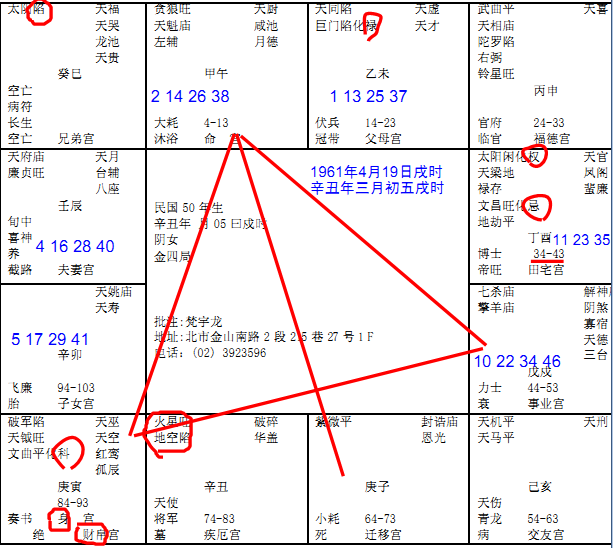

#### 紫微星在子宫

按照紫微斗数安星法，生时在戌，文昌星应该在子，
而这张命盘上，文昌星旺化忌在酉。疑此命盘有误！

首先诸位看第一章，辛丑年3月5号戍时申刻，我们批八字为什么用这个，因为这个这个八字刚好在子宫，诸位先不要看其他的宫，如果紫微星在子宫，命宫可能就有12个地方，但是紫微星在这里它不会动。

我们首先拿到这个八字的时候，原则上这个人的名在这里，紫微星在对面，如果我们以时间来说，诸位注意看，我们在批的时候讲贪狼星，贪狼星是一个桃花星，但是它是亥子宫，亥宫是晚上9点到11点，子时是晚上11 点到1点，这两个宫我们又叫做水宫，在水宫里面，如果贪狼星在亥宫或者是子宫才正合是桃花运，如果贪狼星在午宫不是桃花星，它是武官星，贪狼、破军、七杀这些武官星最希望碰到的是火星和铃星，所以你们看书的时候有一句话叫做火贪，火贪相聚的话叫做火贵格，就是武贵，所有的武官……晚上的贪狼星要长的高大魁梧，男女都一样，长得肥厚，午时的时候贪狼、武曲、七杀、破军这些星的人反而变得瘦小，越小越瘦越好。

举例，王申就是这样的，你看王申跑出来干干的脸红红的，头发还往上翘，这是标准的火形的人，所以他是将军，瘦干干的，还有林文礼也是这样的，空军最矮的就是他了，是总司令，反而是大贵，今天以前你们看到的好的其实是反的，我们在象上把人分五种星：

一种是木形，木形的人瘦瘦高高的，我们要所谓的形出现一定要纯，比如说你很瘦，但是肚子很大就不是木形的人，要从头至尾都瘦，连脚伸出来都干干的，手上都没有肉，这是纯木，

纯火也是干干的，但是红红的，看起来很热，在发热，头好像火焰山一样。

我们过去的总统就是土形的人，很厚重，土是地厚嘛，所以头一定是圆圆的，脚一定是方方的，天圆地方，手伸出来的也是也要厚厚的，摸着没有骨头，全身圆圆的厚厚的重重的，这才是纯的的土。如果你遇到个土形局，全身都像啊，结果手伸出来，干干的，就不是纯土形人，因为他有一个地方不合。

纯金的人，金是白色的，金属都是方方的，手伸出来都是方方的。

水星局的人呢，水是圆圆的，什么角度看都是圆圆的，嘴唇，下巴，额头都是圆的，手也是肥厚的圆圆的。

除了在象上要成局的人一定要纯，越纯的越贵，非富即贵，这是第一个看象的原则。

第二个是两句话送给各位，南人要北象，北人要南象。这在过去大陆的人看的最明显，长江以北的人大口吃肉、喝酒，面食一直吃，所以北方人看起来很高很壮，如果出来一个山东人很瘦瘦小小，皮肤白白的，娇小的，斯斯文文的，这叫做北人南象，大贵。如果是南人北象，长江以南的是南方人，因为南方是鱼米之乡，所以他们比较斯斯文文秀秀气气，结果出来一个人比北方人还高，这叫做南人北象，这种人也是非富即贵，这些特殊的贵象你要知道。

我们为什么要看这些象呢? 算命的时候只占我们的三分之一，我们有天文、地理、人事，到后来我会慢慢慢慢让这三条路并成一条，不管人和地的部分，在介绍象的时候如果我们有办法把命象同参的话会增加很多准确性，会帮你做加帮你做减。

贪狼入命的人，他有生杀之权，所以我们介绍的时候同时要介绍这些东西。这有一个

天魁星，天魁星是什么? 科甲代表这个人是有武，天魁星是文，这个人是文武双全。

如果文武全给一个男人的话太好了，有的女孩子很不幸，拿到这种命很累，这个时候我们会跟她说你这个是男命女身。

诸位看到她的命宫以后，我们说的事业宫就是官禄宫。

我们批一个八字的时候先定三方四正，先看他的本，我们算命的时候分两个部分，第一个叫做迷津，第二个叫做批流年，这两个都属于算命的部分，官禄宫是七杀和擎羊，杀破狼一定会来一只擎羊。

如果官禄宫最喜欢的是权星入进来，我们命上有几种权，有几颗星都代表权：

第一个是四化星里的化权；

第二个是紫微和七杀同宫，这也代表权，这个时候是官权压重，非常好。

现在这个人的八字只有七杀和擎羊，没有化权，所以他当官势必不好，当官要有权才好，要不然当个小官干嘛。

还有一种官禄宫和特殊的一种批法，如果财星跟权星在一起，那就变成银行的总经理、中央银行总裁，财的权很大，可是钱不是自己的，这叫做财权。

财权的人看他的鼻子，两种鼻子是指本身有财，一种是很大很肉的鼻子，像狮子的鼻子，还有一种悬胆鼻，就是长长的，这两种是大富。

如果他没有这种鼻子，鼻子是很挺，长的很好，但是肉并不是很多很厚，颧骨很大，这种人就是掌财权的人。手握过去软绵绵的，说明是贵人和富人，这两种人手都很软。

如果官禄宫里有杀星在里面，你当官当然不容易了，我们看到这是财帛宫，诸位看到上有一个身宫。

身宫的定义是什么? 我们简单讲就是后天，比如说身宫在财帛就会在生意人，如果在官禄宫自然会当官。

有的人身命同宫就是先天和后天是一样的，比如说我的命是划权、划命，我身命同宫，我生下来家里就很有钱，我长大了也有钱，有的人身宫是夫妻宫，后天被婚姻的影响很大。身宫在哪就是看后天影响她最大的是什么。

这个女孩子的身宫在财帛，命一定是做职业妇女，中间不能中断，因为中年的时候可能先生会有问题，不然你为什么老是想要去赚钱，她本来就想做职业妇女，不会去做家庭主妇，她的命就要这样。

我们还有一句话七杀临身终不美，身宫上最怕是七杀，比如说一个人他的福德宫在这里，结果七杀星在福德宫，身宫跟福德宫也在这里，七杀在身宫里面，你不要管它是什么，光是七杀临身，一辈子多半少成，这种命很累。算到这种命，诸位放心，我们后面有人间道应解，非常厉害，天人地的人和地加起来就是三分之二，就大于天命，算命只是一个工具。

现在身宫到财帛会在私人企业很好的发展，或者自己做事业发展，那我们看看她到底做什么东西。

第一个是财帛是破军星，第二个是天钺星，第三个是文曲星化科。

我们看八字，科权禄是最大，我们首先看科，科在财帛，他一定要有专业技能，有专长在身上，科主两个意思，一个是考试，金榜题名，一个是专业专长。比如说作家，画画或者音乐家都有科，有的人科在官禄会考公家单位，科在命宫会考试。

她的科在财帛，天魁星在命宫，天钺星又在财帛宫，又化科了，等于三个科甲星，这个人先天才艺一定很好，聪明智慧，才艺好的人一般手指都比较长，天柱纹都比较高一点。你就要告诉她，小姐你要往才艺方面多发展，走专业技术最有利走服务业，已经定出来了。

有的人不是这样的，财帛宫没有破军，他财帛宫都是财星化权，这种时候他就会自己做生意当老板。像这种人如果专科技术专长，破军星是要流浪在外，要走天下，专业技术专长，捧着饭碗走天下。

怎么看有专长的人的相？后面的脑壳下面是这样的，波浪一样的W，下面两个圆圆的，骨头是这样的，这种人一辈子到处四海为家。

她就是唱歌唱的真好，虽然脸不怎么样，但是声名远播。她就是后脑勺可以看到。

还有迁移宫，现在紫微星在子宫，我跟着诸位讲过紫微星一定要有左辅右弼来会合，结果他的紫微星一颗星在外地。

我们批格的时候是讲迷津，迷津是讲一辈子的，我们不管他几岁，我们先把终身讲出来，第一个紫微星在外面，代表你在外地会遇到贵人，紫微星是皇帝星。第二个紫微星对你自己来说也是紫微星，你一个人在外地，到头来会孤君，孤独的皇帝。

所以从这些星上显示我们可以看到一个女孩子的命拿到男人的命，在外地又孤单的话，恐怕先生就会有问题，我们要注意看，已经暗示我们了。所以你就不会让这个女孩子当官，她一定从财方面发展，所以你看天魁星、天钺星在这里，这是我们算命的第一个重点。

第二个重点是我们看左右，天同星在父母宫，兄弟宫，太阴星在这里陷，因为这是巳宫，代表上午9-11点，月亮出来，这是已时应该出在太阳，结果月亮跑出来了。那你看这边酉时的时候太阳在这里，也是陷地。

这里我要提醒各位，我们看女孩子的太阳看太阴，一个人的命月亮、太阳就代表爸爸、妈妈，所以天和地，太阳和太阴在养终生，就好象父母在养子女是一样的象。

一般来说只要太阳和太阴是反背的话大部分的时候是离开家乡，到外地发展。这个八字的人，她在国外美国。

第二个他的父母宫有化禄，代表他父母会有财物给他，第二个解释太和太阴反背过来，巨门星又在父母宫，巨门星代表是非口舌嘛，天同星在同宫，说明父母在一起经常吵架，可是感情又好，两个人感情好又要吵架，不会离婚，很多夫妻这样，说离婚不离婚，可是见面就吵架也不知道为什么。

第三个解释一般来说日月反背的人，是有一些事让父母替他担心烦恼，我们讲的很含蓄，因为每一个人担心烦恼都不一样。我们看到她可能是因为原来很好，可是中年的时候万一她先生有事情，出事了，她一个人带孩子，那是不是爸爸妈妈会担心?

我们过去说这种日月反背的都是克父母，克的时候没有解释的好。在这里我解释一下什么叫做克，什么叫做旺？因为中国以前是用竹简的，竹简克下去也很麻烦，一百种人都是克，但是克的事情不一样，精神是一样的，所以我们陈述事情陈述不完，但是精神是一样的，什么叫精神? 比如说我走在路上我不认识你，先生，你结我10万块，我买车子，你不把我当神经病吗? 我就没有克到你害到你。可是如果我是你弟弟或者是你儿子，我说我出车祸了，把人撞了，你赶快给我10万块，不然我要坐牢，你给不给?这就叫做克，所以说能够影响到你的才是克，所以克不是感情不好，而是感情太好了。

我举例有个女孩子没有结婚，可是她的八字克父母，你跟她说她克父母，你还没有解释她就很心急啊，说我怎么会克父母? 我跟我爸爸妈妈感情很好，我很孝敬他们，没有错，就是因为你感情很好，你大学毕业一个月赚5万块，你就拿4万块给你爸爸妈妈，越工作职务越来越高，一个月赚7万块，你拿6万块，10万块你拿9万块，当你对你爸爸妈妈越好的你的心态是你们放心，不要担心我，我照顾好自己，可是你错了，这是你的想法，你爸爸妈妈的想法是你赚5 万块给4万块的时候想想还年轻，没有关系，等到赚7万给6万的时候你看我们家隔壁的女孩子跟我女儿比差多少，为什么她的女儿嫁的那么好，为什么我女儿到现在没有结婚? 她就会越来越担心，这是克，所以你越对他好的时候就越克，克了半天你们无解，我有解，看一下阳宅一下把它解决掉，这就是人间道，你没有办法，人是感情生物，因为越克越累感情越好。

还有一种是旺，我最怕看到女孩子是旺夫命，可是很多女孩子是旺夫命，首先诸位有一个明确的观点，上帝并没有规定旺夫命的人一定嫁给好先生，这是两回事。

什么叫旺夫? 一个太太会让先生完全没有后顾之忧，这叫旺夫，你知道一个太太要花十几二十年很多年的时间去证明她是旺夫的人。

如果女孩子的太阳，日月很旺这种人是天生很厉害，天生好手，如果你太太是太阳很旺的人，你一定要多听她的，即使她读书很少，你多听她的，她是旺夫命，她给你决定的一定是对的，你是当局者迷，你不听她的就完蛋了，可是旺夫很辛苦。

克夫的女孩子就是太太在前面走，先生在后面满头大汗，在百货公司里大包小包拿着付钱，好不容易走到马路了，车子来了，先生还要帮她开门，把东西拿上去，先生再去开车，这叫克夫命。

那诸位看兄弟太阴星，这就是克和旺，所以诸位千万不要把外面的观点带进来，克就是克死，这是胡说八道，是断章取义的，中间有很多的过程的，结果到头来是你爸爸妈妈因为担心你，一直没有结婚，又担心你又在旁边孝顺她，然后你呢，很爱爸妈，你在旁边孝顺他，你放心我一直孝顺你陪你到死， 结果他就死掉，然后你才能结婚，他赶快死，所以是互克。我们解很简单，一个动作就解掉了。

兄弟宫太阴在这里落陷，这有两种解释，第一种是没有兄弟，兄弟是太阳怎么成月亮了，是阴星。

第二个是有兄弟而且夭折，有夭折的现象，一个星在里面如果不亮的话，没有其他的吉星来会，她就有个太阴星，没有其他主星来会，这个杀星就会很强了，如果是其他的主星，比如说有天同等吉星在里面的话杀星力量就不强了。

所以我们一宫有一个原则，你一个杀星在里面，有吉星来的话，杀星就杀的力量不是很大，什么吉星都没有，哪怕是一个小的天空、地劫都会要你的命。后面我们还有很多很好的案例给诸位，很多都发生了。

看她的疾厄宫，这个疾厄宫很强了，第一个肾脏，为什么肾脏? 因为有宫化忌在酉宫，酉宫代表肾，化忌就是最不好的了。

第二个所有的星里都是火星，地空在疾厄宫里，疾厄宫在丑宫里，丑宫代表肝，这又是一个女孩子，这是妇科右边卵巢的问题。左边是紫薇，右边是火星地空。先和她讲好，什么时候开始不好，之后批给她看啊，现在还没有批流年，先批总格，迷津就是一辈子要注意的事情。

我们最后讲婚姻，现在看朋友宫，这个在这边，交友宫是天机、天马，这种星你自己看，我们有主动和被动，她的命里面朋友宫是天马星座的，她的天马星座在朋友宫，你注意我讲话的顺序啊，所以她会为朋友奔波劳役，有的天马星在子女宫，有的在父母宫。

天机星很平和的星，如果有权、财星或很多吉星在朋友宫的时候，意味着她跟朋友合伙做生意一定大赚。如果有很多空耗的星，比如擎羊、化忌等，这些杀星、口舌星在朋友宫，这代表如果跟朋友合伙的话会朋友变仇人。上帝有没有规定好朋友合伙一定赚钱的，没有吧。这是原则。

一般相术如果这里说这个忧喜参半这是废话，这样说很简单，你说这个命格的人最好一辈子靠自己，你交朋友永远靠不住，这是比较重要的。很多人算命还给她说，你命犯小人，你命有贵人，这种话都不要讲，什么是命犯小人？他看到人就会相信，然后犯到小人，对小人特别信任。

看子女宫是空的，对面田宅宫是化忌，我们看宫一定要看宫，子女宫空的时候我们要看对面，这个子女宫的对宫化忌，杀，所以说无子，你没有儿子。

一般来说我们要看先生的命，如果先生命中有儿子的话，先生的命和太太的命，夫妻八字合在一起，先生有两个儿子，太太命里没有，还是照样生两个，生两个都比较像先生，女儿不知道。如果先生有两个，太太没有，两个人结婚，生的儿子脸孔像太太，你就紧张了，你看他小时候会像大人，善知人意，动作像大人，就是有子但是会夭折的象。

如果客户在你面前，你看她的子女宫，在泪堂。这个图象命宫在印堂，印堂就是你的命宫，额头正中这块地方就是你的官禄宫，所以这个地方越大越好，你的田宅宫在你的眉毛下面，天仓的地方是迁移宫，鼻子中间的是财帛宫，两个眼角尖门的地方是夫妻宫，地阁的地方就是所谓的仆役宫，好象我们的总统下巴就很大，有点下牙包上牙，仆役宫，手下众多的象。这两边命门是我们看生死的地方，如果你看这个人病重的话，鬓角命门这两块黑黑的，就是要死了。有一种人讲话的时候，命门这边多个骨头，两边尖尖的，这个人是有反骨，会背叛人，平常没有，一讲话的时候，一尖一尖的跳起来，就是有反骨，一定会反。

现在社会上很多人事情之前他认为不可能，事情以后他说他后悔，我们学了以后有这种经验，有的事情可以得，有的事情不可以得。

诸位看廉贞星还有天府星，这个廉贞星本身是很清廉的，当官的有廉贞星很清廉，碰到天府星，是个南斗星君，这两个加起来是一个很温和的星，这种让长的很清秀很漂亮，个子不高，也是很正派厚道的人，但是你注意看他的夫妻宫的三方四正，我们看的时候看他的福德，这个人的福德宫是武曲，天相、右弼，我们看三方四正的时候注意看她的先生的夫妻宫，是不是科权禄都没有会到，这种人都是正财，有一个人的命宫在这里，三方四正都没有科权禄，正财，这种人一辈子帮人家工作，结果她的先生没有科权，反而他太太有科在里面， 虽然她的先生很好，但是适合帮人做事领薪水。虽然他们夫妻感情很好，但是儿子没有，是他们的缺点，我们算命是把问题找出来，如何让她生儿子等问题，我们要找到的化解的方式。

<table>
<tr>
<th colspan="1">

兄弟宫

巳

太阴星 陷

</th>
<th colspan="1" valign="top">

命宫 

午 

贪狼星（武官星）（武）（有生杀之权）

天魁星（主科甲）（文）

</th>
<th colspan="1" valign="top">

父母宫

天同星（感情好）

巨门星（口舌是非）

化禄（父母有财禄）

</th>
<th colspan="1" valign="top">

福德宫

武曲星

天相星

陀螺星

陷地

右弼

铃星

</th>
</tr>

<tr>
<td colspan="1">

夫妻宫

廉贞星

天府星

</td>
<td colspan="2" rowspan="2" valign="top">

民国50年生 今年34

辛丑年月05曰戍时阴女

金四局

批注：梵宇龙

地址：北市金山南路2段215巷27号1F

电话: (02)3923596

</td>
<td colspan="1">

田宅宫

酉 肾

太阳星 陷

化忌

</td>
</tr>
<tr>

<td colspan="1">

子女宫（空宫，就看对宫）

</td>

<td colspan="1">

事业宫（又名官禄宫）

七杀 擎羊

</td>

</tr>

<tr>
<td colspan="1">

财帛宫

身宫（指后天，命宫指先天）

破军星

天钺星（科甲星）

文曲星

化科

</td>
<td colspan="1" valign="top">

疾厄宫

丑 肝

火星

地空

</td>
<td colspan="1" valign="top">

迁移宫

子（又名水宫）

紫微（外地逢贵人，在外孤独）

</td>
<td colspan="1" valign="top">

朋友宫

亥（又名水宫）

天机星（平和）

天马星（为朋友奔波跑动）

</td>
</tr>
</table>

这是我们看总格是这样的，我们来看流年，诸位还没有进入天文地理，我们批的时候还没有学完，所以我们地理还没有学完，所以我们不要加起来，不要太快速的进来，先算命。

<table>
<tr>
<th colspan="1">

兄弟宫

巳 39岁

太阴星 陷

</th>
<th colspan="1" valign="top">

命宫 

午  38岁

贪狼星（武官星）（武）（有生杀之权）

天魁星（主科甲）（文）

</th>
<th colspan="1" valign="top">

父母宫 14-23

未 37岁

天同星（感情好）

巨门星（口舌是非）

化禄（父母有财禄）

</th>
<th colspan="1" valign="top">

福德宫

申 36岁

武曲星

天相星

陀螺星

陷地

右弼

铃星

</th>
</tr>

<tr>
<td colspan="1">

夫妻宫

辰 40岁

廉贞星

天府星

</td>
<td colspan="2" rowspan="2" valign="top">

民国50年生 今年34

辛丑年月05曰戍时阴女

金四局

批注：梵宇龙

地址：北市金山南路2段215巷27号1F

电话: (02)3923596

</td>
<td colspan="1">

田宅宫 34-43

酉 肾 35岁

太阳星 陷

化权

天梁

禄存

文昌

化忌

</td>
</tr>
<tr>

<td colspan="1">

子女宫（空宫，就看对宫）

卯 41岁

</td>

<td colspan="1">

事业宫（又名官禄宫）43-53

戍 34岁

七杀 擎羊

</td>

</tr>

<tr>
<td colspan="1">

财帛宫

寅

身宫（指后天，命宫指先天）

破军星

天钺星（科甲星）

文曲星

化科

</td>
<td colspan="1" valign="top">

疾厄宫

丑 肝

火星

地空

</td>
<td colspan="1" valign="top">

迁移宫

子（又名水宫）

紫微（外地逢贵人，在外孤独）

</td>
<td colspan="1" valign="top">

朋友宫

亥（又名水宫）

天机星（平和）

天马星（为朋友奔波跑动）

</td>
</tr>
</table>

批流年的时候诸位要观象，你不要把书背了，你还是不会批的，越背越笨，要观象。我们把它放大，这是田宅宫，34 岁到43 岁，里面有几颗星，太阳化权，各位看例子，还有文昌化忌。这十年中化忌，刚好和太阳同宫，女孩子的命太阳是代表丈夫、儿子。

上不见父母，下不见子，中不见夫，一出来就得杀。然后我们再看这个人的命太强了，这种人孤军奋战，女孩子拿到这种武官命，都是一个人去打仗的花木兰，结果她先生很好，到头来有一个人孤军奋战的现象，原来在34-43这个时候会有灾，第一个十年就看到了，34 到 43 中间这 10 年，太阳星化忌，会发生事情。

举例，如果在你14 到23 岁这 10 年当中有一颗太阴星和太阳星落陷，就是在这段时间你的父亲或者你的母亲会有问题，依此类推看到太阳代表什么? 先生，所以会造成她晚年的时候，她从44 到53 岁七杀星在本宫，也就是说44 岁以后她是一个人孤军奋战。

50年生人，这个人今年34 岁，我们先看流年。

我们从戍宫开始， 这个人是辛丑年，丑年是牛，子丑是 25 岁、37 岁、49岁， 男孩子是顺转，女孩子是逆转，今年算她几岁，34在这边，这个有没有问题? 没有问题现在这个会算了? 

诸位继续看，这是 34 到 43，太阳在这边，其他的星星不要写了，34 岁是什么? 事业宫在这边，现在很多外面人不会算，算命算的不好，问题就是没有把宫解释出来。

这个宫我们在批流年的时候，宫为当年值日发生之大事，举例，今年34岁来找你算命，她就是今天来想问事业的，如果是明年来就问财产、田宅，后年来问婚姻，如果是40 岁来找你的话就是要看夫妻，所以这个宫代表他当年发生的最严重的事情。

这里有两种大限的算法。未来10年无大运，大限在今年，未来1年无大运， 大限在前一年。

34到43 年，子女宫是空的，41 岁那年开始太阳星在紫微星降落，她从41 岁以后开始太阳星看不到了，就是看不到儿子，所以她是 41 岁以后看不到太阳，但是已经讲结果，算命是一个谈果的哲学，我们不知道41岁以后先生没有了，当好值年 41 岁杀在她的夫妻宫，如果是 40 年值年那一年当好是她的兄弟宫，太阳就指的是兄弟了，可是刚好落在夫妻宫，所以从这个命上我们看40岁的时候夫妻有大限。

如果这个女孩子坐到你面前来，面大、声沙、骨粗，就是死运，就是百分百会发生，面孔大大的，讲话声音是破锣嗓，骨头很粗皮骨相连。

夫妻宫有死运的时候，我们看象书上的尖门，尖门就是眼角的尾巴，有人的眼角的尾巴如果是一条，往下走说明婚姻不好。如果是打了一个十字纹，有交叉的纹路的话，代表夫妻死别。有的纹路眼角的鱼尾纹很多，密密麻麻，代表桃花，眼角的鱼尾纹最好是一条、 两条、三条最多，代表夫妻很好，对她的另外一半非常的满意。

我教女孩子一个技巧，你先生每天晚上回家吃饭的时候或者他晚上出去再回来，你就不用问什么，可以看过去，如果他说话时的眉毛眉头纹路立起来，就是刚刚干完坏事回来。女孩子比较不容易看，这部分少教，哈哈，诸位自己看象书。

女孩子婚前乱来，然后到妇产科做处女膜手术，让男方看不出来，那个没有用啊。鼻子上，鼻头上有个骨头，叫素髎，骨头是两片分开来的，一定不是处女。她只能把阴部缝起来，可是没法缝鼻子。

一会还会有她女儿的八字，她女儿的八字刚好是在今年生的女儿，结果她女儿 7 岁的时候她爸爸有灾，从她的命格也看到，正好是她夫妻宫40岁的时候，从她女儿的命也看到。从她的命看到还不见得是对的，因为跟她同时间出生的人很多，不一定嫁给同样的先生，她女儿也是这样的话，这个时候我们要注意，这是一个流年上的限，这个大限我们要如何解它呢?

#### 阳宅化解

阳宅来说东西南北，有两种阳宅死先生死老公的，第一个厕所在房子的正中间，没有靠边，你不用管门，我们讲易把阳宅简化，四个字就讲完了，不要管门是怎么开的，门随便怎么开，厕所格在房子的中间，这是凶宅，这种人死的一定是心脏病、中风啊、气喘，痰梗到死掉了。

第二种凶宅西北角是厨房，西北角是乾卦，西南角是坤卦，太太从先生住了先生的位置，乾卦这是厨房，厨房是刀象。

厕所在中间为什么主心脏病、中风、气喘呢? 一个门，厕所有靠边又有开窗的话，开就是方格子，如果一个门在这边，没有窗户，心脏闷到的象，心脏病人的象不对，我们看什么东西精神就是讲它象它的精神，所以以后室内设计再设计，神还在那。我们取它的象最准。

以此类推，厨房如果在坤方，是不是死太太? 厨房如果在东宫死长子，但是阳宅部分只占了三分之一，必须你命中有灾，比如说这位小姐命上没有儿子，有儿子的话也是夭折，结果她不信生了一个儿子脸孔像她，她很紧张，她去挑房子，挑的时候南北看房子，她一东边不要厨房，结果她的东宫开到这边，这边是厨房，罗盘不会看，南北看反了，很多人这样的，命中有灾，她很紧张也去做了，结果罗盘还是看错了。

一定是命上有灾再加上运上也有灾，就会发生，我们要进入人间道的时候还占三分之一。如果以人间道来看的话，一个妈妈命中没有儿子，这种是什么妈妈? 我告诉你她每天在紧张，从怀孕开始，因为她命中没有儿子，你看她做了很多无知的动作，每个礼拜跑去电子扫描，非把孩子扫描死在心脏病上，小孩子三个月心跳没了。

还有一种是生了儿子以后，因为她命中没有儿子，她会做很多动作伤害儿子，可是她表面上的动机都是爱儿子，她的无知造成，有只有小孩子不懂，东西掉在地上，并不吓人，小孩子很好奇，鼻子侧面看，有点向上翻的人，像<，都天生好奇，小孩子都是这样子的，结果你是妈妈，你在后面叫了一声，你叫的目的可能担心他会摔倒，结果小孩子被你一叫吓到了，你是河东狮吼啊，小孩子受到惊吓了，小肠和心是表里，结果小肠蠕动就不好，大便不出来，然后发高热，就抓去医院给整惨了，很多后遗症都是妈妈造成的。

所以属于你的命中没有儿子，其实算命三个都要讨论的，没有人间道和地理的时候，现在外面算命是让你把儿子给别人养，或者过继给别人，不要放在身边养。这是很消极的动作，因为不见得每个人都愿意，有的人说我自己的儿子我自己养，因为你太关心了。这不是最积极的，最积极的是东宫，让儿子住在东宫里，如果他的妈妈的命中没有儿子，可是他的儿子是排行老二，那也有老大，老大住东宫，刚好是二儿子像妈妈怎么办? 你给他住到南方去水火既济卦，二儿子北方是坎水卦，二儿子要变成长子要等到大儿子结婚二儿子才可以补位，我们的名和位一直在动。我们要告诉她你一定要坚心，不管你搬到哪里，主卧房要住西北角，我特别提醒她。

我们做阴德，我帮了她她还不知道。

第一种情况， 东宫空 

第二种情况， 床压东边强

这里还有我们有两种无子宅，一个房子偏东，中心点来说一看正东边客厅或者是餐厅，空的就是缺东宫，当然没有儿子，随便你睡那一间都没有儿子。 

第二种，东边有房间，但是床压到东边的墙壁，生下来的就是女儿，床不要靠东边，可以靠其他的边，生下来的就是儿子。

过去婆婆看媳妇会不会生小孩，女孩子的人中很宽，生的非常好，生小孩平安，一种很窄，细细的一条，人中代表和产道有关系，代表很困难，整个平平的没有人中根本就是生不到儿子。有时候改阳宅改了半天，搞不好还要别的方法加进来，这是我们要注意的。

我们算命如果有什么问题我们马上把它解决掉，如果她刚结婚住这种房子的话，你的命中没有儿子，你专挑这种没有儿子的房间去住。人很好玩，她的命中没有儿子，她找好几个房间都是这样，好不容易换了一个有东宫的，结果她的床靠东边，这是我们要预防的。

你说这边是客厅没有办法住，没有关系，你跑客厅行房有可以了，客厅住是暂时的，你只是一个月三天，你怎么会每天都会怀孕那么厉害? 我们要住西北角的时候这个才是夫妻一世的位置，怀孕只是暂时的，如果到东南边怀孕的话就是女孩子，东往北怀孕就是男孩子，因为我们的阳宅东西南北，长女在这，长子在这，你要先女后男还是先男后女你自己挑，我这个比较积极。
