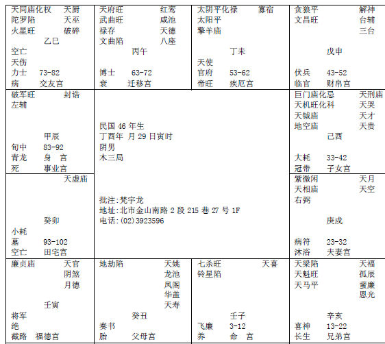

#### 紫微星在戌宫

紫微星在戌宫这个，看到没有，
 
诸位看到紫微在戌的时候，这个格的重点在哪里，

第一个，太阳太阴都在未宫这里，那申宫这里是贪狼，寅宫这里是廉贞。这是未宫，这是丑宫，重复上次课讲过的，太阳太阴丑未中，日月同宫，日月会命；

那申宫廉贞独坐，对面贪狼，就是雄宿朝元。

那这个八字的特点在哪里，各位看到丑宫这里有个地劫看到没有，上次有介绍过，孤星独守的时候，这是大凶。非常的凶。不但本宫凶，对宫也凶，什么叫对宫也凶，比如说你的流年刚好走在未宫这里，对面是一颗孤孤的地劫来会，就代表那年是凶。那至于到底凶什么事情，我们看八字来决定。

进入这个状况的时候，大家要特表注意这个大运会到这个雄宿朝元。地劫星这样的灾星。我提这个八字，就是说丑宫地劫星这个地方千万不要忽略掉。

因为如果武曲地劫在辰宫这里，这个地劫就影响不大，大不了破点财而已，一颗星独守在那里，就很严重，特别要小心这个。
