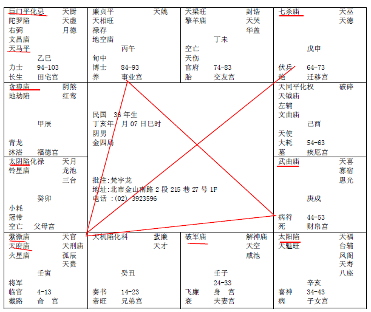

#### 紫薇星在寅宫

诸位看第三个，紫微星在寅宫，我们现在还没有批流年，不要着急，先看格才会批，真正开始批的时候我们找案例，我们一年一年批给各位看。

诸位看紫薇在寅宫，我们先不要管它是什么宫，寅宫在寅宫的时候是天府星一定跟它在一起，七杀就一定在对面，这就成了一个格，在寅宫这个地方的时候我们叫做紫府坐垣格，这四个角当成一个方正，这四个角就叫做垣。坐在寅宫对面叫七杀朝斗，就像一个斗，你先坐过去然后拿斗去掏米嘛。

紫府坐垣格和七杀朝斗都是大贵之星，紫府坐垣格的人将来位列三台，会在天子身侧当个将相，就是近天子身边的人，紫薇在寅宫代表君王。真正的君王不一定在这里，不一定是紫薇天府坐垣。位列三台，就是以前的司马、司空。

七杀朝斗的人是将星，将星入命，他会威震边疆这是一个特殊的格。七杀朝斗，对面是迁移宫是紫薇天府，那就是威震边疆。对面是命宫，那就是本地嘛，当然会在天子旁边。

这是特殊的格，南斗星君、北斗星君同时会在一起。

如果寅宫不是命宫而是官禄宫怎么办? 大好，这两个是官星。如果这个是财帛宫在这里怎么办?财帛宫这两个是库星并不是财星，只是有很大的权利而已，并不是很大的财星，换句话说如果财帛宫在这里的话，他在私人公司里当总经理，比在公家单位还要好，公司不是他的，但是他表现太好了，一定平步青云，会近天子之侧。所以他到底是在私人还是公家单位，什么位置一念之间而已。

这里如果紫薇、天府星在这里，太阳星一定在亥，太阴星一定在卯。诸位想在戌宫的时候太阳一定很惨的，在亥宫是9点到11点，卯宫是5点到7点，一定是更暗，就是比刚刚的还要加凶。

如果你要依此类推，按照《易经》的象来推的话，如果亥时这个人的田宅宫在这里怎么办?晚上出太阳，好大的火啊，火灾。

如果这个不是田宅宫，是父母宫怎么办?太阳就是爸爸。

如果这是一个女孩的命，这是夫妻宫呢? 先生。如果太阳陷地。如果她的命中眼角两根，没有第三根第四根，知道她先生很好，你不要批先生死别啊。她们夫妻聚少散多，她先生可能是海员，很少在一起。如果女孩坐在你面前已经面大、骨粗、声沙你还说你们夫妻聚少离多，他先生已经走人了。就算你看不到他象，没关系，阳宅也可以看，帮我们加减一下。

如果亥是子女宫，不管是男的还是女的，会有儿子，但儿子远离不在身边。化忌的话代表儿子要死，有杀星，或者是羊陀，或者是火铃或者空劫在子女宫的话，如果落陷的话就是杀了，要特别注意一下。

如果这个在疾厄宫呢?用象去批，眼睛不好，你怎么把晚上的太阳看成月亮了? 什么眼睛啊? 青光眼?眼睛都看不到了，日月反背。

如果太阳星落陷在这里，如果是财帛宫呢? 这个人是晚上出太阳，这个人不能做生意当老板，做生意一定要有权有禄才可以，我们前面把星座分成很多，有的是化权，有的是化禄，如果那个人的命就是禄星都在一起，命宫是这样或者是十年大运上有权禄星一起，就代表他可以做生意，如果没有的话，财帛宫太阳是落陷，如果他做生意的话代表他晚上忙、白天忙，忙了半天还是空忙。

还有一个武曲星在这里，诸位看武曲星在戍宫入庙，对宫的贪狼星也是入庙，贪狼隔壁一个宫庙，和对面宫苗旺，完全不一样，贪狼星在财帛宫也是庙，在夫妻宫也是庙，意思就是告诉诸位杀星、武官星入庙最好，大吉，武官星入庙这种人非常的刚强。

中国人讲刚强，在我们八字里讲这个人和固执，在孔子不是这样讲的，孔子说这个人对一件事情坚持到底，我们在《易经》上说阳刚之人，讲的就是这个，一定要有一点个性。

比如你取个太太，你让她到外面给你买包味精回来，她结果去了三个小时还没回来，等她回来你问他，她说刚到外面遇到个人说看电影我就跟他看电影去了，你就完了，你太太没有主见，别人两句话她就走了，她忘掉她自己有什么事情了。我就经常说龙卷风把人都吹不走，人家几句话就把她说走了。如果你娶这种太太很可怕。

还有人更可怜，先天不是这样的，他后天被爸爸妈妈训练成这样了，了解我的意思吗? 如果你是妈妈，你在麦当劳买东西，有妈妈带女儿来，绝对不会问女儿你要吃什么，她替女儿决定。女儿没有什么意见，光说是是是是，出去遇到坏人，坏人说走啊，她说是，走吧。这都是妈妈训练的不好，妈妈说这都是我女儿，我当然替她好，那你有办法24小时看着吗？你对你女儿这样，对你先生也这样，那你就是很可怕的人。所以我就告诉太太，你去庙里打坐静修去，孩子交给我，一个月肯定很有主见的，知道自己要什么。

所以诸位做父母训练小孩子，我知道当他们父母平常忙于工作、上班，我们小孩子送到学校去受教育，都不需要你去教他什么东西了。你不要回来说我再教你，老师有教他，你再教了干什么? 所以说你不要教他。你要教他的是你想要什么? 从小孩子生活环境很好的时候，知道他想要什么，知道他的状态是什么，他很贫困的时候，你看他不要什么不屑做什么事情，就可以知道儿子的心情，这个时候如何真正善诱他就行了，然后平常带他玩就好了，老师教的你不用再重复教他了，老师讲一遍你再讲一遍，孩子都不想听了。很多爸妈一直讲人间的道理，千篇一律，他根本懒得听。你应该问一些问题，知道儿子想要什么，才是重点。

贪狼星是武官带，如果逢到疾厄宫就不是杀星了，因为它会入庙。如果是武官星一定要遇到官星才会有，还有是好的流年，什么是好的流年?你的命宫在丑宫，3岁到12 岁在命宫，13 岁到22岁在这里子宫，23岁到32 岁在亥宫，33岁到42岁在戊宫，武官星才有用啊。结果有一个人的命宫在酉宫，结果2岁到12岁武官星在这里有什么用啊? 12 岁当将军啊?你以为你是甘罗啊。所以我们要有好的流年才有用嘛，依此类推，你不要傻乎乎的，说老师这个很好，结果才多大年纪啊? 所以看八字的时候一定要推理，过去2000年以前的东西我们要适应到2000年以后，环境再怎么改变，但是它的神没有改变。不可能说两百年以后，小孩子生下来12岁就当将军，所以说一定要有过程，虽然是好星，但是出来的时候不对。

如果有一个人的武曲星在戊宫，夫妻宫也在这里，结果他的命宫在申宫，这是一个男性，先生是七杀朝斗，太太是武曲星，这是夫妻两个人是同行。

有的人不是这样的，有的人如果这个命宫在酉宫，武曲星在兄弟宫，代表兄弟得力，所以同样是武曲星，它的性是一样的，看它落在什么宫有什么解释，如果是落在父母宫，这种父母出武贵。一看父母宫是武曲破军化科化权啊，是武将，还允文允武。如果父母化禄，明明是做生意的你还跟他说武官。

所以我们看一个宫，我们为什么要学看命宫，命宫出来会有三方四正，看他的父母宫、兄弟宫也是看三方四正才知道他兄弟怎么样。

有的时候他的父母宫在午宫，父母宫本宫没有什么星，可是三方四正会出来的时候这是是科、权、禄，他的父母是科权禄，那是大富大贵。所以我们看一个宫，我们为什么只画一个箭头、 一个三角形给你看，所有的宫一定要看对面，看子女宫不能光看一个宫，要看三方四正，看对面，所以这是一个标杆，一直在转动，我们不能把它统统画出来，一个你都看昏头了，全画出来更昏了。这样有没有问题? 没有问题我们继续。

还有左上角巳宫，左上角是一个巨门星，这个巨门星已经是是非、口舌星了，遇到巨门星的话已经在吵架、打官司了，已经很凶了，再一个化忌，就会加重巨门星的杀，光一个巨门星就已经会打官司了，再化忌是百分之百要打官司的，在劫难逃。

如果是巨门星和天马星呢? 诸位要依此类推，他骑着马打官司，肯定是车祸。春夏秋冬，巳宫在冬，那就是冬天车祸嘛。

如果我们看十年，八字的十年刚好在这里，太阳在这里，这是 34 到 43 这是田宅宫，结果这个时候太阳星陷地不亮，对面是巨门星化忌，如果这是一个女孩子的命，34 岁以后已经没有太阳了，发生的事情是 33 岁之前，为什么? 太阳代表说夫妻不在，先生聚少散多，可能是做海员，可是对面是化忌就完了，一定是散。

<table>
<tr>
<th colspan="1">

巳

巨门星

化忌

天马星

</th>
<th colspan="1" valign="top">

夫妻宫

午

</th>
<th colspan="1" valign="top">

兄弟宫

未

</th>
<th colspan="1" valign="top">

申

七杀

</th>
</tr>

<tr>
<td colspan="1">

财帛宫

辰

贪狼 庙

</td>
<td colspan="2" rowspan="2" valign="top">

民国8年生

己未年月13日子时阴男

金四局

批注：梵宇龙

地址：北市金山南路2段215巷27号1F

电话: (02)3923596

</td>
<td colspan="1">

酉

天同平     天官

</td>
</tr>
<tr>
<td colspan="1">

卯

太阴

</td>
<td colspan="1">

戍

武曲 庙

</td>
</tr>

<tr>
<td colspan="1">

命宫

寅

紫微星

天府星

</td>
<td colspan="1" valign="top">

天机陷 天虚庙

丑

</td>
<td colspan="1" valign="top">

官禄宫

子

</td>
<td colspan="1" valign="top">

田宅宫 34-43

亥

太阳 陷

</td>
</tr>
</table>