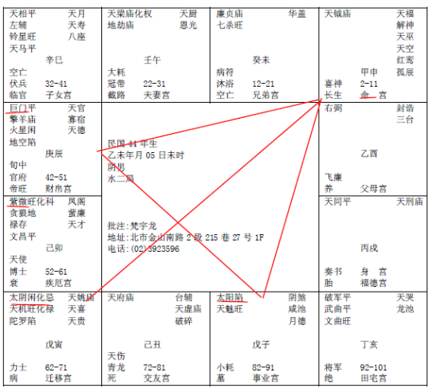

#### 紫微星在卯宫

首先这里有几个特殊的格，要注意一下，
当紫薇在卯宫的时候，我们先不要看科权禄忌那些，我们在正式教诸位批的时候，看案例批的时候，再跟各位讲科权禄忌。

第一个特点，紫微在卯宫的时候，天梁星在午宫，有没有，这个天梁在午宫，一定是入庙，很亮，天梁星在午宫，我们有一个特别的格，这个干武官的话，一品武官。近天子。

武官有四种人，军人，警察，法官，外交官，所以如果一个外交官，拿到这种命，就是命宫天梁在午，这个天梁在午宫，手有生杀之权。所以我算过很多人，当司法官的话，一直往上走当司法院长，警察的话干局长，外交官的话，干大使！都是一方之主，这个。

还有一个要注意，他太阳在子，太阴在寅，对不对，是不是，太阳在子时出来，子时是晚上11-1点，所以太阳落陷，晚上怎么能看到太阳呢，寅时月亮在旁边，如果有一个人命宫在丑宫这里，叫做日月夹命。这种夹命不好，这种叫着反背的夹。反背的日月夹命，如果命宫在丑宫这里，一世辛劳。一辈子都很辛苦。

诸位看一个人头，我们正常的脸呢，很丰满，很饱，上面这个位置，我们叫天仓，下面嘴角两边，叫做地库：

天仓有些是凹下去，有时候正面看不到，你摸他，皮包骨了，太阳穴凹下去了，这就是天仓，有的人凹到前面来了。

你看我的地库，我是刚好两个大肉，如果没有两块大肉，我不会站在这里，如果是瘦瘦的，我在监牢里面。那坐牢的人尖嘴猴腮，一辈子辛劳啊。

我们相上面是断章取义的。哎呀，没有天仓、地库的，一世辛劳，他就讲完了。可是你有没有想到，他为什么一世辛劳，因为他不安分，他心里贪念很大，他每天欲望很强，我们是艮为山为止，他眼睛看到了他就想要，我们看到了就当没看到。他看到他就想去要。取他不当得到的东西，当然这辈子牢狱之灾很多啊。坐牢出来没办法做事，然后又去做坏事，然后又坐牢，就是一辈子这样。

还有一个重点，这个天仓陷下去的时候，过去我们看过去，一望过去，糟糕，这个人天仓没有了，代表这个人身体气血两虚，极虚弱的状态下，天仓也会没有。所以有的人是病重了，你一看他，他没有天仓了，为什么叫天仓啊，就是说，你吃的食物，到胃里面去，胃能够消化掉，能够生养，化生食物，叫做天仓嘛，那这个人病重的时候，天仓也看不到，而且天仓两边，黑黑的，凹下去，这就是代表重病。那他重病了，你说他一世辛苦，不要哦。那人没有重病，精神很好，那你看他天仓没有，就知道他食不知味，他吃东西都很紧张啊，看看左边，看看右边，眼睛在那边闪动，你要是在饭店，看到你对面的人就这样，眼睛闪来闪去，跑路的嘛。这个他已经告诉你了，因为他心里有鬼啊。然后他吃东西会不消化啊，随时会跑。这是他的两个重点。

还有一个，诸位看酉宫这里，右弼星有没有，这个右弼啊，我们叫左辅右弼，或者是八座三台，这四颗星啊，独守，你看就单独一颗星，反过来，紫微星呢，应该要左辅右弼来会，同样辅弼星也要会到紫微星是不是比较好，他现在上面星都没有，一颗星在酉那边，这就叫做这四颗星孤星独守。主的是孤单。如果是命宫在这里，主他一辈子孤单，如果他在父母宫呢，主的是父母单一，单一。

那如果太阳陷，太阴化忌，已经很可怜了，太阳星陷已经很不好了，太阴星好不容易有点露头，化忌!如果没有化忌还好，如果化忌呢，父母都有凶！所以说，这颗右弼星如果入夫妻宫，夫妻宫本来主的是双，两个人才对，夫妻宫有右弼，或者是单一的左辅，一颗星在这里，主的是二婚，婚姻势必会离婚，一定离婚，你不要看什么太阳亮不亮，孤星在那边就代表会离婚的，一颗就够了。

那如果一颗右弼星在福德宫怎么办，那不是更惨，懂不懂我的意思，最好要有紫微星在福德，然后辅弼有，最好，那你光有紫微星，没有辅弼星，也不行。

那如果命就是右弼，那就是告诉你，这个八字告诉你了，我生下来就是辅弼之才，我当你的助手，当你的秘书，当你的助教，他很好，我当老板的助理，那很好，他是右弼星，所以当你是老板，你要用手下，一看是左辅右弼在命，那最好，他孤单对你有利啊，随叫随到啊。

还有一个，诸位看他的未宫，廉贞七杀，在未宫的时候，是不是庙旺，这个廉贞七杀落陷入同宫就是凶星，会横死。

如果两颗星是庙旺的时候，加起来是什么，富人，积富！累积的财富很多。好了。

我为什么举例这个，比如有一个人，他是34-43，十年之间，他是廉贞七杀入庙旺，是不是他这段时间最好，财禄来的是时候。

那如果他是13-22岁是廉贞七杀庙旺，那就是屁用都没有，这就代表他从小学毕业到初中，开始当班长，七杀哦，他都是班长，干到大学毕业，都是班干，然后越毕业然后越惨了，从此念书期间，都是干班长，念书毕业之后都是干不到，好星都走完了，懂不懂我的意思。

所以好运最好不要太早来，你们注意看新闻报道，哎呀澎湖发现一个天才儿童，有没有，几岁能够怎么样怎么样，到后来就没有消息了，然后你去看拿到诺贝尔奖的没有一个是天才儿童，对不对，爱迪生还是一个聋子呢，所以当聋子很好啊，现在社会很多人不是聋子也不是瞎子，爸妈生下来，就准备去被人家骗。所以你去法院看，被骗的都是眼睛很好的。聋子你骗不到他的，他根本听不到你的话，怎么骗。这是几个重点。这张八字我们来讨论。

还有一个，太阳在子宫陷地的时候，这个巨门在辰宫这边，这个巨门在这里的时候，也不亮，巨门和太阳会到，如果看不到的时候，我们巨日有两种，巨日格，巨日格要成格，什么叫成格，就是要拿个格局才叫成格。我们在易经也讲过，这个卦卜到，要那些合上才成格。巨日格必须要庙旺才会成格。就是很亮。

现在这个巨门太阳两个会到了，但是陷和平，不亮，对不对，这也叫做巨日格，但是不成正格，懂不懂，正格的话，要很旺。巨门和太阳是腰间一尺，大生意人，巨贾这种命。

如果落陷了，就不成正格了，不正就变成偏了嘛，所以男孩子拿到还好，女孩子拿到会做偏房。

男孩子拿到了，就变成个性喜怒无常，表里不一致，我算命很怕算到这种人，我难道跟她说小姐你表里不一致，你很坏，先生你喜怒无常，这个我们不能讲，这是反背，你懂不懂我的意思，所以遇到这种人，很累。

如果你看到这种八字，过去犯这种错误，不要担心，没有关系，你要找到如何修正他，所以到了平常心的阶段，比如乾为天，刚健，你对的往前走，平常心，实话实说嘛，没有关系。

前几天有个妈妈带她女儿来，那个女儿四岁，一进来我家，女儿突然很大声，妈妈这个房子好老啊，我刚好在那边啊，她妈妈赶紧说不要讲不要讲，我说太太你错了，她说的是实话，你为什么要禁止她，你每天在家里教你女儿要讲实话，她讲实话，然后你又禁止她，这叫做教而后禁，现在我们教育最大的错误就在这里，教了他，又不准他这样子。平常心嘛，我跟她说，你女儿讲的没错，我房子是很老很破啊，没错啊，你为什么要去禁止她。懂不懂，平常心，如果心性修到这个阶段的时候，命格都绑束不了你了。

这个例子还有一个特殊的状况，太阴化忌在寅宫，命宫刚好在申宫，三方四正来看，我们用红线来搭起来，诸位，搭个线一看，本来他左右巨门太阳落陷已经是杀了，对面又是化忌来冲，我们算十年算命宫，算流年都是一样的。

这个煞星来的时候，如果在本宫，煞星的力量就不强，如果是对面会来的，是最大的，那你看他的命宫，对面是化忌来冲，如果你命中化忌，有杀星还没事，对面有化忌来冲，再加上三方四正，没有吉星来会的时候，这个人，我们不要管他是巨门太阳，比如说是羊陀，或者是其他的煞星，不一定是巨门，反正那个星不好，那对面是化忌来冲的时候，我们有个格，就叫做半空折翅。

这就是说限会在中年，三十岁左右，这是一个定律一样，那限在三十岁左右，有的原因是先天性的绝症，艾滋病啊sle啊，不是我要的，我生下来就这样，还有一种是后天的灾星进来，都有这两种可能。但是他都会有这种现象。

好，还有，武曲、破军在亥宫，武曲破军同时会到这两颗武官星呢，也可以称他为将星得地，将星来会到，这是我讲的都是命宫在亥宫这里哦，其他要以此类推嘛。

我说这两颗星是将星，不单单是命，命中若会到，男人最好了，男人拿武官星最好，出来就化将，如果我们这里，不要讲命宫也不管是什么宫，刚好是34-43，或者44-53，是不是就是化将军啊。 你要会以此类推，你不要被他绑到，对不对，那你如果到74-83，你就不要说武官了，你还在说，先生你干武官很好，什么时候化将，七十二岁！你自己国防法都没看过，几岁退休都不知道。胡说八道。多看看报纸时事嘛，不要乱讲。

一般，原则上，我们算命的时候，都是将星入男命最好，如果将星入女命，有一种最忌讳的，诸位一定要注意，为什么要提出来？这个武曲破军在这里呢，本身就是权力、欲望非常重的人，好了，结果是个女人拿到，易经从头到尾的原则都是阴要从于阳，所以以前中国人讲嫁鸡随鸡嫁狗随狗，可是易经有一个很正确的观念，就是如果阳失道，失了正道，这个阴会盛于阳，夫妻反目。易经还赞成夫妻反目，我们后面有介绍，有赞成夫妻反目的，因为你阳失正道啊。你这个爸爸一天到晚不知道搞什么，太太没有办法了，阴出头了。

那我曾经算过一个太太，她做裁缝的，她那个先生很差，每天不务正业，花天酒地赌博，太太赚钱给他用，不光如此，还有债主到她家里来拿钱，债主哪里来的，赌场里的人，她先生在赌场里面赌钱，到家里来拿钱。好了这些统统不要讲了，结果有一天，他太太去检查发现得了性病，那怎么办，太太到我这里来找我，她说告他怕被他打，要怎么样怎么样，有没有什么办法，我说有，我就教她一改，位置改了以后，后面我会教诸位，改了以后，她先生在外面犯到桃花了，是个舞女，一天到晚吵着跟他结婚，好了，他想尽办法跟他太太离婚。有很多事情，我们人力往往难以做到，我们可以利用一些运来解。

那我为什么提这个出来，就是，如果有这种情形的时候，如果阳是正道，可以助阴。

还有一种是阴呢，就是这种女孩子，碰到这种命，特别要小心事情，因为女孩子拿到这个将命，有生杀之权，你又是阴，从头到尾暗示给你们，就是她是暗权，不是明权，暗权很可怕哦。有些太太呢，她就怀疑先生，她正面上表面上都是很恭敬，私底下就找了侦探去跟踪先生，那我制止了很多这种事情。

那个太太说，倪先生我花钱找人跟踪监督我先生好不好，我说这位太太你的目的到底是为了什么，你做事情总是有目的的把，哎我的目的要看他怎么样子，要他以后不会再犯，我说太太你错了，如果你要达到目的，这个不是方法。如果你的目的是离婚，你不要去找人，你不要花钱，你直接说我要跟你离婚就讲完了，如果你的目的不是离婚，你要这么做，被先生发现了，你就准备离婚把。结果你的目的是这个，但是你做的方法害的达不到目的，而且还会把你的婚姻毁掉，所以怎么看，都不需要去做。

那这种暗权的人，她的杀伤力很大，最后杀到她自己，害到自己，因为她疑心病很重。她怀疑人家谋害她，就会变成这样子哦。

这是一个男人可以女人不行的组合。

那你说，老师你怎么知道女人有暗权，当然有了。不用看八字，一看就知道。
诸位过去我们看乡下，老祖母家里有个灶，旁边还有个烟囱，你看它有两个黑黑的铁门，叫灶门，有没有：
 
如果遇到一个女孩子，鼻子是灶门，圆圈圈的，就是她了。所以一个人会破祖业，整个鼻子都翻上去的。

男的没有关系，女的成格，这样翻进去的，鼻如灶门，有没有。要整个鼻孔出来，稍微漏一点没关系，破点小财。

那有的鼻孔，完全不漏，这样子，那是小气鬼，鼻孔要漏一点点，不能漏太多懂不懂，你看非洲那边都是这样子，鼻孔上翻，身无横财，以后也没有横财。

那你家财万贯，生个小孩出来，不是眼睛对着你，是鼻子对着你，那你的祖业就不能传给他哦，因为他会把祖业败掉。

相书上，就写鼻如灶门，会破祖业，中间省略了很多字，就是暗权，懂不懂。她认为怎么样，祖宗就认定了，她并没有我们那么多理论，专业知识和理论，看了以后，我们再从外面来认定，她一路听谣言就认定，听小人影响，这种人最会犯小人，所以说个性太刚直，女孩子逢到这种星，个性太刚直，这种性格的人，最容易被人家利用，所以跟他讲话，我们一定要听而明，不要做聪明，我没有讲错国语哦，听而明，要做听明的人，不要做聪明的人，在牢里都是聪明人，检察官更聪明把他抓进牢里。
