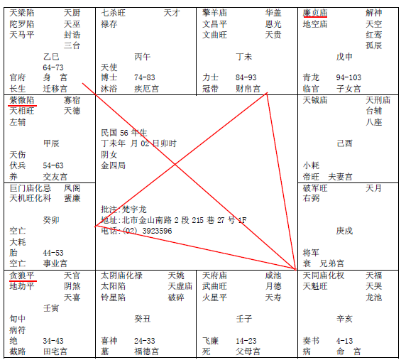

#### 紫微星在辰宫

好，诸位看下一张，紫微星在辰宫。这个命呢，我们一个个介绍。

第一个，廉贞星在申宫，子女宫，一颗星独守！贪狼在寅宫，我们以廉贞星为主，紫微星在辰，紫微动一下，其他星也跟着动。

如果一个人命中廉贞星在申宫，或者廉贞星在寅宫，这两个星都一样，或者廉贞星在寅宫贪狼在申宫，孤星独守，一定要廉贞星居命，而且一定在申、寅宫，合格，才成格，这个有个格叫做：雄宿朝元格。

这种格发生两种人，一种是军人武官，还有一种是生意人，商人，但是商人的话，命宫、财帛宫一定要有禄，我们十二站讲完，以后批命，就一目了然，以此类推，速度会很快。

雄宿朝元，出武官也是出将相，做生意的一定会当老板，但这个八字后期会毁在桃花上面，过去我们有句话，就是说哎你的命很好，你交桃花会破财不好，这句话讲的就是雄宿朝元的人。

有的人桃花很好啊，有的人桃花不好，就是这种人。那像这种人，如果没有八字，如何看这个廉贞星，你看他眯眯眼，笑起来眼睛眯眯的，就是他。

比如说，我们五个男的，你儿子交朋友，好几个男孩子，我们学这个就是看到外面知道里面藏什么，男孩子在一起都没有什么，大家嘻嘻哈哈的，只要有个女生进来，你看另外四个没变脸色，只有一个就已经是变了，眯眯眼，就是他。女的也会一样。对。这是一个。

第二个，文曲文昌在未宫，文曲文昌同宫，叫曲昌同宫，文曲文昌在丑宫也会同宫。

那文曲文昌同宫在丑、未宫，一定会同时会到太阴太阳，有时候这四个在同一个宫。

诸位看到这两个星吧，这是未宫，这是丑宫，就是说，日月科禄，科有没有，如果再加一个禄进来的时候，日月科禄丑未中，定为方伯公。

方伯公不一定是当大官的，比如说很有名的律师、医师、会计师，他本身能接触到官贵，本身是社会的乡绅名宿，直接会接触到为政的人，他不一定是真正的做总统。

那有的人呢，我就看过很多名律师，校长，就是社会权达之人，地方乡绅，这种人，智慧很高。

你看文昌文曲大多都有专业专长，但这个给男命最好。女孩子的命跟男孩子的命稍微有一点例外呢，女孩子的命有月亮星进来，又带文昌文曲，这就叫做女孩子有桃花，杨贵妃就是这样子，文昌文曲又会到月亮，三颗星同时会到，对女人来说，就是桃花。教你们男孩子算命，不能这样哦，嗯，这个女孩子是桃花，太好了，我来追她，看到桃花就不要讲，我们算命，我原则上是不给她批桃花，为什么，批出问题来，知道吗，所以你不要以为你批命批的很厉害，干吗说人家的私事，不要去找她。懂不懂，尽量不要去讲这些东西，我在这里把这个格告诉你。批出来，只会有纠纷。

还有，戌宫有一个天钺星，有没有，这个天钺星独守在这边，同样的，如果有个人命里面，是天钺星。或者是命宫里有文昌文曲，这些星都代表科甲星，除了代表这个人读书读得很棒以外，如果你的流年逢到这个星，刚刚好这年去考试，都代表金榜题名，那反过来，没有会到就不会金榜题名哦。

那文昌文曲，完全着重在文章文笔才华，还有专业的作家画家。天钺呢，比较着重于贵人，除了你的科甲以外，你流年逢到天钺星，你刚好来问我倪海厦你看我今年会不会升官，一看你流年正好是天钺，命里没有权，但是逢到天钺星，你会升，因为有贵人在里面。自然会得到上面的赏识提拔你上去。你是被提拔上去的。以我们升官有两种情形，一种是送了红包去巴结的，还是一种呢是逢到贵人提携上去的。所

再来看，七杀在午宫，看到没有，先别看他在疾厄宫，书上说七杀在疾厄宫是痔疮，这些没有用的哦。

这个如果在命宫，有七杀在午，这也称为将星，所以我们将星很多。将星入命。这也是化权，化将，干将军，所以你批一个武官的命，一看都没有什么将星来会，不要干了。那如果你的命中没有，没有关系，你的流年逢到有，一样成格，比如你43-52岁，七杀在宫里，化权，哇，当司令官！中宫的话就是军区司令了。
