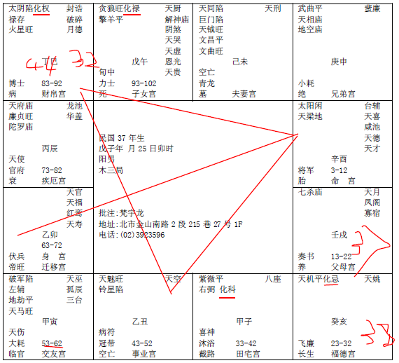

## 案

那今天有两个，天文部分开始介绍案例。

诸位先看一个男的。如果没有电脑排，手工排也没有关系。

各位看他的命宫在酉宫，太阳、天梁。

财帛宫巳宫太阴，禄存，化权，用到我就讲到。

丑宫天魁星，命宫有天喜，命宫对面迁移宫卯宫有红鸾星，这个八字的重点。

为什么要举这个例子给诸位看？这个八字有个重点，所以很多人批八字，就是福德宫不会批，你看他的福德宫，天机、化忌。

贪狼、化禄在午宫，我们尽量不排盘，重点在批命上。

他紫微星化科在子宫，在田宅宫。
我们拿到八字以后，先把他的三方四正画起来，这叫做三方四正：

批一个八字的重点，拿到一个八字不要紧张，拿到八字，先看三方四正，这是他的命宫、财帛、官禄、迁移，迁移宫是空的。

我们在算命的时候，命只有三分之一，这是上看天文。运的时候又占三分之一，这叫做下看地理；人事的部分，又占了三分之一，这叫做上看天文，下看地理，中知人事，天地人是三才。

那我们人控制的是人，还有运，人间道，还有地理位置，加起来，就是大于天命，

所以我们算一个八字，要天地人三才，天地之间，人是万物之灵，所以人道在正中间，我们掌握的人间道，就是我教你们易经的原理，然后地理位置上的应用，他的卦的变化，易经的演绎。我们算命的变成一个什么，变成工具，让我事先就知道会发生什么事情，我们事先去预防，这就是我们学习研究算命的目的，这是正统的中国老祖宗的东西，现在外面的人呢，都是在算命，你们去看，他只有三分之一，他就在那边算哦，不管你是铁板神数、子平法也好，算他命完蛋了，但是不能解，实际上我们要解的时候，要靠地理位置和人事，加起来为三分之二，大于命的三分之一。

所以基本上把天文地理人事都学习的非常娴熟的人，一定是非常精于医理，一定懂医的。

我们不要讲别的，光是算命，哎呀，先生你有心脏病，他就说啊先生真的算的很准，我真的有心脏病，地理位置上你不要去住中央了厕所的房子，啊我现在住的房子真的是厕所在中间，马上换掉，那光是地理跟命拼的时候，正好是三分之一对三分之一在拼，如果应用医学上的技术，把心脏病治好，这就是医理，否则我人间道跟你讲完，你还是心脏病出去啊，因为你遇到我们之前，就已经有病了，了解我的意思吧。

所以我们在人间道上做的时候，诸位进入人间道，反而把人世间的事情看的很清楚的时候，基本上你非常的愉快，你是平常心，你没有喜怒忧思悲恐惊，你不要被周围的环境所影响，你每天都很开心，那种欢喜是从心里发出来的欢喜，所以你不会忧虑。进入人间道的时候，刚开始还没生病的时候就预防生病的，加上地理位置，让你良性循环。

但是已经有病怎么办，我们要靠医学的技术，所以能够再精通医理的话，没有东西不能解决。这是中国人过去天人地三才。

现在我们开始批的时候，大家要有个概念，我们就会从天文讲到地理，讲到人事。地理位置我们可以控制，今天我们可以住西北、西南等等方向，可以控制的，还有人事上的人间道，这些都是看得到摸得到的东西，是我们老祖宗传下来的东西，人间道完全根据易经来的，所以中间不牵涉任何一点的迷信。

所以我在这里慎重的呼吁，你再画符念咒买风铃买鱼缸买玉不要被我碰到，当场骂哦。如果你觉得骂的不对，那你就是觉得我们比较刚直的人不好，那你喜欢小人嘛，这都是很合理，能够让全世界的知识分子，不要光说台湾，大家都能够接受。

好，我们现在开始进入这个范围，一边批一边跟诸位讲。

这个八字我为什么拿这个来举例，到我面前人死了来的知不知道。

一进来的时候，这个人是37年生的，民国80年来算，男的，进来的时候，我还没有看八字哦，我一看她的脸，当然不是本人来的，太太来的，脸的印堂是白色的，这个白不是润白哦，而是枯白，白的黯淡无光，颜色好像牙膏一样，牙膏还是亮亮的，你把牙膏挤出来，放久了，没有光，白白的。就好像你把牙膏和泥巴混合在一起的颜色，掺杂一点杂色下去，整个面色白色惨暗的，我们就知道这个人带丧的，坐在你面前，穿着衣服把那个戴孝的遮挡起来，看不到。看脸，就写着带丧。所以你不用去遮外形的。

一看我心里就有个数了，再一看，他先生的八字，福德宫化忌，这个男孩子福德宫，福德宫主一世的福禄，化忌的时候，就是一世都不顺，很累。

如果过去我们算命，没有人和地理，先生，你去当悟因，就是当和尚，悟生妙真道，可能可以化解，这是光是算命的讲法了。您就好好地去当和尚好了。那一辈子这样就会很愉快，就会逃过这个生死大限。讲完这句话，叫做废话。

所以外面算命哦，他的毛病很大。哎呀先生，您的婚姻有问题，你会二婚命，那我怎么办，简单啊你晚点结婚就好了啊，那几岁结婚，42岁。看玩笑，我做不到，你今天是男的还好，女的呢，对不对。所以外面很多算命的，提出的方法都不能化解，讲话是消极的，啊呀，先生，你这个婚姻不好啊，你这个是二婚命，那我怎么样化解，很简单，你嫁个男孩子离过婚的就行，我不要。所以话很好讲啊，人家要不要啊。对不对。

那像这种命的时候，如果我们光算命，就是说僧道了。你不要看其他的，光着一个福德宫天机化忌就很累了。

那你看这个命，我们怎么批他：
第一个，他的财帛宫化权，还有禄存，这叫做权禄相逢，权禄相逢的人，进财帛，他一定会去做事业当老板。

第二个，身宫在迁移，身宫是后天发展，在迁移宫，他不但会去做生意自己当老板，他还会把生意发展到外地去。

第三，然后，这个人呢，太阳在酉时下山了，太阴在巳时出来，者叫做日月反背格。所以他生意一定是白天忙了晚上还要忙，加倍的辛苦。

一般，所有的日月反背格，一组的，都是夫妻聚少散多，懂不懂我的意思，谁都是一样。

第四，这个命里面来说，午宫是子女宫。他既然一定会去做生意，你不要看他的流年，看他的格就知道权禄在这边，会去做生意，你就不要跟他说，如果你当官会怎么样，根本没有这条路嘛，你还说什么如果，懂不懂，你就这条路讲完了，那我不做生意我当官好了，讲不通。他算的时候，已经44岁了，还如果去当公务员，这话就不要讲了，批的时候，就说先生您没有官带。对不对，如果我们批八字。他这个八字一拿出来，他太太刚拿出来，我就写个字，死，就写完了，写别的还写错了。

可是我们批的时候，如果没有这个大限，是按照这个批，懂不懂我的意思。

他常常在外地。

第五，那你看看他命里面的夫妻，是不是天同，巨门，还有天钺，都是科甲星，有没有，还有曲、昌，都是夫妻宫，一大票星在里面。

第一个意义，他的太太多才多艺；他的夫妻如果没有其他那些星，光是一个巨门，那夫妻吵架打架，那如果你有个巨门，就是吵架难免了，哪个夫妻不吵架的；天同呢，人和，还是不会有问题，他夫妻宫不会生离。

那你福德宫为什么化忌，不会生离，那就是死别了，福德宫就是讲夫妻宫啊，我一直跟各位讲，福德宫十足可以把他当成夫妻宫来看。

第六，这个呢，你看他的交友宫，破军，左辅，地劫，天马，是不是在这里。我们批八字的时候，诸位注意一点，我们有主动和被动，什么叫做主动，他的朋友宫这里是破军左辅地劫天马，顾名思义，他的朋友是天马带地劫，劳多功少，还带破财，破军也是破耗，破军也代表征战，打仗，我不是讲过，军人要有这个命。

好，那如果他主动去找朋友，挺好了，合伙做生意，各位读过了，易经叫做山水蒙，始蒙，君子去蒙之道，以果决行。用结果来决定他的行为，算命就是一个讨论果的哲学，所以算命不管中间过程，他只论成败，所以易经呢，也是不管过程，它只论成败，先生，任何事情，到了结果的时候，不是1就是0。

我去做生意，赚钱还是赔钱；我去考试，上和不上两个结果；我去坐飞机，平安还是凶煞，两个结果；大概会平安，什么话嘛。做生意大概会赚钱，什么话嘛，不可以这样讲。

我们批八字，人家来找你，你要给人家很正确的果，他的主动，他本来自己做生意当老板很好，哪一天他找他朋友合伙做，注意听哦，他的天马星落在朋友宫，意思就是他为朋友去奔波忙碌，忙了半天白忙活一场，还要破财在朋友身上，结果拆伙的时候，朋友之间还变成仇人了，还要打仗，好。

中间过程是这样子，那我们断章取义了，一句话讲完，合伙必败！你要给人家必败，你说先生你合伙大概会赔钱，不太好，你多考虑一下。什么话嘛，必败！讲完了，他就不会做了，讲完了，你跟他这样说，他还抱着侥幸的心理哦。

因为他的命中要破财，他原本走到这边来的话，他就会去跟朋友合伙了，要破财，懂我的意思吧，那你既然来问我，有疑问来问我，然后我跟你讲的又是怀疑的答案，对不对，所以他没有得到，如果他肯定地来问你，你说我就听，以果决其行，必败！我这边写必败，我常常怎么开玩笑，我说，先生，你哪一天合伙开张的时候打我电话，我就送一个花篮，上面写着必败，还祝你成功呢，很多写着祝你成功的，都是赔钱的，对不对，那是谎言嘛，我讲实话你不接受啊，我还事先让你不要赔钱呢，实话你还说我倪海厦错，现在谎言比较盛行哦。做在表面上的比较盛行。这都看得很清楚，

同样的，如果你反过来，如果巳宫这是他的朋友宫呢，你的命里面，朋友宫是这样子太阴禄存化权，那你主动投资给别人，别人化权，来当老板，那对不对，那如果你的命中，所以一个八字可以推断很多地方来，如果你的命中你的财帛宫禄很大，化禄代表财星，禄很大，财星很大，结果没有权，结果你一看，权跑到朋友上面，那就变成，你非常适合跟朋友做生意当老板，朋友来当老板，你来做事情。

反过来，如果你的朋友宫，不是空劫破，而是全部武曲贪狼，统统财星在朋友宫，你是命宫是化权，就变成你跟朋友合伙，你朋友出钱，你来当老板，这样做会赚钱。你说哪有这样好的事，我告诉你，如果他命中告诉这样子，他就会认识这些人，他认识的都是有钱人，懂我的意思吧，都是有钱的朋友，从小一起长大，家里环境都很好的，然后他就去做。所以要推理，推理可以到无限。

反过来，如果他今年才14岁，他妈妈来说倪先生麻烦帮我儿子看一下，这很简单，这个人交的朋友都不好，告诉你，一天到晚他的朋友来找他惹是生非犯法出去打架，然后找他取安非他命破财赌钱，不行，要这样子讲话的，懂不懂。
那她儿子本人来，哎弟弟你当面来了，太好了，你不要去交很多朋友，你这辈子都交不到很好的朋友，听见了没有，这就是果来决其行。

你在帮人家算，或者研究命的时候，根本忘掉了算命的精神是什么，算命的精神就是算命是一个专门谈果的哲学。所有的宗教的东西，统统是谈因，佛教是谈因论，我们算命不谈因，我们算命只谈果，事先就知道结果，当然可以帮你做决策啊。所以他是另外一条路，怎么会把算命跟宗教扯在一起呢，两回事。所以自古真正的宗教没有人在搞算命的，了解我的意思吧，现在很多人拿着宗教的招牌来算命，懂不懂我的意思，混蛋嘛，他自己制造出来，胡说八道的。那两个路不一样嘛。

所以你心情很郁闷的时候，你找宗教家去谈，他说哎呀因为你的前世怎么样怎么样，然后讲完了哦你是这样子，你出去了似是非是，如果你找我，我用命学跟他谈，我很难过什么的，我说离婚！你了解我是意思吗，算命就是谈结果啊，谈因谈了半天，如果来十几个人，我给他谈因，我头发就要白掉了，一天讲一个就够了，我们谈果速度很快，一下，二十来分钟就批完了。一辈子考虑的事情很多，真正面临结果的时候，时间很短。我就把结果讲出来，当然20分钟就讲完了，速度很快。

所以，我们在算命的时候，你十岁，二十岁，三十岁来看，结果不一样，那来算命今天以前只能帮你算命，今天以后统统可以改变，就在这里。

好了，他今年40岁来找你算，你跟他说，你跟朋友合伙必败，他说哎呀早点找你就好了，可以不要破那么多财了，对不对，对啊，然后我就跟他说，先生，现在来是5千，早点2千你不来。2千的时候不来，破了五千万来找我花5千块算命。这差别很大啊，对不对，什么人都有，那我一千块的时候怎么不来呢。
很多人会破大财，都是省小钱，赔大钱，自己骂死自己，到股票市场赔很多钱，到外面吃卤肉饭连一颗饭都要吃光，股票赔了好几千万，这种人很多。

你看他财帛宫，没有破财的星，禄存，你看他小不小气。一看就知道他很小气嘛。然后坐到面前，一看，鼻孔都看不到，小气鬼。然后在朋友宫这边破大财。这叫做悭吝的人，当然，你算命的时候不要跟他这样讲你的悭吝的人哦。

我在这里跟你讲，我们可以算到本性，就是吝啬、悭吝的人，就是很小气的人。

那依次类推，如果有一个人，财帛宫在寅宫这里怎么办，你如果生一个小孩子，他的财帛宫是这样子，破军地劫天马，就是你要小心哦，不要给他很多钱哦，你有多少钱最好不要让你儿子知道，他就想尽办法把你的钱花光，了解我的意思吧。

那如果你儿子一生出来，我们就知道了，那太简单了，我们就给你摆一个小气的位置，你会理财的位置，在64个象里面，找哪一个象是他的，一个人有八个位置可以去睡，如果是长子，你以雷为主，找八个雷的位置，看哪个雷的禄比较大，他住进去就变小气了，睡在里面越住越久，鼻孔就越来越收下来，你看他鼻孔收起来了，好了，诸位要考虑这些问题。

所以，我们第一个八字要来批的时候，我们的重点来了。要星得正位。比如说，官禄宫化权，最好了，当官的本来就要掌权嘛，对不对。

那如果官禄宫化禄，这两个，一个是贪官，我给你讲可以，你看到了不要讲哦，你不要太直，刚直可以，也有分寸哦。也不要太过了。太过了人家把你干掉。官员财禄很大。还有一种，他不是贪官，官禄宫，禄星很大，代表他在银行当主管，银行也是当官啊，他手一批一百亿，结果钱又不是他的，他一个月拿十几万的薪水，钱很大，但是他掌的是财权。这个要特别注意的。

那财权、官权，我们怎么区分，一点都不难，看颧骨，看鼻子，诸位以后看一下中央银行总裁的鼻子，那么大，可是那个大鼻子，有两种是巨富，一个是瘦瘦长长细细，像那个悬胆一样，连鼻孔都看不到似的，像一个猪胆挂在这里一样，大富。还有像狮鼻，肉很多，直通通下来，这是大富。哎，这位先生鼻子长的很好，男人的鼻子管事业啊，可是没有那么直通啊，他就变成财权很大，他本身不是有钱人，他在帮人家管钱，就像以前的掌柜的。管财权。老板以前挑掌柜的，恩，看鼻子，长得很好啊，鼻孔都看不到，连柜台里客人掉的钱都会给我。这个最好。

还有，这个八字，如果我们来批，流年的时候，这个要注意看流年，23-32岁，在亥宫这里，33-42在子宫这里，43-52岁在丑宫这里，53-62岁在寅宫这里，诸位看下面的十年大运：

第一个，未来十年无大运，大限在前十年。

53-62岁，全部是耗星，看到没有，看本宫，全部是煞星，这个时候，他没有大运，很凶，诸位就要小心前面十年，就是说53岁以后他已经没有了，懂不懂，我们先看十年一个宫，前面就会有灾，这是第一个重点。

第二个重点呢，化忌在本宫，还有化忌在对宫呢，不一样。诸位看他是戊子年生的，子年的时候，37岁在戌这里，男孩子是不是顺转，对不对，38亥，39子，40丑，41寅，42卯，43辰，44岁刚好在巳宫这里，有没有，注意哦，你不要当成文字，当成图来读，第一个，对面有杀星来会，未来十年又没有大运，巳宫本宫今年呢，今年把太阳看成月亮，你一出去，把白天的太阳看成月亮，一定死了，眼睛闭到了，象只有一次，你眼睛闭到了，看不到日月啊，叫做目不见日月，你死掉了当然看不到嘛，所以大限就在这里。

举例，23-32岁在亥宫，他是不是化忌，那是不是小的时候也有大限，戌宫这里也有大限，早年的大限，小孩子的大限的时候，在父母上面，也就是说，他13岁-22岁，这时候，不管他是什么灾星，虽然未来十年，没有大运，可是他有贵人，就是父母宫，就是在这一段，读初中高中大学的期间，爸爸妈妈是他的执行官，有没有，这个大限，爸爸妈妈在旁边，这个灾会没有。

那你说，老师，为什么后面会有，他后面是官禄和朋友，他这里本来就不好，对不对，所以他死的时候，是被人家杀死的丢在水里面。那为什么不杀我，要杀他，一定是知道你有什么，而且人家还不是开奔驰的哦，晚上开着aotomotor的时候被人家干掉了，丢在河里面。台北的警察很好玩，两边的警察在那边看，漂过来我这边就是我的，大家都想推过去啊，省的这种大案子难办的要死，对不对，所有一边漂，警察一边沿河看。

这个八字，可惜在哪里，可惜在子宫，一个紫微星化科，紫微星化科在33-42岁，这个我们批八字，我们要会判断，如果这个命格，本身不是去做生意，是去做官的，到了33-42岁化科，是不是大利最好啊，因为当官的要科甲，考试能考上，从此就发布命令啊，科字在这里。

那如果他是做生意的，这个科在这里，没有用，懂不懂我的意思，好了，你跟他说，先生你33-42岁科甲很旺，他说对不起，我是做生意的，对啊，他是一个做生意的人嘛，你搞错了，懂不懂我的意思。
所以如果这个时候做生意，进来33-42岁化科，不代表做生意，这个科就代表名气很大，声名远播，懂不懂，所以他33-42岁做得很好，对面是化禄，赚钱而且声名很大。在工商业发展的时候，会在工商业做一个举足轻重的角色，青年有成，所以他一定会去做生意。

23-32岁，十年化忌，代表这十年他诸多不顺，他从学校刚毕业的时候，一定是帮人家做，人家给你薪水，做得很不顺，做半天越做越火大，干了半天都是化忌嘛，干的很辛苦，老板承诺多少奖金，到头来又反悔了，劳动法那时候又没通过，我干脆不要做了，开始自己做生意当老板了，大运就跳过来了，所以他会做生意当老板，33岁开始。

那如果他28岁来找你算命怎么办，你要怎么讲这个话，你说，先生啊，因为你这个十年不好，因为这个大运他不好，所以你不要在乎多少钱，而要在乎学到多少东西，你之所以后面会很好，是因为这个时候，你学到了很多东西，所以如果你在乎你赚多少钱，你的想法在这里的时候，你每天上班都很痛苦，如果你想32岁前，帮人家做，领人家的薪水，来学做老板的经验，你每天工作就很愉快了，一个天地否，一个地天泰。这就是人间道。所以天地否和地天泰是序卦，一念之间就进去了。

然后他在32岁听了你的话，他就开始很愉快了，人事已经种进心里去了，所以诸位，我们作为一个算命师，本身修养有多少，外面的算命师看两本书就够了，搞不好，跟你算的时候，书在下面偷看呢。

子女宫，像这个贪狼星，你不要管其他的星，像这种星，贪狼星有的时候是阴星，阳星，诸位不要去管阴阳星，贪狼这个武官星出现的时候，杀破狼，作为武官星的时候，都是阳星，你就把他当成男的，所以他会有一个儿子。算命的时候，我们女儿不看。贪狼只有一个，如果看他太太的八字拿来看，他太太命里面也有一个儿子，你就变成两个儿子，那一个像爸爸，一个像妈妈，脸庞像爸爸的儿子，像他的儿子，你看他贪狼在午宫化禄，贪居子午，有没有，最旺，又化禄，他这个儿子将来干什么的，做生意当大老板，如果没有化禄，武官，你讲对了，化禄你懂不懂我的意思，你叫他取当武官他是不是就会去军机采购泄密啊。

如果他儿子不是贪狼化禄，是化科呢，自由业，医师律师会计师建筑师，自由业就是专科有专长，自己打仗，我自己干，我干小兵还是老板，干将军还是老板，一个人打仗，自由业一个人开一个事务所，就是这样的。武官坐命然后一个化科就够了。

那如果一个化科进来，还有一个化权呢，科和权都在一起怎么办，很简单嘛，同样是医生，光是一个化科的就开一个小诊所，或者到医学院当教授，那如果化科化权呢，哦，到医院当主任当院长哦。所以医学院的主任院长，也是医生哦，那有的人，只有一个化科，可能他只能考到律师，当个律师，有的人不是啊，没事干就干干法官，没事又回去干律师，这是各安天命。这样子加减会吧。所以如果立一个法则来批的话，你们不会批的，可是告诉你这个原则，你就会了。

诸位看这个八字，他的兄弟宫，是天相武曲，你先不要想太多，甚至把我以前讲过的忘掉，你看到这个就应该知道是好星嘛，你说你兄弟宫坏了，这就搞错了，看到好星的时候，先不要确定他，看看他的眉毛，我们人的眉毛呢，是兄弟宫，左边叫罗睺，右边叫计都，眉毛最好要细要长，越细越长代表兄弟大贵，有的人又细又长，眉毛尾巴旋起来，翘起来卷起来，也是兄弟众多。但是狼性不长，黑道老大就是这样子。有时候性很正，有些时候不正。性不定。

如果命上面，加上相上面，加在一起的时候，就很清楚，不会被误解。

那他的命中是化权化禄，他的兄弟没有，那如果跟兄弟合伙，兄弟来做他的相，变成他来当老板，他的兄弟姐妹当股东来帮他做事情，他刚好做天子，他兄弟一个做武一个做文，武的话当业务经理，文的话，当里面的行政经理，人事经理，所以兄弟助力大，宜合伙。他来当老板，兄弟来当股东，那这个跟朋友合伙，绝对不行。

#### 夫妻生离死别

夫妻死别、生离。在斗数里面：

第一个，福德宫，凶；比如化忌、廉破、廉贪、凶。这是代表夫妻死别或者是生离。

阳宅都一样，西北方是厨房，死夫；西南方是厨房，死妻；西北方是客厅，生离。

必须命上要有灾，运上有灾，加起来就是三分之二了，大于人事。

他的命上要离婚，阳宅上又是夫妻生离的位置，天和地，命是三分之一，地理是三分之一。当我们遇到这种情况，我们用三分之一的人间道，劝了半天，还是离掉了。懂不懂我的意思，因为命和地理加起来的三分之二，大于人间道。

那诸位要是进入到易经神的层次，诸位把运拿掉，光是命和人间道，我就不需要运，所以你达到神的阶段时，随便你睡东北西南，你是金刚不坏，了解我的意思吧，所以我们只要随便两个加在一起，他的意义就不一样。

如果你一定要用运去改的话，会很累，有的时候你要去住厕所、客厅，可怜，为什么，因为建筑师不懂啊，给你乱画，所有建筑师画的都是形，我敢说这句话，你是建筑师可以来找我。我们有神啊，上帝有规定你住到好的房子，就不会破财啊。我看到一大堆人住小房子大发财，赚到钱以后买个大房子，住进去就赔光了，然后又跑回来住个破，这有个真是的案例的。

然后我们在相上面，夫妻死别，那个鱼尾纹，眼睛纹往下走，是生离。那死别的时候呢，眼睛奸门的地方，有暗纹，非常的黑暗，

那这个是已死，印堂上也会看到白色。

如果对方没死，你的相上注定要死。

男人呢，脸是哭脸，没事在那边哭什么呢。没事在那里笑也不对，无事在那里笑，心生毒计，歹人哦。

女人呢，夫妻要死别，都是面大骨粗，这个要注意哦，哪天照镜子，啊哟我的脸怎么那么大，我讲的不是肉啊，脸胖胖的没关系，而是皮骨相连，骨头长得很大，面孔变的很小，这都是主死别。

那如果在相上面，这些都发现到了后，如果有幸没有死那一半，那就注意死另外一半。

人死的时候，两个礼拜前，有气色，因为死的时候，不见得是病，有的时候是凶杀，有的从楼上不小心摔下去，有的时候打高尔夫脖子拗断掉，很多死亡的原因啊，还有误食农药当可乐哈。

两个礼拜以前，死之前，可以看到气色。就是我们为什么要学这个东西，就是事先可以预防。

你们在临床上可以发现，你们的亲朋好友，街坊邻居，过世了以后，你们去拜访他，聊天，那你就听他们家人讲，其实有很多事情哪些哪些，都有些预兆，然后发生这种事情，其实之前我们每个人都在讲，所以很多人在事情发生之前认为不可能，事情发生了在那里后悔。诸位来到这里之后就要学到这一点，事先有警觉性，开始就晓得。

有没有办法帮他解，有，之前来的灾的时候，如果我们看到这个人将会发生的时候，诸位，这个易经卦斗数，可以到什么程度，我们可以把他什么时候死都算出来，知道那个时间这个牛鬼蛇神要找他了，牛鬼蛇神会入相的哦。

比如说你是注定中午11点到1点，结果呢，到了10点多，十一点的时候，你一出来，一看，我们人看脸上，叫做（shaboyanzhao纱薄烟照？），我们脸上变成红色，但是一个个毛孔都变成青色，就代表牛鬼蛇神已经进来了，意思就是死神接近你。在中国的相上面，就有记载。

可是国外有通灵的人，他一看啊呀这个人变成一个蜡烛，这个蜡烛快烧完了，我们看不到蜡烛啊，不用看嘛，看他脸就知道，写在脸上，所以我们没有什么通灵，我们有的是中国好几千年积累下来的经验。

那遇到这种情形的时候哦，诸位呢，已经附上身了，这种气色，可以说没有办法救回来了。我们为什么要算那一天，算那一天是前一天我们先给他做头七，让他的象先出现一下，就抓错人了，是不是抓到隔壁我们就不知道了，反正他没事就对了。

我们曾经过去有学生这样做啊，家里做完了，第二天隔壁邻居先生出车祸过世了，他吓死了，我说没办法啊，各安天命，也不是我做的啊，你知道我的意思把，只是我们计算到那一天，到底是不是害到别人，这是不可知的，因为也不知道对方的八字，是不是刚好这一天走到头，这个部分是无法验证的部分。