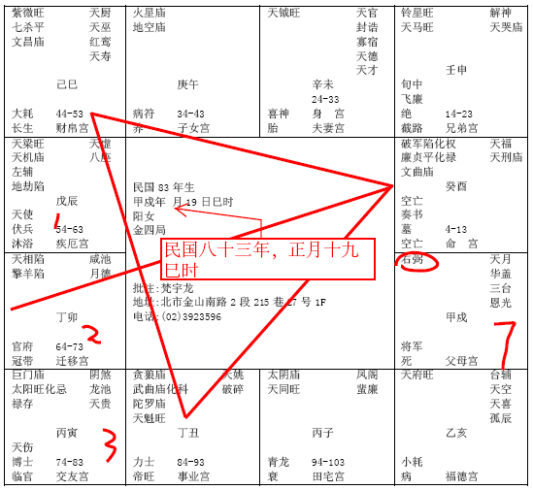

#### 案例10

前面还有介绍给你们一个案例，83年这个案例：

我忘了提醒一下，这也是关系到夫妻的事情。刚刚讲这个案例，福德宫在下面，对不对，右下角天府星是不是。

如果是命宫在这里呢，很多人命宫在这里哦，命宫在这里，夫妻宫就是廉破，看到没有。变成他的命宫是天府，对面是紫薇七杀，他夫妻宫是廉破，那种，我刚才讲的换过来那种八字的格哦，就叫做夫妻死别的格。

那本人批过不止三十个。现在也有一两个在我手上，我让他赶快去化解掉。那前面的来找我批的，都是已经死了才来找我，有的太太是开刀死的，有的跳河死的，反正都是死掉了。

所以夫妻宫如果遇到了廉破，这种杀星进来的话，都是主夫妻死别。
