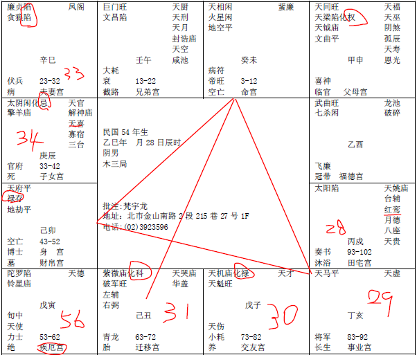

#### 案例11

诸位注意看：

诸位注意看，命里面哦，你先不要看他什么宫，不要看他什么星什么星，我们一般算命，第一个要看科权禄忌。四化星，这个命什么都没有，只有什么，科！怎么样，肯定，我们帮他算命的时候，这种八字呢，叫做因科而禄。靠专科技术专长来赚钱。自由业的人。

这里第一个重点，注意看，身在财帛，他势必一定到私人企业去做事情。有的人，身在官禄宫，他势必会去当官。

这个人势必会去从商，身在财帛的意思。

有的人身在迁移，他势必会去外地。

如果他只是迁移宫，化科，身宫没有在迁移，代表他会到外地去读书，拿到学位，但是工作会回到本地来。

有的人，身宫在迁移宫，他出去外地读书，一去就有去无回了，那诸位以后有机会到美国去的话，把很多中国留学生的八字拿来看，我想大概都是这样子。台湾还比较少，中国肯定是这样子。

那子女啊，你看这个子女宫，一看就知道了，无子！这个你要再批儿子，你就可以回家了，不用学了，这个没有办法。

先说这个疾厄宫，辰宫，胃，这个有没有问题。

还有什么，肺，疾厄宫本身是陀罗杀星进来的时候，这个人势必死在身体的疾病上面，一定是血光啊。
算命上面，有两颗星会开刀的，一个是陀罗，一个是擎羊，两颗星，都会见血光。

那这个八字，好玩在哪里？

第一个，我看看，他是巳年，属蛇，25在未宫这边，26,27,28岁，28岁在戌宫，红鸾星在这里，天喜星在对面。

前面就跟诸位讲过了，这个红鸾星，还有天喜星，正常交会的时候，红鸾、天喜在命宫，或者在夫妻宫，都很好，那这个红鸾星天喜交会在什么，子女宫，25,26,27，28岁那年红鸾星进来，对面是子女宫，即使是化忌哦，他都势必要结婚。

可是一结婚，那个夫妻宫实在太差了，不管男命女命，夫妻宫是这两颗星，廉贞贪狼，或者是廉贞破军啊，廉贞七杀没有关系，廉贞七杀很好，廉贪或廉破，非生离就是死别啊。看到现在就没有例外的。

那如果你的命是照样的话，你要特别小心，很惨，那要赶快去改阳宅，阳宅如果改上去，改不过来的话，就用人间道去改。那如果对方是比较愚劣的人，愚顽的人，或者是蠢，人间道就不要用了。没有用，那你想办法只有一条路，赶快脱离苦海。

异曲同工之妙的是朋友宫，朋友宫化禄，只要朋友宫化禄的话，合伙一定大利。这个人很会做人。

那第一个，这个人婚姻28岁，一年就离婚了，离婚了以后，这个亥宫29岁就会离婚，30子宫，31丑宫，32寅宫，33卯宫，34岁辰宫，34岁呢怎么样，红鸾星又进来了，因为刚好34岁这个红鸾星入子女宫，还是会再结婚，那逢到化忌，只是说逢到的太太也是二婚的。

所以一个男人的命，如果是太阴星化忌，一个是婆媳不和，娶回来的媳妇一定跟妈妈处不来，还有，太太本身有二婚的。太阴星化忌，都是照样解释。

那这个人哦，过去我们算命，这种八字，过去那种算命先生，拿到这种八字，如果来合八字，合婚，你看算命先生怎么讲，八字拿起来，做妈妈的，或者是做丈母娘的，为了挑一个好女婿啊，就去合婚，合婚一看，这个算命先生跟丈母娘讲，你这个女儿，不要嫁给他，这叫做克妻命，谁嫁给他谁倒霉，这个人什么时候结婚比较好，43岁以后他不克妻了，42岁以前统统克妻，你看，都是灾星嘛，这就是按命的形上批的。并没有错哦，错在哪里，他把克误解了，懂不懂。误解了这个克，就对人产生了批判，其实这个克不是说生命克死那个意思。

这个克是感情好，那可能源于他太重感情了，可是妻不贤，两个人还是散掉了，没有办法，像天相入命的人，很好啊，对宫化科，又会读书的，怎么会不好呢，那个财帛宫又是禄存星，善于理财，鼻孔都看不到，诸位到哪里去找这样的铁公鸡啊，对不对。

那这种人也很可怜，为什么，陀罗星进来疾厄宫，大限就进来了。

我们命格上面，单星独守，羊陀火铃空劫，单星独守那个十年大运的时候，你不要管未来十年，那只是一种算死限的方法，你一颗星守在命里面的时候，那颗星就很凶了。我讲过，杀星一定要有吉星来化解才行，这个本宫没有吉星，对面不用看他了，本宫没有吉星，53-62就有大限。

那陀罗星在疾厄宫，疾厄宫呢，我们不要把它当成宫看，把它当成星看，53-62值守的太岁是疾厄，53-62影响他最大的就是疾厄。

那他33-42影响他最大的是红鸾婚姻，太阴妈妈，太太影响最大。

那43-52事业会最好，影响他最大的是财帛。

53-62影响最大的是疾厄。

会不会看这个，这是大限，这个陀罗星进来就是大限。

那你看流年呢，未宫49,50申，51酉，52戌，53亥，54子，55丑，56寅，56岁是不是刚好落同宫，所以56岁大小二限逢到，我们算寿限有很多种方法，这是一种。懂不懂我的意思。

那你现在陀罗你就会了，擎羊你就不会了，天空地劫你就不会了？不行，还有火星铃星。

这是一种限。

然后，所有的星，其他的星都可以解厄制化，唯有一颗星，诸位要注意，这个天府星很特异哦。所有的吉星里面，只有天府星不能解厄制化。所以很多人的流年逢到天府星，就死掉了。所以天府星不能解厄制化的。

所以天府星在我们八字上来说的话，他是一个库星，府库嘛。就是会聚财，那这个人本来就有禄存，很会赚钱，聚财你看看，但是这个不能解厄制化，所以，即使这个天府星落到疾厄宫这里，这个陀罗还是照杀还是照杀，反而一定会杀，为什么，吉处藏凶！

所以我看到吉处藏凶的时候，往往他发生的凶事，致命的大限，都是他参加好好的宴会，或者去郊游啊，旅行啊，或者是很好的事情去的。

那还有的天府星落陷的人，年龄大了也死掉，为什么，因为我去做体检，身体很好啊，我今天八九十岁，本来什么病都没有了，对不对，子女很孝顺我啊，叫爸爸常常去医院检查身体好不好，不去检还好，结果去医院感染出来一堆毛病，因为年龄大的人，体弱抵抗力弱嘛，医院病毒最多的就在医院，结果当时检查出来，报告没有，然后检查完了，在家里不舒服了，对不对，然后什么伤害感染等等都来了，就是你的孝顺想办法让他死得快。

所以，一般来说，我们批这种八字的时候，我们看他的重点，就是婚姻，跟疾厄，其他的没有什么。

那如果要改他，像他来找我们，是30岁，如果要改他，像25,26,27,28,29,30，那之前的事情是不是已经发生了，来不及了，对不对，之后的事情告诉他，我教你们看之后的事情。

第一个，他没有子女，需要改变他的婚姻，不是很难的事情。

如果今年30岁，帮他改，他明年31岁，本身是化科，哦，今年他来找我们，30岁在子宫这里，他今年值令的太岁星，值令的流年是什么，是朋友，所以他第一个问题，他就会问你，哎，倪先生请问你，我今天跟朋友合伙好不好，好！赚钱！那我今年有参加考试好不好？不好，明年最好。这个会看吗。那我的婚姻现在不好，那我要什么时候结婚比较好？先生，如果按照你的命算，你还会再结婚，结婚还是凶，这里有AB两种，很多人哦，被我改了A，B就没有改。

就是婚前的时候，他听我的。他本来没有婚姻，结果我们帮他改了以后，他结婚了，一结婚喜事一冲，头脑就忘掉了，他忘掉了婚后要回去住西北。结果我帮了他忙，还害了他。

如果这个男孩子，30岁来找我们，我们改住东宫，会进入31岁，为什么，因为他前面还是会有婚姻的问题，感情很重，那这个人，天相星入命的男孩子，一定长得瘦瘦高高的，对面 又化科，文采又好，人又长得很帅，女朋友很多，结婚随时可以，那如果我们今年30岁改东宫的时候，一改，他刚好一年，刚好31岁结婚，就不按照命走了，按照运走了。

31岁一结婚，太太进来是紫薇破军化科，你可以跟他说，你太太跟你同行的人，想法都相同，也是瘦瘦高高的，也是专科技术专长，将来在事业上帮助很大，可是先生你一定要记得哦，我帮你改了，31岁会结婚，可是你婚后一定要去住西北，如果没有住西北的话，就按照命走了，按照命走的话，32寅，33卯，34辰，结果34岁又离婚掉了，很多人是这样子啊。婚前注意到了，婚后就忘掉了，所以你要一再提醒他，才可以。

这个有没有问题。

相上面来看的时候，上停，额头，眉毛，眼睛，鼻子，从这一段，鼻子这一段，如果上停，这是中停，如果上停、中停比较长，下巴比较短，这是正常。

最好的相，是三停相等，上上等的相。

如果下停太短，这个人的下巴呢，怎么搞得，这边很长，下巴只有一点点，下停太短了，晚年不好，限在就在这个时候。

他的限就在这个时候，53-62。就是晚年寿命会比较短。

像这个八字，相上面，和命上面，一看疾厄宫我们就知道，他一定是健康有问题。

有的人是车祸死掉，像刚才讲的廉贞破军在这里，像这种廉贞贪狼，都是横祸，灾星，那本身他自己是病灾而亡，因为病灾而亡。

有没有疑问？这里面，如果要批过去，诸位我教你怎么批，因为过去的东西很多。客户会让你批过去，批过去不难，因为过去有很多东西，你帮他算命，给他批重点就好了，就是一个最严重的事情。

诸位看哦，我们先不要管他未来如何，他今年30岁啊，在子啊，居然还坐在你面前，有没有，23-32是廉贞贪狼，杀星，后面是化忌，对于23-32岁来说，未来十年没有大运，大限就在前十年，对不对，结果他现在30岁，应该在29岁就买单了，对不对，29岁那年，是不是廉破对冲过来，有没有，最凶！那以灾星来说，这里是天马星，对面是廉贞贪狼落陷，像这种一定是凶事、横祸。哎，他怎么还坐在你面前呢。那你就告诉他，你不要说他死了，人家还坐你面前，不能睁眼说瞎话，你说先生你去年有大意外大横祸，你讲完了，他一听就吓一跳了，这是一个重点。

还有呢，13-22岁，这段时间，巨门星进来，在读书这段时间，逢到巨门，文昌星也有，但是逢到巨门，不管巨门星是入庙，还是落陷，都代表是非很多，所以他在读国中高中期间交友一定不慎，常常进出警察局，如果落陷的话，就是常常进出牢狱。就出来了。

所以我们算命看到巨门的时候，落陷是在牢里面，入庙的话，是是非纠纷。在13-22这段时间中间。

你如果巨门是晚来，43-52来巨门，然后你的命宫又是化科，像这种化科的，那你当老师的话，那你会干到校长，如果是巨门星入庙，对不对。那如果你当老师，巨门星入陷，老师也会坐牢嘛。对啊，很多校长收回扣去坐牢啊。

这就是我们八字上的加减。

那你们知不知道，这个人一来，一看，哎，你坐过牢，你怎么知道，但是有人在的时候，不要讲啊，他一个人到我面前，我说哎你坐过牢，他一听会吓一跳啊，他说那我怎么办，你听我的话就不会坐牢啊，这样他才会听啊。听懂我的意思吧。

坐过牢的人呢：

第一个，印堂啊，有黑点；

第二个，目带凶光，目露凶光；

人啊，印堂这边，中间这块，上面这块东西，发红赤的时候，代表犯到官符，正在进行中。

那整个印黑黑的，好像早上起来没有洗过脸，是坐在牢中。

从牢房出来的人，那个晦暗的气色没有，但是黑点还在那个地方。

目露兇光，这个兇光呢，和这个凶不一样哦。

出来好像每个人都欠我五百万一样，男女都不好。

女人有这种目露兇光，背后老喜欢指指点点，背后讲人家坏话的人。

这兇呢，不是那个凶，是目白，珠小，眼睛张开来，很大，珠子很小。眼睛睁的特别大，坐过牢。这种都是坐过牢狱之灾。

你知道为什么？因为他坐在牢房里面，旁边都是坏人啊，他会求自保，对不对，他就必须很凶啊，日久就成习惯了，然后出来以后，他以为还在牢房里面，还在防人，懂不懂我的意思，就是相还在那边。

上次我就碰到一个，为什么我们要知道这个，这个预教于众哦，妈妈带个儿子来，我一看，哎，你刚出来啊，他哆嗦一下，你不听我的话还会进去哦，把他吓死了，他说我不要再进去了，那很简单，听你妈妈的就不会再进去，他妈妈就说你看吧，就是你不听我的才进去。你这样连起来了没有。

你们也会读图，很简单嘛，哪个妈妈愿意儿子去坐牢的。我家开杂货店，我家儿子来帮我经营，送送货，他就是不听，去交朋友交了一大堆酒色财气的朋友，然后后来就去坐牢了。对不对？这是牢狱之灾。

那你不要看错了哦，人家印堂这边还是红赤的，你就说你在坐牢，人家站在你面前，红赤代表官司正在进行。

那到山根这里红赤的话，痔疮，不要乱讲啊，你把这个痔疮讲成牢狱之灾，不好。