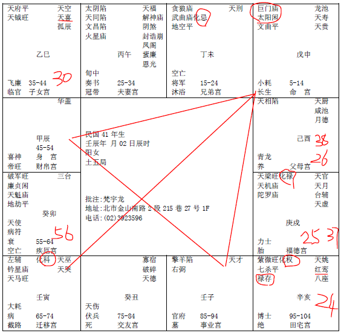

#### 案例13

我们批八字的时候，科权禄忌要先圈起来。

像这个命的人，诸位看，看六亲，看兄弟和父母。兄弟宫化忌，父母宫是吉星落陷，对面是廉贞破军，有没有，这种八字就叫做六亲不靠，靠不了六亲。有的人兄弟很强，父母很旺。可是靠不了六亲，灾星都在六亲方面，所以她要辛苦独立成家。

这种命的女孩子呢，也是巨门太阳，看到没有，诸位只要看到这种，就可以把她批为偏房命了，你说老师怎么你老师喜欢批偏房命，那正房很好都不用批了嘛。

那告诉诸位重点是：

第一个，命里面，三方四正什么都没有，只有一个化科进来，看到没有，四化星来说，只有化科进来。像这种人，她有几种，自由业，医师律师会计师建筑师，还有呢，老师，老师也是化科。所以这个一定是有专业技术专长，才艺出众的一种人。

那像这个兄弟宫有化忌的话，这里还特别要注意这里有一个天刑，天刑代表是非官司刑克，有两个解释。

第一个，兄弟宫化忌代表夭折，兄弟夭折可以从眉毛里看出来，一个人左边的眉毛呢，代表兄弟，右边的眉毛代表姐妹，眉毛中间有痣，在相上面，叫做草里藏珠，是兄弟大贵，贵格。

那有痣露在外面，没有藏在眉毛里，那就主兄弟夭折。

还有呢，眉毛断掉了，断眉，兄弟有夭折。

那种乱眉，长得乱七八糟，扭来扭曲去的，兄弟有刑克，有牢狱之灾，他为他兄弟担心烦恼，一天到晚打官司坐牢怎么办，就会有这种现象出现，反之，到姐妹这边来，右边的就变成姐妹。

像这个八字，父母宫是廉破，也代表父母亲离散。

诸位看，命里是太阳，读图啊，她的命跟太阳走得近，第一个脸孔比较像爸爸，第二个跟太阴星走的比较远，中午出月亮，所以会先不见妈妈，再不见爸爸，先母后父，跟着父亲，看的很清楚。

那这个官禄宫，是擎羊星，灾星进来，所以这个人从事公务人员不会，但是从事教职很好，就是教学教书。

我们研究命理，特别要注意，有一个天道，就是说，遇到流年不好的时候，如果你在当官或者是做事情，遇到流年不好怎么办，没有关系，读书最好。

我们李**就是在42岁发现，当官时候官运不好嘛，我去读书，47岁拿到博士，今天才会干总统哦。所以他有两个大优点，第一个，始终如一，从个最小的公务员干到今天最大，他从来没有换过，所以今天干到总统，这是第一个优点。第二个，他想通了，流年不好我去读书，君子进德修业，所以你以为读书没有进步，你错了，他读书才是真正的进步，他当年没有这个动作今年不可能干总统了，这句话就讲完了。对啊，把你名字取得再好也没有用啊。

这个命里面，你看红鸾天喜星在这边，天喜在巳，红鸾在亥，一定是对宫。那第一个，她的流年，25岁在戌宫这边，女孩子是逆转，25,26,27,28,29,30岁到巳宫，30岁会有婚姻。你说老师啊，她35-44岁天喜红鸾来会啊，这是第二次哦，不是第一次啊。第二次婚姻哦。

所以说，我们批女孩子的命，福德宫很重要，现在她的福德宫很好，如果福德宫不好的话，第二次婚姻都很难。福德宫很好的话，第一次会结婚，那逢到流年，吉星来会的时候，大小流年，30岁进来天喜红鸾星就会动。

如果在忌，化忌之前，比如说25,26,27,27岁她有会到太阳啊，可是没有过忌，没有过忌的话，婚事不成哦。不容易成功。等会我会举例给你们看，很好玩哦，他还没有过忌，他就去结婚，订婚，订婚了才发现她的未婚夫是已经结婚了的，还没有离，你说累不累哦。就会发生一些事情让她想结婚，对，你是想法很好，想法跟事实不见得是一样的哦，造成这样，到30岁会结婚。所以一定是过忌，过忌以后，第一个红鸾天喜星就会结婚，一结婚以后，她这个命，本宫这样，她的命本来就是主偏房命。我告诉你，很奇怪哦，所以我说诸位算命哦特别要注意这个格，其他的很简单，像这种命你会看了，其他的太简单了，男女是同格，就好像我们中医在看病一样，男女的病都一样就女孩子多了一个妇科，我现在讲妇科，其他都正常就好了嘛。

那她是38岁那年，流年在酉，这一年来找我们的，这个在38岁先生死掉，过世啊，死掉了，38岁先生走，夫妻是死别，这个，好玩在哪里，死别之后呢，38岁夫妻死别，她看那个房子是伤心地。死别前她怎么住的？夫妻住西南这里，西北角是厨房，死别以后呢，换了，西北是主卧房，西南是厨房：

还没有出事之前，住这里哦：

像这种廉贞破军在卯宫，都是水里面做坟墓啊。（流年逢到对宫的廉贞破军）
所以我常常讲，一个女孩子的命里，太阳代表三个人，代表爸爸丈夫儿子，所以她38岁，这里是父母宫，爸爸不在了，也等于是进入夫妻，懂我的意思吗，那跟她同时间生的人很多，有的不会有事，有的会有事，为什么，决定在阳宅上面。

所以一个阳宅住进去的时候，快的话，三年，三六的数，慢到第六年，一定会成灾，灾的呈现马上就开始了，第三年就开始。所以她住这个房子，到第三年，她先生就走了。三年过去没事，第六年就第二个灾。所以她住的第一个宅很凶。

那她先生死掉了，她很伤心，她就另外找一个房子，就变成这样子了，为什么之前不找，之后来找，那之后再住这个房子的时候，本来她的命上面，35-44，事情过去了以后，你看，42岁是不是还有天喜红鸾星来会，可是她就去住在这个位置上了，就不会了，懂不懂，就不会结婚了。

所以说，这种命是偏房的人，除了我刚才所讲的行为个性，这个她的个性就很好，没有像刚才那个那么拗，对，然后她就这样做，害自己变偏房，因为她住西南方，思想会超越年龄很多，然后变成责任感很重，念头就变成婚姻看的不是很重，我可以就是爸爸，母兼父职嘛，我就带孩子就好了，好了，结束了，她就变成这样子，所以一个人的想法会改变她的做法，做法会改变她的命。

这里跟诸位讲这些，就是我们改位置，就是要改一个念，一个念而已，一念之间。

还有，诸位看她的大限。55-64，这十年是廉贞破军这些灾星，大限！49,50,51,52,53,54,55,56，56岁在卯，诸位注意到，55-64这十年在疾厄宫上面，反过来，这十年中间，值年的值日星就是讲的是他的疾厄，他的身体一定会很差很差，病痛。那进入小限56岁，同时会到疾厄宫，身体方面大限55-64逢到疾厄，小限56岁又会到疾厄，疾厄上面来说，是大小二限逢，那廉破的话，这就是死啊。水里做坟墓，就是死掉了。56岁。

那我们讲女孩子，如果你的妈妈，家里的长辈，长辈身体要好，有三个卦可以让他身体好，泰卦，坤为地，地风升，也就是正西北泰卦，正西南坤为地和正东南地风升，妈妈住在这三个位置上。你说妈妈你住南边好了，地火明夷卦，本来还没那么快死呢，你住进去死的更快。这是我们化解的方式。

所以，我们在改宅的时候，要特别注意哦。改阳宅的时候，要特别小心。当然这个升卦我们还没有讲，但是诸位已经大概了解了。