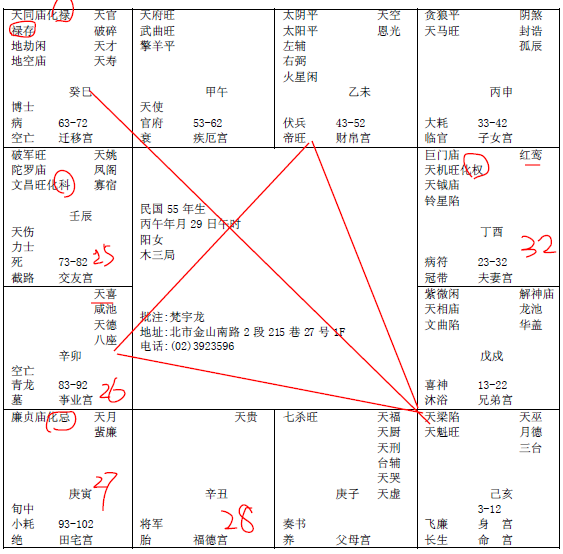

#### 案例14

诸位看这个命，
 
民国55年，81年算的，刚好流年27岁，像这个是午年，属马的，马年刚好在辰这里，25岁在这里，26,27,27岁流年在寅宫，现在算这个流年有没有问题，27岁她化忌。

诸位看，23-32岁她的大运里面就有红鸾天喜星，看到没有，所以这个女孩子，在23-32岁这段期间，除了化权，除了事业以外，她的红鸾星影响她很大。好，结果她刚好，今年27岁她来找你，好，我们在算命的时候常常会发现到一件事情，她会跑来算，都是流年不好的时候跑来算的，那流年化权啊升官发财的时候，都不会找你来算的，那个化忌的都来了，所以进来一看，化忌！化忌在印堂上，红红的很多，就是口舌是非很多，再一看，是廉贞化忌，她是逢到桃花星化忌，结果她就是去结婚，结果订婚了啊，订婚了才发现先生的婚姻还没解决还没离婚，不能结婚，停在那边，这是化忌！

所以我们给人家算命，一再说，要过忌，过忌的婚才是吉的！才最好。

像这个八字的父母宫，我们要批这个八字的父母，要跟批命是一样的，比如说，紫薇七杀，武官星在父母宫，就代表爸爸从事武职的，你的命是武官代表你从事武职，你的兄弟是武官代表你的兄弟是武职，你的父母宫是武官星就是他从事武职，对不对，父母亲是武官的。

那像这种命的人，我们批的时候，我们要批的重点，你看：迁移宫是化禄，所以这种八字是外地大利。到外地去经商的一种人。那什么时候会去，一会我们来看流年。

那官禄宫是空的，所以她的命里没有官带，所以官带不进来，她不会去当官。

那这个女孩子呢，早年的时候，命里有天魁星，意味着她小时候科甲很旺，读书读的很好，13-22岁，文曲星进来，对面是化科，代表说她的科甲升迁，考高中，考大学都没有问题，这是读书星出来是是时候。

23-32岁，因为她命中没有官带，所以23-32岁她会到私人公司去做事，然后掌权，去做主管，受到人家重用哦。

然后33岁以后呢，天马星动了，一种是到外地去发展。一个是外调出去，她换到别的地方去了，原因是什么，婚姻不顺啊，她没有脸啊，不好意思啊，化忌在对面。

所以说，我们要批这个大运的时候要特别注意，33-42岁本来她这十年是贪狼跟天马，像这种武官星逢到天马，是武贵，非常好，你不要说不好，在事业上很好哦，这个天马星逢武官，逢调动换动就会升迁，这是第一个。

第二个，天马星动的时候，她离开国内到外地去做事业当老板，在本地肯定不会。

如果谈到感情方面呢，很复杂啊，了解吧，贪狼就变成是桃花星啊，结果对面是化忌，婚事都不会成，那这是算命，我们知道她婚姻不成。

那我们再看看她的阳宅，一看她住西北角，啊，就知道她为什么不成。

第一不成是糊里糊涂的，她去住西北角的人就会遇到这种事情，懂不懂，她就喜欢结过婚的男人，然后看到结过婚的男人她就特别喜欢。那反过来，她喜欢这个男人，这个男人跟她说他没有结婚，她也相信，她也喜欢，她喜欢的都是结过婚的男人，结果当时在一起不知道，等订婚了才知道这个男的结过婚现在还没有离婚，所以这种眼睛看不清楚。

然后到33-42，她的红鸾星不会动，为什么，因为她一直住西北角啊。如果没有改的话，她就一直喜欢这样子，然后都不会有成就。

所以如果过了32岁，如果没有让她红鸾星动的话，她红鸾星就不会动了。

那好命的人呢，到43-52这种还会动红鸾，下面的那个就是啊。娶了三个老婆，真厉害。

那这个女孩子比较可怜，过了32，到了33-42，那是化忌，不可能有红鸾星，那十年化忌嘛，红鸾星就没有，所以婚姻非常不好，事业很好的一个人。

像这种女孩子呢，因为她比较少接近男人，所以说从相上面也可以看到，因为一个人寡居太久，人就会变了，除非有修佛法，有心理上的依靠，不然的话，人真的会变，眼睛的杀气会比较重，凶光啊，然后变得脸会越来越大，相会改变。

像这个八字，诸位注意看，她的兄弟，兄弟是紫薇天相，是吉星，代表兄弟得利，再注意看她的眉毛，眉毛细细长长的，兄弟姐妹大利合伙，大利做事业。

如果她在本地，倪先生我不想到外地去做生意，本地的话，她会和兄弟姐妹合伙。那她不会从事父母亲的职业，因为她是文，对不对，她的父母亲是武，她不会承袭祖业。

还有一个重点要注意的，像田宅宫化忌在寅这里，重点提出来，一般来说，田宅宫化忌，相书上写住破祖业，就是会把父母亲的财产，耗出去。那么人间道来说的话，代表她不会识人，不会防人，所以她可能会拿不动产去帮她相信的人作保，然后发生这些事情。

会破祖业，那我们在相上面可以看到，鼻孔很大，老远就看到鼻孔是这样子，鼻如灶门，要破祖业。所以你看这个人在你面前鼻孔这样对着你，意思就是破祖业就是我了。她不认为她会，因为她不戒，不知道戒。所以鼻孔很大，如果你是父母亲，财产很多，生个小孩怎么鼻孔对着你，这个财产最好不要挂他的名字，换人比较好，要防一下。不然会耗财出去很大。

那我们还有一个地方要帮她改的，我刚才讲，如果32岁以前不让她结婚的话，她就接不了婚了，所以她33岁来找我们的话，是她的命哦，32岁以前来找我们，是她的运哦。所以她27岁来找我们，太好了，知不知道。

第一个，第一次婚姻要舍掉。你如果说小姐你稍微等一下给这个男的一个机会，这是愚善，人家刚开始就在骗你的，懂不懂我的意思，你后面还给他机会啊，他不骗你你怎么会跟他订婚呢，对不对，已经骗你了，你还在给他机会。很多太太十之八九都是这样子，蠢得要死，害的别人来问导致两个人一起蠢，两只虫嘛。所以遇到这种情形，马上要她当机立断，舍掉。舍掉以后，西北角不要住了，她会遇到这种人，跟她的运有关系，马上住到东南角去。

那如果你寅宫这年改，第二年丑年没有星，如果我们31岁在戌宫去改，32岁那年让她红鸾星动，是不是很好，32岁如果她能够结婚的话，她的先生是巨门化权，会到化禄，这就是从商的，先生是做生意的。因为我们知道这个八字会做生意，我们让她嫁一个做生意的人，刚好门当户对。你如果让她嫁一个紫薇天相文曲，是做官的，如果我们让他30岁改，到31岁结婚，让她嫁一个紫薇天相这种先生的话，33-42变成夫妻聚少散多，天马星就变了，变成聚少散多，所以让她嫁个同行最好。