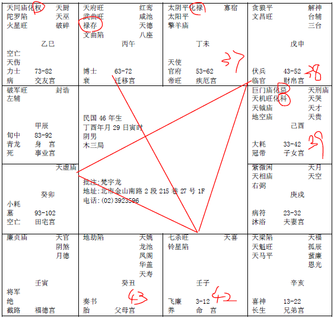

#### 案例16

诸位来看民国46年这个：
 
这个呢，83年，今年虚岁多少岁，38岁，为什么要提这个给你，注意看，他酉这里大运33-42，巨门星就已经是是非口舌官司了，旁边又一个天刑，天刑也是打官司，然后化忌又在这边，灾星太多了。
我们为什么要算命哦，前面给诸位介绍过，君子事天，小人事人，天就是说，有事情发生，有消息，有盈亏，我们可以看到，如果这位先生，他是两岁三岁，十几岁来找你算命的，一看到他在33-42岁有官司是非牢狱之灾，再一看这个人七杀临身，代表这个人很刚强，个性很强，可能会在大怒之下犯下不可弥补的过失，一开始是这个妈妈带儿子来的，太好了，将来让你这个儿子呢，去当军人警察，为什么，这个武官星嘛，他的个性很强，你让他去当军人警察，你这个家管不住他的，那你说我舍不得啊，好，没关系，象是一样的哦，你舍不得没有关系，到了33-42岁这段时间，你儿子去坐牢，也是给国家管，我教你早点给管家管嘛，你偏偏非要到这个时候交给国家管了，不一样哦，所以，在易经上面看的时候，你知道牢里牢外是一样的哦，你被关在里面，和站在外面，在易经上是一样的哦。知道我的意思，所以这种人的命，只是一念之间而已。
所以这个人来找我，38岁，你看看，33-42，我们往往人开始算命的时候，都是事情发生以后再去看，这就叫做事人。就是小人嘛，不管这个人好坏，只要他对我有利，我就跟着他就对了，这就是事人，君子是事天，天就是天象，一个事情发生之前有一些预兆，我们可以看到，对不对。
像这个小孩子，命一到我们手上，哎，你这个小孩子，脾气很犟，如果小的时候来算，爸爸妈妈一定问个性，个性那么强的，没办法管到，那我们人间道就告诉他，哎你去让他归国家管，因为象是一样的。
好，结果到我们这里来已经38岁了，诸位看他是属鸡的，未宫这里37岁，今年38岁，在申，进入这个大运。
阳宅的部分呢，他住的阳宅，我画中间好了，东南西北，厨房在西北角，
 
主卧在西南方，这个人，娶的太太非常好，紫薇天相，太太好的时候，这个并没有说太太好就不会有牢狱之灾，坐牢，两回事，命里面太太非常的好，所以非常的贤良，他们住西南角，他太太睡西南角，代表太太会正她的名，一个人在运的立场，她自己不知道，客户不知道哦，他没有经过我们的指点，她的名字叫妻子，住妻子的位置，名等于位，反过来，当她的位置住对了以后，她就会用她的名字来做事业当老板，所以呢，阳宅上面来看的时候，名等于位，这是家和。位等于名，这是万事兴。住谁的位置用谁的名字来做生意当老板，万事兴，你是什么名字住什么位置，会家和。所以我们所谓的真理，就是正反两面看，都是对的。你不能正面看是对的，背面看就不对。就不是真理了。所以我们人也是一样，怎么搞的，你怎么正面讲这个话，怎么背面讲不是那个话呢。表里不一致也不对。人要里外都一样比较好。
所以他这个流年来找我们，一定是犯到牢狱，牢狱之灾，杀在命宫，一定是严重的伤害，如果是属于窃灾，不是这样子的，属窃是杀星落陷，比如说命是擎羊陀罗落陷，或者是廉贞贪狼落陷，看不到，小偷偷窃，那他是犯刑事，伤人，他的刑会判到42岁为止，我们看流年先以十年大运为主，到42岁，那43岁开始进入这个申，43-52，贪狼文昌，代表说很辛苦啊，孤单啊，他没有办法，因为他有前科，有记录啊，一直要到53-62，他化禄，63-72，他晚年会很好，晚运会很好，可是他33-42这十年，做错事情，影响到他后面，影响到43-52这十年，这十年让他很辛苦，为什么因为他有前科，所以这一念之差，被害了。
如果他做武官呢，小的时候，我们让他从事武职，23-32进入紫薇天相，一般来说，你的流年上面，当官的人，官命的人，或者在学校当老师，都一样，当你的流年逢到紫薇星进来的时候，就代表说你会近天子，靠近天子，所以说，比如说你43-52岁，你是紫薇星进来，你会位列三台，进入天子的身边，那如果你是当官的话，23-32，你当警察或者军人，一出来就到了很高的将官旁边，一直在旁边当兵，然后33-42岁，流年不好的时候，我们有是非口舌官司流年的时候，流年不好的时候，我们去读书，有没有，所以李登辉也有流年不好，不好就跑到外面去读书嘛，人家42岁去，你33岁去算什么嘛，对不对，你如果不听的话，你关到42岁出来。如果你听了，就变成你42岁，拿到学位，出来了。你关在学校里读书，关的象是一样的嘛。所以我们要先让象出现，进入自修的阶段，一读书就可以解灾，所以我们算命一个大原则就是，不管他的流年怎么样，只要遇到坏的流年，进德修业，当你进德修业，遇到好的流年的时候，利建侯，就是你可以出来，见龙在田，到处去广结善缘，建立你的社会背景，这都马上就改变了，这就是我们事天的原理，还没有开始，我们就知道了。
所以他的命宫有灾星，有天喜红鸾星，娶的太太很好，太太娶的再好，还是不能解这个灾。
这个命里面，父母宫是空的，这个地劫啊，代表没有祖业，我讲过，如果父母宫是禄星，或者命宫是禄星，他的祖业就很大。
在相上面，怎么看这个人有祖业，你看那个头，哇，两边，凸起来，山林的地方，两边凸出来，非常饱满，
 
祖业就很大，相上面就可以看到。
看流年，37,38,39,40,41,42岁，43岁，诸位这里还有一个要注意的，一颗孤星独守，这个地劫除了指父母以外，这颗星代表他43岁的时候，有一劫，诸位记得，一颗单星独守，不管这颗星是陀罗擎羊火铃空劫，六煞星一星独守的时候，这是凶灾，所以这个人祸不单行，这个灾出完了，又出车祸，可能当时的交通景况不太一样，祸不单行啊。所以后面会介绍到坎卦，坎为水，两个重卦，我们易经有8个纯卦，意思就是说，你这个险出现的时候，随时要提险，如果处理不当，第二个险马上跟着而来。所以人家常常会发现祸不单行啊。
所以一个爸爸出事了，车祸在医院里面，结果医院打电话到家里面，那家里很急，打电话通知儿子，通知媳妇，结果儿子媳妇赶到医院的路上又出事，这是祸不单行，所以后面我们会介绍以易经，我们要提险。如何出险，处在险局中如何脱险。
像这个就是祸不单行啊。所以你跟他说，对不起，您出来的时候，还有事情，还没有解决哦。这个倒霉运要走到这个时候。