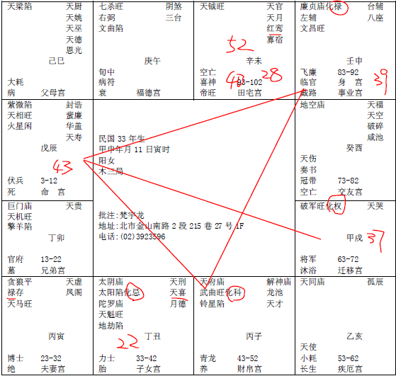
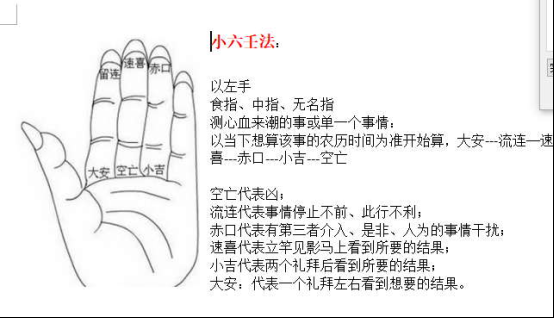

#### 案例17

这个八字，就叫做科权禄三会。我们拿就拿极好的，普通的没什么。

化科在财帛，权在迁移，化禄在官禄，身宫。科权禄全会。

如果这个禄在财帛，科在事业宫，权在对面，或者是权在官禄，都没有关系，那是天子命！

像拿到科权禄三会，我们不要管他，他一定是一方之主啊。所以科权禄的命，很厉害。

好了，这个太太呢，是学校当校长的，这种八字，当老师，一定干校长的，她不会屈居人下，都是一个地方最大的，诸侯的。

你看她43-52，是不是化科，53-62是天同，是官星，63-72是化权。所以她是流年上来决定，如果她的化禄在财帛这边的话，她可能会去做生意。但是她的十年大运有没有，你看十年大运，她禄是不是在后面，所以她比较会走官。之所以会走教育，是因为命中是科权来会，禄也有会到，可是禄并没有会到十年大运，懂不懂，十年大运没有会到。

那这个八字，你看这种女孩子，对不对，太厉害了，厉害归厉害，但上帝并没有规定厉害的婚姻子女就一定好啊，你看看，太阳化忌，在丑宫，我这里提出来，只要女孩子，太阳一入陷地，好累哦。

这个八字拿到我们手上的时候，33年次的，50岁，51了，八字看出来怎么批，无夫无子啊，为什么，已经发生了才来找我们的啊，太阳星陷落在这个地方，第一个，她本身就不会生到儿子，第二个，这段时间，根本就没有先生，然后这个没有先生的原因是红鸾天喜星化忌。所以说前面23-32也是没有结婚，33-42中间也没有结婚，到现在还没有结婚。

很厉害啊，她厉害到哪里，看她的阳宅，哎，她的主卧房间就是主西北角，你看看：

风天小畜卦。哇，很厉害啊。43岁开始化科，科就是声名远播，一方之主了。

十年大运来看，诸位来看这个43-52,37岁在戌这边，女孩子呢，逆转，43年当年就是辰，入到本命宫，刚好紫薇天相，对面是化权，所以她肯定是43岁开始走马上任，当校长。你看她化忌的时候，会不会去当校长，不可能嘛，哪有那么厉害，除非你八字错了。或者你太懂人间道了，这不太可能。

像这种灾，如果隔年，43-52全部是煞星的话，这个33-42是致命的，懂不懂我的意思，如果致命，就致命在孩子、先生身上。就会发生这样子。

那这种命的女孩子，如果是男孩子呢，所以同一个时间生的，男的不一样嘛，为什么，我跟你讲，男女之别哦，生病了，女孩子多个妇科而已。同一个八字，如果你换成一个男的，你把流年改一下就好了，男孩子变成这样转而以，十年呐，刚好反过来，但是小流年还是一样的，男孩子顺的，女孩子逆的，那就变成完全不一样了。

第一个，科权禄还是一样的命啊。读书读得很好。男人批的话，就叫做财官双美格，走到13-22，对面是化科，本宫是七杀，所以他考公家单位，一考一定上啊，然后手有生杀之权，可能是干司法官还是什么。结果33-42呢，本宫对面是化忌，干了半天，火大了，我好心还不得好报，做了半天该轮到我轮不到我，做了半天，老子不干了，不干了，出来43-52开始出来化禄啊。本身有科有权，代表自由业，有没有，名气很大，任何人的命，只要有科进来，名气都会很大，那读书也会读的很好，那43-52化禄了，那么大的财星化禄，对面还禄马交驰，有没有，代表他会自己做事业当老板，一定是自由业的，你看男女就反过来了。

然后自由业做到53岁啊，到52岁，很旺啊，对不对，结果不知道戒盛，我怎么会有问题呢，我看人看的很清楚了，结果53-62，钱都给朋友倒光光了，你知道吗，会不会看。那很多人嗯，如果这是个男孩子，他就刚好会53岁来找你算命的，这个很累的。

如果是早点来找我们，像这种命的人，我们要给她建议什么，你这个人一定要干自由业，自由业同时要化科，什么叫化科，要同时任教，如果你有教学，再去走自由业，相辅相成。比如说，我在学校当教授，当讲师也好，无所谓啊，我去教学，学生就是我的客户，知道不知道，我每天教他们，就是我的客户啊，这是教学相长啊，不但我能进步，我还广结善缘啊。利建侯啊。所以你看外面的名医生律师，或者会计师，他都除了自己的职业以外，自己还在学校任教，这都很有名，不要放弃这个，薪水再少也要去，无所谓啊，这就是科的意思。

那至于说十年大运转换，没错，子女还是一样哦，但夫妻不一样，你不要说他没有太太啊，不会啊，夫妻不一样，太太是太阴啊。

那这个如果给男孩子，这个太阳化忌，代表爸爸要早逝。然后他的太太呢，很彪悍，很凶悍，太太她家里很有钱，禄马交驰，太太家里很有钱，长得很漂亮，个性很刚强，很固执，还有太阴化忌，还有婆媳不和的现象，只要化忌，都会有这种现象。

所以说，如果是男人的话，我们唯一要担心的，就是男孩子是逆转，37,38,39,40岁那年，刚好33-42是化忌，当年天喜红鸾星来会到，像这一年，男孩子刚好反过来，34岁在未，也在33-42中间，可是34岁有天钺，红鸾，所以他夫妻有争执，但是还有贵人来解，还不至于，有长辈在旁边，不好意思，而到了40岁的时候，进入这个化忌的时候，那婚姻就会有问题，所以他的婚姻有问题会在40岁那一年，这是一个我们要注意的事情。当然这些统统可以靠阳宅来解。

我要跟诸位提几个重要的重点。看一个八字，我们要怎么看。

接下来，介绍下面的八字之前呢，因为最近发生空难，我要教诸位出门平安保生命的方法，学不会的话以后你就跟着我出国好了。然后我就骂你，我会倒霉是因为你在旁边。本来很好。

六壬法。我们指算法，掐指一算，六壬法。以前诸葛亮出兵打仗，掐指一算看看是不是好日子，会不会有事情，对不对，我们有六壬六丁六甲，这个手指头呢，食指，中指，无名指，看左手，这个宫，叫寅宫，寅宫起月令，教诸位如何去记：小，空，大，流，速，赤，那原来的名字呢，小吉、空亡，大安，流连，速喜，赤口。

这个东西，在黄历上有，可是他们没有用到神，你一个念错了，就毁了，你就看到形了，没有看到神了。

我们人啊，在心血来潮的时候，哎，今天眼睛怎么一直在跳，或者心慌慌意乱乱的，不知道要发生什么事情。或者是一件事情，犹豫难以决定的时候，或者是此行利不利的时候，或者你在那坐飞机等的时候，是不是死亡班机啊。刚好你眼睛又看不清楚人家的气色啊。

诸位，人死之前，不管你身体健康如何，霉运当头的时候，两个礼拜就看到气色了。我一再跟诸位讲，你看到迁移宫，黑黑的，青青的，要死，那你在机场，看到三个以上，就要走路了，你自己照照自己看，搞不好你也准备跑路啊，宁可不要去嘛，我就不相信你不搭这班飞机，你会死人。

我们从大安开始算，起月令，需要的资料，就是月日时，三个资料就好，重点，用神在哪里呢，重点就是说，当你心血来潮的时候，想用它，就以当时为准。

比如说，我现在有事情了，马上把黄历打开，看看今天农历是几月几号，你不要用国历哦，用农历的，比如说今天农历是4月5号，那现在呢，是戌时7-9点，好，你就从4月开始，大安开始顺时针，1234，然后再从当宫开始走，12345，四月五号了，到流连，然后戌时，子丑寅卯辰巳午为申酉戌，就是落空亡，那就告诉你，凶！此行不利。

你刚刚心血来潮是什么事情，比如说，你刚才心血来潮是你想买股票，凶！空亡，已经告诉你空亡了嘛。你说不行，你要证明我是错的，那你明天去买啊，你就完蛋了。

你不能说，哎老师，那这个时间是空亡，那下个时辰是大安啊，我就下个时间再去想一下，弄个大安好了，但是很好玩啊，到了下个时辰，你就不会去想了哦，忘了，很奇怪！这就是测心血来潮的时候。

所以有时候你想起来，有时候你想不起来，但是算过以后，你不要重复念头去算第二次，一定不对了嘛，反而会害到你自己，为什么，因为你到时候会不知所措啊，了解我的意思吧。

那可以运用到哪个地方呢，比如说，我现在要去跟他签约谈生意，走到办公室门口，哎，心血来潮，看这个会不会成啊，成不成对我影响很大，拿手一算，哎呀，糟糕，是流连，流连代表事情停滞不前啊，此行不利！那你说老师那我要不要过一个时辰再进去，不需要，下次再去。

所以赤口代表有第三者介入。代表 有小人窃财，是非有人为的因素。

速喜是立竿见影，马上看到，我们用在找寻东西，失落东西，或者是找你比较重要的文件，掉钱啊，家里面遭窃啊，都可以。

流连是事情停滞不前。

小吉大概两个礼拜会看到，大安大概一个礼拜左右，

空亡就是你不用看了，你可以断念了。

那你用在一件事上是可以，不要用他来算命哦，这个算不出来，只是单一一件事情，尤其是心血来潮的时候，很准！

那你刚好在机场，你看每个人脸上都是黑黑的，驿马的位置都是黑黑的，我们君子是事天嘛，事先就看到盈亏嘛，事天嘛，小人事人，懂不懂我的意思，这是方法不一样。那你掐指一算，刚好是空亡的时间，那你就要准备跑路了。

那诸位要有一个信念，要用它就要听它的，既然要问，就代表你有疑惑，问了就要听它的啊，问了又不听，易经上怎么说，涉水灭顶，你自己跑到水里面，涉水，不跑出来，你自己被自己害死了，涉水灭顶，很多人是这样子啊。害了半天，害了自己，这个有没有问题，擦掉了啊。