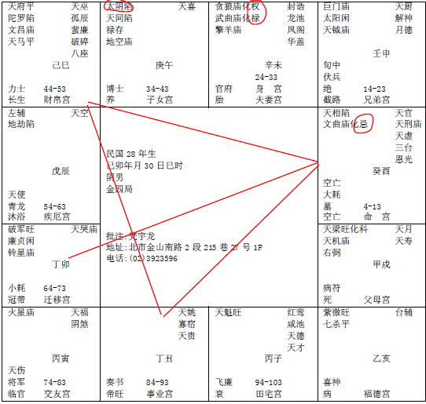

#### 案例18

这一段要给全世界的女人看一下。这个八字哦，脑子要清楚一点。

我讲过，我们事天，事先发现之前我们先去解。

像这个男人的命。你注意看，这个是府相会命，府相会命不是不好，做佐才啊，我去帮你做，领薪水就好了，当你的助手好了，助理，他命都没有会到科权禄，看到没有，天相和天府来会，他偏向到财帛，所以他偏向会到私人企业去做事情。

那你为什么要提这个出来。

第一个重点，你看他的太太，这种权禄重逢，太太能力非常的强，而根据本人的临床经验，往往很强的女孩子，喜欢嫁这种人，因为她有安全感啊，觉得先生能被她掌握到。所以你看那种能力很强，很漂亮的女孩子，找个先生都很丑的，很差啊，为什么，安全感啊！她只为了一个安全感活着，实际上婚前婚后完全不一样。

那有的呢，我看过很多，在婚前的时候，男的对她很好啊，当然把好的一面给你看，你才会嫁给我啊，结婚以后，马上就变了。

那这个八字呢，他在53岁的时候，出事了，我跟诸位讲，54-63岁十年大运是疾厄宫，代表这十年中，值十年的神呢，是疾厄，代表身体，最凶的就是身体，一再讲过，天府，南斗星君这颗星，不能够解厄制化，南斗星君往往发生的事情，就是吉处藏凶，逃都逃不掉，吉处藏凶！

他在53岁的时候，出事了，脑中风啊，中风以后，脑筋有障碍了，从此不能讲话啊，半白痴的样子。可是这种人，好福气啊，有的太太很强的在旁边照顾他啊，那你说对这个太太来说，是好事还是不好呢？也有人说好，一辈子有个人可以去照顾，这是个人的角度而已，但是我们在命上面可以看得很清楚。他太太是为什么嫁给他，而实际上，他太太只是对他而已，他没问题啊，可是他54岁人就没有了啊，等于是照顾一个半身瘫痪的人啊。

然后看这个男人的命，太阴星在午，午时出月亮，反正月亮不亮的，化忌的，都是婆媳不和，你跟你先生合没有用啊，你跟婆媳呢，所以他太太在他34-43之间，他还没有出事之前，忍受了十年的婆媳不和，到了53岁后，还要忍受她先生的中风半身不遂脑子神志不清。

有很多事情，你们在事前都无法预见，所以必须要靠命来预见，所以实际上我们算命是什么，是事天。

那我们在八字里面，人中风瘫痪的时候，有一种宅，叫一侧住人。一个房子，盖起来哦，这边是三个卧房，这边是客厅餐厅厨房，人住在一边，就是一侧住人的房子。

一侧住人的房子，一定要规定在南北向，这边是东西，东边住人，这才叫一侧住人。

如果一个房子，以南北来来讲，两边都有房子，这就不叫一侧住人。是要以南北为轴。

为什么这样子，我们地球有地轴，我们船在水上面，有个龙骨，两边要平稳，对不对。如果你们两个人去划船，都坐船的一边，那不翻船，对不对。所以地轴，一个房子盖在地上面，就好像一条船在水面上一样，他有一个中心轴，所以我们用罗盘去看的时候，我们用中心轴切两边来看。

所以中心轴切两边来看，是看夫妻。如果东西切两半来看，是看生男生女，因为东西切两半，往南边都是女，往北边都是男的。正面切两半，看身体健康的问题。

像这个，厨房在西北角，是伤先生。那如果有的人家是西南方是厨房，是太太中风伤太太。反的，加减，以此类推。一侧住人的房子，不可以住人。好，我们暂停一下。