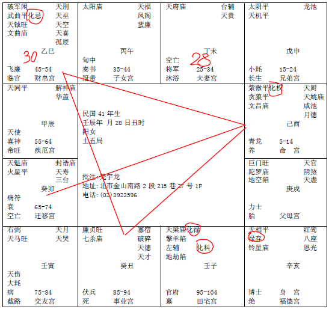

#### 案例19

这个人很好玩，
 
诸位看这个八字哦，这是女孩子，你看她的命，这个紫薇贪狼，杀破狼，都是属于男人的命，女人拿到这种男人的命，武官的命，已经够强了，对不对，再化权坐命，就是要乘2倍的强，加倍的强，个性很固执的强，是全世界的人都要听我的的强，最强的，慈禧太后，这种人的命，你看她的先生，南斗星君天府星，天府星是温和很厚道的星，你知道她发生什么事情，所以说，也是妙！
如果她的红鸾天喜星没有化忌，没事哦，化忌！否则你看她，太阳在午宫，很好，一化忌了以后，就不是这样批了哦。
你看，我读图给你看，这个女人是慈禧太后啊，她先生很厚道很老实啊，实在拿这个太太没办法啊，那刚好，25在戌，28岁走夫妻宫，25-34大运，统统吉星来会啊，她先生人很厚道，一时也看不清楚，好吧，娶了她，一结婚以后，到了30岁巳宫这里，不得了了，化忌啊，化忌来了，女的说，你要离婚，我福德有红鸾星，我不同意，对不对，那个男的是在没有办法，跑路！从此找不到先生了，他就跑掉了。他没办法嘛。所以南斗星君比较温和的星，跑掉了。搞得他们夫妻有名无实，搞到35-44岁，太阳入命，叫做妻兼夫职，这个太阳孤星独守，然后她个性很刚强，出来目有凶光，进来看人都是这样看的，好像每人欠她五百万一样，谁也受不了她，她先生受不了她又不离婚，跑掉了，对啊，要是我，我也跑掉啊，谁也受不了啊。对不对。
可是你看她其他，其他很强啊！可是这个人哦，批的时候要注意，财帛宫是化忌，这种人不会去做事业做生意的，一定是走正官带，事业宫是廉贞七杀，结果我问她你是不是干武官啊，她说对啊，不能说是正式的武官，我是在军方服务，知道吧，这就是命！
可是这个八字，如果给男人，哇，不得了，出将入相哦。所以你看同一个格，同一个时间生的，男女就不一样，所以我跟你们强调，诸位看八字，不要紧张，你是女孩子，你就要有女人的格，你是男人，就要有男人的格，你是男人拿到女人的格也不行，女人拿到男人的格也不好。
当然，小孩先天出来，我们后天可以用运去改，性不要像，就不要被命所绑到。
可是往往都是人被命绑到，你看，这个如果是男人，流年是不是反过来走啊，你看他，一进入25-34，在亥，就逢红鸾星进来，红鸾星遇到化忌的时候，我们要过忌结婚，像25,26，来7,28,29,31,32岁，32岁还在忌，要走到33,34岁，男人的话，变成34岁结婚，过巳宫这个忌，懂不懂我的意思，一定会过这个忌，到未宫，夫妻宫这里34岁，结婚，走完以后，到35-44，是不是化禄啊，化科化禄进来田宅宫的时候，除了代表他的祖业，父母坐巨门，也会有祖业啊，巨门是豪门大宅，有祖业分到以外，代表化科，不管是升职考试，或者是公家单位再深造，都是很好的流年，遇到中午的太阳。
运到45-54，是廉贞七杀，代表一方之主，武官的话，化将！所以说如果是男人，到这里就是将军了，警察的话，干局长，很大。
那55-64，天马星，对面是太阳太阴统统来会，巨门有没有，命在这边，巨日格来会，男人的话，腰金衣紫啊。所以会进入很尊贵的流年。所以男人女人刚好反过来了，你看看。同一个八字，男女不一样啊。一个老公吓死了逃走了，一个老婆好的要死，因为你的留在在这里，夫妻宫还在这里嘛，太太是天府星最好了，很温和很厚道，所以诸位女士们不要太凶，不然的话，什么状况都会出来，你以为管得住啊。他不让你管跑掉了啊，你不离，我不要你嘛，跑掉了，所以女孩子常常不要丢问题给男人哦，你们女孩子容易丢出很多让你做选择，你要听我的还是要和我在一起，那个男的统统不要，因为你把你看的太重要了，一会我们把一个个卦告诉你，要把自我舍掉。
现在很多人都认为她自己太重要的，像女人拿到这种命，很可怕，这种人对家来说会误家，对国来说会误国。