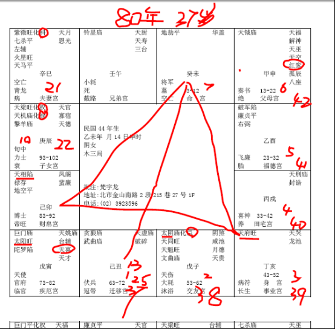

#### 案例2

民国44年次的。

像这个八字哦，我们为什么拿这个例子，就是前面是一位先生的太太。

诸位记得哦，女人的命，这个福德宫非常重要！很多命书上面，对于福德宫的解释不是很好，其实福德宫等于讲的也是夫妻，所以你不要管那个命，福德宫如果很差的时候，那根本就已经不用谈了。

而这个福德宫呢，坐廉破，是水中作冢啊。廉贞七杀呢，半路埋尸；这两个倒是无所谓，最重要的倒是廉破就是一种横祸，一种意外灾，还有主人什么呢，一般廉破主人孤单，所以女人如果拿到这种八字的格的时候，一看到福德宫很差的，心里就要警惕，会有问题、状况发生。

然后，单宫地劫坐命的人，地劫在命宫，先不要管她的命，光是一颗地劫星，如果没有吉星同宫，地劫星就是致命的，她这个好，是好在哪里，是早年来煞。如果这个地劫，同时对面有化忌来冲呢，那就是早年就完了。

所以，第一个，她是3-12岁，早年的时候，比较凶，可能是先天没有祖业，家里人比较辛苦，辛苦成家，那她3-12岁的时候，比如说1岁从丑宫起流年，2岁，3岁，4岁，5岁，6岁，7岁到未宫，我们一个宫可以代表一年，女孩子是逆转，男孩子是顺转，123456，那7岁那年呢，这个小孩子就是地劫在未宫在命宫，7岁那年就有灾。小孩子在七岁以前，有灾的时候，如果有夭折的现象，有两个地方可以看出来：

第一个，善解人意；

第二个，行动如大人。

如果你发现你儿子太好了，善解人意，好聪明啊，太好了，那么善解人意，然后动作像大人一样，没有小孩子的天真，这是夭折啊。

相上面有，命上面有的话，就会来了。所以要保持小孩子的天真活泼，绝对不要把小孩子的天真活泼抑制掉，反而不好。

很多人从小就把孩子穿西装打领带，当小大人，你这是想办法让他死亡，小孩子要有小孩子的天真，我们说赤子之心，而保持到六七十岁都可以的。

这是命宫地劫的意思。

像这种命，我们批八字的时候，你们看她的财帛和官禄，财帛宫是禄存，像禄存，我们介绍过，禄存、化禄、武曲、贪狼，都是大的财星，那禄存在财帛宫，这种人非常善于理财，比较不好听就是守财，比较小气，相上面也能看到，鼻孔都看不到，还特别小，小气得要死。

由于她的命中没有会到权禄，就是直接会过来的，那她的权禄在周围，辰宫这里，算命时，一般我们把四个化星打圈圈起来的。

你看她权禄都在辰，她本人是府相会命，天府天相，三方四正直接会到命的人呢，天生佐才。辅佐人家的人才，当经理、当助理、当秘书、当助手、副将最好。

那如果到外地去的话，武曲贪狼来会，武贪这两颗星呢，都是属于武官星，也是属于财星。

如果这命不是一个女人，而是一个男人，那武官大利，武职会非常的好，因为武职大多漂泊在外，迁移宫是武职进来就好。

像这个人，本身是女孩子，她迁移的话。女孩子的话，遇到武官星，女命凡遇武官的星，主孤单。所以女孩子很怕遇到武官的星。像这里武曲贪狼，破军七杀，这种都是武官星。所以我们看什么星，要看什么人遇到。男人遇到比较阴柔的星也不好，女人遇到比较阳刚的星也不好，会比较孤单一点。

还有，我们一个个宫看，你看她的父母宫，这个父母宫啊，太阳代表爸爸，太阴代表妈妈，日月同亮，有没有，代表她旺父母。所谓旺父母就是说对家里面很孝顺，很尽忠。但是她是太阴星是化忌的，太阴星化忌一般来说跟妈妈，如果太阴落陷的话，如果是落陷化忌的话，就是妈妈会比较早走。如果是太阴入庙化忌就不会，而是妈妈跟她感情特别好，而妈妈会为她担心烦恼，那你说为什么担心烦恼，你看她廉破就晓得了。

这是一个，还有，化忌在朋友宫，我们算命有主动和被动的关系，什么叫主动和被动。你看，这个人的命中的朋友是化忌，你看，我们读图给你看，她的命里面，朋友是化忌，就是说她交的朋友都不是很好，然后她就不会识人，我一再教诸位如何识人，她就把坏人当好人，然后去跟人家合伙，做生意，做了半天，她的结果就化忌，化忌就是事与愿违，朋友变成仇人。

所以你不用讲那么复杂的过程，直接告诉她结果，你和人合伙或者给人作保，结果必败！

易经教我们的原则，以果决行。用结果来决策她的行动，这是最正确的。现在外面自以为是科学家的人，天天在谈因，因都不对了，谈了半天，结果还是一样，这是朋友宫。

像这个兄弟宫，只有铃星，对面是化忌来冲，这个铃星是杀星，也就是说她有兄弟，但是她兄弟宫是杀星，一颗杀星坐命，羊陀火铃空劫都是些灾星，她有兄弟，但是兄弟带来的也是什么，祸害！对面是化忌，所以她不但不利跟朋友合伙，兄弟在一起，也会是非很多。兄弟之间感情也会不好，也会不合，所以六亲方面也不适合合伙做事业。

这个命上面的子女宫，天梁，天梁星是阳星，代表男的，天机星是阴星，代表女儿。

所以有一个阳星，她会有一个男的在里面，她的命中有个男丁，那如果先生命中还有一个男丁，就代表两个男的。一个像爸爸，一个像妈妈。那我们不谈女的。这个命里面，像妈妈的这个男丁化权，天梁星化权进来的时候，天梁啊是武官权，像司法官，外交官，大部分司法官是天梁星化权。

疾厄宫，诸位看疾厄宫的时候，首先要看整个通盘，通盘要检查，不能光看一个宫位。不能说巨门在疾厄宫，太阳在疾厄宫，代表什么什么的，这个不准的。

整个盘局一看，最凶的是在哪里，一个是在未宫地劫单星，一个是酉宫廉贞破军。酉宫主的是肾，未宫主的是小肠，以四肢头面来看，未宫是头，你看她是头是铃星跟地劫，头部的灾比较多，那有些病，比如说中风，那就是头的灾，还有酉宫的肾脏，灾会比较多，这是她是致命伤。

整个盘局来说，太阳代表爸爸以外，太阳还代表丈夫，结果这个女孩子的福德宫遇到廉破的时候，你不用管她夫妻宫有多好，福德宫有廉破的时候，巳宫这里这个太阳星就不见了，一会我还有例子给你们看，太阳星不见的时候，冲夫妻，也就是说，夫妻代表不是生离，就是死别。

一般来说，廉破这种灾，死别会大于生离，为什么？因为上面，因为你太阳旺啊，那么厉害，如果是生离，太阳就是陷地的。一般来说，女孩子的命，只要太阳是反背的，也就是说，晚上出太阳，白天出月亮，刚好是反背的话，太阳星以他的亮度来谈，太阳星如果在陷地，代表是生离；如果太阳星又旺，那边福德宫又是廉破，代表夫妻感情没有问题，代表的是死别。我们用这个推理最好。

所以算命的时候，我们怎么跟她讲呢，像这个太阳旺的时候，我们一般说这种女孩子是旺夫命，旺夫就是她会做很多事情不会让先生有后顾之忧，这才叫旺夫。但是上帝并没有收旺夫的人一定会白头偕老，这是两回事啊。上帝没有说你是贤妻良母，嫁的先生一定很好，这不一定啊。算命说的先生你的婚姻很好，和你娶的老婆很好，这是两回事。

她是旺夫命，但是廉破在福德宫，廉破很凶。

#### 流年

那我们来看流年，民国80年的时候，虚岁在37岁，她那一年呢。

阳宅部分，我们天文部分一定要和地理部分来配合，房子有东南西北，她原来住到五楼，她住的五楼房间比较小，主卧在西北角，非常的顺哦，

到了八十年初的时候，换了一个房子，从五楼搬到二楼，因为五楼太小挤不下，二楼比较大，主卧放在东北角，结果把厨房改在西北角。一楼到五楼都是他们家的，可是她的厨房在二楼的时候，刚好改成西北角，以前她住五楼的时候，没有厨房，厨房在二楼。

这里要提出来，我们阳宅是一个平面一个平面来看的，她的命中有这个灾，她就会把吉宅换到凶宅来住，而客户表面上形上面的原因呢，会说因为我们房子太小，我们住不下，还有因为我先生年初开刀身体不太好，爬五楼比较辛苦，常常晚上做生意回来还要爬五楼睡觉，就搬到二楼去，她的因为都会造成她们从这个吉宅往二楼这个萝卜坑里跳，了解我的意思吗。

所以客户来的时候，或者是你的朋友，你注意听哦，以后你们看的时候，很好玩，你问他为什么这样做，他就会讲出很多因为，讲完了，你不要管他因为，结果他还是去住到那个坑里，因为她命中有这个灾，她就会一直往这个限里面跑，往这个坑里面跳，这个时候诸位呢，我常常说要教诸位如何讲话，如何说服人。

要以果决其行，要刚重。什么叫刚重，如果你遇到这种情形，是你的很好的朋友，你怎么办，他还没有发生，对不对，你搬是不是，就一个字：死！讲完了，你就走了，他一定到后面来追你，等到他过来追你说告诉我为什么，这个时候你跟他讲，他才会收到。不然你跟他讲，他听了却没有收到，他不会按照你的话去做。

像你们做好人，每天好好先生，哎，拜托你，我是你朋友，我很关心，你一定要按照我说的做，你越讲他越不会听。结果这个客户或者这个朋友会因为你而死，知道不知道，因为你讲话的方法不对，所以说话很重要。

所以她这个一发生以后，37岁发生以后，后面呢，还会不会再有太阳，诸位看看她是天喜、红鸾在哪里，把它写上去，天喜星在寅宫，红鸾星在申宫这里。

第一个，她13-22岁申宫这里，她第一次红鸾进来，所以她第一次婚姻是受父母之言，红鸾星落父母宫，去结婚，所以结婚比较早，22岁。

如果有的红鸾星在子女宫，是因为子女之命而结婚，听懂了没有？有的红鸾星在朋友宫，那是被朋友怂恿地推上去就结婚了，什么人都有。

那红鸾星在命宫的人呢，主见比较强，我要自己决定我的婚姻，好歹不管是结婚离婚死别都是自己决定，所以你看到红鸾星落到哪里，你就知道他的婚姻十足受到谁的左右。

那好了，这就出现一个问题，当年她的妈妈，极端赞成，非要她去嫁这个人，太阴星化忌哦，极端赞成，因为她妈妈势必会去管她的婚姻，她的爸爸则无所谓啦。结果出了这个事情以后，你说妈妈怎么办，怎么去跟女儿交代。所以我们常常跟人家说，你不要做第三者，他不管要嫁谁娶谁，你跟他客观分析，不要替他做决定，他自己决定好了，不管好与坏，他自己会承担。

如果你是爸爸，你替你女儿决定婚姻，如果她结婚很好，你有话讲，你女儿也不愿意回来看你，因为你到处去说，我女儿婚姻很好，就是因为我，她才婚姻很好。喜欢去干涉别人的生活事情，都是永远把功劳放到自己身上的。如果女儿婚姻不好，她也不会回来看你，为什么？当年你帮她做的决定。所以千万不要做这种事情，不管她婚姻结果好不好，做决定的人都倒霉。

还有，夫妻吵架，你不要神经病去干涉，你干涉完，不要说二十四个小时，晚上干涉完，第二天早上你就变成两个人的仇人，夫妻就是床头打架床尾合，第二天早上起来两个人就说你是我们婚姻的仇人，不劝和反而劝离。

遇到夫妻争执的问题怎么解决，知道吗，这个很简单啊，有一次我朋友来找我，和太太两个人进来找我，海厦，你帮我，我们两离婚，签字，哦，好，现在几点，马上十二点，ok，签完了，回家啊，我就是照样。你们呢，如果是你们，一定开始安抚，哎呀你们不要这样，夫妻之间有什么必要呢，我们泡杯茶好了，谈到早上六点钟，问题还是没解决，下次吵架还是来找你，我签完字，你要的嘛，签完了我就走了，我签完字，我就进去睡觉去了，结果他们两个手牵手出去的，懂不懂我的意思，这叫做生死一线之间，我不是写过，生也是一，死也是一，你让他看到最坏的打算嘛，所以易经告诉我们做什么都要有最坏的打算。

你今天劝了半天，他也不会离，不劝，他要离也会离，你再怎么做都没有用的，他要什么，你就给什么，因为你是朋友嘛，一签字下去，眼泪当场就掉下来了，好了，没事了，我就走了，对不对。

那如果是你们呢，劝到第二天早上六点，你眼睛黑黑的，变成熊猫，他还是在那边，然后下次吵架还是找你，因为你是和事老。了解我的意思吗，只要你开始劝，他们下次吵架，有一方不想离婚的那一方，就会说我们去找他来评评理。因为他知道你会劝。从那次以后，吵架不敢来找我了，懂不懂我的意思，因为你们从来没有这样做过。所以你们很累，白天工作累的半死，晚上还要当和事老。

你看早上上班的人，看眼睛，眼珠旁边有红丝，红丝贯睛，红丝贯睛是自己想不开，事情应再自己身上。如果红丝没有贯睛，整个血丝布满，那就是去当和事老，神经病，去做人，这个一看就晓得。

我们言归正传，像这个人，后半生，红鸾星都没有动，如果光算命的话下去，这个人一子送终。会不会批啊，一个儿子送终。

有没有办法改变她，当然有办法，我教给你们改变哦。

已婚的女人，结了婚的女人，形上面，我们叫做妻子，有子女，我们叫做妈妈，你看我好想讲废话一样，对不对，反正不管是已婚的，还是有子女的，妻子和妈妈是相等的，这里，我不是乱写的。不是的。

阳宅上，东南西北，因为西南角是妈妈的位置，如果你不了解妈妈的定义是什么，有的人呢，没有结婚，生了小孩，是不是妈妈，有的人是离婚了，没有小孩，了解我的意思吧，离过婚或者是有小孩的单身女子，孤女，如果不想当尼姑。

你如果孤女一个去住西南角，那恰好就是孤女了，所以一个房子的西南角位置，不管你是已婚，还是未婚，都不适合单身去住，记得哦。

这是坤卦，一个阴已经够累了，它六个阴，一票尼姑在那边，了解我的意思把，不可以的。我呆会给你们讲个例子，女儿跟妈妈一起住在西南角，你看看，爸爸很惨啊，爸爸住西厢，这个爸爸有没有地位，没有地位啊，妈妈跟女儿住在那里，那妈妈很疼女儿啊，希望她女儿嫁到很好的先生，让她女儿刚离婚了以后住在家里，那她妈妈就把女儿拉着一起住，两个都是妈妈住在一起，从此就坤嘛，不见阳，六阴嘛，六个爻统统都是阴爻，只有女人存在。

那你去看阳宅，朋友家，一走进去，门口全都是高跟鞋，房子统统是偏南边的，都是女人，属于女人住的房子，不管是已婚未婚的女人，不管是妈妈，还是离过婚的，如果你要让她红鸾星再动的时候，都一律把她放在东南角，懂我的意思吗？

东南角的位置，这里有个时的问题，时就是易经中所谓的象和术。东南西北，东南角放进去，三女儿住到大女儿的位置，会造成妹妹结婚姐姐还没有结婚，所以东南角的位置，代表没有婚姻的女孩子，会很快嫁一个先生。

然后我们来看她的流年，哦，太阳星在寅宫这边，那他的东北角最好啊看，命盘这里，左边是东，右边是西，上面是南，下面是北，刚好寅宫最好，我们就叫他东北方大利，所以人睡在东南角，头履西南，脚朝东北：

看懂了我的意思吗？这是第一个，改上去。

第二个，我们来看她的流年，如果37岁改，38岁是化忌，38岁是同阴化忌在朋友宫，化忌不会成，39岁进入事业宫，也不会成，一定要进入有人的宫，40岁田宅宫，还是要回到福德宫要到41岁，所以即使她37岁你帮她改，也会拖拖拖到酉宫，有人的福德宫，女人的福德代表先生。

但是第二次的时候，就绝对不要历史重演，第二次结婚的时候，一定要强调，主卧放在西北角，没有这个条件不能结婚。

如果你不慎，她婚前做了，婚后没做，没住到西北角，我们这个动作等于是害了她，不是帮她，让她再一次发生这个事情，本来运上面没有，被你搞成有了。懂吗，所以我们这样运一动，力量很大，你不要乱给她动。

如果你是这年改，举例啊，比如说，这一年是40岁，在午宫，刚好40岁那年是改在东南角这里，刚好第二年是什么是夫妻宫，她就红鸾星就41岁结婚，了解我的意思把，这是我们帮她改出来才有。

所以改的时候，决定在什么时机，我们改，她来找我们的这个时机，还有我们看她八字的时候，我们帮她改的时机，很重要，所以我一再讲，决定什么时机下手，那丑、子流年这两年都不好，反正都不好，我们先不要去改她，我们让她住在西南角坤卦，为什么？因为名位相等。

一个女人，或者男人，不管他，只要是名等于位，她的名字叫妈妈，住妈妈的位置，名位相等的时候，发事业。你的名字是儿子，那去住东宫，你是丈夫去住西北，你是长女去住东南，名位相等的时候发事业。

因为你位置住对了，可以用你的名字来做事业当老板，你看她命上面，先生是紫薇七杀，不但代表先生是长子以外，还代表先生头顶上没有人，做事业当老板，那她先生走了以后，她应该会去继承她先生的事业，这个时候先改住西南角，让她名位相等，名字等于位置，反过来，位等于名，是发事业。

那等到把化忌、无人宫、廉破的灾统统去掉了，我们让她进入父母宫，37,38,39,40,41岁，你看一念之间，以她80年次来说，这一段时间，明年子宫太阴化忌，天府是小星，没有大财星，戌宫没有人，到41岁，都是廉破，都是灾星，财星都不进来，那我们帮她改西南角，让她37-40岁四年的事业财运都非常的好。

然后让她进入父母宫的时候，父母宫是有人的宫啊，红鸾星进来，小姐你41岁年底的时候，西南角不要住了，去住东南角，然后脚朝东北，一进去，42岁一结婚，一结婚红鸾星一进来，她遇到的先生是天魁，对面是巨门和太阳。

这是我们把她遥控控出来的，懂不懂。那她这样住到底有没有好处，当然有好处了，这是一个缘啊，免得她一辈子福德是廉破。但是一定要强调，像这种命格的人，我们中国人，我算命，就算我算到这种格，我都避而不谈，很多人手哎呀你看这个女孩子一嫁个先生先生就死掉了，女人克夫呀什么样子，以前不得了啊，算命先生讲的话，再加上婆婆骂，哇那个太太就完蛋了，媳妇会被婆婆给活活整惨。那就变成那个婆婆和算命先生都该杀，混蛋嘛，懂不懂。

那我们如果把她改到父母宫这里，让她42岁结婚的话，她再嫁的先生，会像她父亲一样，年年带她旅游，年纪大她很多，然后像爸爸对女儿一样的好。

那你看到一对夫妻，先生和太太就像爸爸对女儿一样，你看爸爸对女儿都很偏心，爸爸对儿子就买一件牛仔裤就好了，再要就给你踢一脚，女儿跑过来抱着那什么都给她买，爸爸对女儿就是照样的，这就是促成的红鸾。

你告诉她的时候，因为你没有时间跟客户讨论说，我跟你讲，你这样做了之后会怎么怎么好，你没有时间去讨论它，她呢很不知，她就相信你，先迷后得，为什么相信你，因为你这样做无伤嘛，又不是叫我基督教去信佛教喇嘛教，也不是叫我买块玉花三十几万，做个法念个咒画个符，无所谓嘛，我听你的话去做，叫做先迷后得。

所以她得到了，当她到了那时候，她就把你忘掉了，什么叫做阴德，就是你帮助了人家，人家还不知道你帮助了她。

现在很多人到庙里面去做，每天在那里说我要积一个阴德，有钱人去帮没有钱的人煮饭洗衣服烧菜，还说做功德，这是狗屁，自欺欺人的行为。我们帮助人家，人家还不知道，懂得吧，要挑合适的时机下手。你不要挑她化忌的时候，好了，她37岁，当年就住东南位，然后她第二年一结婚，交一个朋友是化忌的，然后结婚了惨了，化忌后三年又廉破，又买单了。倪先生，我很辛苦啊，你说的方法真是很有效，真的发生这种事，你看你不是害死人啊，害死人杀人于无形。因为你一念之差，所以我们帮她挑的时候眼睛要放亮一点。

所以看清楚，挑流年的时机，这个挑流年，挑先生的作法，跟我们挑儿子、女儿的方法是一样的。

我从这上面，比如说，很多人要挑上面时候开刀生产，其实不必要，我们挑什么时候，在什么时候，哪一年怀孕就可以了。

比如说，我们看子女宫，天梁，天机，化权，化禄，这很好啊，我们叫她在巳宫这一年怀孕，之前啊，呃，怀孕十个月你知道吧。你十个月总会算嘛，你十月怀孕，到辰宫这年生，你生下来就是天机天梁权禄。

我只挑什么时候怀孕，比如十个月怀孕，至少要六月份以后了，你不要挑在一月怀孕，那你没有这个基本常识我就没办法教你。

那年中以后怀孕的话，第二年生的就是这个，然后更妙的是什么，父母孩子三个八字放在一起，三个格是一模一样的，同一个格哦，然后妈妈的命在这里，子女的命在这里，然后生下来就是照样，一模一样。

我们挑出来的，而不是事后再排，而是事前就决定什么时候怀孕。所以真正这是很科学的东西，我常常讲，你根本还没怀孕我就知道你男女的，科技的东西还要等到怀孕后长出来才看出来，看一下还会看错了，把子宫里面的肌瘤看成生殖器，以为是男的，下来是女的。看错啦，这个仪器都有误差啊。我们还没有怀孕就知道了。
那还有呢，要注意一点，女命凡中年丧偶的人，有一定的相。

#### 女命凡中年丧偶

第一个，中停短。我们一个脸啊，这是额头，这是眉毛，鼻子，人中，嘴巴，从额头到眉毛这一段，叫做上停，眉毛到鼻子尖这里，叫做中停，鼻孔下面就是下停。

有一个人呢，如果说，上停很高，也叫天，人，地，中停最短，上下都高，中间最短，这是第一个相。

第二个相，面大，骨粗，声沙，有的人是面大，有的人是骨粗，有的人是声沙。那如果同时来了那是肯定的，一个就成格，懂不懂我的意思，三个你不要看到人，走到门口听到声音就知道是了，这种相都会造成。

第三个，鱼尾奸门有乱纹或者是黑点。都可以看到，在相格上面来说。鱼尾奸门知道吧，眼睛的眼角这个地方。