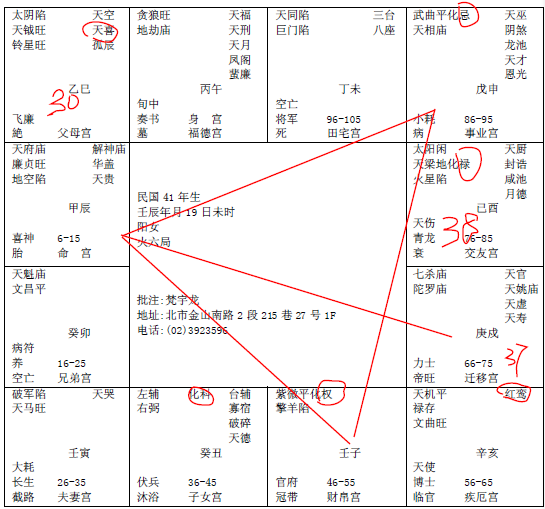

#### 案例20

这个女孩子的命，紫薇星在子宫。

像这个官禄宫，武曲星化忌，这种煞星在官禄宫，不会走公职，那财帛宫是紫薇化权，所以她会在私人企业当主管，而且做得很有声有色，化权在命，命里面有权的，一定会做主管。

夫妻宫这里看到，破军星就一颗星，如果落到夫妻宫，或者是落到福德宫里面，都代表婚姻不好。像这个女孩子的命，像这个对宫化忌来对冲夫妻，所以婚姻非常凶。

我们还没有看，再一看她的阳宅，主卧房在东南角，婚姻凶，因为先生是天风姤，姤是男女交合的象，姤卦，所以先生在外面会有桃花，所以到外面去。

所以为什么很太太小姐我劝你们买一套录影带，为什么，你在结婚前，认识的男孩子，的确很老实，你跟踪他好了，他绝对不犯桃花。结婚了以后你不知道啊，你跟他去住到东南角，你嘴巴上行动上你不准犯桃花，住在阳宅上面是鼓励他犯桃花，那你变成为一个人活了。所以你只能掌握到你自己这里，不要说你先生，你儿子都无法掌握得到，我们只有用这个方法来掌握。所以造成她婚姻离婚。

第一个流年在戌，25岁，25,26,27,28,29,30岁到巳，天喜红鸾会到，就会结婚，她30岁结婚，天喜红鸾星落父母宫，所以姻缘是父母亲掌握帮她挑的。

太阴跟她最近，所以她妈妈影响她最大。她妈妈是长舌妇，哎呀女儿你嫁给他，妈妈的眼光绝对没错。上帝有说妈妈一定对吗，好吧听你的我就结婚好了，结婚到38岁就毁了。

那这个女孩子厉不厉害，很厉害!所以我们看过很多女孩子的命，在事业上都是一级棒的，为什么，因为她在处理事业上面脑筋没有感情的观念，办事都非常优秀，甚至是女孩子比男人强。遇到这种感情的问题，就跟猪一样，猪不是笨死的，是蠢死的，你懂不懂，不会处理。取舍之间，进退之间，没办法拿捏在手里，发生这种事情。

那到了56-65，还有红鸾星进来，这个红鸾星进来就太慢了。

所以这个太太呢，丑宫子女呢，左辅右弼在这里，如果一颗星单守没有儿子，二颗星反而有一个儿子。这个儿子化科，读书会读的很好。

这个太太过来的时候，是一个儿子一个女儿，跟着她，三个人，住在这个房子。

那问题又来了，她给她儿子住在西边，女儿住在西南，你看她把自己害了，把儿女也给害了，看懂了没有。女儿没有结婚让她住西南角，是不是鼓励她女儿去做偏房，儿子住西厢是鼓励他儿子去做同性恋。神！东南西北那是看神哦！这是雷泽归妹卦，二男二女并行，雷住到泽的位置。所以很多父母亲呢，表面上，儿子啊，你绝对不能当同性恋啊，手上却把他推到西厢，无知啊！

那碰到我呢，太太，主卧让出来，让太太睡西南，位等于名，她的名字叫做妻子，离婚没办法，今天以前没办法帮你，今天以后可以让你好一点啊，名字叫太太住太太的位置，运改哦。

一改上去，她46-55，本来她这段时间就化权了，36-45她化科，所以已经很好了，我们再把她改到这个位置上，她的位置会爬的更高，做的更好。

那遇到这种情形，儿子没有位置的时候，很多人是在东南切一个角，让儿子尽量住到房子的东边。

让长女来西厢住，长女到这里，易经上面是风泽中孚卦，中孚卦是发科甲，女儿住进去，一考就是状元，所以哪天你考试，会不会考的不好，一卜到中孚卦，考状元呐。

后面我们会介绍易经很多卦，哪个卦是主什么事情，等到64卦学完了，开始批流年哦，我们用易经来排八字，用子平法排出来，就不教你们紫薇斗数了，教你们排八字，八字排出来，我们用卦来解释它。

这个阳宅有没有问题。所以很多事情发生在一念之间，我们要出去多帮人家的忙，我不让各位多介绍客户给我，而是你要多去帮助人，很多无知的人，造成后面的问题很大。害了你自己还不知道呢。