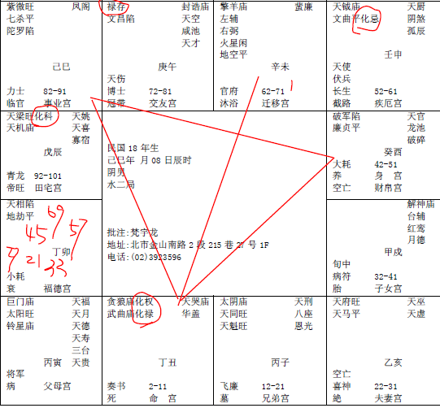
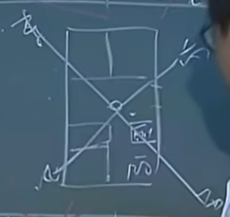
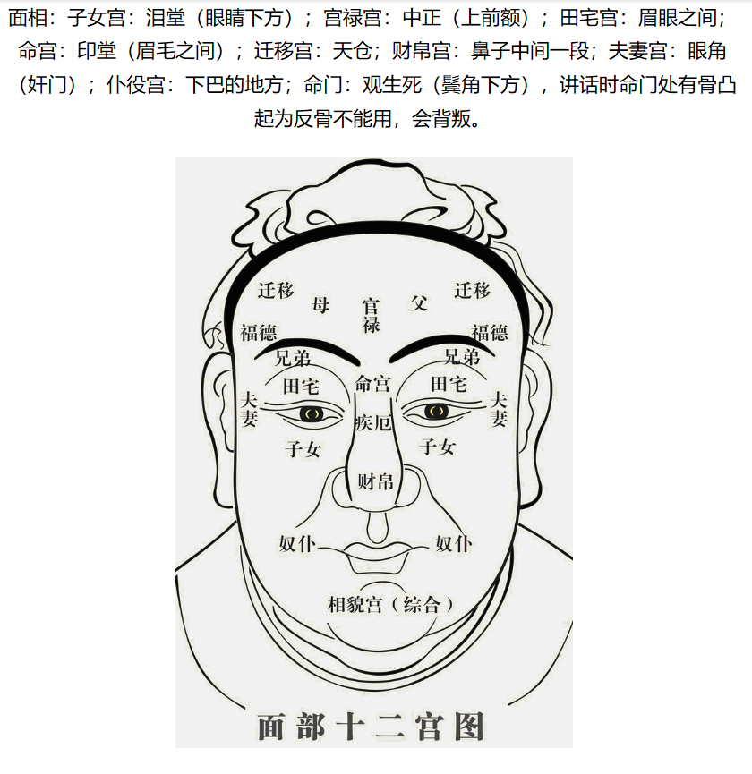

#### 案例21

先看民国18年这张：

提出这一张命盘的目的呢，这是一个格，这个男的命呢，命宫在丑这里。

小的时候是贪狼武曲，化权化禄，这个贪狼武曲，我们除了主武官星以外，还可以主财星。所以生下来，就是权禄，这是豪门巨富啊。生在家里面一定很有钱。

诸位呢，我们最好的命是怎么样，就是早年比较凶一点，吉星在后面嘛，这样才好嘛。

那这个生下来，太好啦，太有钱了，就像我们蒋家三兄弟一样，太好了，我怎么会有事呢，我就没有戒心了。

诸位看，他的父母宫是巨门太阳，巨门就是豪门，家业都很好的，命宫化禄都是家里财富很多，可是这个是先天啊。生下来。

后天，你看看他的财帛，是廉破，官禄宫是紫薇七杀，所以他如果呆在本地的话，他是从事武官的。一个生下来享有祖业，还有一个后天的官禄是紫薇七杀，会从事武职。

这个财帛宫是廉破，不可能会去自己做生意，完全不可能。

那我们看他流年行运，42岁以后进入廉破，这是煞星，对面福德宫还是天相星落陷，还有地劫，煞星在对面，这个福德宫主一世的福禄，结果煞星来会，未来十年52-61是不是化忌。

这个八字拿出来的时候，我问说你这个八字有没有拿错，为什么，在45岁就是大限了嘛，为什么？因为未来十年没有大运，大限是不是在前十年，是在42-51，那未宫是59,58,47,46,45岁是不是在卯这里啊，45岁对冲，对面是廉破，刚好是十年的对宫，然后煞星落陷，煞星落陷代表是无解！这个很凶的。

45岁就该买单啊，走人啦。我告诉你，他45岁的时候，得了大肠癌，刀子一开下去，哎，人家大肠癌现在世界上的存活率最长是5年，后来移转到肝癌都死掉了。哎，没死哦，这个没有死，是祖上有德！

可是没有死以后呢，诸位想想看，你再转一圈，是不是12年，那45加12，是不是57啊，那没有错的话，那应该是57岁走人啊，他57岁没走，出一个大车祸，廉破啊，化忌啊，出一个大车祸。也没死！可是因为他在42-51岁动了刀子，到了52-61大运，我为什么提这个，重点哦，诸位，流年逢到化忌的时候，这种煞星、化忌，不管你，什么都不要谈，光讲事业来说的话，完全是停摆！

这个八字，整个格，最好的宫在哪里，在夫妻宫，太太是天马，男人的命里面，如果你的命中夫妻宫是天府带天马，你最好感谢你老婆，你这个辈子什么决策都是错的，娶个老婆娶对了，天马星是吃苦耐劳，为你奔波啊，天府星是很善于理财，因为很厚道，拼命做事情，人又很善良的一种人，有非常善于理财。

你娶个老婆廉贞贪狼落陷看看，入庙没关系，落陷看看，家里什么都赌光，跟你讲。

煞星一煞弹回来没办法做了，弹回来，外地是擎羊和左辅右弼，你是不是只能去帮人家做事情，然后慢慢做事情，到45岁，身体凶啊，所从45岁开始一直没有做事，到61岁，那到61岁在那里是在没事干，就跟朋友帮忙出来做啊，62-71是进入权禄，有没有，所以因为这个灾逃过去了，所以他过去的流年，一直在命上面走。

今年来找我们算，民国83年，是不是66岁啊，66岁在子这边，挺好，67,68,69岁是不是有是卯这个，57加12是不是69。

男人啊，上次讲过，男人九是老阳，女人呢，六是老阴，阴的极限。所以男人很多是逢九买单。

他刚好69岁逢到卯，进入这个大灾，69岁是大限。那他20多年前开刀到现在，他装一个人工肛门带到，一直带在身边，69。

诸位你看他的阳宅才妙。这个人的太太非常好，可是你看这个人的个性强不强，这个人的个性是最刚强最固执的一种人。你根本不要跟他讲，他说我不信这个！所以我说无知到哪里，不懂却要讲结论，懂不懂。不懂没关系嘛，不予置评，我不懂嘛。

阳宅是这样子的，他是切两半，门从这边进来，这里有两间房间，这里是厕所，这里是厨房，然后房子，东南西北在这边，西北角刚好是一个什么，走道，还有厨房，沾到，卧房也沾到。

这个房子就一直住下来，所以在这个房子，看的时候，本身没有先生的位置，对于这个家来说，这个房子，本身得不到先生的助力，成家的不是先生，一家之主不是先生，缺位，看到没有。如果厨房在西北方正中的话，那就买单了，走人了。厨房在偏一点。

我们现在帮他改的时候，诸位注意看，我们帮他厨房改成长条形，厕所移到这边来，这个房间加大，原来的房间，加大到厨房这边来，刚好满在西北角上面，看到没有，然后他东北方是不是朝这里，所以我们改床在这里，朝他最好的方向来睡。头在这里，脚朝东北。因为他还要做事啊。

这个八字，所以遇到这个廉破流年的时候，所以诸位要记得，帮人家算命，流年不好，一律鼓励人家去读书，去深造，去进修，读书是人最愉快的事情，会忘掉很多事情。让自己成长，这个流年。

那你知道这个过程哦。对面是化忌，我们光以化忌来看，化忌是不是来冲到父母宫。所以，以化忌来说的话，他的父母宫刚好太阳星独守，是不是，光以他的八字来看的话，是不是父亲先走，再来走母亲，爸爸要先走，因为对面是化忌来冲，对不对，这是看父母。

还有66岁，流年在子这里，67岁第二年，是不是很好，这是看小流年。你从66年跨入这个流年，未来这一年是不是很好，未来一年流年很好，这已经是果，他的因是在66岁这一年。所以他66岁这一年有什么决策，动作，基本上因为明年的果是好的，所以他的决策，他的方向一定是对的。了解我的意思把，可是是对的尽量去做，没有错，可是不要忘了69岁这个大限哦。那就是你赚了钱，没有办法享受到。69岁！

诸位把那张脸相拿出来看，69岁在下角这里。腮帮子下面。看到把那个寿限到了，这里会有黑点，黑线。

你这个黑点有两种状况，一种是黑气隐在皮肤里面的，那是大限。

一种是一个痣，或者是一个黑斑长到这里来，长到皮肤外面。

那长到皮肤外面的黑痣，就是过不了那个关，像我们肖天战，这里有一个黑斑，就是过不了那一年。

那我们脸上有黑痣、黑斑，是流年不利，当官的会下台，做事情就会破财，在那个黑点上面。

那大限到了，黑点这里会变成什么，青这里，就是暗黑色，隐在皮肤下面，看的很清楚。

再接近两个礼拜，人的气都没有了，摸他的脸，头发，都没有油了，我们头发鼻子皮肤都会出油的，你最好出油，哪天不出油了，我就紧张死了，快买单了。我们在发生事情之前都会看到这种气色，头发没有油，蓬起来了。

我们身上的油，在中医讲的就是气，中医的理论，大家对气不了解，实际上相书里面讲的，就是我们身上的油，而根据我们的临床看，是油没错！所以一定要有油。哪天发现你没有油，赶快来找我。