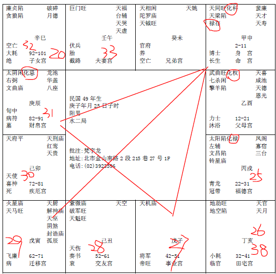

#### 案例22

这个八字哦，送给全天下做妈妈的人，做个警戒。
 
我们算命的时候，我们研究命，就是知道消息，知道盈亏，就是事先知道事情。

为什么提醒诸位这个事情，我们先看命里面，我们知道，命里面，太阴会来，有的人是太阳，有的人是太阴，太阳就是完全受到父亲的影响，太阴就是完全受到母亲的影响。

像这个命，先不要管别的，太阴化忌，有没有，男人的命，最怕太阴化忌。为什么？婆媳不和，太太跟妈妈一定不和的。像这个命，太阴化忌，他妈妈就一直在制作问题。

然后你看看他的父母宫，擎羊星落陷在这里，爸爸妈妈就是他的小人欸。心想我怎么会害我儿子，对，那是你的想法，可是你的动作，所有出来，都是害你儿子的。

这个人生下来，命中化科，带禄存，人聪明啊，才智很高，家里又有钱，命格上很好啊，对不对，你看他的妈妈。

第一个大运，12-21岁，在父母宫，天喜星来会，红鸾在对面。

这个人的小流年，25岁在戌，排过来，18岁在卯，他12-21是不是天喜红鸾来会，会早婚哦。

会早婚的人，都是父母在旁边搅和嘛，懂不懂我的意思，我是独子啊，我这个孩子很好啊，我希望我这个孩子娶上媳妇啊，18岁就让他结婚，红鸾星动啊，你看是谁的错，一看就晓得是妈妈嘛，明摆嘛，不是我不是我，就是你啊。你的小人就是你妈妈。

所以妈妈不要替小孩子去做什么决策，你帮忙做的决策，做的好也罢，做的不好小孩子会怨你哦，可是你要做的很好，很难的。因为你想的不见得是他想的，你想我想想的不一样，飞机就掉下来了啊，所以不要去乱想，只能掌握自己。

你看他18岁一结婚，19,20岁是不是就是廉贪落陷！你知道他发生事情吗？一结婚以后，为什么，因为12-21在这十年中间，他，我们先看未来，22-31是不是太阴星就不亮了，换句话说，22岁以前就看不到月亮了，懂不懂。

那男人的月亮除了妈妈以外还指谁，老婆啊，他一娶进来，第二年，他太太就跳河自杀了，你知道她为什么自杀，又是他妈妈搞出来的嘛。你看他18岁结婚，第二年太阴化忌，跟她处的很不好，逼得她火大自杀去了，你看看，媳妇是你挑的嘛又把媳妇逼死了，就是妈妈的决定，很可恶啊，你们身边有没有这种女人，有啊，随时可以找到，有时候你自己犯了你都不知道哦，自己犯了错都不晓得。

所以我们一看到这种信息，马上把他妈妈撇开来，你不要去乱左右他。

好了，他太太一出事，你看他，22-31太阴化忌，他产生和他妈妈相抗的心理。本来是很好的人啊，他妈妈说你不能犯法，我就要犯法，我是你儿子啊，我想尽办法把你儿子整惨，他就开始作奸犯科啊，22-31是化忌进来，化忌是官司是非啊。

日月反背的话，代表眼睛看不到天日啊，还会有牢狱之灾呢。

26岁你看逢空劫！22岁在未，23是申，24是酉，25是戌，是不是26岁最差，是不是空劫啊，马上26岁开始犯了官符了，一天到晚就在坐牢啊。牢狱之灾啊。

然后还有危险的，因为22-31，化忌来冲，32-41空劫，是不是没有大运啊，那寿就在32岁之前，你知不知道。

本来是很好的格，你看看，机月同梁多好的格，这个太阴妈妈尽来搅局，你看看，这也是命啊，你懂我的意思吗，命中注定。

然后那个妈妈执迷不悟哦，地雷复嘛，永远迷复在那边。我没有错啊，小孩子就是照样子。

像这种命，机月同梁，定为吏人。一定是在公家单位或者在学校，吃固定薪水的人。除非有科权禄会到，才会有做生意的状况。

所以这个活活被她整死。

那他犯了牢狱之灾，作奸犯科，一判，关到33岁，流年在午，看看，这个法官好像会算命哦，26到33，刚好关7年。然后34岁又开始，后面走他的运啊，可是他的运刚好走41岁啊。

37，38岁到亥，如果37在酉这边，当然不可能在这边，如果在这边，38,39岁走到亥这个地空，39岁就要走人了！限就在中年，就叫做半空折翅，那38岁，男人没关系，如果女人的话，完了！懂不懂我的意思，如果这个灾来了，就完蛋了，男人没关系！男人的话，这个灾变成意外灾，横祸。

所以如果生到这种小孩子，诸位想办法把他妈妈隔离起来。你说不人道啊，可是你要救人啊，可是你永远没有办法证明我们是对的，你要想证明我们是对的，很惨哦。因为你只有一次机会，不可能有第二次机会，所以千万不要抱着侥幸的心理。

这个做妈妈的要警戒，你看这个八字好不好，看到没有，多好，这是我们命里面，最温厚最温驯的一种人，结果还是一样坐牢啊。你看他对他妈妈产生恨，可是这个人呢，个性不会爆发，如果是落陷，煞星落陷，太阴星在命，落陷啊，抵抗力很强还好啊，他反而没有抵抗力，我就消极的抵抗嘛，反而闷在肚子里去做，让他妈妈担心烦恼，始作俑者就是这个18岁的婚姻，懂不懂，所以这个太阴化忌非常的可怕。

如果是女人的命，这个八字完全不是这样，男命就惨了，这个太阴就犯到了，女人的话，是太阳啊，男的，是太阴，刚好，这个格我提出来的重点，最重要是来自这里。