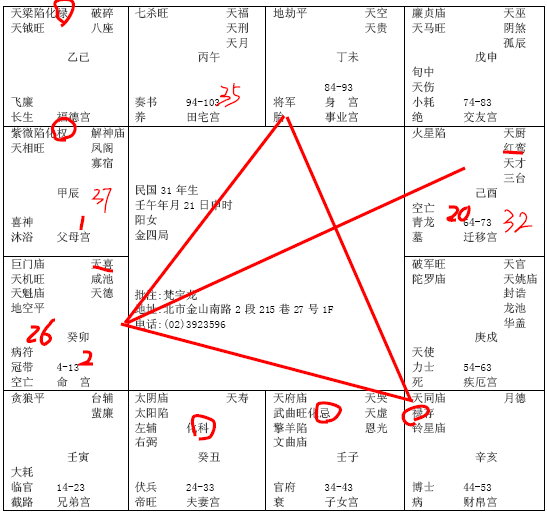

#### 案例23

诸位看这个命哦，阳宅的部分，我们天文地理一直参照，东南西北，本人在西南，正西打叉是浴室厕所，东北这里是厨房，女儿住正北这边，儿子住西北这边，

八字一拿到，我们排出来是这样子，她住的阳宅是这样子。天文和地理配在一起看。诸位是不是图已经读完了。所以她会这样住，这是她的命，诸位现在应该很会读这种图了。

所以我现在就比较轻松了，以前客户过来说倪先生我们家门在哪里那里，我说不要讲了，我就看完了，你还在那边讲。哪边窗户哪边神位，这个不重要，其他什么的不重要，东南西北，已经画完了，越简单的图越好。

像这种人的命，我们给她批的话，你看她官禄宫是什么，地劫，空的，不会当官的。那天同禄存在财帛，一定在私人企业来做事情。

那迁移宫落火星这种星，不可能到外地去发展。

而且你看她的事业，44-53,是同禄，对面是不是化禄，54-63，是破军，对面是紫薇天相，64-73都是吉星来会，你看她是不是晚运很好，那早年就比较差！

我们看整个八字，看她的格的时候，诸位有没有一个观念，你知道她为什么晚运很好？因为她想通了。你知道想通了什么事情，我不要婚姻，晚运就很好嘛。可是我不信邪，哪有说不要婚姻的，也没关系，我就去结婚。

辰宫是25,37岁流年，26岁就天喜红鸾来会，因为她24-33岁大运正好进入夫妻宫，太阳星在里面，对不对，26岁那年是不是刚好天喜红鸾星来会，夫妻宫在丑这里，对不对，因为刚好十年大运在夫妻，加上天喜红鸾来会，所以她会26岁结婚。

可是这一结婚以后，34-43是不是化忌，我们一般来说，女孩子婚姻的时候，要过忌，她的忌刚好在下面，懂不懂，你如果忌很晚，搞不好，代表死别啊。忌在下一个，37,36，35岁是不是逢化忌在午这里，化忌对冲，对冲比在本宫还凶啊。

所以她26岁一结婚，到35岁进入这个对宫化忌来冲，刚好是大小二限，大限是34-43，小限这里是七杀，对冲化忌，刚好在这里，所以她35岁婚姻就要破裂掉。

破裂掉和先生离婚了，她一开始结婚就住在这个位置上，懂不懂，注定了嘛，这个先生是天地否，她是坤为地。然后她生个儿子呢，她把儿子放在西北角，雷天大壮，象出现了。

住在西南角的女孩子，不管未婚已婚，代表她是孤单的，因为坤为地，纯阴啊。西北角代表取代了他先生的位置，结果她的儿子取代先生的位置，所以她就不需要先生了嘛，变成这样子。

那儿子，子女宫是化忌哦，这个天府武曲化忌，代表有儿子，但是儿子化忌，有子但是冲突很大啊，很难管。了解我的意思把，化忌！

那进入44-53这个大运呢，她离婚以后呢，她想道，算了，我就不要管婚姻好了，我就专心从事我的事业好了，就不结婚。当她这样想，她住在西南这个位置，她自然而然就不会想结婚，我很好啊，我结婚干吗，结婚我还倒霉呢，对不对，不要结婚，后面的事业就做的很好，你看。所以像这种命的人呢，就是属于二婚命， 然后带着孩子到老，她就这样住。

那你说人好不好呢，天机巨门，当然巨门星口舌，就比较唠叨啊，男人受不了，天机星的心眼也比较多一点。

那她命里的太阳星，你看她先生，夫妻宫化科的话，代表先生是专科技术专长来赚钱的，很可能当自由业，当老师，医师律师会计师建筑师。诸位看，这种科跟日月在一起，日月化科，代表这个人，有专业技术专长，常常白天忙晚上都要忙啊，所以太阳太阴全部来会，就是没有一个固定的说早上上班晚上下班，常常白天晚上都要忙啊，忙得跟夫妻不和，那住西南角，不和的原因，一定是太太太强了嘛，个性太刚强了，要求太多，冲突就来了。

这个八字，有没有什么其他看不懂的。

像这个34-43大运一个化忌，未来十年又是吉星，没有杀星，所以这个不会死啊，你不要乱批啊，一定是很凶才会死，这个是婚姻的忌！

那一般来说，诸位可以用同理来推，这个父母宫，是紫薇天相化权，这个父母宫是什么，当官的嘛，了解我的意思把。如果你的命宫是紫薇星化权，你也是当官的啊。很清楚嘛。那如果你的兄弟是紫薇天相，那就是你的兄弟当官了，儿子是紫薇天相，儿子就当官了。

就是这样子推你懂不懂，所以我们讲一个宫，讲他的星，就是放在那里，说这个人会做生意，如果财星统统会到兄弟宫，兄弟做生意，会在子女宫，你儿子将来做生意的，以此类推上去，所以我们不用讲的很复杂，挑几个例子讲给你听，你就会了。

像这个女孩子，在相上面，可以看得出来哦，颧大压鼻啊。女孩子长得，两个颧很大，鼻子一点点大，哇，旁边的颧骨好大，眼睛在这里，这是脸嘛：

所以你看到两个颧骨太大，不好！颧骨太大，大多独坐到老。

那又没有肉，皮骨相连，我们相上面，最怕皮骨相连，女孩子呢，好的女孩子手上面是皮骨相连，是贤妻良母，那脸上面不能皮骨相连，脸上要有肉，有的人就没有肉啊，皮骨相连，亮亮的，你摸他，一点肉都没有，都是皮，都不用做美容，这种都是到老孤坐。就是一个人坐在那边到老啊。

这是颧大压鼻，女孩子的夫妻就是什么，鼻子！太小了嘛，她有婚但会离，那如果再加上吹火嘴，那从头到尾都不会结婚。那就很丑了。

当然，我们后天可以帮她改了，改东南什么的，但是也要看她愿不愿意啊。有时候你帮她改，她还不愿意，她命就是这样，我不相信！懂不懂我的意思，就来了，就很麻烦！

还有，在相上面，看子女，眼袋下方，我们眼睛啊，
 
眼袋这边是儿子，这边是女儿，儿子女儿很贵很棒，当一个父亲为儿子女儿为荣的时候，哇，这个眼袋，膨起来，很丰满，对他儿子女儿很满意。那有一天一遍膨起来，一边凹下去，那就是儿子这边膨起来就是儿子满意，对女儿不满意。现在我看过的儿子这边膨起来的比较多。

还有呢，当你看到阴鸷纹的时候，就是这个纹×××××一票，这种乱纹，代表儿子死掉了啊。反之就是女儿已经死了。

那如果是刚走，你去头七丧礼上看人家的气色，你去上香偷偷看一下，刚走的时候，眼下带黑看到，一般来说，在子女宫出现，往往两边可以看到。

这边是暗黄色，这就是代表刚走啊，很伤心嘛，很伤痛。一般两边都可以看到，太伤心了，以比较浓的这一边来决定子女，就是刚死。那死掉很久了，这个阴鸷纹很浓。

那男人的话，太太过世的话，脸上也可以看到，在额角这边：

我们叫做天罗纹，在这个角，一票网状纹路，罗就是网嘛，盖在天庭上。天罗纹。太太过世。

所以脸上有纹路出现的时候，这个纹哦，要清晰，要少，不要太多，集中在一起就不好，纹路集中在一起都不行的。基本上你能掌握到这种原则。基本上就可以看得很清楚。