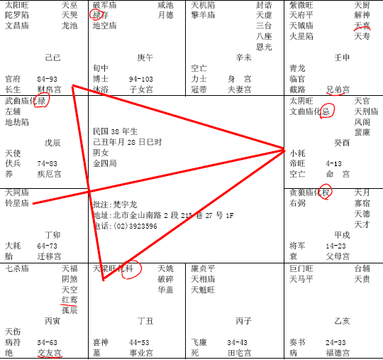

#### 案例24

诸位看哦，这个八字有个重点。
我们看这个八字，可以看到一个人的心性！

太阴坐命的人，本来就是性比较阴，像文曲、太阴会到命宫来，过去历史上有一个人，杨贵妃，杨贵妃是太阴星入命带文曲文昌，这种人是桃花命！

那命里面化忌，像这种命的人。当然，化忌除了代表早年比较辛苦以外，这个人本来就是个性很刚，心胸比较恶毒的人。我是跟你讲哦，你不要批命的时候当场说你心胸恶毒，你放到肚子里就好了。不要乱讲，但是你心知肚明。不能讲啊，有的时候，有苦难言啊，一讲的话，会翻脸哦，后面也不会听你的。

像这种命的人，她心眼比较多，结果造成害了她自己，为什么要提这个命，因为她害了她自己。

诸位注意看她的红鸾天喜星，落的位置非常的不好。对不对，你看她的流年是往下走，红鸾星在那边，第一次会到是54-63，根本不用结婚嘛。那我们看，奇怪，为什么她到这么晚还不结婚呢，哦，跟这个命宫有关系。

所以小人不能长久。最好做君子比较好，不能坐小人，不能长久，你骗的了人家一时，骗不了一世嘛，刚开始不知道，相处久了发现你心眼太多了，一天到晚在算计别人，跑了。对不对，这个就造成她婚姻不好啊。

像这种，就是标准的孤鸾命。算这个命的时候，我说，小姐啊，你认识这两个字吗，孤鸾，就是叫你出家比较好，反正你嘴巴喜欢讲，就开始念经啊。心经可以念几万遍，对你很好，只有这样劝她。

然后，这个人的阳宅住在哪里，东南西北，她就挑西北的位置，更凶。这种就要加凶啊。婚前就住西北，再加上她的命中，要加凶，懂不懂。

那这个八字拿出来，家里面没有人能受得了她。

整个布局上来说，她的六亲最好！你看她的父母，兄弟，有没有，可是你要找到，整个家就因为她一个人，弄得鸡飞狗跳。所以一粒老鼠屎，会坏一锅粥。

那如果这是个小女孩，拿到我这来，所以说这是命啊，啊太太您这个女儿从小就送到尼姑庵去当尼姑，她不会同意啊，所以人都是命。

父母再强，你看她父母宫权禄重重，贪狼化权一般是武官，对面是化禄，还有从商，做生意当老板，兄弟是南北斗星君又是官贵，对面又是禄，你看看，六亲多好！

可是她就是不行。所以很多人，父母亲，爸爸很厉害，兄弟很强，出一个女儿，好累哦，大家都很灭火一样。然后人都是懵懵懂懂的，他就会去让他女儿去住西北角。还说西北角是主卧房，我宠我那个女儿，对不对，最大的房间去给她住，你看看，害死人不负责，也会害到自己。

像这种八字，碰到我们比较晚，如果早碰到我们有没有救，有！当然有救啊。诸位给她结婚的时候，千万不要让她害人，如果你给她找一个一样的，吹火嘴来，先生也是吹火嘴来，对上了，这个可能骨肉相残啊。不太好。

那我们要给她找一个温和的星，还有要改变她的性，改变她的心，所以一定要她去念宗教，像这种人，你跟她讲人间道，没有用啊，你只有让她念宗教，每天念心经，慢慢念念比较不容易发脾气，然后再给她找好的对象，好的对象，不能害到人家啊。所以要再三叮咛她，婚前怎么做，婚后怎么做。

那你说这个八字，事业好不好，事业太好了，你看她，大运一路上都是吉星啊。所以她这个人的事业，你看看，官禄宫化科，像这种人参加公家单位的考试，考公务员资格，考老师资格，一考就上去，当老师也好啊。上帝并没有说老师一定是对的，两回事啊。

你看她的流年，24-33,34-43,44-53，都是好星，就是一个婚姻星拖得晚。所以婚姻星拖得晚，跟她本身的个性也有关系，还有，可能婚姻拖得晚，也救了她，懂不懂，你宁可不结婚，也比那种结了婚再离婚，来的好一点，对不对，如果你只有两个选择，没有第三个选择，那就选择不结婚哦。

所以有时候，帮她改是害她。这个时候，在取舍之间，就很难，遇到这种八字，诸位做取舍的时候，一定要掌握的第一个原则，就是看她的心性有没有变过来。而心性变很难变哦，江山易改本性难移。那你说我又不是她父母，没办法每天在旁边观察她，很简单，你只要过一段时间，看她的气色，就知道了，因为人一变正的时候哦。

诸位以后做老板，看手下，你用人，用人之道，你只要掌握一个大原则，用手下的人，你看他两个眼，眼神啊，眼神呢，不能有凶光，可以有威，有威的眼神，看起来比较威严的人，你可以让他当主管，当经理啊厂长啊，眼神很柔的人，而且鼻梁很正，鼻子很正，然后眼睛眼珠一动不动，这种人可以用他。绝对不会背叛你。

那种鼻子歪的，眼睛在那里闪动的，那就完蛋了，你要准备他背叛你。这是你用人不当。

所以诸位，用人用手下，不管怎么样，看他的神就够了。那有的人长得很丑，可是他神很好，鼻子很好，你用他永远不会背叛你，永远会帮你断后的人。这是用人。

那你只要看她，正不正，看她的神就知道了。这个神呢，有很多地方可以看到，除了眼神，我们的鼻梁以外，还有神气，你看那个人坐在那边，大富大贵的相，神很足啊。坐在那里他动不动的。背梁挺得笔直，动都不动，我就看过这种人。有的是小孩子都坐在那里动都不动的哦。从小开始的，那像躺在那边软趴趴的脚翘起来软绵绵的，那是没有神的。懂吗。气不够嘛。

如果你要看她是否心性变正了，看她眼睛就知道了。那我看过很多，眼睛有凶光的人，念念佛经，念到后来，真的变慈祥了，是有，但是我们不能说它一定是最好的。而是因为各种宗教有存在的必要，因为有的人的资质必须要经过这个程度才有办法到好的阶段。你不能要求每一个人，但是这是可以给对方一种心性的修养。对于她只有这样子，你跟她讲人间道，没有用。那讲地理位置，她不见得愿意去改。
这是一个标准的格。

那如果你不会批，哇，老师，她夫妻宫很好啊，巨门天马，太阳旺啊，旺夫的命，太好了，对不对，这个人不会结婚。红鸾天喜星都没有会到。所以红鸾天喜很重要，是决定一个人喜庆的星。

那女孩子呢，孤鸾命啊，这个有几个地方，当然有些疾病的问题，我们写到书里，上课不好意思讲。

女孩子，因为没有结婚嘛，没有跟男孩子常常在一起，阴气很盛，懂不懂我的意思，没有男人的荷尔蒙啊，人的相不一样哦，她的肉会长得很扎实，硬邦邦的。结婚了的女孩子，会跟男孩子那个，肉就比较软。那种手拿出来，都很扎实的，骨头都很扎实，因为都还没有接触过男人。这都是我们看相的地方，可以看到。

谁愿意，吓都吓死了，给她吵翻了，这种星哦，现在很可惜，就是现在李先生就是这种格的人。