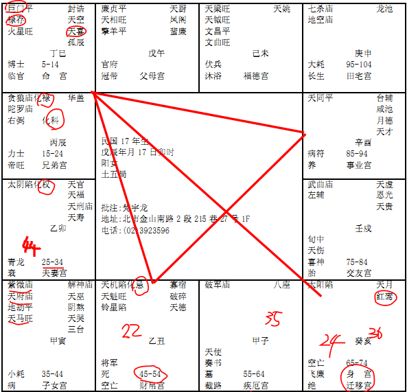

#### 案例25

我们曾经算过非常多的民国38年从大陆来taiwan的，诸位看呢，民国三十八年的时候，是不是22岁啊。她是辰年，戌宫是25岁流年，她是逆转嘛，22岁是不是在丑，化忌！
很奇怪的事情，我算过很多民国十几、二十几年的命，八字拿出来，都是化忌的！
所以易经有句话是对的，遇险而止，招凶。所以我们遇到险要行险，行险才能脱险！所以三十八年mailand沦陷的时候，很多人流年化忌，很多人看到煞，就停了，好了，你呆在大陆，一停未来四十年就不一样了，所以我们脱险之道，要行险。你不能说停着不动，停着不动，所以坎为水是两个重险，这个险停下来，后面还有更大险过来。了解我的意思吧，更大的险过来，你会收到这个险是因为你停下来了，所以要行险！
当然我们如果来卜卦，卜到一个卦，卦上一匹马，就叫你动啊，你赶快跑，也可以啊。那你说，我不相信，命掌握在我自己手上，好嘛，那就呆在大陆上，对不对，四十年就不一样了。很多人都是流年碰到化忌的时候碰到。这是三十八年，这是国运！那至于国运归国运，化忌归化忌了，巨日格还是巨日格，懂不懂我的意思，我不管你是大陆的，还是taiwan的，都是一样，巨日格还是巨日格。
这种八字，我们算，我们不用管别的，这种八字就是属于偏房格的人。如果你的小孩拿到这种命，你赶快要小心点，要注意啊。当然你要觉得当偏房很好也无所谓啊，我只是陈述一件事实。
这个拿出来的重点在哪里？注意看，流年是往这边走，她从45-54，是化忌，我们看十年哦，这个要很小心的，很容易犯错误在这里，你看她的子女宫好不好，非常的棒，可是从45岁一进入丑宫这里，就化忌就去了。化忌代表的就是停滞、官司，孤单，破耗，破耗伤身啊，这四个统统属于化忌。
她到外地去的时候，太阳落陷，像这种八字，我们怎么样给她算哦，平常你们拿到这种八字，这种就是过去几千年来，我们那个算命先生坐在路边，看这个女孩子的八字，一看，哎呀，您这个女儿，是刑夫克子的命，那这种人，出家当尼姑最好。那太阳星不亮，她跑到外地去，如果她呆在本地，大陆本地，她22岁没有动，她继续呆在大陆本地，那会不会发生这种事情，目前无可验证，但是她是结果到taiwan来了，所以，对她的子女来说，她在45岁以前，她在45-54，是果啊。从45岁之后，就孤单了，要这样子看。那太阳星不亮，女人的太阳，上面指她爸爸，中间指的是先生，下面指的是儿子，所以她从45岁开始，都看不到了。
那25-34这十年呢，这里走的是夫妻，那对她的先生来说，我们这位天天，35-44是逢到南北斗星君，你不要管子女，35-44也代表这位太太的流年，好，她的流年一进来的时候，紫薇天府在里面，对她来说，也是孤军奋战，只是孤军奋战的很好而已，所以这个宫，对于先生来说，也是她一个人单打独斗，先生也没有，那对于寅宫这个子女来说，未来也是化忌，夫和子都凶哦，因为这个很容易犯错，所以我们批八字，常常要注意一定就是，看她这十年怎么样走，要看未来，你看她一年怎么走，要看她未来，比如说你21岁来找我们算，你22岁化忌，那么你21岁的决策，一定统统是错的，她是命是这样走，她的想法就会引导她往错的方向去，好，那我们要想办法改变她的念，那像这个是十年，她来找我们的时候已经几岁了，诸位，37,36,35岁在子，25-34这十年中间，她的命中注定要没有先生，可是她结婚了，诸位看她红鸾天喜在哪里，麻烦就在这里，她的天喜红鸾星在巳亥宫，命带天喜红鸾，如果女孩子的命没有天喜红鸾，天喜红鸾在父母或者兄弟、朋友或者别的地方，就会做偏房也就罢了。问题是她的命带红鸾天喜星，一定会结婚，命里带红鸾天喜，会结婚再散，结婚散的时候，有生离还有死别，所以像这种八字的格，她注定是偏房格，我们不用看其他，光看巨门，和太阳，这个太阳落陷，就够了，太阳星要入庙啊，要庙旺啊，落陷完全不一样啊，两个刚好极端的相反。如果她结婚了，那不是生离就是死别，结果还是做偏房。二房，就是照样。所以你看25,26，她24岁，22岁跑路到taiwan来了，24岁呢，红鸾星就进来了，红鸾星就动了，但是这个红鸾星动的时候，太阳是陷地，象要出现一次哦，我们知道易经象最难懂，象只有一次，太阳星落陷的话，结婚的对象要两个条件，第一个，七岁以上；第二个，二婚夫。先生要大她七岁以上，或者是离过婚的人，让她第一次太阳不亮，为什么，因为我们刚好走到对面是六个时辰，太阳刚好六个时辰，十二个小时走完，所以一般要差六岁以上，七岁。所以有的人，婚姻有问题，我们给他说，哦你找大你七岁以上就好了，那二婚夫呢，就是先生有离过婚的，像这种情况就可以结。那如果你嫁个先生年龄跟你差不多，又没有结过婚的话，凶了！所以她在35岁那一年，在子，对35岁一个年宫来说，一个年的宫来说，35岁的第二年，36岁，是不是太阳就看不到了，所以事情一定就发生在35岁，因为36岁已经是果了，懂不懂我的意思，也就是从36岁开始就看不到了，那就发生在35岁，刚好，对25-34来说，刚好是走到夫妻的尾巴，要进入35岁，她35岁只看到儿子，看不到先生嘛，所以她真的在35岁那年先生走人了。
相上面看的时候，这个眼睛啊，眼尾的奸门，凹陷下去，而且是黑色的，很暗，主夫妻死别，两个眼睛都会有。
手掌上面，这个坤宫，主夫妻，一会我们会给大家介绍手相。
 
手相，面相，八字，统统合在一起。后面我们再叫四柱易经命卦。
我们就把四柱排在中间，先天卦，后天卦排在这边，十年大卦，然后流年的小卦，都有。
因为36岁看不到了，所以35岁先生过世。然后这个人哦，到44岁，你看35+9=44，我跟各位说过，9为老阳数，她44岁在卯宫这里，45-54岁化忌，看不到儿子了，因为她注定在那个时候孤单，44岁刚好最尾端，未来一年就是子女，结果她35岁那年先生过世，九年以后，儿子也走了，如果这个化忌，她的流年是顺行走，这个八字就不是这样批。
所以我们批八字，特别要注意，你未来一年没有大运，大限在前一年。未来十年没有大运，大限就在前十年。这样了解我的意思吧。
那这种命的人呢，大部分，长的样子，都是面薄，脸上没有肉，皮骨相连，眼睛凹陷下去，然后眼眉靠得很近，因为她没有家了嘛，她一个人，眼眉靠的很近，因为眼眉之间主田宅宫，眼眉太近就没有什么家庭观念。
所以女孩子的命，最怕太阳落陷。