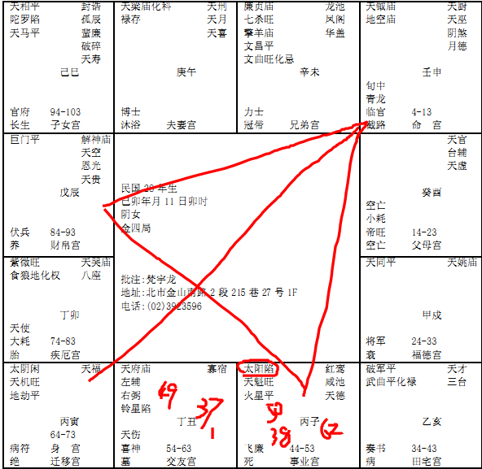

#### 案例26 

像这个命，诸位看，女孩子天钺星入命，命里面，科权禄都没有，财帛是巨门，巨门是一个煞星，不可能去做生意，所以她一定是从事公职的人员。
那这个女孩子，你看她子宫，太阳是陷地，看到没有，一看，所以女孩子很累啊，我们一看到太阳陷地，就要特别当心一些事。
像你看她的夫妻宫是化科，天梁在午宫，时间官威官权很大，那她先生官权又带禄，所以很可能是走财经界的，这个权是掌财禄的，所以她先生是在银行一个很高的主管。
兄弟化忌，有化忌在兄弟，主两件事情，第一个，兄弟不和；第二个，兄弟夭折，那你说老师怎么看不和还是夭折，看眉毛嘛。你眉毛乱七八糟就是不和嘛，眉毛有断路就是夭折嘛。慢慢看多了，就会了。
那她的父母，你看，太阳是不是在陷地，父母宫是空的，按照我们刚刚的推算法，她4-13岁开始，第一个流年就会到太阳，看不到太阳，这个时候，我们要注意兼带着看相，那个小姐一来，日角没有，然后呢，耳角有缺，刚好到14岁，耳角有缺，那如果日角平了很久，平下去，摸不到，很早就走了，十几岁，或者早年就走了，如果太阳在对面落陷，对冲的话，第一个大运4-13岁就要走人了，所以有的人，一生下来，爸爸就过世了，有的人，到第二个十年，才过世，最近才走的话，额角上明显能看到黑黑的一块，如果是很暗，代表是重病，暗已经变成白色，苍白，像盐巴，没有光泽，就是死掉了，丧父，刚死。
她在14-23，父母宫就空了，13，14岁是不是太阳落陷，所以她14岁的时候，父亲就不在了。所以流年一逢到，就出现了。
还有呢，诸位看她的流年，你在这两个流年没有逢到的时候，到34-43这个流年，侧会会到兄弟，还有对会，诸位看斗数啊，看这个线，兄弟宫对会这两个，那兄弟宫有化忌，在14-23,24-33都没有会到兄弟，34-43才进入化忌，就代表说，这一段时间，兄弟会有夭折的现象。
你如果流年反着走，兄弟宫这里是14-23，那代表14-23这段时间内兄弟会夭折，了解我的意思把。当然我是举例，但是你看，如果流年在这边变兄弟，流年在这边变父母，你们要以此类推。
那第一个，37,38岁在子这里，34-43侧会兄弟，所以38岁太阳星不亮，女孩子横的以外，除了先生以外，讲的是兄弟啊，所以38岁有个灾，兄弟要走。
再来，54-63，还没有发生，她61岁，62岁是不是在子，太阳星是不是不亮，也会走。
她的流年呢，49岁的时候，发生了一件事，她和她先生的阳宅，
 
这个厨房在西北角，算的时候，厨房在西北角，49岁那年你看发生什么事情，他去打高尔夫，打完了，大家都要回去休息，他说再打一个洞，硬把大家拉回来，然后开球，一开，人就躺下去了，最后去检查，脖子断掉了，她先生哦。在这个之前，两个礼拜，她有两次状况，她跟我陈述的，两次的状况，她在办公室里面，看她先生的时候，就是突然进办公室，一看看到，脸色发青啊，青色的，那种青是湛蓝的青，青还发亮，她就奇怪脸色怎么这个样子，她的先生很好，这个太太人也很好，为什么脸色是这个样子，如果是不好，早就太阳星落陷了，看不到先生啊，就在这段时间，那她先生说我很好啊，没有什么，体检也很好，很正常啊，然后就走了，不到两个礼拜，她不晓得是两个礼拜的事情，她是看到那个气色，不久先生就走了。当然他们不了解节气的关系。这个时间的关系，他不晓得。出这个事情，所以49岁以后，太阳就落陷了，看不到了。
你看下面的小星，有没有，那个44-53，那个是飞廉，还有死，进入这个小流年，所以很辛苦哦。
所以有的时候，很多事情我们可以预防的，所以我们为什么要去算命，就是君子事天，事情还没有发生，我们去看，多一个参考资料，无所谓嘛。
你看她的其他宫，有没有问题，这个子女宫没有问题，为什么，因为子女宫对会过来没有杀星，你了解我的意思吧，如果她后面的大运，54-63，没有会到子女宫，统统没有会到的话，这个孩子不会出事，就像我们刚才那个八字一样，所以说为什么要教诸位去看气色，因为我们排盘的时候，不可能把每一天都给你排起来，那么麻烦，排的你寸步难行，对不对，有人算到今天右脚会扭伤，结果你不敢出门，躺在床上，肚子饿，起来炒菜，脚滑到了，还是扭到了。所以啊，不要去管那细微芝麻的小事，大运抓到就好。