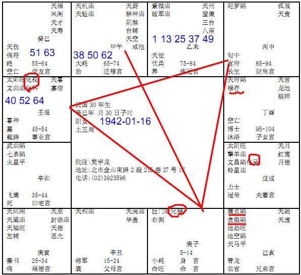

#### 案例27

诸位看兄弟宫，他是不是廉贞落陷，贪狼落陷，逢地劫，地空，天马，逢那么多杀星在兄弟宫，本身就主兄弟夭折。有的人呢，他没有兄弟。有的人呢，兄弟夭折。大部分没有兄弟的人呢，他的眉毛非常的浓，眉毛很特殊，但那个浓，是很宽厚的浓，有时候看不到眉底，最好的眉毛呢，是细细长长，根根见底，你不能统统看不到，太浓了，看不到皮肤，也不行了，越细越长越好，眉毛要浓淡适宜最好。太浓太淡都不是很好的事情。
那你看她的夫妻宫，夫妻宫化忌，这个八字，我提出来的原因是什么，你看她的流年。
她命宫在子宫，身宫也是子宫，是不是5-14岁，然后旁边，丑宫是父母，15-24岁，流年是不是往这边走，是不是，我宁可她流年往这边走，往右走是我假设的。
这个流年往左边走，因为她是阴女，那如果女的是阳年生的，那十年大运就反着走，格是一样的哦，她往这边走，阳年的话就反过来走。如果她反着走，走到25-34，是不是刚好入夫妻宫，化忌，那是生离，了解我的意思把，生离还算好，当然，那也有人说我宁可死别不要生离啊，这很难讲。
那你看她45-54，这十年，是不是太阳旺，化权，化科，有没有看到，这个女孩子的命呢，是科权禄三会，右手边财帛宫是不是空的，所以这个女孩子在官场上事业上非常的强，人呢，在很好的时候，就没有戒心了，就没有警戒心，她的45-54，诸位看，大运十年，在45-54上面，55-64的那个宫是不是空的，是不是交友宫，这个人，事情发生在50岁这一年，50岁那年会发生事情，就是因为她未来十年，这边刚才讲右下角是廉贪，有没有，廉贪落陷，是不是空劫，是不是都是煞星，对她来说，49到50非常的不好，然后45-54非常的好啊，55-64非常的不好啊，有没有，所以，人呢，叫做吉处藏凶，我们人事上是吉处藏凶，八字上也是吉处藏凶，看似好，所以你一看未来没有大运了，你马上就要注意前面。如果是她命宫会来的忌，那是她本人的伤，结果她的忌是先生会来的。先生会来的化忌，所以夫妻宫是化忌的时候，如果夫妻两个人八字不合，不受命的影响，如果两个八字是合到了，就完了，化忌就要来，知道怎么合八字了把，所以我们有时候八字合才能结婚，有时候八字不合才能结婚，这是光论命，你就找个八字太阴太阳啊，她的夫妻宫是太阴星化忌，对面是太阳，日月嘛，好了，她找一个先生八字拿出来，也是太阴太阳来会，不是刚好合到，合到就按照命走，所以，十年大限过不了55-64，那小运50岁，50岁根本进不了55-64这个流年，这个流年就已经发生了，懂不懂，所以同样这个55-64这个宫，从这边看是十年，从这边看就是一年，刚好挡住，就在这个巳宫上。这是排的很好。
她还有一个状况，38岁兄弟还夭折，37岁在未，是不是38岁在午，所以50岁的时候，先生走，38岁的时候兄弟走人，38岁你看，也是会在这个角上面，为什么38岁，你看她35-44岁，诸位看左下角，卯宫，是不是，她是武曲七杀在里面，侧会回来是不是会到兄弟宫，有没有，这个例子就是告诉各位，有的时候，灾你看过去，我就怕你们看不出来，所以要提醒自己，我连续举几个例子给你们看，这个灾来的时候，她先生是车祸过世的，她的先生不坏啊，如果是往右边走，15-24在亥，25-34在戌，在这边的时候，她化忌在这边，刚好十年会到这个化忌，那就是生离，就算了嘛，懂不懂，结果她没有生离，她往左这边走，很好啊，夫妻很好，没有问题啊，就是发生这个事情，所以这个八字，我们要警戒的就在这里，看似很好，这种凶来的时候，你根本没有提防，这种凶事发生出来是刹那间发生的，比如说有的先生，开刀开十年，也没事哦，你懂吧，没死哦，有的先生很好啊，出去给人撞死了，马上发生，突如其来，这种就是突如其来的灾，了解我的意思吧，这是我们没有戒心的关系，所以诸位，常常要注意哦，发生事情常常都是在你没有戒心的时候，所以出去玩的时候，要特别小心。