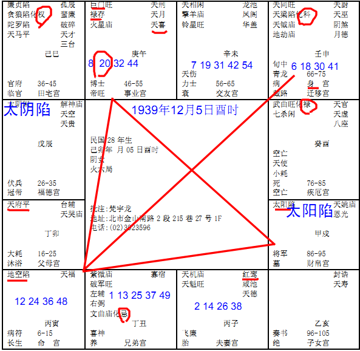

#### 案例28

诸位来看民国28年这个，属兔的，己卯年生的，
 
诸位看她的命宫是空的，对面呢，午这里是巨门禄存，46-55，事业宫；财帛宫呢，太阳是陷地；她命宫刚好是这里，命宫是地空，诸位看她兄弟宫，你不用管她是什么，兄弟宫是化忌，你就不用看了；父母宫是天府星，这个人呢，是从小被人家领养的，父母和兄弟带煞，我们就叫做六亲不靠，像刚才前面那位，也是六亲不靠，为什么，你看她是不是太阳在戌，太阴在辰，辰宫是上午7点到9点，出月亮，晚上7点到9点，出太阳，所以父母看不见！
小孩子生出来的时候，看印堂，有空到孤儿院去看一看，他印堂这里看不到两个角，你看我的两个角，两个角圆圆的，那你看他，摸他也没有凹陷下去，也没有突起来，领养！
这个命里面，领养当然也不见得一定是坏事，她也没办法，只是跟诸位说有这种情形。
红鸾星在子这里，夫妻宫，诸位看她的流年怎么走的，6-15在寅，16-25在卯，26-35在辰，36-45在巳，诸位看，她的红鸾星在子，天喜星在午，有没有，结果她一路过来，6-15,16-25,26-35,36-45，统统没有遇到红鸾星，红鸾天喜要到45-55才会会到，所以，婚姻也没有，懂我的意思吗，有的人，福德宫这里红鸾天喜也没有，也是在这里结婚，那是因为这里是吉星啊！如果这里是杀星，她26-35遇到是早上出月亮，应该是出太阳，这个时间不是太阳，是月亮出来，是杀星，所以不会成，那有的人呢，26-35吉星很多，即使没有红鸾天喜星，她也会结婚，为什么，媒妁之言啊朋友起哄啊就结婚了。
那36-45岁又是廉贞贪狼落陷，化忌，我是从来没有看过人家在这种流年里结婚的，那是桃花嘛，所以她呢一直没有婚姻，而且她是做人家偏房，只好做偏房了。
诸位看她的子女宫，子女宫在亥这边，是不是空的，对面是廉贪落陷化权，廉贪是杀星，有没有，所以她也没有子嗣。
这个小姐来的时候，看相，几个特征，一进来，个子小，我强调你要个子小没关系，要统统要小，懂不懂，头要小眼睛要小，一起小，你不能个子小但是眼睛很大，那是破相。所以她个子很小，脸孔一点肉都没有，鼻子也没有肉，鼻骨相连，然后过去我们老太太讲了，屁股没有，整个平的，没有屁股，知道不知道什么叫没屁股，要站在那边，看屁股，屁股没有肉，东方人的眼眶不能陷太深，整个眼眶陷下去，眼眶这样一陷下去，就会变成眼睛和眉毛几乎连在一起，所以过去你们很羡慕，很多电影明星都这样子，眼睛陷下去，和眉毛这样子：
 
你们很羡慕，我看是败家子，为什么，她没有家庭观念嘛，了解我的意思吧。有的人是没有家没有家庭观念，有的人是根本没有什么家庭观念，他不晓得什么是家庭观念，就会变成这样，所以娶老婆找老公，最好找眼镜眉毛比较高一点的。
上次有一个小姐很可爱，我说小姐你很好啊，你的眉毛眼睛那么高，她说你这么讲很奇怪我想压却压不下来，我说你还想压下来啊，她说我怎么长得跟人家不太一样，我说小姐你这样很好，看你落谁家，谁家好福气啊。她还不喜欢呢。
所以这种八字，就比较博人同情了。那命上面是博人同情，可是还是有人事上的行为。
所以你们看，我提出很多八字，那个巨门太阳落陷，我告诉你哦，很凶哦，凶到人家谁都受不了她，懂不懂，很凶恶啊，脾气很拗的很坏的，个性很刚强，很固执，然后你跟他吵架，你才讲一句，他十句已经骂完了，泼妇骂街型的。到时候就是这样，所以人还有外相。
诸位看这个首相，我们把它放大，
 
文王的后天八卦里面，各位先在学卦了，诸位，乾在西北，后天卦哦，后天卦为用个，北方是坎，东北角是艮，东方是震，东南方是巽，南方是离，西南是坤，西方是兑，手掌正中间，过去叫明堂。我们盖房子，盖坟墓，过去都是有院子比较好，所以说明堂很重要，中国的堪舆学和我们人相学，统统是结合在一起的，为什么要明堂呢，比方说太平洋收购百货，路边的地一平方算200万，那日本人很聪明，他可以把地舍掉，把建筑往后拉，建在后面，让明堂露出来，结果太平洋是泉胜百货的冠军，另外那个小鼻子小眼睛的家伙，那么贵的地方我们怎么能舍掉，我盖到马路边上去，甚至连路都盖上了，好嘛，里面没生意，外面哟生意，小摊贩都躲在下面啊，那边人很多，里面都没有生意啊，那如果你说盖的好，为什么没有太平洋销售生意好，你整个明堂都盖住了，太平洋一站出来，就是好，这是人的习惯这样子嘛，所以明堂要平广，那你手上明堂这里放一个东西，你晚上睡不着觉的，因为中间被挡掉了，明堂被破坏，所以我们手掌中间是明堂，最好的明堂在风水上，在手相上，都是一样的，要能够留东西，或者凹一点，或者平广，不能凸起来，不行，所以手掌要凹，甚至你水倒下来，哎，还有点水停在上面，这叫明堂。
我们看手一伸出来的时候，有点时候，你不好意思看别的，哎，你手看看，像我们中医比较好，手伸出来，摸摸脉，看到了，就看是读了，读脸，读手，就已经读完了。
诸位看你们手掌上面写的，乾的位置，乾位呢，是祖宗，乾位丰隆，也主的是父母，乾位这个角，看左手啊，男女都看左手，这个角挺起来，丰满，代表能够受到祖先的庇荫，对祖宗来说，代表祖上的风水很好，如果是陷落，扁扁的，代表父母相克，跟到你的爸爸妈妈相克，可能就不在了，那最好不在，如果这里平落的话，代表你跟父母亲处的非常的不好，也代表过世，再看看他额头就知道了哦。这是乾位。
坎这是一个人的祖业，像诸位看我的手，你看是不是两边突起来，中间凹下去，我的坎卦就是陷落，陷落就是没有祖业，那有的人饱满，一伸出来，哇，后面正官膨起来，代表来龙很旺，后面会介绍到风水，来龙很旺，代表祖业很兴旺，这个坎卦要丰满，凹陷下去代表没有祖业，对不起，你要白手起家。
艮卦呢，主田宅，这个位置膨起来，代表田宅很多，这里也代表兄弟很旺，兄弟很多，如果这个田宅的位置，扁下去，代表兄弟很少。
震卦呢，管的是妻子，如果震卦丰满，代表妻贤，凹陷代表折损妻子，太太不好，或者是太太过世，好，颜色比较暗，比较黑。
那巽卦呢，这个位置上，这个位置很重要，就是这个角落上面，巽卦呢，主的是财禄。巽卦的位置肉越多，越丰满，代表财禄越兴盛，如果是凹陷下去，或者是乱纹很多，一票乱纹在里面，财路要破财的，所以你如果有好多钱要给你子女，拿起手一看，哇，巽卦凹陷下去，然后横纹很多，不行。守不住财的。
离卦位置主的是官禄，越挺越高，代表从官得禄，懂不懂，当官拿官家的钱，这个地方越大官位越大。
那坤卦的位置，代表子息。子女。很平，低低的，扁扁的，没有子息。如果坤卦膨起来，子息贵。
女孩子和男孩子不一样，男孩子震宫如果黑黑的妻损，女孩子呢如果坤宫黑黑的夫损，你看看你的坤宫，黑黑的，就代表你对你老公不满意。然后你回家手伸在后面，老公我对你很满意，手一看坤宫黑的，这是读心。嘴巴上那是假话。
兑卦呢，仆役，为什么中国人喜欢看仆役，家人兴旺，人多代表家运昌隆，代表仆役多。这个地方丰隆代表仆役多，凹陷代表仆役少。现在来说的话，也代表朋友，我们这个宫越丰满代表好的朋友很多。如果落陷下去扁扁的没有肉，代表朋友都不是很好，常常受到朋友的伤害。
有一个地方，我们从手掌这里，一路通上去，通到中指，这条纹叫做天柱纹，发的是科甲，如果这个人呢，纹路很细，我们的手上的纹哦，要越细越好，我们拿手可以看这个人的心性，手拿出来，很光润，纹路很细，很清秀，这个人很正，跟他的心性是一样的，那个手横纹很多，这个人心横，你懂不懂，心一横把他干掉，心横嘛。
那有的人手纹很深，很复杂，代表心机越深，那有的人说你看我的纹多好，还透指过来，手纹透到手背上来，这种人破祖业破财很凶啊，所以不要乱讲。手纹要细腻，手纹如果就一点点，代表这个人心思沉浮，很憨厚。
手纹纹路要柔，看手纹很秀气，手很润泽，纹路细而且明，看不到手纹那是蠢蛋。
看指头，那个指头，伸出来的时候，指甲是看胆气，我们指甲上有太阳在上面，旭日东升，太阳没有了，胆小，我们不要讲病啊，我们讲情智。指甲都是干枯枯的，都是比较懦弱的。
那你再看一下他的指头，指头如锤啊，这是比较累的，锤是这种形状，指头变成这个样子，你仔细看就有这种形状啊，指头如锤的人，一辈子辛劳，愚顽，个性很顽强。
那我们的手掌一定要赔后我们人体来看，你人瘦，手掌就瘦嘛，这个很正常，你人瘦，手掌那么肥，你是小气，不漏财，懂不懂。
那有的人肥呢，掌瘦瘦的，意思告诉你，相是反的，无财。所以很多胖胖的人，没什么钱，你以为他胖就有钱，不一定，他胖胖的但是手干干的，无财，所以人胖手也胖，要均匀的胖。你不能光人那么瘦，手那么胖，这种人都是铁公鸡。
所以掌相很简单，诸位把8个宫核对一下就可以了。
那诸位手掌上有没有看到休门、生门、伤门、杜门、景门、死门、惊门、开门，有没有看到，那个叫做奇门！奇门呢，最好是开门要红润，在乾卦的地方，这个地方红润，说明他此时出入不管是求财求官都很吉利。那用兵、投资，都是大吉。
那生门、休门呢，跟开门一样的意思，唯独伤、杜、景、死、惊呢这五个门，看到颜色有青色，有暗的话，都是有破耗伤身灾盗偷窃，家里被偷了，很火大，奇门都是看气色为主，这个地方黑黑的，破财啊，家里有小偷啊，家里被大搬家了，当你发现今天晚上被大搬家了，明早起来手就黑了，为什么，受到心情的影响。马上就看到了。
这就给诸位很多很好的资料。诸位也可以看一些其他的相书，但是大原则就是这些。所以诸位看相，除了看他的形，什么纹路，那是注重在形，最重要的是看那个神，看到神以后，诸位从相上面可以学到一些很好的观念，所以说，过去看相的，算命的，我们都有一个观念，福地福人居，心好真的是流年就很好，很多命是这样子，我们去研究他，真的是这样子哦，自己是这样子的人害他自己成为这样子，我就曾经看过一个女孩子，那个手纹很复杂，全部是横纹，一看哇，怎么这么凶，再一看，两个鼻孔通的，我问她你为什么要跟先生离婚，先生太好了，所以我要跟他离婚，你懂不懂，很多人都是身在福中不知福。
所以那种相，诸位读心的时候，去看人，看到人长得都一样，对不对，要从很多角度去参考，会帮助诸位不要看错。
有么有什么疑问？左边那个连卦是皇极经世，邵康节弄出来的，民国几年几年都有年卦，诸位可以去核对一下，这是我们中华民国的大运，这里不讲。
天机道里面，我们分为两个部分，正常的天机道的书，一部分讲的是天象，就是28个天罡星，28宿，跟日月星辰，日月五星，日太阳，月亮，还有木火土金水，五星，加起来七个星，跟28个天罡星，和地球的关系，这就是过去，我们站在地球上看，哦，这是东方的尾宿和心宿是，最重要就是尾宿和心宿，那哪一天，火星经过尾宿和心宿，代表隔年有战祸，可能有炮打到taiwan海峡，看方向嘛，哎，看看太白星，金星经过哪边，他主的是什么事情，这是天机道里面，天文的部分。
天机道分为天文，还有天象，天文就是我刚才讲的那些东西，那这个易经的卦，推中国的流年，过去有很多东西预测中国的未来，西洋就是一个圣经嘛，也讲的不太准嘛，那我们的圣经，就是我们的易经。里面把每一年的年卦都排好，我现在给你的是中-华-民*国的年卦，那我们以后会教诸位如何去排自己的命卦，排法很简单，跟排中-华-民-国的排法是一样的，那个时候，我们推年推月推时，算的非常精准，诸位回去可以拿我们这个参考，看看会发生什么事情。