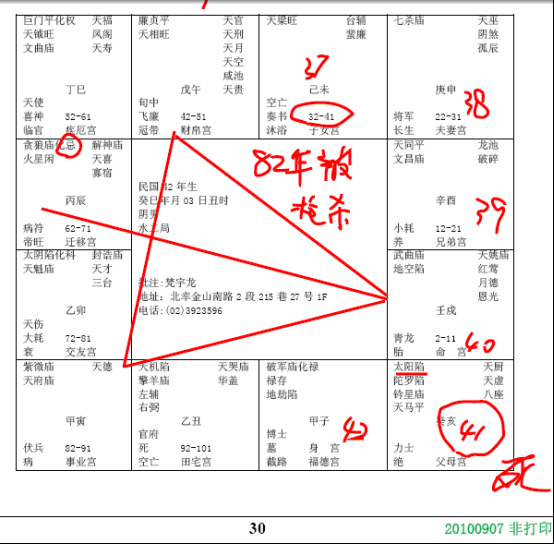

#### 案例3

诸位看下面一个，民国42年的那一张，有没有看到，
 
武曲星在命宫这边，看到没有，对面辰宫是贪狼，火星，这里化忌，有哦，对了，学会了，谁讲的，这个命啊，化忌对冲命，诸位要记得，化忌对冲命，非常凶！化忌只要是冲命，就是半空折翅。

如果是机月同梁，也是会被杀死，意外死亡，这个命呢，也是有凶灾，半空折翅，限在中年，所谓中年，就是32-41岁这段时间，这是命。

如果地运，东南西北，西北角是厨房，死夫；西南角是厨房，死妻，对男人女人来讲，都不好，所以我们买一个房子，最好厨房不要在西南或者西北，厨房在什么位置最好呢，最好在你的正北方，或者是正西方，这两个位置摆厨房是最好。

像这个，他是巳年，未宫开始算，37,38,38,40,到亥宫41岁，你先不要去看他本宫落什么，半空折翅，限在中年，一定在32-41岁这段时间。

所以他在82年，是中南部最有名的案子，枪击致命，早上到他家去，他下午就出事了，竞选某一样东西，你看他41岁，首先看，这是限在中年锁定在这里，然后他41岁，刚好亥宫是不是太阳星陷地，有没有，我想跟各位讲，用象来读八字，太阳星陷就是眼睛看不到了，天上的日月不见，看不到日月，一种是昏迷的状态，还有一种是永远看不到了。

这个八字当初，本来是来让我批，后来又说不用批了，我还没开始动手，所以说这是命，为什么，我还没开始动手，拿到了，结果他打电话说不用批了，买单了，差一个礼拜哦。后来我听到消息，赶快打出来一看，还没有print，哇，命啊，解也解不掉啊。

这个比较快。讲完了。那我们有很多格，专门讨论夫妻，讨论子女，我先把限要搞清楚，如果你限没搞清楚，你批个八字批半天，结果他死掉了。