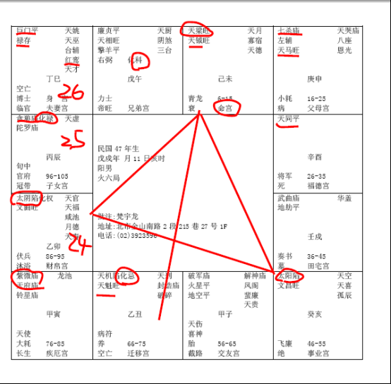

#### 案例4

下面有一个很好玩的八字，我跟诸位提出来，说明，我是有目的，哦，民国47年这个：

诸位看他的命宫，在未，是不是天机化忌在对面丑宫啊，这个八字很好玩，笑翻了当时。

卯宫太阴化权，亥宫太阳是不是陷地，命宫是天梁天钺。

跟刚才那个八字为什么摆在一起，虽然命宫不一样，但是其实是同格啊。巨门、禄存是不是也在巳宫这里，你看，七杀天马在父母宫。

那我们先看这个地方，这个人啊，命出来，就是日月反背。过去的算命的先生，几千来就说，哎呀这个小孩子克父母啊，二姓移生，要过继给别人养，不要自己身边养，自己养养不活的，为什么？因为日月反背，对面化忌又冲命。

可是人哦，各安天命，怎么样各安天命，这个人很好玩，这个人出身那天，医院里面发生火灾，婴儿室一弄乱，他爸爸妈妈抱错小孩，他跟父母亲离散，是不是二姓移生。命大啦，还活下来了，我告诉你，到了我面前好好的人。我一看，哎奇怪，这个八字很特殊啊，应该是要夭折啊。结果他好好的在对面，吓我一跳。

我跟他说你知不知道你父母亲的事情，他说我知道啊，我说奇怪，你这个八字，不应该生在父母亲身边的，你有没有跟他们在一起住，有啊，在一起住啊，我说那你在一起住感觉怎么样，他说很好啊，问我干吗，他很纳闷我问他这个。

我看看他的日角月角是平的，你看我的日角月角是不是凸的，他是平的，你说凹陷下去就是不在了，他是平的，也没有突出来，结果后来他才讲，我在问了半天，他都没有讲，他不知道我问什么，然后他就问我倪先生你看我这个八字我是不是我父母亲身的，我说我问了半天就问这个啊，我问了半天你都说很好，我不敢讲啊，我怕我问了你不知道啊。

我们现在问人家，你不要当场讲哦，因为有的父母没有告诉他，他是领养过来的，不跟小孩子讲，父母亲把它当秘密，好了，你说出来了，然后他回去跟父母吵架，然后怨恨父母说你们为什么不跟我讲还好我去算命，你是不是害人，所以我就暗示的方法问，后来就不讲了，然后我说你为什么问这个问题，他说你看我是不是我父母亲亲生的，我说你为什么这么问，他说因为我们血型不一样啊。那长得样子也不一样啊，对不对，我长大了懂事了我就问父母啊，父母说医院抱错了，找不到了，弄不清楚了。我说先生恭喜你，还好抱错了，否则现在中年，一样完蛋，一样买单，然后他现在很好啊。

这个人呢，你看他的化权在财帛宫，财帛宫不管是化权化禄化科有在，一般来说，他就会在私人公司或者企业里面上班。因为他命里面只有权，没有禄，所以他只能在私人企业里面上班，掌权做个主管。

那这个天钺星入命的人呢，对面是天魁，坐贵向贵，这种人呢，必有科甲。读书读的很棒，有专科技术专长，靠专业技术专长在私人企业做事情上班，而且会掌权当主管，这就连贯起来了。

本来现在中年就不要批限了，因为他二姓移生。所以过去我们算到这种八字，这种冲命，大部分都能过继出去，有这个原因在里面。

但是过继出去，这都是属于什么，属于命解，懂不懂我的意思，命的解法。都是比较消极的，比如说我给你讲了，谁愿意啊，比如说小姐你的婚姻不太好，你晚点结婚，倪先生那多晚，45岁以后比较好。这是命解，很消极的，做不到啊。你话是很好讲，人家做不到。所以外面很多算命的，都是这样子的。讲完了我没办法啊只好晚婚，那是废话，不算也是这样子啊。

所以命解是消极的，我们要有积极的运解才行。

男孩子还没有结婚前，给他睡东宫，长子睡东宫，有化权的话就是长子，东宫睡下去以后，然后脚朝延年方，像这个延年方在南边。

#### 延年方 

诸位怎么看延年方，就是东南西北的延年方，有解厄制化的星都可以，像南边的话，都是吉星来会，看到没有，廉贞天相啊，吉星比较多。

那你说老师，如果我的房子是斜的，你给他朝紫薇天府也可以啊，南北斗星君本来就是解厄制化的功能。

那一般我的方法是，如果客户的房子，是正向的，我尽量改正的方向，如果是斜的，我就改斜的，改四个角上面，看哪一个角比较好。你总不会让他对着太阳星落陷的地方，对吧。他没有事都会被你搞的少掉一只眼睛，一个眼睛看不到。左眼是太阳，右眼是太阴啊。本来好好的，结果伤到一只眼睛，明年来找你就眼睛少掉一只，被你搞出来的。

你给他朝东北嘛，东北是南北斗星君。这个很灵哦，我有一次跟一个客户讲，他就是脚朝着太阳落陷，我说你不要朝这那边，眼睛会不好，结果他没有听，隔了两个月，带一票人来找我，眼睛包着，包着左眼，不会是右眼。但我们不会给客户讲那么多，教他算命，没办法。刚好太阳落陷在这边，如果是太阴的话，脚朝着这边，就是右眼。

这个八字来说，子女宫看到没有，贪狼化禄，有没有，他的财禄星都在子女宫上面，所以贪狼也代表男的，一个儿子，但这个儿子，是化禄，是财星，做生意当老板。

这个八字，最累的在夫妻宫，诸位看，他比较倒霉就在这里：

第一个，他的福德宫是天同星，然后天喜红鸾又刚好落在夫妻宫，有没有，这个人呢，天梁星坐命的人，一般来说，比较正派，比较厚道，个性是很强，但是他的权是在财帛，而不是在命，权在命宫就是个性很强，这个权是在财帛宫，做事业领导力很强。那娶一个太太是巨门星，这很累，很呱噪，每天在那里吵，娶一个小鸟回来，就在家里吵，然后他赚的钱，要全部给太太，因为夫妻宫这里是禄存，都要给我哦，不给我马上就翻脸，巨门！哦，这很辛苦。

那这边红鸾星在夫妻宫有没有，也就是他自己爱，懂不懂，他觉得这样很爽，懂不懂我的意思。

如果是命坐红鸾，他一定想办法跟她离婚，那红鸾在夫妻宫，他认了，这就是在劫难逃了。所以主动、被动的关系就在这里。他红鸾星在这里，对不对，就是他天生就喜欢，这你就不要去管他了，这是算命。

那如果我们要让他太太好点，夫妻好一点，住西北角那是唯一的方法。有没有问题。

那如果光以事业来看，诸位看，他16-25岁七杀天马星，有没有，他就离开父母，代表他读书的时候，他就会到外地，不会呆在本地，有天马星，一考就考到台南高雄，跑到很远，而且离开父母亲，天马加上七杀，就是孤单嘛，孤军奋战，一个人在外面读书，在外地求学。

26-35岁进入福德宫，他就会结婚，你看他戊戌年生的，男孩子顺转，25岁在辰宫这边，第一个流年进入大限，26岁的时候，就进入福德宫，就逢到红鸾，走到夫妻宫，这就叫做大小二限逢红鸾星。26到35岁是不是走福德宫，26岁是不是刚好逢到红鸾天喜，又入夫妻，所以26岁的婚姻是在劫难逃。

那巨门星呢，代表太太形小、身高、量大。所以你别看女孩子身体小小的，说话声音很大，真的是母老虎的个子，又白又细，小小的，很凶悍，很彪悍。

你看他这个26-35岁，本宫是天同，对面是化权，在财帛，所以他是帮人家工作，领固定的薪水，掌权。

然后36-45岁，科禄会，有没有，诸位看，武曲星在本宫，他是36-45岁进入田宅，田宅宫进入财星，武曲是财星，进来田宅，代表说产业和禄会慢慢增加，房地产田宅会慢慢多起来，对面呢，逢科、逢禄来会，有没有，专业技术专长，左边呢，紫薇天府来会，代表36岁到45岁，他因为一直呆在这个公司里面，对公司贡献很大，老板会分股东啊分股权啊鼓励给他来做股东啊，所以这十年他会做的非常的好。

那进入46-55以后，日月反背的流年，在事业上是披星戴月，然后事与愿违。所以他46到55岁，限在中年的时候，事业非常不顺。那我们看一个人中年运好不好，看看中停，懂不懂，最好的相，是上中下三停的高是相等的，很难哦，有的人上亭是早年好，下亭不好晚年不好，有的人是下巴很大，晚来好。

这样会看把，批流年就是照样以此类推。

那一个宫可以代表十年，也可以代表一年，批流年，运要做加减哦，比如说这个人一直住西北，你要把运里好的事情要加重，如果不住西北，好的地方要减半，坏的地方要加重，这是加减，后面我们会举例来讲。一路下来，有的专门是举例给你看，批流年的，有的专门举例给你看批夫妻的，有的专门批子女的，所以我会按照不同状况的案例来教诸位来批，我们用实例来教导诸位如何批。