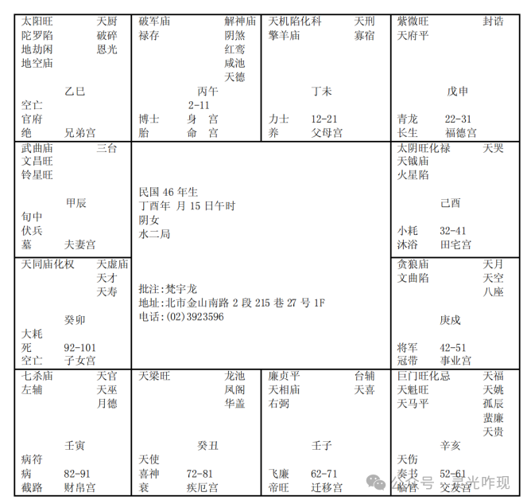

#### 案例10

诸位看民国46年这个案例：

这个命是紫薇在申宫，算命有句话，叫做：破军居子午，这个破军星如果在子宫或者午宫，我们又名英星入庙。

英星入庙成格，男人最好。男人的话，这个英星入庙，发武官，军人警察法官外交官，这种人。

那女人拿到这种破军在子或者午宫的英星入庙呢，主比较孤单，个性会非常孤僻。

这个七杀破军贪狼三颗星的个性不太一样。

破军星坐命的人，个性比较孤僻，自守，好像闭关自守一样，你晓得把。你跟他讲了半天，他听到了，回家他还是他。破军就是这样子。

那七杀星呢，比较性子很急，个性很刚烈。

那贪狼星呢，比较狠，个性比较拗，比较犟，会有这种现象。贪狼星的人比较容易意气用事，不顾一切。

那像这种煞星，武将星，给男人比较好，给女人的话，比较嫌太过。

像这个人来找我们的时候，诸位看，一般来说，红鸾星在命宫，女的命，命宫带有红鸾，相书上怎么写呢，女招贵夫。男人命宫有红鸾或天喜，男招美妻，就是娶的太太都很漂亮。

所以你发现你儿子的命一看，哎呀，我儿子命里面有红鸾，你就会发现你儿子，追女朋友，不漂亮的他不追，他就要看漂亮的。什么明星啊，他最喜欢了，跑去追了。漂亮不能当饭吃啊。这是喜神坐命的时候，会有这种现象。

那红鸾天喜星永远是面对面的，这里有个问题来了，为什么我要提这个给你们，所以批八字要批神哦，你不能批形，那按照相书说的，这个女孩子，红鸾星坐命，太阳星在巳宫入庙，那福德宫是紫薇天府，南斗北斗星君都来了，婚姻应该很好啊，对不对，你知道我怎么给她批的吗。

今年83年，虚岁是不是38岁，我说你啊，33岁丧夫，死了先生，为什么？我讲给你听，然后呢，44岁，再婚，再婚呢，51岁又失夫，先生又出事，她的婚姻，都是7年。你知道为什么我这样批，有原因哦，所以，讲出来就没有什么。可是不讲，就会奇怪，怎么会这样，所以批命不能看形啊。

第一个，她来的时候，拿出来的阳宅，我画小一点，没关系，东南西北，他们家两个房子，正东正西是照样面对面的，东北角是厨房，西北角是厕所，然后她的主卧房在正西，整个南面这里是客厅，这房子这样子，很奇怪。

然后人来了，坐在我面前呢，面大，骨粗，上下停长，中停短。额头很高，鼻子下很大，中间短短的。坐在那等我批的时候，手一上来，哇，这个手腕比我还粗，骨粗啊，然后我问她小姐你贵姓，一开口，声沙，我想完了。

我再一看，怎么回事，为什么会有这种现象，再一看命盘，看出来了，象，读图哦，读图，这是一个女人的命，32-41岁，太阴化禄，是女人啊赚钱，不需要男人了。红鸾星坐命的人，逢到第一次红鸾星就会动，所以她12-21岁，13,14岁不会动，那第二次红鸾星，25,26，午宫这里是不是25岁，这样子有没有问题的，不会太快把，她26岁是不是刚好遇到红鸾星，所以她第一次红鸾星动是在26岁，27岁巳，28岁辰，29岁卯，30岁寅，31丑，32子，33岁到亥宫，化忌对冲太阳，看到没有，所以夫妻死别，先生死在车祸上面。

她流年38岁到午宫这里，诸位，这里还有一个象，告诉你们，诸位把前面的人相图拿出来，33岁在左眉角，对不对，她来的时候，我就注意看了，一看，哎呀，左眉角都是黑点，这个黑点呢，已经凹下去了，已经是固定死的，是乌斑一样，就代表已经发生，刚好在33岁这一带：

那女孩子，还有很多迹象，她的眼睛，眼尾是这样斜下来，懂不懂，两个眼睛眼尾是这样走的，

然后还有很多黑点在眼尾奸门，奸门就是夫妻宫。

然后左眉毛眉尾的上方这一块呢，33岁:

在相上也有，命上也有，命相同参，所以这种八字，给男人没事，给女人就有事。

那我们给她说，你看，22-31岁这个限多好啊，她左右逢源，南斗北斗星君来会，因为22-31统统都是吉星来会，所以诸事皆吉，算命书上写诸事皆吉，诸位不要被他所蒙蔽哦，你不能被书绑到，他是意思是说22-31岁发生所有的事情心想事成的意思。

比如说红鸾星，她就会结婚，如果22-31岁逢到化忌，你逢到红鸾星也化忌，因为我们看一小流年的时候，先要看十年大运，以十年大运为主，小流年为辅，因为她22-31岁太好了，她所有的事情统统来了，统统会发生，了解我的意思吧，要这样看，所以你看诸事皆吉，没错啊，他也应该这样写，这段时间心里想的事情，都会很顺心的达成。因为贵星太多了，能够解厄制化，出了什么事情都有人来帮你逢凶化吉，那她26岁红鸾星理所当然一定会动。

那夫妻宫是武曲文昌来会，文武双全的人，可是大限33岁。你看，33岁化忌。如果是本命冲，什么是本命冲，就是如果她的命宫在巳这里，化忌对冲，就是冲她自己，懂不懂，这里是冲她的太阳，冲她的先生。

那到了第二个限，32-41岁，33岁先生出事以后，十年之间，她都不会再动，为什么？因为太阴化禄，太阴化禄代表这个妈妈在赚钱，她一个人在持家。结果很好玩的是什么，她有一男一女，她让女儿睡在东边，儿子睡在西边，刚好反的，女儿睡东宫，儿子睡西边，原来她的儿子是天同化权，看到卯宫没有。

我们批子女的时候，诸位看，也是要看三方四正，我用另外颜色的粉笔画出来，诸位看看，是不是三方四正，她这个子女宫，变成科权禄三会，还有忌也会在这里，科权禄三会的儿子，这个儿子应该在命上面，是非常优秀的，命只有一部分而已，只有三分之一，这个儿子呢，化权带科带禄，再住东宫的话，就是三分之二了，再加上后天人为训练起来，那就是本身非常的完整，结果她命上的儿子很棒。女孩子怎么样有儿子知道不知道？像今天下午一个太太来找我，八字还在批，我看她脸，就知道她没有儿子，她就生了三个女儿了，我根本还没有看八字，一看就知道，为什么，人中是平的。要么上嘴唇缩上去，人中短的看不到了。你看这个太太没有人中，平的。

女孩子人中越深的，生儿子。

所以以前的婆婆是笨蛋，为什么，选媳妇的时候，你背对我看看屁股，有什么用啊，生啊，也会生啊，生的都是女的，要看人中，女孩子人中宽、厚，深，最好。那女孩子人中都没有，那根本生不到了。当然，这是人事上，我们有人事上的建议，地理上的建议，可以让她生儿子。好，这是看相。

她后天上，让他女儿、儿子睡错了，结果女儿变成儿子，儿子变成女儿，所以女生男态，儿子变成女儿，害羞，躲在房间里面，有时跑出来穿裙子，她说，对啊，我儿子常常抢他姐姐的衣服穿啊，抢裙子穿啊。住到西厢，后面会介绍雷泽归妹卦，归妹啊，二男二女并行，同性恋的原因就在这里。

那西北角是厕所，缺夫位，失掉先生的位置，这是阳宅地理位置上、天文、人事上、相上看到，这就是为什么同时间生的人，长的不见得一样，这里特别提出来，所以诸位呢，千万不要，不管这么样子，如果遇到不如意的事情，千万不要这个样子，一挤中停就短了，要尽量打开来，没事要抬眉，尽量拉高。
 
所以我跟诸位讲这个八字。

还有一个重点。像这个命的人，她的朋友宫是巨门化忌，这是标准的，如果你跟朋友合伙的话，一定是官司收场。上帝有说好朋友就能合伙赚钱吗，到法院互相告的都是好朋友，就是好朋友才会合伙嘛。

第二次大限是42到51 的时候，为什么进入40 岁会再婚，因为42 到 51 是贪狼星，贪狼星是什么? 桃花星，诸位看，44 岁的时候刚好会到天喜星，这个婚姻落在迁移宫，在外地，我说小姐，你现在在什么的地方? 她说我在加州，这个就是这个命。

然后她就结婚了，一结婚51 岁的时候化忌又来一次，为什么这样说? 因为她40到51 岁，52 岁到 61 岁在这里化忌，这时候是未来十年无大运，已经是果了，之前会发生事情。51 岁小限，刚好对面是化忌一冲，不要看前面，52-61化忌，不见太阳有没有，她这个婚姻又没有了，她不但婚姻没有了，在婚姻没有的状态之下，她又把她毕生的积蓄跟朋友合伙，所以她人财两失。这是很不好。

她来找我是38 岁，今天以前的已经没有办法了，今天以前只能给她批，今天以后就可给她讲后来，小姐，你40 岁可以结婚，但是你要克死第二夫，为什么? 因为你就是克夫的象，你不要这样跟她讲，我说小姐，你是旺夫命，你是很好的太太，可是上帝并没有说旺夫命的人的先生一定会很长命。

我们要给她鼓励，这样很好化解，所以我们到时候跟她说你再婚的时候，你要记得我讲的话，主卧室要在西北角，一定可以化解，住在西北角的时候，诸位看到这是酉宫，这是申宫，这是卯宫，这是辰宫，全部是吉星看到没有? 是不是都是吉星?我们给她住到西北角以后，脚朝的方向就朝着这些方向，这个方向诸位看罗经。

你们今天拿到罗经，我们有24个座山，朝着这个方向就好了，所以我们拿到罗经有两个动作，第一个是找到房屋的中心点，然后把罗经摆下来，看乾卦的位置，乾在什么地方，找到乾的位置，到了西北角的位置，要站在床的正中心在看，我们有24个分金煞，诸位在罗盘上面，做的这个罗经是这样切开来，这个中间都有宫，所谓的分金就是说如果你的限刚好是这样的。

比如说这是举例，刚好你限在这个分金煞上，就是说坐向正在分金煞上，我们有一个罗盘，我们有24个位置，24个位置平分360 度，所以你拿360 度除以24的时候，你个宫是22.5度，在这个状况之下的时候，千万记得，我们有24个位置不能摆，不能盖房子，不能立基，房子不能盖在这个上面，床不能摆在这个上面，这是所谓的分金，所以两个坐山中间的分界线不能摆。这个也叫分金，绝对不能在这个上面。如果你把床摆在这个上面或者是房子在这个上面，根本不用看了，为什么?分金上主凶， 家里会绝代，不好。人睡在床上都会掉下来，因为分金上坐不了人的，人坐上去很难过，你就会想转个位置。

诸位也可以看试一下，你用个圆形的会转的椅子，每个方向做五分钟，有的感觉气血很浮躁，有的感觉很凉快很舒服，你就找到自己的位置了。我们在八字上就可以看到你的位置在那里，朝着这个位置是很舒服的。

诸位你看，如果我们要陷害一个人，我们把他的厕所放在房子的中央，诸位知道中央的厕所是主闷，主心脏病是不是? 让他的凶宅厨房在乾，厨房在乾位，厨的象是刀象，杀先生，把他的床摆在分金上，她先生晚上睡觉做恶梦，突然从床上摔下来，一吓心脏病发作死掉了。这是杀人于无形的，怎么查? 

弗洛里达就发生一件事情，积善之家必有余庆，积恶之家必有余殃。A、B、C 三户, 龙卷风来了, 把 A、C 打掉了, B 平安无事, B 的瓦都没有少一个, A和C 的房子被打烂了，结果那罗经一看这两个是分金煞，然后问警察，这两家是贩毒的，被龙卷风打掉了，报应啊，所以不要去贩毒。

我们怎么看是不是吸毒的?不要验尿了，那太慢了，我们看下巴这个承浆，吃坏肚子，或食物中毒，或吸毒的人承浆这里黑黑的，青青的，疙疙瘩瘩生一个点有没有。承浆就是承受你喝的浆露。

批事业的话，像这个人的话，22-31南北斗星君来会，所以工作很顺利，由于31 岁以后工作很顺利，32岁开始到41 岁十年化禄，对面是化权，所以这个小姐一定在32岁以后她会开始自己做生当老板。

比如说她的先天的命不会做生意，那是她先天的命，可是她在32到41一定会去做，43-51做的很好，为什么? 贪狼星就是横财星，等到51 岁的时候先生一死，后面一败涂地了。所以她的财运只走 20 年，这个时候我们现在就看到了，如果她51 岁来找我们算命，没有福气。现在来找我们算命，改一下，化忌所在的宫这十年就不见了。所以诸位你们学到的东西是钱不能解决的，你永远没有办法证明我是错的。你要证明我是错的你要付出很大的代价。我们讲到33岁这里的时候吓得，她和她妈妈脸色都变了。