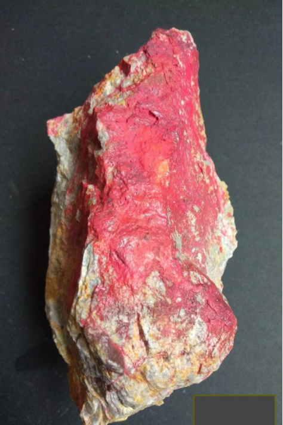
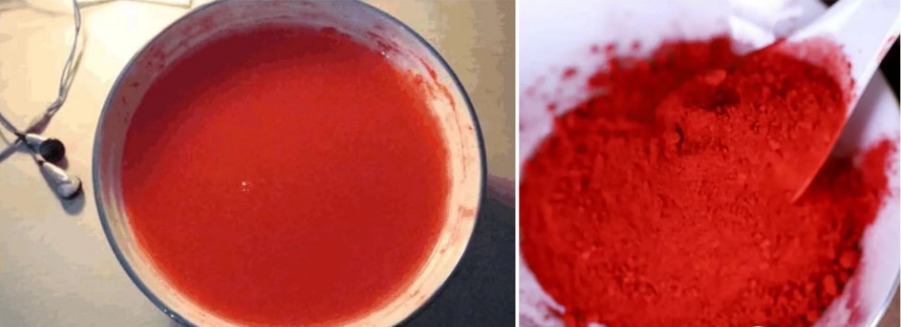

## 丹砂

  

##### 【本经原文】
性味甘，微寒无毒，主治身体五脏百病，可以养精神安魂魄。益气明目，杀精魅邪恶鬼，久服通神明，不老能化为汞，畏磁石恶盐水，其色真珠光色如云母，可折者良。又名朱砂。
##### 【产地】
在我国四川湖南等山中。以辰州为最佳，故又号辰砂，属石类。
##### 【主治】
丹砂为安神要药。
##### 【别录】
通血脉，止烦满，消渴，益精神，悦泽人面。除中恶腹痛，毒气疥廔诸疮。
##### 【甄权】
镇心，主抽风传ㄕ痨痵等。
##### 【大明】
润心肺，治疮痂息肉，可外涂之。
##### 【灵贻】
入心镇怯，定魂除邪。
##### 【用量】
一般水飞用以拌合他药，单服时可用二，三分。以至钱许。

##### 【禁忌】
丹砂只可生研水飞用。火炼则为水银而有毒。不可用，多服丹砂因其性质重坠，使人神定目呆。坊间名为朱砂，一般使用方式是用来拌合他药或做丸衣用，因为其功用在安神镇静，所以多被加入一些安神药中，海藏曰“如同龙骨牡蛎合用，可以养心气，同当归丹参合用，可以养心血。同枸杞地黄合用可以养神，同厚朴川椒等合用可以养脾，同南星川乌同用可以却风。
可以明目安胎，也可以解毒，可以发汗，端视医师如何使用而见其功”。
因其色红，内合真汞之水，属火中有水之药性，故其象心之性，而其性属微寒，得治心病所必须之寒性，服之使人心神内敛神守，故能安眠。为补心之要药。即朱砂，由天地自然熔铸而成，阳中含阴，外露火色，内含水阴，具硫磺水银之相合之性，因属火体中含有水气，故丹砂能入心，益阴以安神，养血安神为之最。有阳中之阴药称，与人参南北称王。一般言北方属水，故多气分之药，南方属火，故多血分之药。
##### 【炮制】
取朱砂打碎，选去夹石，用磁石吸尽铁削。研成粉未。置砵内，加入适量清水研磨
成糊状，然后再加入清水搅拌，使之沉淀。倒出悬浮液。只取下沉粉末，如此反复多次。至
手捻之细腻则止，倒出水后，将粉末晒干即得。瓦罐装，置干燥处。

> 丹砂就是朱砂，大陆辰州的朱砂品质最好，原石像弓箭的箭簇一样，丹砂原样拿出来就是这样的，用的时候把它打碎。

> 什么叫水飞？

  

> 拿到朱砂原石，先把灰尘清理一下，之后打碎，打碎后里面还有铁这种金属，过去中药房是用吸铁石把铁吸出来，先得把金属吸走，之后再把这个朱砂放到水里，好的朱砂是会沉底的，一放下去朱砂沉底，灰尘泥石浮在水面，把浮在上面的这些杂质倒掉，这是第一次处理。

> 第二次，继续加清水，搅和一下，之后静置，朱砂又会沉底，上面的杂质继续倒掉，再进行第三次的时候，得到的朱砂就比较纯了。

> 前面讲过判断有毒没毒就看是否沉底，朱砂沉底它就是有毒的。但是朱砂只要不见火就是没毒的，一见火朱砂被烧就变水银了，所以不可以加热。

> 把水滤干之后，得到的朱砂黏黏的红红的，要把它风干，风干之后的朱砂非常细滑，以上过程就叫水飞朱砂。后面会介绍眼科的药，有些药太涩，就加一点朱砂，就会变得很滑。

> 看本经原文，朱砂的性味是【甘，微寒】，其中【甘】为阴，讲的是味道，【微寒】为阳，讲的是气。所有的药性的描述都是这么分阴阳的，这在药性总义里介绍过的。

> 主治【身体五脏百病】，就是什么都可以治，它还可以【养精神，安魂魄，益气，明目，杀精魅邪恶鬼。久服通神明、不老。能化为汞。生山谷。】，

> 为什么说朱砂可以杀精魅、邪恶鬼？朱砂是安神用的，当心神不宁的时候感觉周围有恶鬼，吃点朱砂就看不到了。所谓杀，不是真的杀，而是你自己看不到了，幻觉消失。一般长期受到惊吓、恐惧，会在安眠的方子里用一点朱砂。

> 朱砂强到什么程度？比如拿一桶做好的药丸，大概有一斤，这时候要生用朱砂，想把朱砂包裹在药丸外面，怎么办呢？以前药房的师傅就用小指甲盖抠一点朱砂，放进做好的药丸桶里，然后盖好盖子，“嘭”一声拿出来，一桶药丸都是红色的，朱砂就那么厉害，大家就知道朱砂有多细腻。

> 朱砂有毒到底能不能用？我们千百年就是这么用朱砂，现在卫生署跑出来说，丹砂里面有汞不能用，中医也知道朱砂有毒啊，但它是见火才有毒，其次用的剂量那么少，怎么就不让用，这下好了，朱砂不让用，睡不着都给吃安眠药，看起来是安眠了，变成吃完药就去梦游。其实朱砂外面看起来红色，真水在里面，并没有出来，是隐藏的，只要不见火，不会造成伤害，可以放心用。

> 【别录】、【甄权】、【大明】，【徐灵胎】，这是过去历代医家的注解，像【甄权】是医生的名字，他跟孙思邈是一个时期的，【大明】、【别录】是其他书的名字，倪老师把其中相关的描述摘录进来。

> 为什么要参考历代医家的注解呢？因为《神农本草经》到现在流传千年了，难保有遗失错漏，把历史上各位医生的看法都了解一番，你把共同处提取出来，这个药性大致就是没啥问题的。

> 【别录】说丹砂能【通血脉，止烦渴，消渴，益精神】，因为丹砂它本身是无毒的，能够定心神，心神定了以后精神就好起来，当然很多的病会同时会去掉。

> 【传尸】是什么意思？就是说这个病会相传的，也是现在讲的基因遗传，爸爸把病遗传给儿子，有的几代统统死在一个病上面，这叫传尸。

> 中西医对遗传概念的理解不同。西医有基因的概念，认为爸爸的基因遗传给儿子，所以疾病的基因也遗传了，比如你们家有糖尿病史，你就大概率会得。

> 中医认为爸爸和儿子得一个病，是因为生活在一起，相同的生活习惯导致，并非身体的遗传，而是行为的遗传。比如说爸爸工作忙，每晚八九点到家才吃饭，爸爸吃儿子也会跟着吃点，等于继承了这个习惯，晚上吃完饭就睡不活动，食物闷在胃里面，血糖就增加，日积月累就有了糖尿病。

> 再比如过去有讲风水，说一个房子风水不好，住进去人和六畜会灭绝。实际上仔细去看发现这个房子中间的井是个死水，所以很多蚊虫细菌滋生在里面，水质不太好，爸爸喝这个水得了乌脚病，儿子喝这个水也得乌脚病，不去研究水，说这个是基因的遗传是不对的，它是环境造成的。

> 所以传尸有以下两个原因：1.承继父母亲的饮食习惯；2.住在同一个屋檐下，环境相同。

> 【大明】说朱砂也可以外用。1.朱砂因为是红色的，很漂亮，过去有女孩子可以把它涂在嘴巴上，变成口红；2.小孩子受到惊吓，晚上会无缘无故哭叫起来，叫得很惨，好象看到鬼一样，妈妈就拿朱砂在额头印堂上点一下，可以镇心；

> 【用量】一般水飞用于拌合他药，单服时可用二、三分，以至钱许。

> 外用的剂量：上面讲大人吃的是指甲盖那么一点点，小孩子要更少，一丁点，倒到他的米粉里面给他吃都可以，光吃朱砂都可以，量很小很小，不会中毒的。中药里有的可以取代，朱砂是很难取代的。

> 【禁忌】丹砂只可生研水服用·火炼則为水银而有毒，不可用，多服丹砂因其性质重坠，使人神定目呆。

> 朱砂吃多了会变得呆呆的，但如果是好动儿，过动儿，宁可你吃朱砂，也不要去吃西药。

